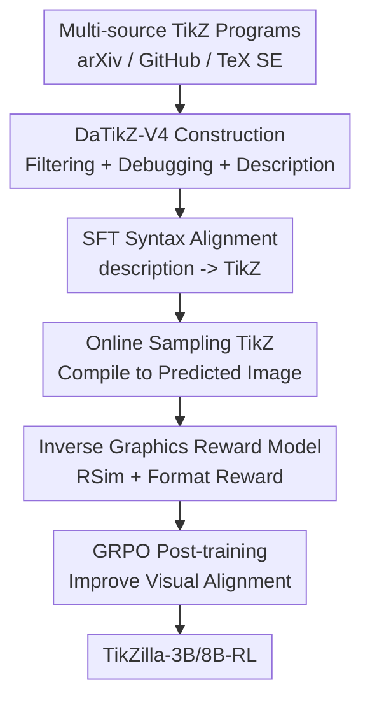

# TikZilla: Scaling Text-to-TikZ with High-Quality Data and Reinforcement Learning

**Conference**: ICLR2026  
**OpenReview**: [https://openreview.net/forum?id=rJv2byEWA3](https://openreview.net/forum?id=rJv2byEWA3)  
**Paper**: [OpenReview](https://openreview.net/forum?id=rJv2byEWA3)  
**Code**: https://huggingface.co/collections/nllg/tikzilla  
**Area**: Code Generation / Scientific Graphics Generation  
**Keywords**: Text-to-TikZ, Code Generation, Scientific Graphics, Reinforcement Learning, Inverse Graphics Reward  

## TL;DR
TikZilla surpasses GPT-4o in Text-to-TikZ scientific graphics generation and exceeds GPT-5 on automatic metrics by constructing the million-scale high-quality TikZ dataset DaTikZ-V4 and further training small Qwen models using GRPO with an inverse graphics image encoder-based reward after SFT. This significantly improves compilation rates and graphical semantic alignment.

## Background & Motivation
**Background**: Graphics in scientific papers often require precise, editable vector representations compatible with LaTeX, where TikZ serves as a standard tool. The Text-to-TikZ task requires models to directly generate complete TikZ/LaTeX programs from natural language descriptions, essentially translating textual instructions into "compilable graphical code." Existing methods mostly rely on caption-TikZ pairs for Supervised Fine-Tuning (SFT), with some attempts to incorporate visual supervision via inverse graphics models or cross-modal adapters.

**Limitations of Prior Work**: This task faces issues at both the data and training signal ends. In terms of data, the existing DaTikZ-V3 scale is only in the hundreds of thousands, and original captions often lack information regarding graphic types, components, labels, and spatial relationships necessary for reconstruction. In terms of training signals, pure SFT only sees TikZ sequences at the token level, lacking direct knowledge of whether the rendered code resembles the target image. Consequently, models may produce TikZ-like syntax that contains visual loops, irrelevant elements, or incorrect spatial relationships, or fails to compile due to package or command mismatches.

**Key Challenge**: The quality of Text-to-TikZ depends not just on "how much the code resembles reference code," but on "whether the rendered scientific graphic matches the description and target image." Conventional captions do not provide sufficiently granular graphical semantics, and general metrics like BLEU, TED, or CLIP cannot reliably characterize layouts, labels, geometric relationships, and formulaic elements in scientific figures. Therefore, model training requires richer data and feedback closer to the rendered results, both of which are insufficient in previous TikZ datasets.

**Goal**: The authors decompose the problem into three sub-goals: first, expanding and cleaning a larger TikZ library covering arXiv, GitHub, TeX StackExchange, and synthetic data; second, generating fine-grained descriptions suitable for graphical reconstruction using VLMs to replace coarse captions; third, introducing rendering-aware reinforcement learning (RL) after SFT to constrain the model directly by the "semantic consistency between the generated and target image" during online sampling.

**Key Insight**: The observation is straightforward: if the final deliverable is renderable graphical code, the training feedback should pass through the rendering result rather than stopping at text tokens or general image-text similarity. The authors thus re-train the image encoder of DeTikZify-V2 through an Image-to-TikZ inverse graphics task to learn structural representations of scientific figures, then freeze this encoder as an RL reward model.

**Core Idea**: Replacing "noisy small-scale caption data + pure SFT" with "high-quality Text-to-TikZ data + rendered image semantic rewards" shifts scientific graphic code generation from a language modeling problem to an executable, visual feedback-driven program generation problem.

## Method

### Overall Architecture
The training pipeline for TikZilla is a closed loop from data construction to post-training: first, large-scale TikZ code is cleaned into the compilable, describable, and trainable DaTikZ-V4; then, supervised fine-tuning is performed on description-TikZ pairs to help small models master TikZ syntax and task formats; finally, model outputs are rendered into images, scored by a specialized scientific graphic image encoder, and further optimized through GRPO. Here, RL is not for general decision-making but for converting "visual resemblance of the rendered image" into a training signal for the code generation model.

From an I/O perspective, the training input is a VLM-generated scientific graphic description $x_{desc}$, and the target output is a complete TikZ sequence $x_{tikz}=(x_1,\ldots,x_T)$. The SFT stage focuses on generating valid TikZ documents given a description; the RL stage treats the model as a policy $p_\theta(\cdot|x_{desc})$, sampling multiple candidate programs for the same description. After compilation, these are compared with the target image, and reward differences drive the model toward more compilable and visually consistent code.

### Key Designs
**1. DaTikZ-V4: Building the Data Foundation with Scale and Compilability**

The bottleneck in existing Text-to-TikZ data is not the lack of TikZ but the lack of usable, clean TikZ with granular descriptions. DaTikZ-V4 extends coverage to mid-2025 arXiv, introduces ~55K GitHub repositories containing `.tex` or `.pgf`, and retains TeX SE and synthetic data, resulting in 2,000,880 unique TikZ graphics—over four times the size of DaTikZ-V3. This scale is vital as TikZ syntax is highly diverse, covering circuits, commutative diagrams, functions, flowcharts, control systems, and mathematical structures.

For quality control, the authors standardized code into `\documentclass[tikz]{standalone}` environments, dynamically detected required LaTeX packages and TikZ libraries, removed external dependencies (`\input`, `\includegraphics`), and decomposed subfigures. For high-failure-rate arXiv code, Qwen3-32B was used to read compilation errors and repair TikZ, fixing ~600K out of 1.3M uncompilable samples. This step salvages real scientific figures as training data and ensures SFT learns stable document structures and package dependencies.

**2. VLM Descriptions via Qwen2.5-VL: Transforming "Captions" into Reconstruction Instructions**

Traditional paper captions are designed for human readers and often omit colors, layouts, labels, and spatial relations; Text-to-TikZ requires instructions akin to a drawing manual. Human evaluation of 200 captions from DaTikZ-V3 showed that most lacked graphic types and spatial relationships, scoring low on usefulness. Quantitatively, original captions achieved a BLEU-4 of only 0.003 against human descriptions, while GPT-4o-generated descriptions reached 0.089 (close to human-to-human consistency of 0.094); STS improved from 0.355 to 0.777.

Consequently, DaTikZ-V4 uses Qwen2.5-VL-7B-Instruct to generate fine-grained descriptions for ~1.3M compilable samples. These descriptions emphasize geometry, shapes, colors, and labels over semantic summaries. This ensures training inputs are closer to actual drawing specifications. Ablations show that using VLM descriptions improves GPT-4o inference (AVG 0.315) compared to captions (AVG 0.270).

**3. Inverse Graphics Reward Model: Evaluating Renders with Scientific Graphic Representations**

A key RL challenge is reward definition. General image similarity metrics like CLIPScore or DreamSIM may ignore scientific details like arrow directions or label alignment. The authors re-trained the DeTikZify-V2 image encoder on the DaTikZ-V4 Image-to-TikZ task to capture structural and geometric layouts.

Since DeTikZify-V2 outputs patch-level embeddings, the authors compared target patch sets $x=\{x_i\}$ and predicted patch sets $y=\{y_j\}$ using Earth Mover's Distance. With a distance matrix $D_{i,j}=1-\cos(x_i,y_j)$ and an optimal flow matrix $F$, the similarity reward is $R_{Sim}(x,y)=1-\frac{\sum_i\sum_j F_{i,j}D_{i,j}}{\sum_i\sum_j F_{i,j}}$. This reward $[0,1]$ measures if local structures can be aligned at low cost. A format reward is also included to enforce standalone TikZ document structure.

**4. GRPO Details for TikZ Sequences: Avoiding Length Bias and Unstable Exploration**

SFT teaches TikZ syntax but doesn't correct rendering errors. TikZilla uses GRPO on the SFT model $p_{\theta_{SFT}}$, sampling $G$ outputs $\{o_1,\ldots,o_G\}$ per description. It employs a Dr.GRPO variant with token-level normalization over a fixed maximum length $L$ to avoid inappropriately penalizing longer TikZ responses.

Additionally, a DAPO Clip-Higher strategy with $\epsilon_{low}=0.2$ and $\epsilon_{high}=0.28$ is used to allow more upward movement for low-probability exploratory tokens while capping high-probability tokens. Advantage scaling by standard deviation was removed to avoid re-weighting prompts based on difficulty. Setting the KL coefficient $\beta=0$ indicates that the format and graphical rewards were sufficient to constrain the output without explicit anchoring to the SFT model.

### Mechanism Example
Consider a control system description: "A plant box at the top, output $y$, feedback through high-pass filter, multiplier, low-pass filter, and integrator to a summing node." An SFT model might generate nodes and arrows but misplace a `\usepackage` outside the preamble or confuse feedback line directions. Token loss only penalizes string mismatch, not the visual error.

TikZilla's RL process samples multiple TikZ documents for this description and renders them. Documents that are uncompilable or lack standalone formatting receive low format rewards. Compilable outputs are processed by the frozen DeTikZify encoder and matched against the target image using patch-level transport. If a candidate preserves the loop structure and components, it receives a higher $R_{Sim}$ even if the code text differs from the reference; if another candidate misses a loop, the alignment cost increases, leading to a lower reward. GRPO uses this gap to push the model toward visually correct programs.

### Loss & Training
The SFT stage uses standard autoregressive Negative Log-Likelihood: $L_{SFT}(\theta)=\mathbb{E}_{(x_{desc},x_{tikz})\sim D}[-\sum_{t=1}^{T}\log p_\theta(x_t|x_{<t},x_{desc})]$, targeting syntax and prompt-following formats.

The RL stage uses GRPO with sampling temperature=1.0 and top_p=0.9. TikZilla-3B used a learning rate of $5e^{-6}$ for 4,000 iterations with 8 rollouts. RL training used DaTikZ-V4-RL, a 160K subset with second-round LLM-repaired graphics and Qwen2.5-VL descriptions.

The reward consists of a format check and the structural similarity reward $R_{Sim}$ from the frozen DeTikZify-V2 encoder (re-trained on 1.3M Image-TikZ pairs from DaTikZ-V4 for two epochs at $5e^{-5}$ learning rate).

## Key Experimental Results

### Main Results
A DaTikZ-V4 test set of 1,047 samples (post-May 2025, non-overlapping with training) was used with GPT-4o-generated descriptions. Metrics include CLIP, DreamSIM (DSim), TeX Edit Distance (TED), Compilation Rate (CR), and Average Tokens (AT).

| Model | CLIP↑ | DSim↑ | TED↓ | AVG↑ | CR↑ | AT |
|------|-------|-------|------|------|-----|----|
| GPT-5 | 0.181 | 0.679 | 0.765 | 0.365 | 88% | 480 |
| GPT-4o | 0.147 | 0.580 | 0.767 | 0.320 | 78% | 404 |
| TikZero-Plus-10B | 0.104 | 0.397 | 0.807 | 0.231 | 61% | 742 |
| TikZilla-3B | 0.161 | 0.613 | 0.802 | 0.324 | 89% | 672 |
| **TikZilla-3B-RL** | **0.189** | **0.731** | **0.766** | **0.385** | **98%** | 481 |
| TikZilla-8B | 0.158 | 0.602 | 0.793 | 0.322 | 86% | 729 |
| **TikZilla-8B-RL** | **0.185** | **0.727** | **0.761** | **0.384** | **95%** | 459 |

TikZilla-3B-RL and 8B-RL both outperform GPT-5 in AVG. Compared to TikZero-Plus-10B, TikZilla-3B-RL improves CLIP by 0.085, DreamSIM by 0.334, and compilation rate by 37 percentage points while using 261 fewer tokens.

| Human Evaluation | Text Align↑ | Image Align↑ | Overall↑ |
|--------------|----------|----------|------|
| GPT-4o | 3.27 | 2.85 | 3.06 |
| GPT-5 | 4.18 | 3.48 | 3.83 |
| TikZilla-3B | 2.57 | 2.63 | 2.60 |
| **TikZilla-3B-RL** | **3.40** | **3.30** | **3.35** |
| TikZilla-8B | 2.93 | 2.87 | 2.90 |
| **TikZilla-8B-RL** | **3.68** | **3.46** | **3.57** |

RL provides a significant boost (>0.7 points) in human ratings. TikZilla-8B-RL essentially matches GPT-5 in image alignment (3.46 vs. 3.48).

### Ablation Study
Ablations confirmed that VLM descriptions provide higher gains than raw captions. LLM debugging also proved essential; models trained without repaired code (SFT no debug) showed a lower AVG (-0.036). Furthermore, the RSim reward based on DaTikZ-V4 outperformed rewards based on CLIP or DreamSIM, showing a higher Spearman correlation (0.714) with human scores.

### Key Findings
- **RL boosts CR**: RL dramatically increases the compilation rate (up to 98% for TikZilla-3B-RL) as format rewards penalize uncompilable code.
- **Model scale path**: Qwen2.5-3B requires SFT to establish syntax, while Qwen3-8B can improve significantly even with RL-only. SFT teaches "language," whereas RL "corrects visual structure."
- **Efficiency**: RL naturally reduces average tokens (e.g., from 672 to 481 in 3B-RL) by penalizing irrelevant or hallucinated elements.
- **Generalization**: On the OOD SPIQA benchmark, TikZilla-3B-RL significantly outperforms GPT-5, indicating the model learns transferable scientific graphic structures.

## Highlights & Insights
- **Data over Model Size**: The study demonstrates that scientific graphic generation failures are often due to noisy inputs (captions) rather than model size. VLM descriptions are a superior supervision source.
- **Domain-Specific Rewards**: An image encoder trained on inverse graphics is more reliable for scientific layouts—including labels and topology—than general-purpose similarity metrics.
- **LLM Debugging Utility**: Using LLM-driven repair based on compiler logs salvages vast amounts of real-world data that would otherwise be discarded.
- **Vertical Domain SOTA**: Small 3B/8B models can outperform multi-billion parameter closed-source models in specialized tasks through domain-specific "data + feedback" loops.

## Limitations & Future Work
- VLM descriptions may still contain hallucinations; if the description is wrong, RL may reinforce incorrect behaviors.
- The reward is currently image-level; future work could include grainier features like OCR, graph parsing, or element-wise topological matching.
- Data licensing for DaTikZ-V4 is complex given the mix of arXiv, GitHub, and TeX SE sources.
- Inference benchmarks rely on GPT-4o-generated prompts, which may hide performance shifts when dealing with shorter, more ambiguous real-user prompts.

## Related Work & Insights
- **vs AutomaTikZ**: TikZilla scales the data and introduces VLM descriptions and rendering-aware RL.
- **vs TikZero/TikZero-Plus**: TikZilla outperforms TikZero-Plus by using specific description-TikZ pairs and a custom inverse graphics reward model instead of generic modality bridging.
- **vs Closed-source LLMs**: While GPT-5 has stronger general reasoning, TikZilla is a more stable professional tool for TikZ due to its specialized training on executable code and visual feedback.

## Rating
- Novelty: ⭐⭐⭐⭐☆ The use of an inverse graphics encoder as an RL reward model for Text-to-TikZ is highly targeted and effective.
- Experimental Thoroughness: ⭐⭐⭐⭐⭐ Comprehensive evaluation across automatic metrics, human ratings, and OOD benchmarks.
- Writing Quality: ⭐⭐⭐⭐☆ Clear structure, though some training details reside in the appendix.
- Value: ⭐⭐⭐⭐⭐ Provides a solid paradigm for other structured generation tasks like LaTeX tables, CAD, or SVG.

<!-- RELATED:START -->

## Related Papers

- [\[ACL 2026\] MARS2: Scaling Multi-Agent Tree Search via Reinforcement Learning for Code Generation](../../ACL2026/code_intelligence/mars2_scaling_multi-agent_tree_search_via_reinforcement_learning_for_code_genera.md)
- [\[ICLR 2026\] Critique-Coder: Enhancing Coder Models by Critique Reinforcement Learning](critique-coder_enhancing_coder_models_by_critique_reinforcement_learning.md)
- [\[ICLR 2026\] HARDTESTGEN: A High-Quality RL Verifier Generation Pipeline for LLM Algorithmic Coding](hardtestgen_a_high-quality_rl_verifier_generation_pipeline_for_llm_algorithmic_c.md)
- [\[AAAI 2026\] ReCode: Updating Code API Knowledge with Reinforcement Learning](../../AAAI2026/code_intelligence/recode_updating_code_api_knowledge_with_reinforcement_learning.md)
- [\[ICLR 2026\] ATGen: Adversarial Reinforcement Learning for Test Case Generation](atgen_adversarial_reinforcement_learning_for_test_case_generation.md)

<!-- RELATED:END -->
