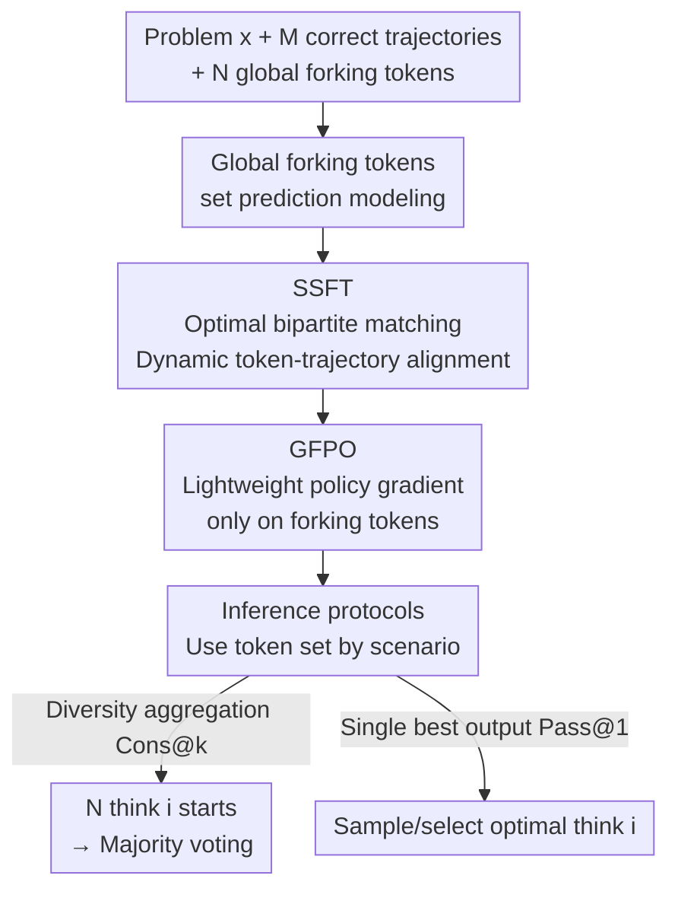

# Training Large Language Models To Reason In Parallel With Global Forking Tokens

**Conference**: ICLR2026  
**arXiv**: [2510.05132](https://arxiv.org/abs/2510.05132)  
**Code**: [Sheng-J/SSFT](https://github.com/Sheng-J/SSFT)  
**Area**: Code Intelligence  
**Keywords**: parallel reasoning, global forking tokens, set supervised fine-tuning, bipartite matching, test-time compute

## TL;DR

This paper proposes Set Supervised Fine-Tuning (SSFT), which aligns global forking tokens with diverse reasoning trajectories through bipartite matching. This enables LLMs to globally steer different reasoning patterns from a single control token, significantly outperforming standard SFT and GRPO on mathematical reasoning and code generation tasks.

## Background & Motivation

- LLMs improve reasoning capabilities by scaling test-time compute (generating more tokens), but **sequential scaling** suffers from "overthinking" issues—performance actually declines after exceeding a certain sequence length.
- **Parallel sampling** (e.g., self-consistency, Best-of-N) is another scaling dimension, but it relies on the model generating **diverse and correct** solutions.
- Research indicates that in Chain-of-Thought reasoning, only a few **forking tokens** lead to different reasoning paths. As problems become harder and generations longer, the probability of sampling these critical tokens decreases significantly.
- Common methods for increasing diversity (e.g., temperature scaling) face a **diversity-accuracy trade-off**: theoretical work shows that merely increasing temperature does not guarantee greater diversity unless the model is explicitly trained for coverage.

## Core Problem

How can diverse reasoning trajectories be utilized to train LLMs so they fork into different reasoning modes via a set of **global control tokens** at the start of generation, achieving high diversity and high accuracy in parallel reasoning without relying on sampling intermediate forking tokens?

## Method

### Overall Architecture

The method reformulates "teaching an LLM multiple reasoning styles simultaneously" as a set prediction problem: a set of global forking tokens $\langle \text{think 1} \rangle \dots \langle \text{think N} \rangle$ is placed at the beginning of the sequence, allowing each token to uniquely "claim" a reasoning trajectory. Training occurs in two stages: first, SSFT aligns tokens and trajectories through bipartite matching; then, GFPO, a lightweight RL step, fine-tunes the distribution at the token positions. During inference, the model can fork into different reasoning modes from the start simply by initiating with different $\langle \text{think i} \rangle$ tokens.

### Key Designs

**1. Global Forking Tokens and Set Prediction Modeling: Making diversity globally determined by a starting control token**

Past parallel reasoning relied on sampling rare intermediate forking tokens within a Chain-of-Thought to produce different paths. This paper changes the approach: it defines a set of global forking tokens $\boldsymbol{g} = \{g^{(i)}\}_{i=1}^{N}$ (instantiated as $\langle \text{think 1} \rangle, \dots, \langle \text{think N} \rangle$), fixed at the start of the generation sequence. This ensures different reasoning modes are globally steered from the beginning. Given problem $\mathbf{x}$ and $M$ diverse correct trajectories $\mathbf{R} = \{\mathbf{r}^{(j)}\}_{j=1}^{M}$, the goal is for each $g^{(i)}$ to uniquely trigger one trajectory. This requires formulating the training objective as set-of-next-token-prediction: the loss must be **permutation-invariant** regarding the order of $\mathbf{R}$ and $\boldsymbol{g}$, and **different trajectories cannot share the same $g^{(i)}$** to prevent mode collapse.

**2. SSFT: Aligning tokens and trajectories via optimal bipartite matching to avoid mode collapse**

Hard-assigning the $j$-th trajectory to the $j$-th token introduces artificial order bias. SSFT borrows the set loss concept from DETR, allowing the token-trajectory assignment to be decided dynamically at each training step. First, **optimal matching** is performed: a cost matrix is constructed where elements are the length-normalized, stop-gradient NTP loss of trajectory $\mathbf{r}^{(j)}$ conditioned on $g^{(i)}$. The Hungarian algorithm finds the minimum cost matching $\hat{\boldsymbol{\sigma}}$. Then, **optimization** is performed by backpropagating only on the matched $M$ sequences to minimize the Hungarian loss:

$$\mathcal{L}_{\text{Hungarian}}(\boldsymbol{\theta}) = -\mathbb{E}_{\mathbf{x}, \mathbf{R}}\Big[\sum_{j=1}^{M}\sum_{t=1}^{T_\mathbf{r}} \log \pi_\theta\big(r_t^{(j)} \mid \mathbf{x}, g^{(\hat{\sigma}(j))}, \mathbf{r}_{<t}^{(j)}\big)\Big]$$

Since matching is solved independently for each problem, a teacher trajectory may be assigned to different forking tokens across different problems. Consequently, the model learns the association between tokens and "reasoning styles" rather than specific samples, allowing positive transfer between different trajectories. Implementation maintains $N > M$ (the paper uses $N=6, M=4$), providing space for similar trajectories to differentiate. A key computational trick: matching costs use only the first $L$ tokens of each trajectory ($L \approx \lfloor \text{max\_seq\_len}/(MN) \rfloor$), allowing all $M \times N$ costs to be calculated in a single forward pass with negligible training overhead.

**3. GFPO: Lightweight RL applying policy gradients only on forking tokens**

Following SSFT, a small number of RL steps further differentiate the tokens, but gradients are only applied to the output distribution of the global forking tokens. Since these tokens are always at fixed positions, this only requires a few lines of Python slicing in standard GRPO code: full generations are rolled out to estimate the advantage of each $g^{(i)}$, but backpropagation only updates the distribution at token positions, making the cost much lower than full-sequence RL.

**4. Inference Protocols: Selecting token usage by scenario**

When measuring diversity aggregation (Cons@k), $N$ different $\langle \text{think i} \rangle$ tokens are used to initiate separate generations followed by majority voting, converting learned diversity directly into coverage. For single best output (Pass@1), the GFPO model can automatically sample the optimal $g^{(i)}$, or select the $g^{(i^*)}$ that covered the most diverse trajectories during training (per the graph heuristic in the paper's Equation 4).

## Key Experimental Results

### Experimental Setup

- **Base Model**: Qwen2.5-32B-Instruct
- **Training Data**: 1,000 problems from s1k, with 4 reasoning trajectories distilled for each from R1, Gemini Flash, Claude Opus 4.0/4.1, and GPT-OSS-120B.
- **Evaluation**: AIME24/25, MATH-500, GPQA-Diamond, LiveCodeBench (OOD).

### Main Results (Pass@1)

| Model | AIME24 | AIME25 | MATH-500 | LCB(OOD) |
|---|---|---|---|---|
| SFT-mixed-distill-32B | 58.23 | 51.96 | 88.49 | 32.34 |
| SSFT-32B (random σ) | 61.77 | 55.10 | 89.95 | 35.33 |
| **SSFT-32B** | **64.06** | **58.13** | **90.02** | **38.92** |
| **SSFT-32B-GFPO** | **64.22** | **58.80** | 89.90 | **42.10** |

- SSFT improves over SFT on the same data by **+5.83 / +6.17** on AIME24/25, respectively.
- Cons@32 reaches **86.67%** on AIME25, a 10-percentage-point increase over SFT's 76.67%.
- On OOD code generation (LCB), SSFT-GFPO reaches 42.10%, a gain of +9.76.

### Key Findings

- Different $\langle \text{think i} \rangle$ tokens trigger **distinctly different reasoning length distributions and accuracies** (Figure 4).
- In models trained with random matching, no discernible differences are found between different $\langle \text{think i} \rangle$ tokens (Figure 5).
- Only a few matching configurations consistently receive weight during training, indicating the model learns stable associations between forking tokens and reasoning patterns.

## Highlights & Insights

- **Elegant Problem Modeling**: Formulates parallel reasoning as a set prediction problem, applying bipartite matching ideas from DETR to language modeling for the first time with clear theoretical grounding.
- **High Practicality**: Global forking tokens are at fixed positions, allowing diversity to be steered without complex search; GFPO is implemented with minimal code changes.
- **Interpretable Visualization**: The evolution of matching configurations during training clearly demonstrates the automated learning of associations between forking tokens and reasoning modes.
- **Extremely Low Computational Overhead**: Matching cost calculation utilizes stop-gradient and only the first $L$ tokens, adding almost no training time.

## Limitations & Future Work

- The current $N=6, M=4$ setting is small-scale; the effects and computational burden of larger-scale bipartite matching remain to be explored.
- Diverse reasoning trajectories rely on multi-teacher distillation, implying dependence on teacher quality and diversity.
- GFPO only applies policy gradients to forking tokens; whether this can be extended to more controllable positions is not discussed.
- Evaluation focuses on math and code; effectiveness on open-domain reasoning tasks (e.g., commonsense reasoning, multi-hop QA) is unknown.

## Related Work & Insights

| Method | Features | Ours Advantage |
|---|---|---|
| Temperature scaling | Increases diversity via temperature | Cannot guarantee coverage; high temp reduces accuracy |
| Self-consistency / Best-of-N | Aggregation after parallel sampling | No explicit diversity training, relies on intermediate forks |
| Multiverse (Yang et al., 2025b) | Converts sequential CoT to parallel | Lacks set loss; cannot avoid mode collapse |
| Concurrent work (Wen et al., 2025) | Multi-trajectory distillation + random tags | Random assignment fails to learn token-trajectory associations |
| DETR (Carion et al., 2020) | Global set loss in object detection | First extension to autoregressive language modeling |

## Rating

- Novelty: ⭐⭐⭐⭐⭐ (Introduces set prediction to LM; global forking tokens are a novel concept)
- Experimental Thoroughness: ⭐⭐⭐⭐⭐ (Multiple benchmarks, model scales, data sources, and rich ablation studies)
- Writing Quality: ⭐⭐⭐⭐⭐ (Clear formulas, rich visualizations, rigorous experimental logic)
- Value: ⭐⭐⭐⭐⭐ (Practical and theoretically elegant; provides important guidance for parallel reasoning training)

<!-- RELATED:START -->

## Related Papers

- [\[ICML 2026\] Locally Coherent Parallel Decoding in Diffusion Language Models](../../ICML2026/code_intelligence/locally_coherent_parallel_decoding_in_diffusion_language_models.md)
- [\[ICLR 2026\] Evolving Graph Structured Programs for Circuit Generation with Large Language Models](evolving_graph_structured_programs_for_circuit_generation_with_large_language_mo.md)
- [\[ICLR 2026\] CrossPL: Systematic Evaluation of Large Language Models for Cross Programming Language Interoperating Code Generation](crosspl_systematic_evaluation_of_large_language_models_for_cross_programming_lan.md)
- [\[ICLR 2026\] LearNAT: Learning NL2SQL with AST-guided Task Decomposition for Large Language Models](learnat_learning_nl2sql_with_ast-guided_task_decomposition_for_large_language_mo.md)
- [\[ICLR 2026\] Learning to Reason without External Rewards](learning_to_reason_without_external_rewards.md)

<!-- RELATED:END -->
