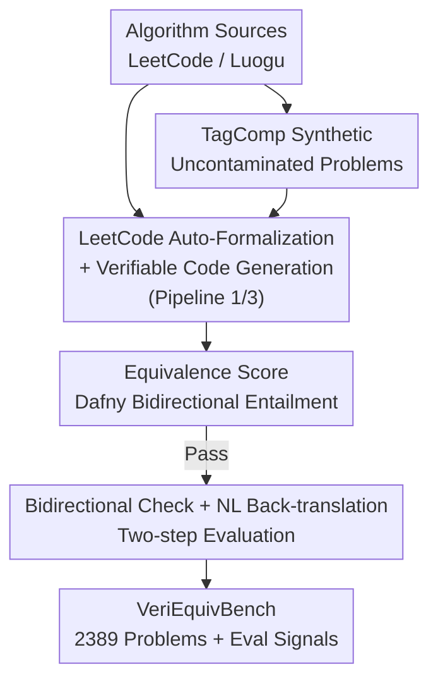

# VeriEquivBench: An Equivalence Score for Ground-Truth-Free Evaluation of Formally Verifiable Code

**Conference**: ICLR 2026  
**OpenReview**: [https://openreview.net/forum?id=tRRHVUwP2B](https://openreview.net/forum?id=tRRHVUwP2B)  
**Code**: https://github.com/PunyGoood/VeriEquivBench  
**Area**: Code Intelligence / Formal Verification / LLM Evaluation  
**Keywords**: Verifiable code generation, formal specification, equivalence score, Dafny, ground-truth-free evaluation

## TL;DR
To address the issue where "verifiable code generation" evaluation is limited by the scale and errors of manually annotated ground-truth specifications, this paper proposes an **equivalence score**. It uses the Dafny verifier to automatically check the **bidirectional entailment** between code and specifications, enabling quality assessment without ground truth. Based on this, VeriEquivBench is constructed with 2,389 complex algorithmic problems, where results show that even Claude-4-sonnet completely fails under pass@4.

## Background & Motivation
**Background**: The next frontier for LLMs to generate trustworthy code is **formal verification**. Instead of merely running unit tests, models generate formal specifications alongside code, which are then proven by theorem provers (such as Dafny, which includes an automated prover) to ensure "code $\iff$ user intent." This provides provable correctness guarantees and avoids issues like insufficient unit test coverage or missing critical bugs.

**Limitations of Prior Work**: The bottleneck of this path lies in **evaluation** rather than generation. Existing Dafny benchmarks (DafnySynthesis, CloverBench) rely on **matching model-generated specifications against manually written "ground-truth specifications."** However, formal annotation is extremely expensive and requires deep expertise, resulting in these datasets totaling only **215 simple problems**, which is insufficient for stress-testing the advanced reasoning of modern LLMs. Worse, the ground truths themselves are unreliable: CloverBench found that 10% of expert specifications in DafnySynthesis were incorrect, and this paper identifies an additional 18% containing errors or ambiguities. Relying on such ground truth undermines the fundamental validity of these benchmarks.

**Key Challenge**: Traditional methods for evaluating whether a specification is "good" require a "gold standard" for comparison. Since these standards are scarce and unreliable, **specification evaluation is simultaneously locked by both scale and reliability.**

**Goal**: ① Identify a specification quality metric that does not depend on ground truth and provides formal guarantees; ② Use it to scale the benchmark in size and difficulty by an order of magnitude; ③ Conduct empirical tests to assess the true performance of current LLMs in end-to-end verifiable code generation.

**Key Insight**: The authors observe that determining if a specification "precisely characterizes the code" does not require an external gold standard; it only requires checking the **mutual entailment between the specification and the code**. If a specification is too weak (e.g., binary search only requiring $-1 <= idx < a.Length$), a buggy implementation that fails to find the key could still pass the verifier—this is the vulnerability.

**Core Idea**: Use the Dafny verifier to automatically prove the **bidirectional entailment** of "$code \implies spec$" and "$spec \implies code$," defined as the **equivalence score**. Score is assigned only if both directions hold, allowing for a **ground-truth-free, zero-false-positive** determination of whether a specification is complete and unambiguous.

## Method

### Overall Architecture
This work is essentially a benchmark project consisting of an "evaluative metric + data construction pipeline + LLM empirical study." The core metric is the **equivalence score**, and the data pipeline processes raw algorithmic problems (from LeetCode / Luogu) into a four-part annotation: "natural language query + Python/Dafny implementation + formal specification + unit tests," validated by the equivalence score.

The pipeline comprises three stages (Pipeline 1/2/3 in Figure 2): **Pipeline 1** automatically formalizes problem descriptions into syntax-error-free Dafny specifications; **Pipeline 2** verifies the consistency between the NL query and the specification (back-translation + unit tests); **Pipeline 3** produces verifiable Dafny code annotations given the specification, description, and reference solution. Furthermore, the authors designed a **TagComp** synthesizer to mass-produce uncontaminated new problems and a two-step evaluation protocol involving **bidirectional equivalence + NL back-translation**.

### Key Designs

**1. Equivalence Score: Replacing Ground-Truth Matching with Bidirectional Entailment**

This serves as the anchor of the paper, directly addressing the pain point of requiring ground truth for evaluation. The authors split "whether the specification precisely characterizes the code" into two directions of entailment, both handled by the Dafny verifier: ① **$Code \implies Spec$** (code behavior falls within the specification's bounds), done by submitting the annotated Dafny program to the verifier; ② **$Spec \implies Code$** (specification tightly characterizes code behavior for any input without slack), requiring a verification script to prove "the code will not behave outside the specification." An equivalence score is awarded only if **both directions pass**.

The critical advantage is **zero false positives**: Dafny's automated prover only allows passage when the entailment truly holds, ensuring accepted pairs are precise matches. Figure 3 provides a counter-example: the post-condition for `Max(a,b)` only states `ensures max >= a`, missing `>= b`. By constructing `Check_Max_Spec` to take an arbitrary `max` satisfying the spec and asserting it equals the actual output, the verifier identifies the assertion as false, preventing this underspecified program from receiving an equivalence score. In contrast, the prior Clover protocol relied on unreliable LLM judgments for NL equivalence; the equivalence score delegates judgment entirely to a formal prover.

**2. LeetCode Auto-Formalization + Verifiable Code Generation Pipeline**

To solve the scale issue of manual annotation, the authors use LLMs to convert community-verified LeetCode problems into formal annotations. In the specification generation phase (Pipeline 1), Claude-4-sonnet produces initial Dafny specifications, with **up to 10 retries** to eliminate parse/resolution errors. Using few-shot in-context learning significantly reduces errors; meanwhile, specifications are **restricted to first-order logic** (prohibiting recursion or DP-style definitions) to ensure they describe declarative properties rather than implementation details. The code generation phase (Pipeline 3) uses a **multi-stage pipeline**: a strong model (Claude-4) generates annotated Dafny code given specifications and Python solutions, and a lighter model (Claude-3.5) refines it with **up to 6 iterations** to eliminate syntax errors, typically converging within 3 rounds.

The pipeline produces **two versions of specifications**: a "strong spec" derived losslessly from the query (complete enough for Claude-4 to recreate the implementation but **unverifiable**) and a "weak spec" (verifiable but incomplete). These map to two auxiliary tasks: "Verifiable Code Refinement" (adding invariants/lemmas to pass verification via strong specs) and "Code-to-Spec Generation" (measuring spec-superior-score against weak baselines). Ultimately, 2,174 Dafny programs were converted from LeetCode.

**3. TagComp: Scalable Synthetic Uncontaminated New Problems**

To prevent data contamination and provide an infinite source of training data, the authors designed a synthesizer based on a **fine-grained tag ontology + random combination**. Each problem is tagged across three orthogonal dimensions: **domain**, **data structure**, and **algorithm**. The ontology defines 500+ fine-grained tags (7x the density of LeetCode's 69 tags), sourced from Luogu and manually cleaned. For synthesis, **12 tags are sampled from each pool, and Claude-4 selects 3–8** to generate a clear algorithm problem with ~40 unit tests. An initial pool of ~1,900 problems was narrowed down to **300 problems with unit test pass rates $\ge 85\%$**, forming the TagComp set. Combined with LeetCode, this results in 2,389 problems compatible with the equivalence score signal.

**4. Bidirectional Validation + NL Back-translation: Two-step Intent Alignment Assessment**

Equivalence score alone is insufficient—it ensures the code and spec are precise relative to each other but not necessarily aligned with the original user intent. Thus, evaluation consists of two steps: ① Using the equivalence score to ensure the code and spec are **bidirectionally equivalent**; ② **Back-translating** the formal spec into NL to judge if it captures the original query intent. Back-translation involves Grok-4 rewriting and Claude-4 equivalence scoring (82.98% success rate), supplemented by translating the spec alone into Python to run unit tests. In the final evaluation, **Claude-4 acts as a judge** to evaluate intent satisfaction. Only programs passing both steps receive the **exact matching score**.

## Key Experimental Results

### Main Results
**Data Scale and Complexity**: VeriEquivBench significantly exceeds predecessors in scale and difficulty. Average Cyclomatic Complexity rose from 2.44 in DafnySynthesis to 5.63, with problems often containing multiple methods.

| Dataset | Avg Cyclomatic Complexity | Note |
|---|---|---|
| MBPP-50 | 2.44 | Source for DafnySynthesis |
| MBPP | 2.78 | — |
| LeetCode (Ours) | 5.38 | Significantly more complex control flow |
| TagComp (Ours) | 5.63 | Synthetic problems are harder than LeetCode |

**SOTA LLM Performance (pass@4)**: On the older CloverBench, Claude-4-sonnet achieved 75.81%, but on the uncontaminated TagComp, performance collapsed—all three proprietary models **failed on every problem**. While Claude could generate "syntactically correct Dafny code" at 73.79%, the "bidirectional equivalence" score for GPT-4 peaked at only **2.65%**. Further analysis showed these "equivalent" solutions were mostly reward-hacking simplified implementations that did not truly meet user requirements.

| Benchmark | Top Model Performance | Conclusion |
|---|---|---|
| CloverBench | Claude (75.81%) | Oversimplified; masks true difficulty |
| VeriEquivBench (TagComp) | All models failed | Formal reasoning for complex algorithms remains an open challenge |

### Ablation Study
**Validity of Equivalence Score as a Metric**: The authors used the equivalence score to audit the "ground-truth specifications" of previous benchmarks, exposing serious issues—many alleged ground truths could not establish equivalence with the code.

| Configuration / Dataset | Equivalence Score Ratio | Note |
|---|---|---|
| DafnySynthesis | 76.22% | Nearly 1/4 of ground-truth specs fail equivalence |
| CloverBench | 61.29% | NL-dependent equivalence checks are limited |
| DafnyBench | 43.09% | Not designed for spec completeness; lowest score |

Furthermore, in 50 expert verifiable codes from DafnySynthesis, the equivalence score identified 9 samples with ambiguities or code errors (of the 14 failures, only 8 could be repaired manually, highlighting the difficulty of manual annotation).

### Key Findings
- **Zero False Positives are Core Value**: The metric not only scores new solutions but acts as a "ground-truth auditor," identifying 18%~57% inferior specifications in prior benchmarks—a feat impossible for unidirectional verification.
- **High Scores on Old Benchmarks are Illusory**: Success rates on CloverBench masked the true task difficulty; shifting to complex problems dropped scores to zero, indicating benchmark difficulty must rise with model capability.
- **LLM Bottleneck is Formal Reasoning + Intent Alignment**: Models can write syntactically correct Dafny (73.79%) but fail to generate solutions that are both equivalent to the spec and aligned with the query ($\le 2.65\%$), with the remaining successes often being reward hacking.
- **Auxiliary Tasks are Challenging**: RL baselines achieved only 17.68% on "verifiable code refinement" and 54% on "specification generation," with almost no samples generating complete specifications—likely due to SFT models being trained on overly simple problems.

## Highlights & Insights
- **Transforming "Ground-truth-free Eval" into "Bidirectional Entailment"**: The most elegant move is recognizing that specification quality doesn't require a gold standard, just internal consistency proven by a verifier. This turns a data annotation problem into a formal verification problem with zero false positives.
- **Benchmarks as "Auditors"**: The equivalence score is not just for new models; it systematically audits old benchmarks, exposing inferior quality in DafnySynthesis, CloverBench, and DafnyBench.
- **Tag Synthesis as a Data Engine**: The 500+ tag ontology provides a paradigm for "sustainable problem generation" that naturally avoids contamination and is natively compatible with formal evaluation signals.
- **Honest "Complete Failure" Reporting**: The authors do not sugarcoat results, showing that SOTA fails at pass@4, which highlights the true difficulty of verifiable code generation—a valuable negative conclusion for the field.

## Limitations & Future Work
- **Heavy Reliance on Specific Proprietary Models**: The pipeline's automated formalization, back-translation, and judging rely on Claude-4 / Grok-4; model bias or inconsistency could directly affect data quality and evaluation.
- **Trade-off with Weak Specs**: Much of the dataset uses weak baseline specs (as strong specs often fail the verifier), meaning the formal attributes are incomplete, potentially capping downstream task performance.
- **Weak Auxiliary Task Baselines**: Low RL baseline scores may be due to SFT starting points trained on simple problems rather than task difficulty itself.
- **Information Density of "All Failures"**: While zero scores indicate difficulty, they make it hard to distinguish capability gradients between models. Future work may require more granular metrics or partial scoring mechanisms.

## Related Work & Insights
- **vs. Clover (Sun et al., 2024)**: Clover's equivalence check relies on unreliable LLM judgments of natural language; this work delegates judgment to a formal prover's bidirectional entailment.
- **vs. Yan et al. (2025) (spec-superior-score)**: They use partial order comparisons against ground-truth specs; this work bypasses ground-truth dependency entirely through bidirectional verification.
- **vs. DafnyBench / DafnySynthesis / CloverBench**: Previous works either omit spec completeness (DafnyBench equivalence 43.09%) or are small-scale (215 problems) with 10%~28% errors in ground truth. VeriEquivBench is an order of magnitude larger (2,389 problems) with doubled complexity and trusted automatic evaluation.

## Rating
- Novelty: ⭐⭐⭐⭐⭐ "Bidirectional Entailment = Ground-truth-free Equivalence" fundamentally redefines specification evaluation.
- Experimental Thoroughness: ⭐⭐⭐⭐ Extensive testing across models and benchmarks with systematic auditing of prior work, though auxiliary baselines are weak.
- Writing Quality: ⭐⭐⭐⭐ Logical progression with clear examples (Max/SwapFirstAndLast), though some pipeline details are scattered in appendices.
- Value: ⭐⭐⭐⭐⭐ Provides a scalable, trustworthy, and contamination-free evaluation base for verifiable code generation.

<!-- RELATED:START -->

## Related Papers

- [\[ICLR 2026\] VERINA: Benchmarking Verifiable Code Generation](verina_benchmarking_verifiable_code_generation.md)
- [\[ICLR 2026\] SWE-RM: Execution-Free Feedback for Software Engineering Agents](swe-rm_execution-free_feedback_for_software_engineering_agents.md)
- [\[ICLR 2026\] CrossPL: Systematic Evaluation of Large Language Models for Cross Programming Language Interoperating Code Generation](crosspl_systematic_evaluation_of_large_language_models_for_cross_programming_lan.md)
- [\[ICLR 2026\] Process-Level Trajectory Evaluation for Environment Configuration in Software Engineering Agents](process-level_trajectory_evaluation_for_environment_configuration_in_software_en.md)
- [\[ICML 2026\] SWE-IF: Aligning Code Evaluation with Human Preference](../../ICML2026/code_intelligence/swe-if_aligning_code_evaluation_with_human_preference.md)

<!-- RELATED:END -->
