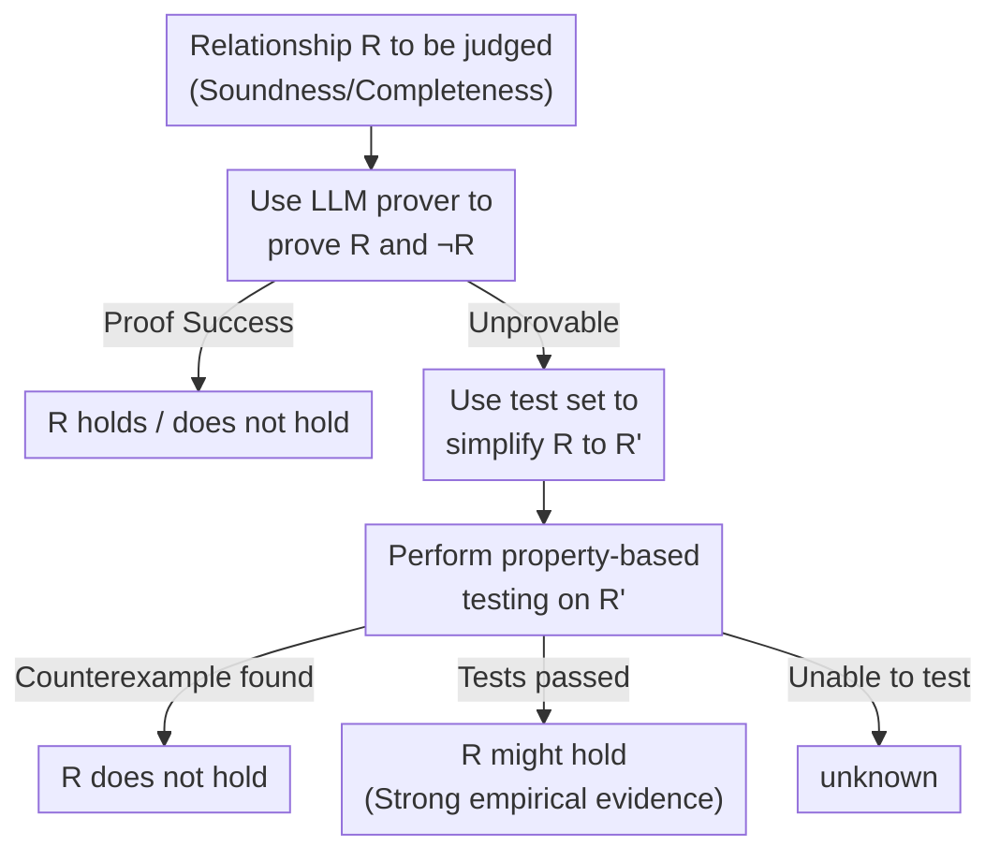

# VERINA: Benchmarking Verifiable Code Generation

**Conference**: ICLR 2026  
**OpenReview**: [https://openreview.net/forum?id=0A4Uf88pog](https://openreview.net/forum?id=0A4Uf88pog)  
**Code**: https://github.com/sunblaze-ucb/verina (including HuggingFace dataset)  
**Area**: Code Intelligence / Verifiable Code Generation / Benchmark  
**Keywords**: Verifiable code generation, Lean, formal specification, theorem proving, Benchmark

## TL;DR
VERINA uses 189 manually refined Lean programming tasks to decompose "verifiable code generation" into three independent yet combinable base tasks: CodeGen, SpecGen, and ProofGen. It provides a multi-stage specification evaluator combining "theorem proving + full coverage testing." Results show that even the strongest o3 achieves only 72.6% code correctness and 52.3% specification success, while the proof success rate is as low as 4.9%.

## Background & Motivation

**Background**: LLM code generation has been widely deployed in tools like Copilot and Cursor. However, because models are inherently probabilistic, they cannot provide formal correctness guarantees for generated code; bugs and security vulnerabilities still rely on manual review. A more ambitious path is "verifiable code generation"—requiring models to **simultaneously generate code, formal specifications, and formal proofs** that the code satisfies the specifications, thereby shifting the "correctness" check from human judgment to machine verification.

**Limitations of Prior Work**: To advance this paradigm, benchmarks are essential for tracking progress, yet existing evaluation systems almost exclusively cover only one or two dimensions. HumanEval/MBPP only handle code without specifications or proofs; DafnyBench and miniCodeProps focus only on proof generation; AutoSpec and SpecGen only infer specifications from existing code. A few works covering all three (Dafny-Synthesis, Clover) suffer from two major flaws: small sample sizes (50, 62 items) and the **intertwining of specification and proof generation** into a single task, preventing separate evaluation. Automated pipelines (e.g., FVAPPS with 4715 items) lack manual quality control, leaving specification quality unassured.

**Key Challenge**: Verifiable code generation naturally involves three **interdependent** sub-tasks. However, a good benchmark must provide robust metrics for each sub-task individually while being able to combine them to reflect the end-to-end real-world scenario of "producing verified software directly from natural language requirements." Existing works either lack coverage, lack quality, or lack modularity, making it difficult to achieve all three simultaneously.

**Goal**: Construct a high-quality, modular benchmark for verifiable code generation that covers all three tasks and provides a reliable specification evaluation method even when current LLM provers are weak.

**Key Insight**: Choose Lean for interactive theorem proving (ITP) rather than Dafny/Verus for automated theorem proving (ATP). Lean proofs include explicit intermediate steps, allowing models to diagnose errors, learn from failure, and iterate; in contrast, SMT solvers are black boxes, making proofs brittle and hard to debug. Meanwhile, the Lean ecosystem is growing rapidly in projects like AlphaProof and AWS production environments.

**Core Idea**: Explicitly decompose verifiable code generation into three independent and combinable base tasks: CodeGen, SpecGen, and ProofGen. This is supported by 189 manually refined Lean problems with full-coverage positive/negative test suites. A multi-stage evaluator is designed for the "specification correctness" problem—the hardest to automate—by "proving first, and falling back to testing if unprovable."

## Method

### Overall Architecture
VERINA is not a model but a benchmark and evaluation protocol. Its core assets are 189 independent Lean programming tasks, each including a natural language description, reference code, formal specification (preconditions + postconditions), optional formal proof, and a test suite with both positive and negative cases. Based on this data, VERINA defines three **base tasks**: given descriptions and function signatures, models produce code (CodeGen), specifications (SpecGen), or proofs (ProofGen). These can be **combined** into workflows like specification-guided code generation, code-to-specification inference, and end-to-end verifiable code generation. The most difficult stage is the automated determination of specification correctness, for which VERINA designs a multi-stage evaluator based on theorem proving and testing.

The following diagram describes this "proof-first, fallback-to-test" specification evaluator (corresponding to Figure 3 in the paper):

### Key Designs

**1. Five-Element Data Format and Three-Source Quality Control: Ensuring High Quality**

To address the common pain points of existing benchmarks—small samples or unvetted automated generation—each task in VERINA consists of five elements: natural language description (median 110 words, clearly stating intent, input types, and output requirements), reference code, formal specification (precondition $P$ for inputs, postcondition $Q$ for input-output relations), optional proof (manually written for 46 of the 189 tasks for quality checks), and a test suite (median 5 positive + 12 negative cases). Data comes from three sources with manual oversight: 49 tasks translated from MBPP-DFY-50, 59 from CloverBench translated via o3-mini few-shot and manually corrected, and 81 from theorem-proving course assignments (originally from LeetCode/LiveCodeBench).

Quality control uses strong constraints: positive tests must achieve **100% line coverage** on reference code (verified via Python reference implementations + coverage.py before manual Lean migration); each positive case generates at least three mutated negative cases violating $P$ or $Q$, categorized to evaluate different specification components accurately; reference code and specifications must pass all positive tests and fail all negative ones. Notably, all ground-truth specifications are deliberately designed to be **unusable as code**, forcing the CodeGen task to perform non-trivial reasoning rather than simply copying the specification.

**2. Three Base Tasks + Modular Combinations: Component-wise and End-to-End**

VERINA decomposes verifiable code generation into three base tasks with a shared input format (NL description + function signature): CodeGen, SpecGen, and ProofGen. Code generation uses standard $\text{pass}@k$ with full-coverage tests; proof generation is verified by the Lean compiler (proofs with `sorry` are marked incorrect). Crucially, these can be **combined** for real scenarios: specification-guided code generation (given ground-truth spec, write code then prove it satisfies the spec), code-to-spec inference (given code, annotate spec and prove alignment), and the hardest end-to-end verifiable code generation (given NL, independently generate code and spec, then prove the code satisfies the **ground-truth spec**).

Requiring the code to satisfy the "ground-truth spec" rather than the "self-generated spec" in end-to-end tasks is a key design choice—otherwise, models could generate trivially equivalent code and specs to make proofs easy. This ensures the evaluation reflects true verification capability. Modular tasks also allow studying dependencies, such as the information gain of specs over NL.

**3. Multi-stage Evaluator for Spec Soundness/Completeness: Automated Specification Validation**

Specification evaluation is the hardest part to automate as "specification equivalence" is undecidable. VERINA defines: let $\phi$ be the set of programs satisfying the ground-truth spec and $\hat{\phi}$ be the set satisfying the generated spec. An ideal spec should have $\hat{\phi}=\phi$, decomposed into **soundness** ($\hat{\phi}\subseteq\phi$, the spec is "small enough" to include only correct programs) and **completeness** ($\phi\subseteq\hat{\phi}$, the spec is "large enough" to cover all correct programs). Specifically, generated $\hat{P}$ is sound iff $\forall x.\,P(x)\Rightarrow\hat{P}(x)$, and $\hat{Q}$ is sound iff $\forall x,y.\,P(x)\wedge\hat{Q}(x,y)\Rightarrow Q(x,y)$.

To judge if relationship $R$ holds, the evaluator follows the multi-stage path: first try to prove $R$ via an LLM prover. If it fails, fallback to testing—simplify $R$ into $R'$ using test values. If Lean cannot determine it directly, use the `plausible` tactic for property-based testing to systematically search for counterexamples for remaining quantifiers. Success yields formal proof; failure yields a counterexample; passing tests without proof indicates "$R$ might hold." To increase precision, both $R$ and $\neg R$ are checked. The final SpecGen metrics report $\text{pass}@k$ for soundness, completeness, and their aggregation, using error bars for unknown results.

### An Example: Judging a Generated Precondition
Consider a task "delete element by index": the true precondition is `k < s.size`. If the model generates `k < s.size - 1`, the evaluator identifies it as **unsound** using the positive test `(s : #[1,2,3,4,5]) (k : 4)` (valid but rejected). If the model generates `k < s.size + 1`, it is judged **incomplete** using the negative test `(s : #[1,2,3,4,5]) (k : 5)` (invalid but accepted). This process is automated via categorized test suites.

## Key Experimental Results

Evaluation of 10 general LLMs and 3 specialized provers/agents, 2-shot prompting, reporting $\text{pass}@1$.

### Main Results: Three Base Tasks

| Task | Best Model | pass@1 | Description |
|------|---------|--------|------|
| CodeGen (Code Score) | o3 | 72.6% | Highest among general models |
| SpecGen (Sound & Complete) | o3 | 52.3% | Harder than code |
| ProofGen (Proof Score) | o3 | 4.9% | All general models < 4.9%, extremely difficult |

Difficulty increases across tasks; proof generation is the bottleneck. General LLMs mostly stall in the single digits for ProofGen. o4-mini, o3, Claude 3.7 Sonnet, and Gemini 2.0 Flash are relatively stronger.

### End-to-End and Combined Tasks

| Task | Best Model | pass@1 |
|------|---------|--------|
| Code&Spec (Both Correct) | o3 | 41.2% |
| End-to-End (Both + Proof) | o4-mini / o3 | 3.2% |

Generating both correct code and specs drops to 41.2%, and requiring a correct proof collapses performance to 3.2%. Proof generation is the primary bottleneck for end-to-end verifiable code generation.

### Dedicated Provers and Iterative Refinement

| Configuration | ProofGen pass@1 | Description |
|------|----------------|------|
| o3 (General) | 4.9% | Best general model |
| Goedel Prover V2 32B | 11.2% | Best specialized prover |
| DeepSeek Prover V2 7B | 8.6% | Specialized prover |
| Copra (o4-mini, ≤64 query) | 7.9% | Tree-search agent |

Specialized provers and agents outperform general models. Iterative refinement (reading Lean errors) can boost o3's success from 4.9% to **20.1% (64 steps)**. Within the same query budget, **iterative refinement consistently outperforms direct generation**, validating the value of the Lean verifier.

### Key Findings
- **Specs help CodeGen, but code doesn't help SpecGen**: Ground-truth specs improve code generation through semantic constraints; however, providing reference code for SpecGen often introduces noise or over-constraints without improving performance.
- **Combined tasks are harder**: Replacing ground truth with LLM-generated intermediate outputs leads to a consistent performance drop.
- **Student tasks are harder**: Problems from theorem-proving courses (LeetCode/LiveCodeBench sources) are more difficult for all models than translated Dafny tasks.

## Highlights & Insights
- **Modular Evaluation Protocol**: Decomposing into three base tasks allows pinpointing exactly where models fail while still supporting end-to-end workflows.
- **"Proof-then-Test" Evaluator**: Tackles the undecidability of spec equivalence by combining the certainty of formal proofs with the empirical strength of full-coverage and property-based testing.
- **The Performance Gap**: Quantifies the stark contrast between LLM coding proficiency (70%+) and formal verification success (<5%), setting a clear target for future research.
- **Anti-cheating Design**: Preventing specs from being used directly as code forces true semantic understanding.

## Limitations & Future Work
- Scale is limited to 189 tasks; expansion for LLM fine-tuning will require LLM-aided automated labeling.
- Tasks are relatively simple programming problems and do not fully represent complex real-world verification engineering.
- The evaluation currently uses testing to bypass the limitations of current LLM provers; future improvements in provers will allow for even stronger formal guarantees.
- Limited only to Lean (ITP); extending to ATP systems like Dafny/Verus would improve generalizability.

## Related Work & Insights
- **vs Dafny-Synthesis / Clover**: VERINA uses Lean, has larger sample sizes (189 vs 50/62), and provides modular task separation, which Clover lacks.
- **vs DafnyBench / miniCodeProps**: These focus solely on proof generation; VERINA covers the entire pipeline.
- **vs FVAPPS**: VERINA emphasizes manual quality control over the sheer volume of automated generation.
- **vs CLEVER**: CLEVER (parallel work) is limited to SpecGen and spec-guided CodeGen on HumanEval; VERINA covers the full workflow spectrum.

## Rating
- Novelty: ⭐⭐⭐⭐ First modular, combinable benchmark for Lean verifiable code generation with an original evaluator paradigm.
- Experimental Thoroughness: ⭐⭐⭐⭐⭐ 13 models/frameworks tested across single, combined, and end-to-end tasks, including iterative refinement.
- Writing Quality: ⭐⭐⭐⭐ Clear definitions of tasks and formalization of soundness/completeness.
- Value: ⭐⭐⭐⭐⭐ Essential infrastructure for bridging the gap between LLM code generation and formal correctness.

<!-- RELATED:START -->

## Related Papers

- [\[ICLR 2026\] VeriEquivBench: An Equivalence Score for Ground-Truth-Free Evaluation of Formally Verifiable Code](veriequivbench_an_equivalence_score_for_ground-truth-free_evaluation_of_formally.md)
- [\[ICLR 2026\] FHE-Coder: Benchmarking Secure Agentic Code Generation for Fully Homomorphic Encryption](fhe-coder_benchmarking_secure_agentic_code_generation_for_fully_homomorphic_encr.md)
- [\[ICLR 2026\] InnoGym: Benchmarking the Innovation Potential of AI Agents](innogym_benchmarking_the_innovation_potential_of_ai_agents.md)
- [\[ICLR 2026\] Local Success Does Not Compose: Benchmarking Large Language Models for Compositional Formal Verification](local_success_does_not_compose_benchmarking_large_language_models_for_compositio.md)
- [\[ICML 2026\] MEnvAgent: Scalable Polyglot Environment Construction for Verifiable Software Engineering](../../ICML2026/code_intelligence/menvagent_scalable_polyglot_environment_construction_for_verifiable_software_eng.md)

<!-- RELATED:END -->
