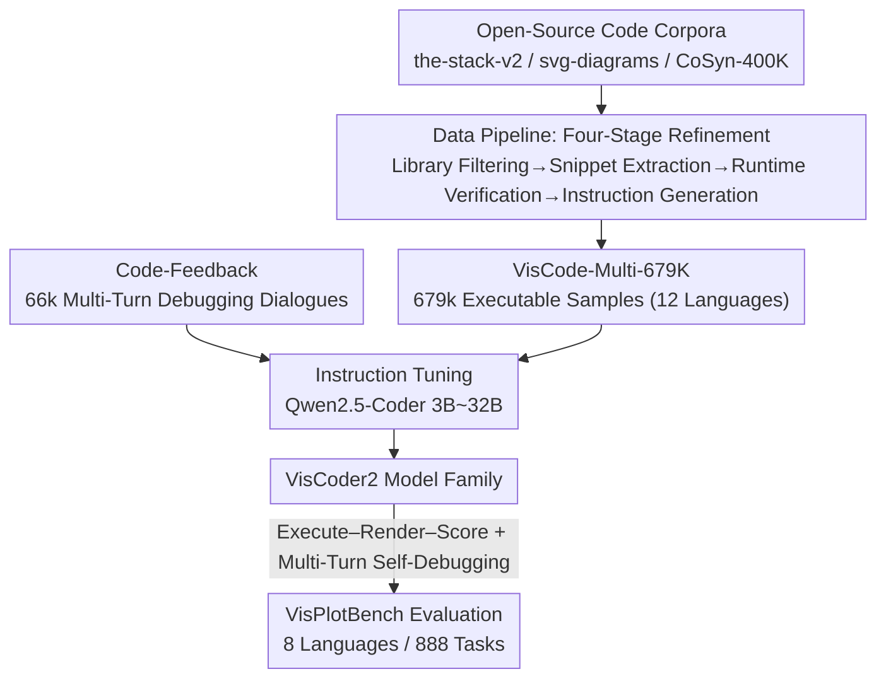

# VisCoder2: Building Multi-Language Visualization Coding Agents

**Conference**: ICLR 2026  
**OpenReview**: [https://openreview.net/forum?id=4zoMnmZzh4](https://openreview.net/forum?id=4zoMnmZzh4)  
**Code**: https://tiger-ai-lab.github.io/VisCoder2  
**Area**: Code Intelligence / Visualization Code Generation / Programming Agents  
**Keywords**: Visualization programming, multi-language code generation, self-debugging, execution feedback, instruction tuning

## TL;DR
Addressing three major pain points of existing visualization code models—narrow language coverage, non-executability, and inability to iteratively correct errors—this paper introduces a dataset (VisCode-Multi-679K, 12 languages, 679k executable samples), a benchmark (VisPlotBench, 8 languages, 888 tasks), and a model family (VisCoder2, 3B~32B). For the first time, an open-source model matches GPT-4o in execution pass rate (32B reaches 82.4% after self-debugging), significantly leading in symbolic/compiled languages such as LilyPond, LaTeX, and Asymptote.

## Background & Motivation

**Background**: LLM-driven programming agents are increasingly used in data analysis and reporting for the "generate visualization code → execute → observe feedback → iterate" workflow. Visualization tasks offer a natural advantage: execution results and rendered images provide strong signals, allowing immediate judgment of code correctness, which is ideal for training "self-correcting" agents.

**Limitations of Prior Work**: Existing models frequently fail in real-world workflows, generating code that crashes, produces incorrect plots, or fails when switching languages/libraries. This stems from narrow datasets and benchmarks; most focus solely on Python or Vega-Lite and contain fragmented, non-executable snippets. Existing benchmarks also focus on "single-turn generation" without protocols for multi-turn repair or cross-language evaluation.

**Key Challenge**: The real workflow of visualization is inherently **iterative**. Analysts rarely get a plot right in one go; they repeatedly revise based on execution errors and visual feedback. Training resources, however, are typically "single-turn, single-language, and unverified," which is completely decoupled from the real demand for "multi-language + runtime verification + feedback correction."

**Goal**: To address these three limitations: (1) an **execution-verified**, multi-language training dataset containing multi-turn debugging dialogues; (2) a cross-language benchmark for evaluating "initial generation + multi-turn self-debugging"; and (3) a truly reliable multi-language visualization programming model.

**Key Insight**: Treat "execution + rendering" as a free supervisory signal. By keeping only samples that successfully execute and render valid images, large-scale data can be constructed. By mixing "multi-turn dialogues with execution feedback" into instruction tuning, the model can learn to interpret error logs to fix code.

**Core Idea**: Use "execution-verified multi-language samples + multi-turn debugging dialogues" for instruction tuning to train a visualization programming agent capable of the "execute-render-self-debug" cycle across 8+ languages.

## Method

### Overall Architecture

The paper proposes a synergistic triad of "dataset + benchmark + model." First, a four-stage pipeline refines open-source code corpora into 679k executable visualization samples (VisCode-Multi-679K), mixed with 66k multi-turn debugging dialogues containing execution feedback. These are used for instruction tuning on Qwen2.5-Coder (3B~32B) to obtain VisCoder2. Finally, a standardized "execute-render-score" protocol with up to 3 self-debugging turns is used for evaluation on the self-built VisPlotBench (8 languages, 888 tasks). The input consists of "natural language instructions + sparse data previews," and the output is executable and correctly rendered visualization code.

### Key Designs

**1. Four-Stage Data Pipeline: Using "Executability" as a Filter**

Visualization datasets are often hindered by non-executable samples. The solution involves using execution itself as a hard filtering threshold. The pipeline consists of: **Library Filtering** (extracting candidates based on keywords of common visualization libraries across Python/JS/C++/TS/HTML/R from three complementary corpora); **Snippet Extraction** (extracting independent plotting blocks using GPT-4o-mini and injecting mock inputs for standalone execution); **Runtime Verification** (running in isolated Jupyter environments with specific kernels, using `nbconvert` with `allow-error=False` for strict filtering, and **retaining only samples that execute successfully and produce valid images** larger than 10KB); **Instruction Generation** (using GPT-4o to write natural language instructions for each verified sample). This process ensures "executable" supervision signals.

**2. Five-Part Structured Instructions: Covering Semantics and Visual Style**

To ensure the model learns data structures and visual styles rather than just simple commands, instructions are split into five components: (1) Setup (language and library); (2) Data/Visual Description (underlying data for data-driven plots or visible elements for non-data-driven plots); (3) Data Block (one-line data generation or two-line preview); (4) High-level Output Description (conceptual intent); (5) Style Description (visual attributes like color and grid layout). This forces a uniform instruction structure across languages and corpora.

**3. Multi-Turn Execution Feedback: Integrating "Error-Correction" into Training**

Single-turn samples do not teach iterative correction. The authors intermix 66k multi-turn dialogues from Code-Feedback, each containing user instructions, generated code, and subsequent turns with execution feedback or revision hints. While not all are visualization-themed, they provide the crucial supervision for "fixing code based on runtime signals," training the model in both "initial generation" and "multi-turn repair."

**4. VisPlotBench: Execute–Render–Score Protocol + Multi-Turn Self-Debugging**

To evaluate debugging capabilities fairly, the benchmark must support multiple turns. VisPlotBench covers 8 languages across 13 visual categories and 116 subcategories (888 tasks). Evaluation follows a standardized pipeline producing rendered images, execution logs, and metadata. Three metrics are reported: **Execution Pass Rate**, **Task Score** (instruction following via LLM judge), and **Visual Score** (perceptual similarity to reference images). For unresolved tasks, the model attempts up to 3 repair turns using the instructions, previous code, and error logs.

### Mechanism

Taking a LilyPond music notation task as an example: The instruction requires "generating a piano score for a piece by J.S. Bach." After VisCoder2-7B generates the initial code, it is sent to an isolated kernel for compilation. Symbolic languages like LilyPond have fragile syntax; initial versions often fail due to `MarkupError` or structural issues. During self-debugging, the model receives the error log, fixes missing tokens or syntax errors, and recompiles. For this language, the baseline Qwen2.5-Coder-7B only achieves a 5.5% pass rate, while VisCoder2-7B reaches 69.1% initially and 72.7% after debugging, with a tenfold increase in high-quality task scores.

## Key Experimental Results

### Main Results

Comparison of execution pass rate (%) on VisPlotBench (8 languages):

| Model | Overall | Python | Vega-Lite | LilyPond | LaTeX | Asymptote |
|------|---------|--------|-----------|----------|-------|-----------|
| GPT-4o | 63.4 | 64.3 | 84.5 | 43.6 | 31.3 | 21.7 |
| GPT-4o + Self-Debug | 82.4 | 84.2 | 96.1 | 63.6 | 66.1 | 46.7 |
| Qwen2.5-Coder-32B | 57.5 | 50.5 | 83.0 | 30.9 | 29.5 | 17.4 |
| **VisCoder2-32B** | **73.1** | 65.3 | 94.6 | 56.4 | 42.9 | 58.7 |
| **VisCoder2-32B + Self-Debug** | **82.4** | 81.6 | 96.1 | 69.1 | 61.6 | 71.7 |

VisCoder2-32B outperforms the same-sized Qwen2.5-Coder by ~15 percentage points and reaches 82.4% after self-debugging, matching GPT-4o and surpassing GPT-4o-mini. Small models are also effective: VisCoder2-3B reaches 67.7%, exceeding the much larger DeepSeek-Coder-33B (54.3%).

### Key Findings
- **Self-debugging yields the highest gains in symbolic/compiled languages**: For languages with fragile syntax like LilyPond, LaTeX, and Asymptote, self-debugging rescues many "shallow but frequent" failures, increasing the overall 32B score by nearly 10 points.
- **Structural/API errors are easy to fix, while semantic/runtime errors are difficult**: Structural and type errors that can be localized by error logs drop significantly (Python API errors 13 → 3), whereas semantic errors requiring deep reasoning (LaTeX 28 → 23) remain a bottleneck.
- **SVG is the sole weakness**: VisCoder2 lags behind the strongest baseline in SVG execution rates by over 10 points, as SVG evaluation is highly sensitive to library-specific rendering details rather than pure semantic understanding.
- **Targeted dataset coverage translates directly to capability**: The coverage of symbolic syntax in VisCode-Multi-679K elevates the model from "near-zero" performance to usable levels in languages like LilyPond.

## Highlights & Insights
- **Executability as a Hard Quality Constraint**: Using `allow-error=False` and image validation ensures the elimination of "non-executable training samples" at the source. This is a strong, "free" supervisory signal inherent to visualization data that can be migrated to any automatically verifiable code task.
- **Integrating "Debugging Dialogues" to Empower Self-Debugging**: Many works only wrap a self-debug loop during inference, but models fail to repair if they haven't seen "reading error logs to fix code" during training. Mixing multi-turn feedback dialogues into instruction tuning provides the actual foundation for the gains observed in self-debugging.
- **Alignment between Benchmark and Training**: VisPlotBench's multi-turn protocol mirrors the training data format, avoiding the "train on single-turn, evaluate on multi-turn" mismatch.
- **Symbolic/Compiled Languages are the Real Bottleneck**: Even GPT-4o scores below 45%/25% on LilyPond/Asymptote. This paper identifies that breaking through symbolic syntax is the key to generalization.

## Limitations & Future Work
- **Imbalanced Training Corpora**: High-resource ecosystems like Python and Vega-Lite have abundant samples, while symbolic/domain-specific languages have much fewer, potentially biasing the model.
- **Limited Benchmark Language Coverage**: VisPlotBench currently covers 8 languages; expansion to more frameworks is needed for a more comprehensive evaluation.
- **Persistence of Semantic/Runtime Errors**: Current self-debugging relies on logs, which are insufficient for semantic errors requiring deep logic. This necessitates "syntax-aware training objectives" and more robust runtime integration.
- **Dependence on GPT-4o for Instructions and Scoring**: The quality of training instructions and Task/Visual scores depends on GPT-4o, which may introduce bias toward certain styles.

## Related Work & Insights
- **vs VisCoder (Prior Work)**: The previous version introduced self-debugging only for Python. VisCoder2 generalizes this to 8 languages and 13 visual categories, significantly expanding data scale and language coverage.
- **vs General Multi-Language Code Models**: While models like the-stack-v2 or Qwen have wide coverage, they lack specialized visualization knowledge, particularly in niche domain languages like LaTeX mathematical diagrams or LilyPond scores.
- **vs Visualization Systems like LIDA**: While such systems have feedback mechanisms, they lack systematic multi-turn, cross-language error correction capabilities. VisCoder2 unifies these aspects, particularly excelling in symbolic languages.

## Rating
- Novelty: ⭐⭐⭐⭐ Systematic integration of "execution-verified + multi-language + self-debugging" fills a major gap.
- Experimental Thoroughness: ⭐⭐⭐⭐⭐ 4 scales × 8 languages × dual modes + detailed error analysis.
- Writing Quality: ⭐⭐⭐⭐ Clear structure with a complete motivation-method-experiment loop.
- Value: ⭐⭐⭐⭐⭐ Fully open-sourced dataset, benchmark, and models, allowing open-source models to match proprietary SOTA.

<!-- RELATED:START -->

- **VisCoder**: [https://arxiv.org/abs/2402.13138](https://arxiv.org/abs/2402.13138)
- **Qwen2.5-Coder**: [https://arxiv.org/abs/2409.12186](https://arxiv.org/abs/2409.12186)
- **Code-Feedback**: [https://arxiv.org/abs/2402.04258](https://arxiv.org/abs/2402.04258)

<!-- RELATED:END -->

## Related Papers

- [\[ICLR 2026\] Multi-LCB: Extending LiveCodeBench to Multiple Programming Languages](multi-lcb_extending_livecodebench_to_multiple_programming_languages.md)
- [\[NeurIPS 2025\] Text-to-Code Generation for Modular Building Layouts in Building Information Modeling](../../NeurIPS2025/code_intelligence/text-to-code_generation_for_modular_building_layouts_in_building_information_mod.md)
- [\[ACL 2026\] CodeDistiller: Automatically Generating Code Libraries for Scientific Coding Agents](../../ACL2026/code_intelligence/codedistiller_automatically_generating_code_libraries_for_scientific_coding_agen.md)
- [\[ICML 2026\] NEMO: Execution-Aware Optimization Modeling via Autonomous Coding Agents](../../ICML2026/code_intelligence/nemo_execution-aware_optimization_modeling_via_autonomous_coding_agents.md)
- [\[ACL 2026\] RExBench: Can coding agents autonomously implement AI research extensions?](../../ACL2026/code_intelligence/rexbench_can_coding_agents_autonomously_implement_ai_research_extensions.md)

<!-- RELATED:END -->
