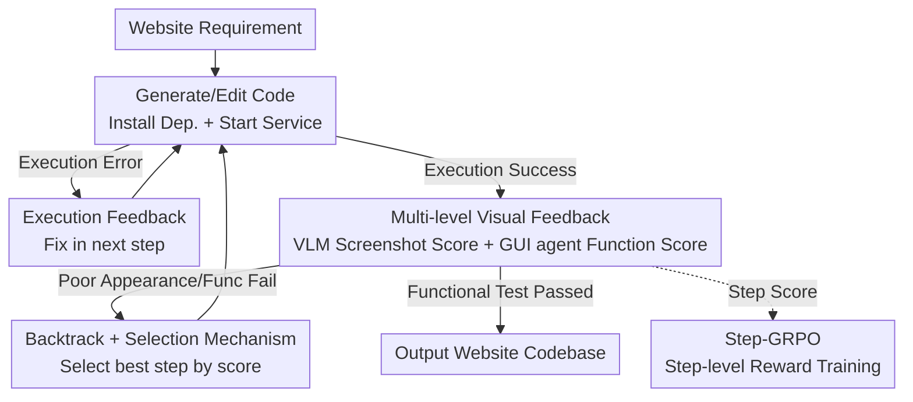

# WebGen-Agent: Enhancing Interactive Website Generation with Multi-Level Feedback and Step-Level Reinforcement Learning

**Conference**: ICLR 2026  
**OpenReview**: [https://openreview.net/forum?id=fE14yWa68Z](https://openreview.net/forum?id=fE14yWa68Z)  
**Code**: The paper does not provide an official repository link in the main text (refer to the OpenReview page)  
**Area**: Agent / Code Generation / Reinforcement Learning  
**Keywords**: Website Generation, Visual Feedback, GUI agent, Step-GRPO, Process Supervision

## TL;DR
WebGen-Agent enables a coding LLM to iteratively refine website code using multi-level visual feedback ("screenshot + GUI agent testing") at each step. These feedback scores are then utilized as step-level rewards for Step-GRPO reinforcement learning. This approach improves Claude-3.5-Sonnet's accuracy on WebGen-Bench from 26.4% to 51.9% and elevates 7B small models from 38.9% to 45.4%.

## Background & Motivation

**Background**: LLM-based code agents are already effective at repository-level code tasks (fixing GitHub issues, adding new features). The mainstream approach utilizes an "execution feedback loop": generate code $\rightarrow$ run $\rightarrow$ observe execution errors $\rightarrow$ modify.

**Limitations of Prior Work**: Website generation tasks are **highly dependent on visual effects and interaction smoothness**. Conventional execution feedback only reveals if the code runs or throws exceptions; it fails to monitor if the rendered page is aesthetically pleasing or if buttons are interactive. Consequently, generated websites often suffer from "functional but poor" issues, such as misaligned components, unattractive color schemes, unresponsive buttons, or broken links—zero errors at the code level, but unusable for the end-user.

**Key Challenge**: The true signals for website quality reside in the **rendered visual and interaction layers**, whereas existing agent feedback remains at the **code execution layer**. A gap exists between these layers: successful execution $\neq$ website usability. Without supervision signals reflecting real quality, agents cannot iterate effectively.

**Goal**: (1) Provide website generation agents with feedback reflecting real visual/interaction quality; (2) Distill high-quality signals from this expensive loop into affordable small models, enabling 7B-8B open-source models to perform competently.

**Key Insight**: A relatively small open-source VLM is sufficient to reliably judge **page-level** appearance, while a GUI agent can verify functionality by actually "clicking through" the website. By using a VLM for appearance scores and a GUI agent for functionality scores, the authors obtain both refinement suggestions and dense, reliable process rewards.

**Core Idea**: Utilize a "screenshot feedback + GUI agent testing feedback" multi-level visual signaling system to replace simple execution feedback for iterative refinement. Furthermore, the sum of these two scores is treated as a step-level reward for process-supervised training via Step-GRPO, converting VLM visual judgment into LLM programming capability.

## Method

### Overall Architecture
WebGen-Agent consists of two components: an **inference-time iterative generation workflow** and a **training-time Step-GRPO reinforcement learning method**.

The inference workflow is a multi-step iterative process. The input is a natural language website requirement (specifying appearance and function), and the output is a website codebase. Each step includes three actions: **Generate/Edit code $\rightarrow$ Execute code (install dependencies, start service) $\rightarrow$ Collect feedback**. If execution fails, error messages are fed back to the agent for the next step; backtracking is triggered after 5 consecutive errors. If execution succeeds, a landing page screenshot is sent to a VLM for appearance scoring and suggestions. If the appearance is satisfactory, a GUI agent is activated to operate the website and verify functionality. After the trajectory ends, the best step is selected based on the scores, and the codebase is restored to that state.

On the training side, the screenshot score $\text{Score}_{shot}$ and GUI score $\text{Score}_{gui}$ naturally generated in the workflow are reused. For a single instruction, multiple trajectories are sampled. The reward for each step is the sum of these two scores, which is then group-normalized to obtain step-level advantage for GRPO training of small models.

### Key Designs

**1. Multi-level Visual Feedback: Visualizing Appearance and Usability**

This design bridges the gap where "execution success $\neq$ website usability." WebGen-Agent introduces two complementary layers of visual feedback. The first is **screenshot feedback**: after successful execution, a screenshot of the landing page is provided to an independent small VLM (Qwen2.5-VL-32B-Instruct in experiments), which outputs a triplet $F_{shot} = (\text{Description}, \text{Score}_{shot}, \text{Suggestions}_{shot})$. A separate, smaller VLM is used because judging appearance does not require strong reasoning, thereby reducing costs; it focuses only on page-level aesthetics where current VLMs are most reliable.

The second is **GUI agent testing feedback**: once the appearance is satisfactory, a GUI agent session is initiated. It generates test instructions covering the requirements, operates the website, and finally determines if the test passed, yielding $F_{gui} = (\text{Score}_{gui}, \text{Suggestions}_{gui})$. Human auditing confirmed that 98.3% of auto-generated test instructions effectively cover requirements. These two layers are appended to the trajectory $T = [I, \Delta C_1, O_1, F_1, \Delta C_2, O_2, F_2, \dots]$, allowing the agent to continuously refine the website. Ablations show that screenshot feedback improves appearance scores from 3.0 to 3.6, while GUI agent testing contributes the largest accuracy gain (3.3%).

**2. Backtrack + Select-best Mechanism: Preventing Regression**

Iterative editing risks "regression," where subsequent modifications may be worse than previous ones (e.g., fixing functionality might break the layout). The authors store the code state $C_i$, the edit $\Delta C_i$, and the scores $\text{Score}_{shot,i}, \text{Score}_{gui,i}$ for each step in a memory list. **Backtrack**: if execution errors occur in 5 consecutive steps, the trajectory and codebase revert to the previous "best step." **Select-best**: at the end of the workflow, the best step is selected to restore the final codebase.

The "best step" is determined hierarchically: priority is given to steps with the highest $\text{Score}_{gui}$, followed by the highest $\text{Score}_{shot}$; if scores are tied, the most recent step is chosen. This mechanism upgrades visual scores from "mere suggestions" to "trajectory-level selection signals."

**3. Step-GRPO with Screenshot and GUI-agent Feedback: Visual Scores as Dense Rewards**

To enable 7B-8B open-source models to perform well, reliable scores from the workflow are used for process supervision. The process begins with a lightweight SFT warm-start using ~700 trajectories generated by DeepSeek-V3, followed by Step-GRPO. Unlike standard GRPO, which assigns the same advantage to all tokens in a trajectory, Step-GRPO assigns **different advantages to tokens from different steps**, applying the loss only to the generated code edits $\Delta C_1, \dots, \Delta C_K$. The reward for step $j$ is the sum of the visual scores:

$$r^{(i)}_j = \text{Score}^{(i)}_{shot,j} + \text{Score}^{(i)}_{gui,j}$$

Advantages are normalized across all sampled steps for a given instruction: $\hat{A}^{(i)}_j = \frac{r^{(i)}_j - \text{mean}(R)}{\text{std}(R)}$. The authors **do not** accumulate normalized rewards from future steps (unlike standard GRPO), as screenshot and GUI scores directly reflect the quality of the current step.

### Loss & Training
The Step-GRPO objective follows the clipped importance sampling format of GRPO, but with step-assigned advantages and loss applied only to code-edit tokens. Training configuration: SFT for 1 epoch on ~700 DeepSeek-V3 trajectories (lr 4e-5, batch 32); Step-GRPO for 1 epoch on 500 instructions (lr 1e-6, batch 16, 5 samples per instruction). High-quality small-scale data proved sufficient due to the reliable step-level signals.

## Key Experimental Results

Evaluated on WebGen-Bench: 101 natural language instructions + 647 GUI test cases. Functionality is tested using Qwen2.5-VL-32B-Instruct, and appearance is evaluated by GPT-4o. Accuracy is weighted (YES=1, PARTIAL=0.5).

### Main Results

| Engine Model | System | Accuracy (%) | Appearance Score |
| :--- | :--- | :--- | :--- |
| Claude-3.5-Sonnet | Bolt.diy (Prev. SOTA) | 26.4 | 3.0 |
| Claude-3.5-Sonnet | **WebGen-Agent** | **51.9** | **3.9** |
| DeepSeek-V3 | Bolt.diy | 20.8 | 2.0 |
| DeepSeek-V3 | **WebGen-Agent** | **52.6** | **3.8** |
| Qwen2.5-Coder-32B | Bolt.diy | 9.5 | 1.1 |
| Qwen2.5-Coder-32B | **WebGen-Agent** | **32.0** | **3.3** |
| Qwen3-Coder-480B-A35B| **WebGen-Agent** | **58.2** | **4.3** |

WebGen-Agent outperforms OpenHands, Aider, and Bolt.diy across various proprietary and open-source models.

Step-GRPO gains for small models (under the WebGen-Agent pipeline):

| Model | Accuracy (%) | Appearance Score |
| :--- | :--- | :--- |
| Qwen2.5-Coder-7B-Inst. (Base) | 12.4 | 1.6 |
| + SFT | 38.9 | 3.4 |
| + Step-GRPO | **45.4** | **3.7** |

### Ablation Study

Incremental ablation of the workflow (using DeepSeek-V3):

| Configuration | Accuracy (%) | Appearance Score |
| :--- | :--- | :--- |
| Execution-only | 45.9 | 3.0 |
| + Screenshot | 46.6 | 3.6 |
| + GUI-agent | 49.9 | 3.4 |
| + Backtrack | 51.2 | 3.7 |
| + Select-best (Full) | **52.6** | **3.8** |

### Key Findings
- **GUI agent testing is the primary driver for functional gain** (+3.3% accuracy), while screenshot feedback drives appearance gains (3.0 $\rightarrow$ 3.6).
- **Backtrack + Select-best are essential stabilizers**: They mitigate the "side effects" where functional fixes might degrade appearance.
- **Immediate rewards outperform cumulative rewards**: Step-GRPO with immediate rewards (45.4%) significantly outperforms the cumulative advantage version (38.7%) and standard outcome GRPO (42.5%).
- **Small-scale data is sufficient**: 500 instructions over 1 epoch provided the best results, as the feedback signals are highly dense and reliable.

## Highlights & Insights
- **Repurposing "Evaluators" as "Rewarders"**: Scores generated for feedback in the workflow are reused directly as dense process rewards for RL—this dual-use of visual signals is highly efficient.
- **Using small VLMs as "Eyes" for coding LLMs**: Decoupling vision and coding allows cheaper VLMs to handle visual judgment while stronger LLMs focus on code generation.
- **Behavioral Verification**: Authenticating functionality via a GUI agent "clicking through" is more robust than static checking and transferable to other interactive media (apps, games).
- **Immediate Step-level Rewards**: This approach offers a reproducible solution for the common problem of "iterative regression" in generative tasks.

## Limitations & Future Work
- Focuses exclusively on **page-level, single-page** aesthetics; multi-page consistency remains an open problem.
- The workflow relies on a **heavy environment** (services, screenshots, GUI agent), leading to high inference cost and latency.
- Reward upper bounds are constrained by the **quality of the judge models** (VLM/GUI agent); reward hacking remains a potential risk.

## Related Work & Insights
- **vs. Bolt.diy**: While Bolt.diy relies solely on execution feedback, WebGen-Agent introduces visual/interaction feedback and selection mechanisms, significantly outperforming it across all model scales.
- **vs. OpenHands/Aider**: These general code agents rely on execution-layer feedback; WebGen-Agent’s specialized signals for visual-intensive tasks lead to superior performance on WebGen-Bench.
- **vs. Standard GRPO**: The transition from trajectory-level outcome rewards to step-level immediate rewards proves more effective for tasks where process quality is immediately evaluable.

## Rating
- Novelty: ⭐⭐⭐⭐ Reusing feedback signals as rewards is elegant, though built on GRPO frameworks.
- Experimental Thoroughness: ⭐⭐⭐⭐⭐ Comprehensive evaluation across 7 proprietary and multiple open-source models with solid ablations.
- Writing Quality: ⭐⭐⭐⭐ Clear motivation and methodology; formal definitions of feedback structures are well-presented.
- Value: ⭐⭐⭐⭐⭐ Highly practical paradigm for interactive product generation, offering a clear path for enhancing small models.

<!-- RELATED:START -->

## Related Papers

- [\[ICLR 2026\] RECODE-H: A Benchmark for Research Code Development with Interactive Human Feedback](recode-h_a_benchmark_for_research_code_development_with_interactive_human_feedba.md)
- [\[ICLR 2026\] Critique-Coder: Enhancing Coder Models by Critique Reinforcement Learning](critique-coder_enhancing_coder_models_by_critique_reinforcement_learning.md)
- [\[ACL 2026\] MARS2: Scaling Multi-Agent Tree Search via Reinforcement Learning for Code Generation](../../ACL2026/code_intelligence/mars2_scaling_multi-agent_tree_search_via_reinforcement_learning_for_code_genera.md)
- [\[ICLR 2026\] Gistify: Codebase-Level Understanding via Runtime Execution](gistify_codebase-level_understanding_via_runtime_execution.md)
- [\[ICLR 2026\] CARD: Towards Conditional Design of Multi-agent Topological Structures](card_towards_conditional_design_of_multi-agent_topological_structures.md)

<!-- RELATED:END -->
