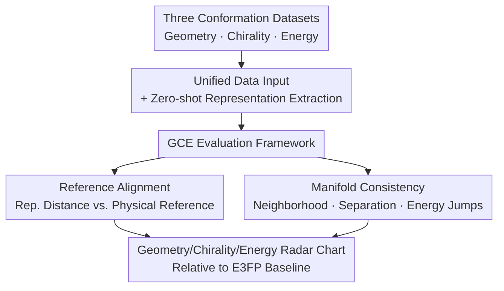

# 3DCS: Datasets and Benchmark for Evaluating Conformational Sensitivity in Molecular Representations

**Conference**: ICLR 2026  
**OpenReview**: [https://openreview.net/forum?id=JAb0y8lkqL](https://openreview.net/forum?id=JAb0y8lkqL)  
**Code**: https://github.com/ComDec/3DCS  
**Area**: Computational Biology / Molecular Representation / Benchmark  
**Keywords**: Molecular Representation, Conformational Sensitivity, Chirality, Potential Energy Surface, Zero-shot Evaluation

## TL;DR
The authors construct 3DCS, the first benchmark specifically designed to evaluate the representation sensitivity to "different conformations of the same molecule." Using >1M molecules and ~10M conformations covering geometry, chirality, and energy dimensions, paired with a Geometry–Chirality–Energy (GCE) evaluation framework, they reveal that modern 3D molecular representations are geometrically sensitive, erratic in capturing chirality, and largely fail to align with energy.

## Background & Motivation
**Background**: Drug design, reaction prediction, and material discovery rely heavily on the 3D conformations of molecules. Whether a ligand binds tightly to a protein pocket or what quantum properties a molecule possesses is essentially determined by the spatial arrangement of atoms. Consequently, Molecular Representation (MR) has evolved from 1D SMILES and 2D graphs to 3D models encoding atomic coordinates directly (UniMol, MolAE), force field models based on spherical harmonics (GemNet, MACE), and voxel-field models (FMG), consistently setting new SOTA records on various property prediction leaderboards.

**Limitations of Prior Work**: While models grow increasingly powerful, no existing benchmark can answer "whether these representations actually encode 3D conformational information." Existing molecular benchmarks (MoleculeNet, Molecule3D, MARCEL, GEOM) treat molecules almost exclusively as **static entities**, with evaluation tasks focused on cross-molecule property regression or classification—which the authors term **inter-molecular tasks**. These utilize conformational info but never test whether a "representation can distinguish between different conformations of the **same molecule**."

**Key Challenge**: Real-world applications are inherently **intra-molecular conformation-sensitive**. Different conformations of the same molecule can have drastically different binding affinities and quantum properties; enantiomers (mirror-image chiral molecules) can exhibit opposite biological activities. If a representation "flattens" these differences into nearly identical vectors, no downstream task can recover the lost information. This layer of sensitivity has never been systematically quantified by existing benchmarks.

**Goal**: To shift the evaluation focus from "inter-molecular" to "intra-molecular conformation" and decompose it into three measurable sub-problems: whether representations can (i) preserve geometric variations, (ii) capture chirality, and (iii) align with potential energy surfaces (PES).

**Key Insight**: Rather than creating a new end-to-end prediction task, it is more effective to directly measure whether "representation distance" aligns with "physical reference distance" in the representation space. Given a set of conformations for the same molecule, one can calculate pair-wise representation distances $\Delta_{ij}$ and use RMSD, chirality signatures, and energy differences as references to check for rank correlation and manifold coherence.

**Core Idea**: By using the alignment between "representation distance vs. physical reference distance" and manifold consistency, 3D molecular representations are evaluated across three axes—Geometry, Chirality, and Energy—making it clear for the first time exactly where a model's weaknesses lie.

## Method

### Overall Architecture
3DCS is not a single model but "three datasets + a zero-shot evaluation framework." The pipeline consists of four steps: ① Unifying the three types of conformational data into a standard input format; ② Selecting a candidate representation model to extract **zero-shot** representation vectors (no fine-tuning, using pre-trained encoder outputs directly); ③ Feeding representations into the GCE evaluation pipeline to calculate pair-wise representation distances and align them with physical references; ④ Outputting metrics for each dimension and plotting a radar chart of relative improvement using E3FP as a baseline.

Three datasets focus on different dimensions: **Geometry** uses the Relaxed Scan dataset (~1.5M molecules, ~10M conformations produced by relaxed dihedral scans around inter-ring single bonds); **Chirality** uses drug-like candidates filtered from ChEMBL (4,057 molecules, 52,391 conformations forming enantiomeric pairs); **Energy** utilizes AIMD trajectories from Revised MD17 (10 small molecules, 100k conformations each with DFT-level energy and forces). The GCE framework itself has two layers: **Reference Alignment** measures the rank correlation between representation distance and physical quantities, while **Manifold Consistency** evaluates the coherence of the representation space structure.

### Key Designs

**1. Three Conformation Datasets: Grounding "Conformational Sensitivity"**

The primary challenge was the lack of high-quality "multi-conformation per molecule" labeled data. The authors constructed three new datasets: For **Geometry**, they combined heterocyclic units into diverse scaffolds, attached two sets of substituent libraries to obtain 1,559,779 molecules, and performed relaxed dihedral scans in $2.5^\circ$ steps (optimizing with xTB at GFN-xTB level), followed by DBSCAN (eps=0.5) redundancy removal to get 10,097,643 conformations. xTB was chosen over DFT to balance accuracy and compute for 10M conformations. For **Chirality**, they screened drug-like molecules with chiral centers from ChEMBL, optimized stereoisomers with xTB, and only kept pairs passing R/S consistency checks; they then applied small torsional perturbations to make conformations of different enantiomers **overlap** in geometric space (preventing models from separating based on coarse geometry rather than true chirality). For **Energy**, they adopted AIMD trajectories from Revised MD17 with DFT-level energy and forces.

**2. GCE Layer 1 — Reference Alignment: Aligning Distances with Physics**

For a set of conformations $C=\{c_1,\dots,c_n\}$ of the same molecule, pair-wise representation distances $\Delta_{ij}$ are calculated (cosine distance for learned reps, Tanimoto for fingerprints) and compared against three references: Geometric reference is the RMSD of optimally aligned atoms $D^{(G)}_{ij}=\mathrm{RMSD}(c_i,c_j)$; Chirality reference is the proportion of mismatched stereocenters, where $D^{(C)}_{ij}=\frac{1}{m}\sum_{t=1}^{m}\mathbb{1}[s_t(c_i)\ne s_t(c_j)]$ for signatures $s_t \in \{\pm1\}$; Energy reference is the potential energy difference $D^{(E)}_{ij}=|E(c_i)-E(c_j)|$. Alignment is quantified using Spearman/Kendall rank correlation, RBF kernel CKA, and Isotonic Regression $R^2$.

**3. GCE Layer 2 — Manifold Consistency: Evaluating Global Structure**

Alignment alone does not guarantee a "coherent" representation space. For Geometry: **Local Isometry Error (LIE)** compares the neighborhood of each conformation in $D^{(G)}$ and $\Delta$; **Torsional Smoothness (AS)** measures the median representation change per degree of dihedral rotation (moderate AS indicates responsiveness without instability). For Chirality: **Enantiomer Separation AUC (ES–AUC)**, nearest-neighbor accuracy (NN@1), silhouette coefficient (SCI), and the Hopkins statistic quantify "the ability to cluster enantiomers into distinct groups." For Energy: **Energy Jump Sensitivity (EJS)** measures the conditional probability that large energy differences correspond to large representation separations.

**4. Zero-shot + Fine-tuning Protocols: Measuring Pre-training vs. Predictive Power**

The main evaluation is **zero-shot**, testing what the representation "naturally" encodes. To address whether fine-tuning solves these issues, two supervised experiments were added: for chirality, supervised contrastive learning with Murcko scaffold splitting (8:1:1); for energy, adding a small MLP head to predict values on RMD17. A key discovery is that **metrics are predictive**: models with high 3DCS energy scores (MACE, GemNet) achieve lower energy MAE after fine-tuning.

## Key Experimental Results

The evaluation covers the manual fingerprint E3FP, coordinate-based 3D encoders (UniMol, MolAE), spherical harmonics-based models (GemNet, MACE), multi-modal models (MolSpectra), and field-based encoders (FMG).

### Main Results (Geometry)
Almost all learned representations significantly outperform manual fingerprints. Interestingly, **coordinate-based models outperform GemNet**, which uses spherical harmonics—the authors hypothesize that spherical harmonics, composed of relative distances, inherently lose some absolute geometric information compared to RMSD references.

| Metric | E3FP | GemNet | MolAE | MolSpectra | UniMol |
|------|------|--------|-------|------------|--------|
| Spearman (↑) | 0.406 | 0.560 | 0.640 | 0.682 | **0.697** |
| Kendall (↑) | 0.272 | 0.336 | 0.483 | 0.506 | **0.563** |
| CKA (↑) | 0.757 | 0.813 | 0.862 | **0.904** | 0.889 |
| Isotonic $R^2$ (↑) | 0.521 | 0.667 | 0.734 | 0.770 | **0.782** |
| AS | 2.757 | 0.0018 | 0.0048 | 0.0214 | 0.006 |

The AS row is telling: E3FP hits 2.757 because it encodes substructure presence into binary bits, where tiny dihedral changes can flip multiple bits, causing "representation explosion" even when the geometry barely moves.

### Main Results (Chirality)
Learned representations are weak in zero-shot enantiomer separation. MolAE performs best—while sharing the SE(3)-invariant framework with UniMol, MolAE uses a 3D cloze objective (reconstructing masked atoms including stereocenters), which naturally forces the model to capture subtle differences near chiral centers, whereas UniMol's coordinate denoising can induce "chiral flipping" training signals. 

| Metric | E3FP | GemNet | MolAE | MolSpectra | UniMol | FMG | MACE |
|------|------|--------|-------|------------|--------|-----|------|
| ES–AUC (↑) | 0.486 | 0.577 | **0.782** | 0.545 | 0.622 | 0.706 | 0.485 |
| NN@1–Acc (↑) | 0.178 | 0.292 | **0.497** | 0.235 | 0.339 | 0.412 | 0.199 |

Supervised fine-tuning improves chirality metrics for all, but the relative ranking remains largely unchanged.

### Main Results (Energy)
For most models, the correlation between representation distance and energy difference is much weaker than the correlation with geometry. Representations generally encode geometry but almost ignore energy unless explicitly supervised with energy/forces (e.g., MACE, GemNet).

| Metric | E3FP | GemNet | MolAE | MolSpectra | UniMol | FMG | MACE |
|------|------|--------|-------|------------|--------|-----|------|
| Spearman (↑) | 0.026 | 0.078 | 0.039 | 0.023 | 0.043 | 0.015 | **0.236** |
| EJS (↑) | 0.184 | 0.356 | 0.294 | 0.271 | 0.301 | 0.269 | **0.578** |

### Key Findings
- **Strong Geometry, Flaky Chirality, Weak Energy** is the general profile of modern 3D representations.
- **Training objectives dictate chirality**: The gap between MolAE and UniMol proves task design is more critical than architecture.
- **3DCS energy scores predict downstream performance**: High-score models on 3DCS are easier to fine-tune for energy prediction.
- **Surprise Insight**: Applying PCA to learned representations as collective variables (CVs) can often recover energy barriers and minima, suggesting potential use in transition state analysis.

## Highlights & Insights
- **Model-independent benchmark for sensitivity**: By focusing on distance alignment, the benchmark treats manual fingerprints and deep models on the same scale, avoiding the circular logic of creating another prediction task.
- **Diagnostic value of the radar chart**: Plotting a new model on the G-C-E axes immediately reveals if it lacks geometric smoothness, enantiomer separation, or energy alignment, providing "interpretable failure localization."
- **Chirality data design**: The use of torsional perturbations to create geometric overlap ensures that models separate enantiomers based on true stereochemistry rather than trivial geometric differences.

## Limitations & Future Work
- **Limitations**: The current work focuses on unconditional, ligand-side capabilities. Conditional settings (protein-ligand docking, chirality-sensitive property prediction) are necessary next steps.
- The use of xTB instead of full DFT for the 10M conformations introduces a precision ceiling on energy labels.
- **Future design suggestions**: (i) Geometry objectives should include bond angles and torsions; (ii) Use chirality-preserving augmentation; (iii) Replace raw coordinates with spherical harmonics to handle energy features more effectively.

## Related Work & Insights
- **vs MoleculeNet/GEOM**: These focus on inter-molecular tasks and do not test if the same molecule's conformations can be distinguished. 3DCS fills this gap.
- **vs Manual Fingerprints**: Metrics reveal why fingerprints are unsuitable for continuous conformational changes despite being strong baselines for substructures.
- **vs Coordinate vs Spherical Harmonics**: 3DCS reveals a trade-off: coordinate models focus on geometry, while spherical harmonics excel at energy.

## Rating
- Novelty: ⭐⭐⭐⭐⭐ 
- Experimental Thoroughness: ⭐⭐⭐⭐⭐ 
- Writing Quality: ⭐⭐⭐⭐ 
- Value: ⭐⭐⭐⭐⭐ 

<!-- RELATED:START -->

## Related Papers

- [\[ICLR 2026\] GeomMotif: A Benchmark for Arbitrary Geometric Preservation in Protein Generation](geommotif_a_benchmark_for_arbitrary_geometric_preservation_in_protein_generation.md)
- [\[ICLR 2026\] Towards Understanding the Shape of Representations in Protein Language Models](towards_understanding_the_shape_of_representations_in_protein_language_models.md)
- [\[NeurIPS 2025\] JAMUN: Bridging Smoothed Molecular Dynamics and Score-Based Learning for Conformational Ensembles](../../NeurIPS2025/computational_biology/jamun_bridging_smoothed_molecular_dynamics_and_score-based_learning_for_conforma.md)
- [\[ICLR 2026\] Enhancing Molecular Property Predictions by Learning from Bond Modelling and Interactions](enhancing_molecular_property_predictions_by_learning_from_bond_modelling_and_int.md)
- [\[ICLR 2026\] Learning Explicit Single-Cell Dynamics Using ODE Representations](learning_explicit_single-cell_dynamics_using_ode_representations.md)

<!-- RELATED:END -->
