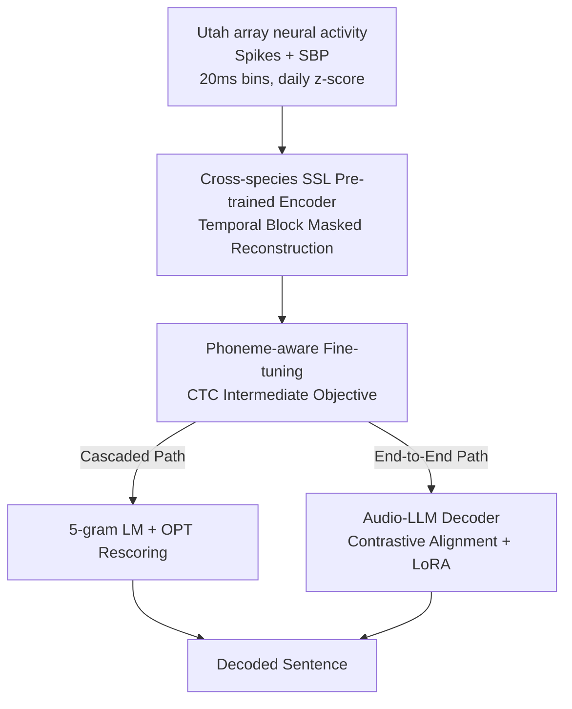

# A Cross-Species Neural Foundation Model for End-to-End Speech Decoding

**Conference**: ICLR 2026  
**OpenReview**: [https://openreview.net/forum?id=Lp1noMpMUG](https://openreview.net/forum?id=Lp1noMpMUG)  
**Area**: Computational Neuroscience / Brain-Computer Interface / Multimodal Alignment  
**Keywords**: Speech BCI, Neural Foundation Model, Cross-species Pre-training, End-to-End Decoding, Audio LLM

## TL;DR
This paper proposes BIT, an end-to-end brain-computer interface (BCI) that translates cortical neural activity directly into full sentences. It utilizes a Transformer neural encoder pre-trained via cross-species (human + monkey) and cross-task self-supervised masked modeling. This encoder is then fine-tuned with contrastive alignment to an Audio LLM, reducing the Word Error Rate (WER) of previous end-to-end methods from 24.69% to 10.22% while setting a new SOTA on the Brain-to-Text '24/'25 benchmarks under a cascaded framework.

## Background & Motivation
**Background**: The goal of speech BCIs is to translate the neural activity of paralyzed patients into text to restore communication. Current mainstream systems predominantly rely on **cascaded frameworks**: first mapping neural activity to phonemes using an RNN, then using an n-gram language model (LM) to assemble phonemes into sentences.

**Limitations of Prior Work**: The primary issue with cascaded frameworks is that **the stages cannot be jointly optimized**. RNNs and LMs are trained separately, causing a performance disconnect—a decrease in Phoneme Error Rate (PER) in the RNN does not always translate to a lower overall WER. This "local optimum $\neq$ global optimum" gap limits system potential. Existing end-to-end attempts (Feng et al. 2024) connected RNNs directly to text-based LLMs, but they relied on outdated RNN architectures without pre-training, lagging significantly behind cascaded methods (WER 24.69%).

**Key Challenge**: Modern architectures like Transformers are theoretically superior at capturing complex neural representations but require massive datasets to be effective. However, labeled speech BCI data for a single subject is extremely scarce (approximately 10,000 sentences per subject). The critical bottleneck for end-to-end speech decoding is bridging the gap between "desiring powerful architectures" and "insufficient data."

**Goal**: To construct a truly differentiable, end-to-end optimizable speech decoding framework that achieves new SOTAs in cascaded settings while significantly closing the WER gap between end-to-end and cascaded approaches.

**Key Insight**: The authors observe that neural probe recordings (Utah arrays) share underlying structures across different subjects and tasks (e.g., speaking vs. reaching). Therefore, large-scale, cross-species, and cross-task **unlabeled** neural data can be used for self-supervised pre-training to provide a stable, transferable representation base for data-scarce speech decoding. Analogous to how LLaVA provides "eyes" (image encoders) for LLMs, BIT provides a "brain" for LLMs.

**Core Idea**: Replace the non-pre-trained RNN with a cross-species self-supervised Transformer neural encoder, then use contrastive learning to align neural representations into the linguistic space of an Audio LLM, enabling end-to-end differentiable decoding from neural activity to sentences.

## Method

### Overall Architecture
BIT decomposes "neural activity $\rightarrow$ sentence" into a three-stage differentiable pipeline and uses contrastive learning for modality alignment between the encoder and decoder. Inputs are cortical neural activities (thresholded spike counts + Spike Band Power SBP, 20ms bins, daily z-score normalized to combat probe drift) recorded by Utah arrays; the output is a full English sentence.

The pipeline is trained in three steps: **①** Pre-training the Transformer neural encoder using self-supervised masked modeling on 367 hours (human ~98h + monkey ~269h) of cross-species/cross-task data. **②** Removing the masking module and fine-tuning the encoder as a phoneme decoder using CTC loss to inject phonetic information. **③** Connecting the "phoneme-aware" encoder to an Audio LLM via a shallow MLP projector, followed by end-to-end fine-tuning using cross-entropy and contrastive loss for autoregressive sentence generation. During fine-tuning, only the encoder, projector, and LoRA layers (added to LLM attention/FFN layers) are updated. Two decoding paths are available: cascaded (phoneme logits $\rightarrow$ 5-gram LM $\rightarrow$ OPT rescoring) or end-to-end (neural representations $\rightarrow$ Audio LLM).

### Key Designs

**1. Cross-species, Cross-task Self-supervised Masked Pre-training: Feeding data-hungry Transformers with other brains and tasks**

**Design Motivation**: This directly addresses the tension between using Transformers and the scarcity of single-subject speech data. The authors bundle neural activity into $T_{patch}$ time bins to form "time patches," transforming the shape from $(T, C)$ to $(T/T_{patch}, C \times T_{patch})$. These are passed through a patch embedding layer (LayerNorm-Linear-LayerNorm) into a Transformer with RoPE (Rotary Positional Embedding) and bidirectional attention. Using time patches instead of 20ms bins aligns high-resolution neural recordings with the slower rhythm of speech (30–60 wpm) while reducing context length and redundancy for the LLM.

Pre-training follows the Masked Autoencoder (MAE) paradigm: random time patches are replaced with learnable mask tokens (variable mask lengths, constant overall mask rate). Latent representations are projected back to original dimensions to reconstruct masked neural activity via MSE loss. Critically, the pre-training corpus uses **only human and monkey Utah array data**, spanning various tasks and subjects. This allows the encoder to learn stable probe representations robust to electrode placement and behavior, while masking serves as data augmentation to mitigate overfitting and probe drift. Separate linear read-in/read-out layers for each subject ensure compatibility across varying electrode counts (128 vs 256).

**2. Phoneme-aware Fine-tuning: Using CTC as an "intermediate objective" to infuse phonetic structure**

**Mechanism**: A common pitfall for end-to-end models is the alignment difficulty between neural encoder outputs and the LLM's linguistic space. The solution is a round of phoneme decoding fine-tuning—removing the masking module and adding a linear layer to output logits for phoneme classes + blank/silence tokens, trained with CTC loss (Graves et al. 2006).

**Key Insight**: In the final end-to-end model, these phoneme logits are **not actually fed to the LLM**. They serve as intermediate supervision to "bake" phoneme-level phonetic information into the neural representations. Even when the goal is direct sentence prediction, teaching the encoder to "distinguish phonemes" produces outputs with a linguistic structure that the LLM can naturally interpret.

**3. End-to-End Audio-LLM Decoder + Contrastive Cross-modal Alignment: Giving the LLM a "brain" and aligning neural/text embeddings**

The final step uses a shallow MLP projector (Linear-ReLU-Linear) to map phoneme-aware encoder outputs into the Audio LLM's text embedding space. A prompt "decode the above neural activity into an English sentence:" guides the decoding. During training, the model receives neural embeddings + prompt/target sentence text embeddings for next-token prediction; at inference, it generates autoregressively from neural embeddings and the prompt.

To strengthen alignment, a **modality aligner** is added: mean-pooled neural and text "modality tokens" are projected into a shared latent space via linear layers, L2-normalized, and optimized with contrastive loss. Positive pairs are neural-text embeddings from the same trial; others in the batch are negative. Total Loss = Cross-entropy + Contrastive Loss. A key discovery is that **Audio LLMs significantly outperform text LLMs** (best: Aero1-Audio 1.5B, an audio expansion of Qwen2.5-1.5B). Audio pre-training provides an inductive bias closer to neural decoding, allowing shallow MLPs to align modalities, and small models (1–1.5B) outperform larger ones (>7B) as BCI tasks require translation rather than complex reasoning.

### Loss & Training
The three-stage objectives are: ① MSE reconstruction of masked neural activity for pre-training; ② CTC loss for phoneme fine-tuning; ③ Cross-entropy (next-token prediction) + Contrastive loss (modality alignment) for sentence fine-tuning. In the third stage, only the encoder and projector are updated alongside LoRA on the Audio LLM layers, ensuring efficient fine-tuning under low-data regimes.

## Key Experimental Results

### Main Results
Evaluated on Brain-to-Text '24 (T12, 1200 holdout sentences) and '25 (T15, 1450 holdout sentences) leaderboards.

| Dataset | Method | WER | Note |
|--------|------|-----|------|
| BT '24 | Feng et al. 2024 (Prev. E2E) | 24.69% | End-to-end baseline |
| BT '24 | BIT End-to-End | 15.67% | Single model |
| BT '24 | BIT End-to-End + Ensemble | 10.22% | E2E SOTA, >50% relative reduction |
| BT '24 | Feghhi et al. 2025 (Prev. Cascaded SOTA) | 7.98% | Cascaded baseline |
| BT '24 | BIT Cascaded | 6.35% | Non-ensemble cascaded SOTA |
| BT '24 | BIT Cascaded + Ensemble | 5.10% | #1 on Leaderboard (Prev. best 5.68%) |
| BT '25 | BIT End-to-End + Ensemble | 7.76% | Top of public leaderboard |
| BT '25 | BIT Cascaded + Ensemble | 1.76% | #1 on Leaderboard |

BIT reduces the E2E WER of Feng et al. (2024) from 24.69% to 10.22%, narrowing the long-standing gap between end-to-end and cascaded approaches while winning both benchmark competitions for the cascaded category.

### Ablation Study
| Configuration | Key Finding | Description |
|----------|---------|------|
| LLM Modality | Audio LLM > Text LLM | Audio pre-training bias is closer to neural decoding; Aero1-Audio 1.5B best |
| Model Scale | Small (1–1.5B) > Large (>7B) | BCI tasks need translation, not reasoning, under low-data |
| Neural Embedding | Neural Modality > Audio Modality | No need to force audio interpretation, yet benefits from LLM audio knowledge |
| Contrastive Learning | Contrastive Alignment decreases WER | Modality alignment is effective |
| SSL Pre-training | BIT-Human/All is 39–45% lower than BIT-TFS | Low-data tasks benefit most |

### Key Findings
- **Pre-training yields highest gains on low-data tasks**: For imagined speech (50-word vocab, minimal labels), SSL pre-training yields 39–45% relative WER reduction, far exceeding gains in attempted speech.
- **Self-supervised cross-subject > Supervised cross-task**: BIT-All (human + monkey SSL) outperforms BIT-Cross-Task-Only (subject-specific supervised), suggesting larger migration gains from unlabeled SSL.
- **Language-like representation geometry**: RSA analysis shows BIT encoder outputs are structurally closer to Audio LLM text embeddings than RNNs. PCA/LDA visualization shows BIT aligns attempted and imagined speech into the same semantic space.
- **Human data is more impactful than monkey data**: Ablation shows human data provides more gain than monkey data, as human corpora include speech-related tasks, whereas monkey reaching tasks are less correlated.

## Highlights & Insights
- **Applying the "eyes" paradigm to the "brain"**: Moving the LLaVA paradigm (image encoder as eyes) to BCI—using a neural encoder as the "brain" and Audio LLM as the language center—is a clean, generalizable multimodal alignment strategy.
- **Audio LLM > Text LLM is counter-intuitive and valuable**: Neural activity is not audio, yet the inductive bias of audio pre-training makes alignment easier, suggesting "selecting the right pre-training modality is more important than parameter count."
- **CTC as a bridge**: Using phoneme supervision to "infuse" structure without feeding logits to the LLM is a clever way to stitch signal encoders and LMs.
- **Efficiency of small models**: Challenging the "bigger is better" notion is crucial for on-device BCI deployment.

## Limitations & Future Work
- **Latency**: E2E decoding takes ~0.95s per sentence, slower than the cascaded 0.24s, which is still too slow for real-time BCI.
- **Decoding constraints**: Bidirectional attention used for performance prevents stream decoding. 1.5B LLMs are compact but still difficult for on-device implementation.
- **Data dependence**: The encoder requires massive unlabeled data to fight sensor variation, and the LLM requires more labeled data to surpass cascaded systems, yet private human data access is restricted.
- **Safety/Privacy**: Decoding "inner speech" requires robust informed consent and protection.

## Related Work & Insights
- **vs. Feng et al. 2024**: They used non-pre-trained RNNs with text LLMs (WER 24.69%). BIT uses SSL Transformer + Audio LLM + Contrastive Alignment (10.22%).
- **vs. Feghhi et al. 2025**: They introduced Transformers with temporal masking but lacked E2E LLMs and large-scale SSL. BIT pushes their SOTA from 7.98% to 6.35% in cascaded settings.
- **vs. LLaVA / BLIP transition**: The evolution from cross-attention to simple projection shows that stronger LLMs require less compute for modality alignment; BIT confirms this trend for neural signals.
- **vs. POSSM**: POSSM verified monkey-to-human transfer for imagined handwriting; BIT extends cross-species SSL pre-training to human speech decoding.

## Rating
- Novelty: ⭐⭐⭐⭐⭐ First to stitch cross-species neural foundation models with Audio LLMs for E2E speech decoding.
- Experimental Thoroughness: ⭐⭐⭐⭐⭐ Covered dual benchmarks, attempted/imagined tasks, and extensive modality/scale ablations.
- Writing Quality: ⭐⭐⭐⭐ Clear motivation and analogies; some experimental details are relegated to appendices.
- Value: ⭐⭐⭐⭐⭐ Significant clinical potential by narrowing the E2E BCI gap and paving the way for large-scale neural data integration.

<!-- RELATED:START -->

## Related Papers

- [\[ICLR 2026\] Optimal Transport Unlocks End-to-End Learning for Single-Molecule Localization](optimal_transport_unlocks_end-to-end_learning_for_single-molecule_localization.md)
- [\[ICCV 2025\] MolParser: End-to-end Visual Recognition of Molecule Structures in the Wild](../../ICCV2025/computational_biology/molparser_end-to-end_visual_recognition_of_molecule_structures_in_the_wild.md)
- [\[NeurIPS 2025\] UniSite: The First Cross-Structure Dataset and Learning Framework for End-to-End Ligand Binding Site Detection](../../NeurIPS2025/computational_biology/unisite_the_first_cross-structure_dataset_and_learning_framework_for_end-to-end_.md)
- [\[ICML 2025\] Protriever: End-to-End Differentiable Protein Homology Search for Fitness Prediction](../../ICML2025/computational_biology/protriever_end-to-end_differentiable_protein_homology_search_for_fitness_predict.md)
- [\[ICLR 2026\] Continuous Multinomial Logistic Regression for Neural Decoding](continuous_multinomial_logistic_regression_for_neural_decoding.md)

<!-- RELATED:END -->
