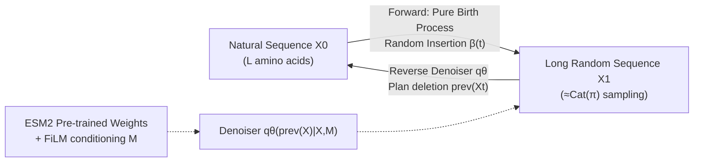

# A Diffusion Model to Shrink Proteins While Maintaining Their Function

**Conference**: ICLR 2026  
**OpenReview**: [https://openreview.net/forum?id=quxeCxJwKm](https://openreview.net/forum?id=quxeCxJwKm)  
**Code**: TBD  
**Area**: Computational Biology / Protein Generation / Discrete Diffusion Models  
**Keywords**: Protein Engineering, Discrete Diffusion, Sequence Deletion, Evolutionary Sequence Modeling, ESM2, ProteinGym  

## TL;DR
The authors propose SCISOR, a discrete diffusion model that learns only to "delete characters." It uses a pure birth process (random insertion) for forward noising and trains a denoiser to plan reverse deletions. This shrinks long protein sequences into shorter ones that are both "natural" and functional, achieving SOTA on ProteinGym deletion effect prediction.

## Background & Motivation
**Background**: Many proteins with medical or bioengineering value are difficult to synthesize in labs, fuse with other proteins, or deliver to tissues due to their excessive sequence length. Ideally, large models trained on massive natural sequences (ESM2, ProGen2, Tranception, etc.) could learn "evolutionary constraints" to suggest shortened sequences that do not compromise function.

**Limitations of Prior Work**: (1) Autoregressive or BERT-style models cannot efficiently search the combinatorially explosive deletion space of $\binom{L}{M}$; (2) They lack inductive biases for deletion tasks and are not explicitly trained to predict deletion effects; (3) While diffusion models (EvoDiff, DPLM) excel at planning mutation sequences, existing discrete diffusion frameworks only handle **substitution** mutations and cannot generate deletions.

**Key Challenge**: Utilizing diffusion models to search deletion spaces is promising, but standard forward noise involves substitution or masking. Deletion changes sequence length (variable dimension), requiring a deletion diffusion framework that is strictly defined, allows for closed-form ELBO calculation, and can scale to UniRef size.

**Goal**: Construct a discrete diffusion model with an insertion-only forward process and a deletion-only reverse process, providing the denoiser with an inherent inductive bias for "which character to delete" to shorten real proteins.

**Core Idea** (**Reverse Noise Design**): To make the model learn deletion, the forward noising process is designed to **only insert random characters**. A natural sequence is transformed into a long random sequence by continuous insertion; the denoiser then plans a series of deletions to recover a natural-like protein sequence.

## Method

### Overall Architecture
SCISOR (Sequence Contraction with InSertion-Only noising pRocess) reformulates "protein shortening" as a denoising problem. The forward process uses a **pure birth process** to randomly insert characters into a natural sequence (Sec 4.1). The reverse denoiser $q_\theta$ is trained to predict "which character was inserted in the previous step" to delete it (Sec 4.2). The model scales to UniRef using ESM2 (Sec 4.3). At inference, it starts from a long random sequence and iteratively deletes characters until the target length is reached.

### Key Designs

**1. Insertion-only Forward Process + Diffusion Without Steady-State Distribution: Pure birth processes make "deletion" a valid denoising target.** The forward noise utilizes a pure birth process (Kendall, 1948): at each of the $L+1$ slots in a sequence of $L$ amino acids, a new character is independently grown at rate $\beta(t)$. Inserted characters are sampled from $Y\sim\mathrm{Cat}(\pi)$. The authors prove $X_t$ can be sampled in one step from $X_0$ (cumulative insertions $M_t\sim\mathrm{NegBin}(L+1,\alpha(t))$ where $\alpha(t)=\exp(-\int_0^t\beta(s)ds)$). Crucially, while standard diffusion requires $p(X_t|X_0)$ to converge to an easy-to-sample steady-state distribution—and insertion processes grow infinitely—**Thm 4.1** shows that as $M_1\to\infty$, $X_1$ can be arbitrarily approximated by a long random sequence $q$ sampled independently. This proves that a **formal steady-state distribution is not necessary** to define a diffusion model, enabling "deletion-only" diffusion.

**2. Schedule-conditioned Closed-form ELBO: Specifically targeting "which character to delete" while conditioning on deletion count M.** Following the discrete diffusion framework by Amin et al. (2025), **Thm 4.2** derives a schedule-conditioned negative log-likelihood upper bound:

$$-\log q_\theta(X_0|L)\le \mathbb{E}_{M_1}\mathrm{KL}\big(p(X_1|X_0,M_1)\|q(X_1|L+M_1)\big)+\mathbb{E}_{t,X_t,M_t}\frac{M_t\beta(t)}{1-\alpha(t)}\mathrm{KL}\big(p(\mathrm{prev}(X_t)|X_0,X_t,M_t)\|q_\theta(\mathrm{prev}(X_t)|X_t,M_t)\big)$$

The first term is negligible per Thm 4.1. The second term trains the denoiser $q_\theta$ using sequences $X_t$ and insertion counts $M_t$ to predict the "last inserted character" $\mathrm{prev}(X_t)$, equivalent to a distribution over positions to delete. This is more stable than classic discrete diffusion and **explicitly conditions on the deletion count $M$**, allowing the model to plan for future deletions.

**3. Rao-Blackwellized Target Distribution via Sequence Alignment: Transforming integrals over insertion paths into parallelizable alignment counts.** The second term requires the ground-truth distribution $p(\mathrm{prev}(X_t)|X_0,X_t,M_t)$. Since multiple insertion paths exist from $X_0$ to $X_t$, they must be marginalized. **Prop 4.3** provides a closed-form solution: if $\mathrm{ali}(X,Y)$ is the number of ways to align $X$ to $Y$, the probability of character $b$ being deleted is:

$$p(\mathrm{prev}(X_t)|X_0,X_t,M_t)=\frac{\mathrm{ali}(X_0,\mathrm{prev}(X_t))}{M_t\cdot \mathrm{ali}(X_0,X_t)}$$

Intuitively, characters that align less frequently with the original $X_0$ are more likely to be insertions. This Rao-Blackwellizes the gradient estimate over all paths, reducing variance. Dynamic programming is used to calculate $\mathrm{ali}(X_0,\mathrm{prev}(X_t))$ in parallel.

**4. Reusing ESM2 + FiLM Conditioning + Long Sequence Engineering.** The denoiser architecture reuses pre-trained ESM2 weights, replacing the final layer with a linear + softmax head. To condition on $M$, FiLM layers are inserted between attention blocks to apply affine transformations: $(1+A_{\theta,d}^\ell(M))\times a_d^\ell+B_{\theta,d}^\ell(M)$. For engineering: (1) $\beta(t)$ is chosen such that mutual information between $X_t$ and $X_0$ decays linearly; (2) Sequences are batched by length with gradient accumulation; (3) For $|X_t|>2048$, a windowed approach ensures ELBO remains a valid bound. A "corrector" step (iterative insertion/deletion) can be used during generation to escape local optima (Alg 2).

## Key Experimental Results

### Main Results: Generation Quality + Deletion Effect Prediction
Comparing diffusion models (EvoDiff, DPLM) and autoregressive (AR) baselines on UniRef50 using Perplexity (lower is better):

| Model | Size | Perplexity (↓) |
|------|------|----------------|
| Random | - | 18.03 |
| EvoDiff S | small | 14.61 |
| SCISOR S | small | 14.05 |
| DPLM M | 150M | 10.61 |
| EvoDiff L | large | 13.05 |
| **SCISOR L** | large | **12.19** |
| DPLM L | large | 9.15 |
| AR L (Ref) | large | 10.41 |

SCISOR is competitive among diffusion models, and sample quality (FPD, OmegaFold pLDDT) often outperforms similar diffusion models, approaching AR baselines.

ProteinGym Deletion Effect Prediction (62 assays, 7000 measurements, Spearman correlation, higher is better):

| Model | Single Deletion (↑) | Multi Deletion (↑) |
|------|-----------|-----------|
| HMM | 0.45 | 0.45 |
| Tranception | 0.46 | 0.47 |
| ProGen2 | 0.51 | 0.47 |
| PoET (w/ MSA) | 0.55 | 0.49 |
| **SCISOR** | **0.57** | **0.52** |

SCISOR outperforms all baselines in both single and multi-deletion benchmarks, including large models like PoET that access additional MSA info.

### Shortening Tasks: Maintaining Function
Evaluating 200 UniProt sequences with annotated functional sites, shortened by 1%–50% vs ProGen2 and Raygun:

| Metric | SCISOR Performance |
|------|-------------|
| pLDDT (Confidence) | Consistently highest across ratios |
| TM-score (Similarity) | Outperforms baselines |
| RMSD (Deviation) | Outperforms baselines |
| Functional Site Retention | Best in most cases |

Only at 50% shortening does ProGen2 show higher functional site retention, but its low pLDDT suggests those samples are likely unfolded/non-functional. In a RalA case study, SCISOR best preserved the predicted structure of the GTP binding site.

### Ablation Study

| Configuration | Key Finding |
|------|----------|
| W/O Rao-Blackwellized target | Significant performance drop; Prop 4.3 is core |
| Continuous vs Discrete time | Continuous time (SCISOR) yields higher quality |
| Corrector steps K | Increasing K improves quality but increases compute |

### Key Findings
- A "deletion-only" diffusion model can match the generation quality of mature "substitution" diffusion models.
- Task-specific inductive biases for deletion allow smaller models to outperform larger general-purpose models on deletion effect tasks.

## Highlights & Insights
- **Redefining Protein Shortening as Diffusion Denoising**: Reversing the diffusion direction—forward insertion and reverse deletion—makes deletion an inherent capability rather than a post-hoc heuristic.
- **Debunking Steady-state Necessity**: Thm 4.1 proves diffusion doesn't need a formal steady state, only that $X_1$ is approximable by a random sequence, enabling one-way diffusion.
- **Alignment as Path Integral**: Prop 4.3 transforms the intractable marginalization of insertion paths into a sequence alignment counting problem solvable via dynamic programming.
- **Closed-form ELBO**: Unlike most insertion/deletion diffusion designs, SCISOR allows for principled model comparison and perplexity evaluation.

## Limitations & Future Work
- **Distribution Shift**: During training, $X$ is a noisy inserted sequence, but during inference shortening, $X$ is a real protein. A more "natural" forward insertion process might help.
- **Naturalness ≠ Functionality**: The method assumes natural-looking sequences are likely functional, which may not hold for all families. Explicit functional/structural guidance could be added.
- **Computational Overhead**: Shortening $M$ positions requires $M$ denoiser evaluations, unlike Raygun which requires only one.
- **In-silico Dependency**: Functionality is mostly assessed via tools like OmegaFold/ESM2; wet lab validation is needed.

## Related Work & Insights
- **Variable-dimension Diffusion**: SCISOR provides a shortening-specific inductive bias compared to TDDM or auxiliary token methods (Johnson et al., 2021).
- **Protein Shortening**: Unlike Raygun (Stochastic Autoencoder), SCISOR is explicitly trained for contraction and maintains structural/functional similarity more effectively.
- **Inspiration**: One-way (dimension-decreasing) diffusion using alignment for path integrals can be transferred to other generation problems such as code compression, text summarization, or molecular scaffold simplification.

## Rating
- **Novelty**: ⭐⭐⭐⭐⭐ First deletion-only discrete diffusion framework; elegant theoretical breakthroughs.
- **Experimental Thoroughness**: ⭐⭐⭐⭐ Covers generation, ProteinGym, and shortening tasks; lacks wet lab data.
- **Writing Quality**: ⭐⭐⭐⭐ Clear motivation and sound mathematical derivation.
- **Value**: ⭐⭐⭐⭐⭐ Solves the practical "long protein" bottleneck with a scalable tool.

<!-- RELATED:START -->

## Related Papers

- [\[ICLR 2026\] Pallatom-Ligand: an All-Atom Diffusion Model for Designing Ligand-Binding Proteins](pallatom-ligand_an_all-atom_diffusion_model_for_designing_ligand-binding_protein.md)
- [\[ICLR 2026\] SimpleFold: Folding Proteins is Simpler Than You Think](simplefold_folding_proteins_is_simpler_than_you_think.md)
- [\[ICLR 2026\] VenusX: Unlocking Fine-Grained Functional Understanding of Proteins](venusx_unlocking_fine-grained_functional_understanding_of_proteins.md)
- [\[ICLR 2026\] A Joint Diffusion Model with Pre-Trained Priors for RNA Sequence-Structure Co-Design](a_joint_diffusion_model_with_pre-trained_priors_for_rna_sequence-structure_co-de.md)
- [\[ICML 2026\] CountsDiff: A Diffusion Model on the Natural Numbers for Generation and Imputation of Count-Based Data](../../ICML2026/computational_biology/countsdiff_a_diffusion_model_on_the_natural_numbers_for_generation_and_imputatio.md)

<!-- RELATED:END -->
