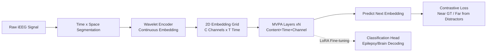

# A Foundation Model with Multi-Variate Parallel Attention to Generate Neuronal Activity

**Conference**: ICLR 2026  
**OpenReview**: [https://openreview.net/forum?id=5M1YOW3bRq](https://openreview.net/forum?id=5M1YOW3bRq)  
**Code**: [https://github.com/IBM/multi-variate-parallel-transformer](https://github.com/IBM/multi-variate-parallel-transformer)  
**Area**: Computational Neuroscience / Multivariate Time Series Foundation Models  
**Keywords**: iEEG, EEG Foundation Model, Multivariate Attention, Channel Heterogeneity, Epilepsy Detection, Generative Pre-training  

## TL;DR
This paper proposes Multi-Variate Parallel Attention (MVPA), which decouples attention into content, time, and channel parallel components to ignore differences in channel quantity and arrangement. Using this, the authors build MVPFormer, the first open-source, open-weight, and open-data intracranial EEG (iEEG) foundation model, achieving expert-level SOTA in epilepsy detection and brain activity decoding.

## Background & Motivation
- **Background**: Multivariate time series (finance, sensor networks, clinical records) have driven the demand for general neural architectures. Intracranial EEG (iEEG) is one of the most challenging types—it characterizes brain activity at millisecond and neuronal levels and is the gold standard for epilepsy diagnosis.
- **Limitations of Prior Work**: Electrode layouts for each patient are tailored to clinical needs; **channel numbers, spatial positions, and semantics vary across individuals** (channel heterogeneity). Vanilla attention flattens 2D spatio-temporal signals into 1D sequences, losing spatial structure. Existing iEEG models (Brant-2, BrainBERT) are mostly tied to fixed channel counts and require patient-specific adaptation, limiting generalization across subjects.
- **Key Challenge**: Achieving "channel-agnosticism (independence from fixed channel positions)" without sacrificing spatio-temporal locality and generalization. The goal is to flexibly ingest arbitrary channel configurations while modeling temporal and spatial interactions within the fundamental attention unit.
- **Goal**: Design an attention mechanism capable of natively processing heterogeneous multichannel time series and train an iEEG foundation model that achieves zero-shot generalization and expert-level performance on clinical tasks, while releasing data, code, and weights to the community.
- **Core Idea**: **[Decoupled Attention]** Instead of global position encoding or flattening, attention is split into three parallel components with relative encoding: content, time, and channel. **[Generative Pre-training]** Predict future brain signals in a continuous embedding space using contrastive loss, allowing the model to "generate neural activity" before fine-tuning for downstream discriminative tasks.

## Method

### Overall Architecture
MVPFormer segments raw iEEG signals in both time and space dimensions. These are mapped into continuous embeddings via a wavelet encoder and arranged into a 2D embedding grid. MVPA layers model temporal, spatial, and content dependencies simultaneously on this grid. The model undergoes generative pre-training with a contrastive objective to "predict the next embedding while staying away from distractors." Finally, it is fine-tuned for downstream tasks like epilepsy detection and brain activity decoding using LoRA + linear heads.

### Key Designs

**1. Three-way Decoupled Multi-Variate Parallel Attention (MVPA): Splitting "Content/Time/Space".** The starting point is the "dual encoding" form of 2D spatio-temporal attention $a^{\text{dual}}_{c,t,c',t'} = (x_{c,t}+T_t+C_c)^T W_q^T W_k (x_{c',t'}+T_{t'}+C_{c'})$, where $T$ and $C$ are independent temporal and spatial codebooks. Direct expansion generates expensive second-order cross-terms. Drawing from Transformer-XL's relative encoding, this work replaces absolute positions with relative distances and learnable biases $u, v, w$. After eliminating cross-terms, attention scores rearrange into three parallel groups: the content term $x_{c,t}^T W_q^T W_{ke} x_{c',t'} + u^T W_{ke} x_{c',t'}$ focuses on raw query/key content without position; the temporal term $x_{c,t}^T W_q^T W_{kt} T_{t-t'} + v^T W_{kt} T_{t-t'}$ focuses on relative temporal distance and is shared across channels; the channel term $x_{c,t}^T W_q^T W_{kc} C_{c-c'} + w^T W_{kc} C_{c-c'}$ focuses on relative spatial distance and is shared across time steps. The total attention is the sum $a^{\text{MVPA}} = a^{\text{content}} + a^{\text{time}} + a^{\text{channel}}$, followed by $\text{softmax}(a^{\text{MVPA}})V/\sqrt{d}$. This allows the model to separately learn signal semantics, temporal dynamics, and inter-channel structures.

**2. Relative Channel Encoding → Implicit Connectivity Graph, naturally adapting to heterogeneous layouts.** The channel component uses relative spatial distance rather than absolute coordinates. This is key for handling channel heterogeneity: many iEEG datasets do not provide 3D coordinates (e.g., the SWEC dataset used here omits positions for privacy). Starting from random initialization, MVPA **autonomously learns an implicit channel connectivity graph**, discovering hidden associations between spatial locations. Literature suggests absolute positions may not be necessary—results show MVPFormer outperforms coordinate-dependent SOTAs even on Brain TreeBank, proving that relative encoding maximizes flexibility without sacrificing performance.

**3. Efficient Implementation with Sub-quadratic Complexity (FlashMVPA).** The temporal term is identical across channels, and the channel term is identical across time steps. Thus, these terms only require quadratic calculations in one dimension (remaining constant in the other) and can be broadcast. Combined with Transformer-XL style shifting to calculate relative embeddings, and a local attention window ($L=10$ segments, 50s) for the expensive content term, the total complexity is $O(T^2 C + T C^2)$—quadratic per dimension but sub-quadratic relative to total context length when $L \ll T$. Combined with Grouped Query Attention (GQA) and FlashMVPA (written in Triton), the effective context length can exceed 10,000 (e.g., 100 channels × 100 time segments) on a single A100-80GB.

**4. Generative Contrastive Pre-training in Continuous Embedding Space.** As iEEG lacks a discrete vocabulary like language, this work follows the trend of "continuous latent representations," mapping signals to continuous embeddings via a wavelet encoder. MVPFormer is trained to predict future embeddings using contrastive loss: random fragments from the same batch or other subjects serve as "distractors" ($Z=\{z_1,...,z_n\}$). The model maximizes the similarity between the predicted embedding and the ground truth while minimizing it against distractors. This generative foundation is critical—ablation shows a purely discriminative version reaches only 0.52 Kappa, while the pre-trained MVPFormer-S reaches 0.54.

## Key Experimental Results

### Main Results: iEEG Epilepsy Detection (SWEC / MAYO / FNUSA)

| Model | Attention | SWEC Kappa | SWEC f1 | MAYO f1 | FNUSA f1 |
|---|---|---|---|---|---|
| **Ours (MVPFormer)** | MVPA | **0.61** | **0.59** | **0.36** | 0.46 |
| MVPFormer-S | MVPA | 0.57 | 0.53 | 0.35 | 0.46 |
| MV-Llama | Vanilla | 0.11 | 0.01 | / | / |
| Brant-2 | Vanilla | 0.06 | 0.01 | 0.19 | 0.46 |
| BrainBERT | Vanilla | 0.00 | 0.00 | / | / |

> Achieved a zero-shot average Kappa of 0.61 across 50 unseen subjects, matching/exceeding expert thresholds (0.53) with a false positive rate of only 0.15 fp/h. Vanilla attention baselines largely failed on SWEC.

### Main Results: Brain TreeBank Activity Decoding (4 Task Acc)

| Model | Attention | Pitch | Volume | Onset | Speech |
|---|---|---|---|---|---|
| **MVPFormer-S** | MVPA | **0.83** | **0.88** | 0.87 | 0.90 |
| MV-Llama | Vanilla | 0.63 | 0.77 | 0.80 | 0.81 |
| Brant | Vanilla | 0.61 | 0.74 | 0.80 | 0.80 |
| BrainBERT | Vanilla | 0.59 | 0.66 | 0.70 | 0.71 |
| PopT † (w/ coords) | Vanilla | 0.74 | 0.87 | 0.90 | 0.93 |
| PopT (no coords) | Vanilla | 0.62 | 0.76 | 0.81 | 0.83 |

> † indicates use of absolute electrode coordinates. MVPFormer exceeds all baselines on Pitch/Volume (including the coordinate-using PopT) and is second only to PopT on Onset/Speech, while comprehensively outperforming PopT without coordinates.

### Ablation Study
- **Generative Pre-training**: A purely discriminative model (Kappa 0.52) performs worse than the pre-trained MVPFormer-S (0.54), validating the foundation model paradigm.
- **General Time Series (Forecasting, Lower MSE/MAE is better)**: MVPFormer consistently $\geq$ PatchTST, TimesFM, TimeMixer, and WPMixer on ETTh1/ETTh2/Weather. Vanilla Transformer's MSE on ETTh2 reached 3.37, while MVPFormer maintained 0.38, indicating MVPA generalizes beyond iEEG.

### Key Findings
- Vanilla attention iEEG models fail when encountering channel heterogeneity and cross-subject scenarios; MVPA's relative spatio-temporal decoupling enables zero-shot generalization.
- Independence from electrode coordinates increases flexibility—implicit connectivity maps outperform explicit coordinate schemes in most tasks.
- MVPA is an attention mechanism transferable to general multivariate time series, not just an iEEG-specific trick.

## Highlights & Insights
- **Turning "Channel Heterogeneity" into Design**: By using relative channel encoding and implicit connectivity, the model breaks free from fixed channel counts and absolute coordinates, marking a fundamental difference from other iEEG models.
- **Decoupled Architecture + Sub-quadratic Performance**: Decoupling provides interpretable inductive bias and eliminates second-order cross-terms. FlashMVPA scales context to tens of thousands, providing both engineering and theoretical gains.
- **Open Data Value**: The released SWEC iEEG dataset (68 subjects, 9328 hours, 704 seizures) is the largest public iEEG corpus to date. Combined with open code and weights, it forms a rare "triple-open" infrastructure for the EEG community.

## Limitations & Future Work
- The SWEC dataset **lacks intracranial coordinates** for privacy reasons. While this fits MVPA's design, it prevents studying the additional benefit of absolute spatial priors.
- Testing for epilepsy detection still requires manual channel selection (fixed to 32 channels) based on variance/kurtosis, which remains a burden for real clinical deployment.
- As a unimodal electrophysiological model, it has not yet integrated multimodal info like imaging or clinical text; it slightly trails dedicated models on tasks requiring precise spatial localization (e.g., Onset/Speech).
- High pre-training cost (8×A100 for two weeks, 1.2M steps), creating a high barrier to reproducibility.

## Related Work & Insights
- **iEEG Foundation Models**: Unlike Brant-2, BrainBERT, or PopT which bind to fixed channels or coordinates, this work addresses generalization shortfalls via relative decoupled attention.
- **Relative Position Encoding**: Derived from Transformer-XL, but innovated by extending it to 2D spatio-temporal signals with sub-quadratic solutions.
- **Continuous Logic**: Echoes the trend of "predicting in continuous latent space" (e.g., LeCun’s JEPA), providing a template for foundation models in non-language modalities.
- **Insight**: Any multivariate signal with "variable inter-instance structure" (sensor networks, multi-lead ECG) can benefit from this recipe of relative encoding and implicit connectivity.

## Rating
- **Novelty**: ⭐⭐⭐⭐⭐ Decoupling attention into content/time/channel relative components to solve heterogeneity is a mechanism-level innovation with clean derivation.
- **Experimental Thoroughness**: ⭐⭐⭐⭐⭐ Covers 3 epilepsy datasets + 4 brain decoding tasks + general forecasting, including zero-shot, expert comparisons, and robust ablation.
- **Writing Quality**: ⭐⭐⭐⭐ Mathematical derivations and diagrams are clear; the logic from motivation to experiment is closed-loop.
- **Value**: ⭐⭐⭐⭐⭐ First open-data/code/weight iEEG foundation model + largest public dataset. Expert-level performance and transferable methods provide long-term value.

<!-- RELATED:START -->

## Related Papers

- [\[ICLR 2026\] Low rank adaptation of chemical foundation models generate effective odorant representations](low_rank_adaptation_of_chemical_foundation_models_generate_effective_odorant_rep.md)
- [\[ICLR 2026\] SAVE: A Generalizable Framework for Multi-Condition Single-Cell Generation with Gene Block Attention](save_a_generalizable_framework_for_multi-condition_single-cell_generation_with_g.md)
- [\[ICML 2025\] SToFM: a Multi-scale Foundation Model for Spatial Transcriptomics](../../ICML2025/computational_biology/stofm_a_multi-scale_foundation_model_for_spatial_transcriptomics.md)
- [\[ICLR 2026\] ProTDyn: A Foundation Protein Language Model for Thermodynamics and Dynamics Generation](protdyn_a_foundation_protein_language_model_for_thermodynamics_and_dynamics_gene.md)
- [\[ICLR 2026\] HEIST: A Graph Foundation Model for Spatial Transcriptomics and Proteomics Data](heist_a_graph_foundation_model_for_spatial_transcriptomics_and_proteomics_data.md)

<!-- RELATED:END -->
