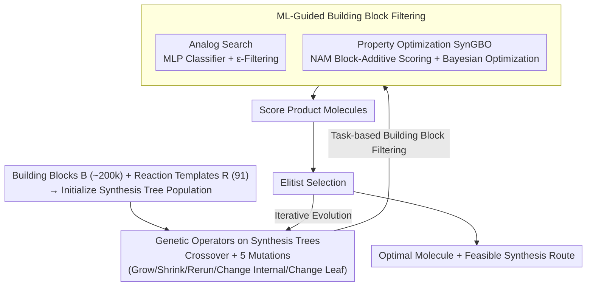

# A Genetic Algorithm for Navigating Synthesizable Molecular Spaces

**Conference**: ICLR 2026  
**arXiv**: [2509.20719](https://arxiv.org/abs/2509.20719)  
**Code**: [https://github.com/alstonlo/synga](https://github.com/alstonlo/synga)  
**Area**: Molecular Design / Optimization  
**Keywords**: Genetic Algorithm, Synthesizable Molecular Design, Synthesis Route, Bayesian Optimization, Building Block Filtering  

## TL;DR
SynGA is proposed as a genetic algorithm that operates directly on synthesis routes (synthesis trees). By using customized crossover and mutation operators, it strictly constrains the search to the synthesizable molecular space. Combined with ML-driven building block filtering, it achieves SOTA performance in synthesizable analog search and property optimization.

## Background & Motivation

**Background**: Generative models in molecular design (VAE, RL, GFlowNet, LLM) are advancing rapidly, yet classic genetic algorithms remain highly competitive due to their simplicity, sample efficiency, and exploration capabilities.

**Limitations of Prior Work**: Most molecular generation models ignore synthesizability, potentially proposing unstable or unsynthesizable designs, which remains a primary hurdle in practical applications. Using post-hoc retrosynthesis models can mitigate this but entails high computational costs (minutes per evaluation). Existing synthesis-constrained GA methods require training ML projection models to map molecules back to the synthesis space, incurring pre-training costs and being limited by projection quality.

**Key Challenge**: The need to search efficiently within a vast discrete combinatorial molecular space while ensuring that generated molecules possess feasible synthesis routes.

**Goal**: To design a lightweight genetic algorithm that guarantees synthesizability by construction, serving as both a standalone baseline and a modular component.

**Key Insight**: Rather than generating then verifying, genetic operators are defined directly on synthesis trees, effectively restricting the search space to synthesizable molecules from the outset.

**Core Idea**: By defining crossover and mutation operators on synthesis trees, the GA search is naturally bounded by the synthesizable space. This is further accelerated by ML-guided building block filtering to focus the search on relevant regions.

## Method

### Overall Architecture
SynGA aims to achieve "guaranteed synthesizability during search": given a set of ~200,000 purchasable building blocks $\mathcal{B}$ and a set of 91 reaction templates $\mathcal{R}$, it searches for the optimal molecule under a specific objective while simultaneously providing its synthesis route. Its key design shifts the search space from "molecules" to "synthesis trees"—a synthesis tree $T \in \mathcal{T}$ features building blocks as leaf nodes, reactions as internal nodes, and the final product at the root. The GA no longer performs crossover or mutation on molecular graphs but evolves synthesis trees directly: each generation applies operators to the population, scores the resulting molecules, and retains high-performing individuals via elitist selection. Since the operations act on valid synthesis trees, every candidate molecule is inherently accompanied by a feasible synthesis route. For sampling building blocks during mutation, SynGA employs a task-specific filter: an MLP classifier for analog search, or a block-additive model combined with Bayesian Optimization (SynGBO) for property optimization.

### Key Designs

**1. Genetic Operators on Synthesis Trees: Synthesizability as a Structural Constraint**

Traditional molecular GAs modify atoms and bonds, often producing unsynthesizable molecules that require expensive post-hoc retrosynthesis checks. SynGA embeds the constraint into the data structure: every node in the synthesis tree ensures that "leaves are building blocks and internals are valid reactions." **Crossover** involves enumerating subtrees from two parent trees and identifying compatible pairs that can be joined by a bimolecular reaction at a new root. **Mutation** provides five operations covering different perturbation granularities: Grow (extend via a new reaction), Shrink (revert to a subtree), Rerun (maintain tree structure but resample products), Change Internal (replace an internal reaction), and Change Leaf (replace a leaf building block). Notably, Rerun exploits synthesis route ambiguity—the same scaffold can produce different molecules—allowing for efficient exploration of variants within the same synthetic framework.

**2. ML-Guided Building Block Filtering: Compressing the Search Space**

With 200,000 building blocks, the candidate space for mutation is immense. For analog search, a lightweight MLP classifier $\pi_\theta: \mathcal{M} \times \mathcal{B} \to (0,1)$ is trained to predict the probability that a building block is used to synthesize analogs of a target molecule. To balance exploitation and exploration, an $\varepsilon$-filtering strategy is used: sampling from the filtered subset with probability $1-\varepsilon$ and from the full set with probability $\varepsilon$.

**3. Block-Additive Model + Bayesian Optimization (SynGBO): Ranking Building Blocks without Targets**

In property optimization, where no target molecule exists, SynGBO utilizes a Neural Additive Model (NAM) to score building blocks individually. The overall tree score is calculated as:

$$\rho_\theta(\mathcal{B}_M) = \left(\alpha + (1-\alpha)|\mathcal{B}_M|^{-1}\right)\sum_{B \in \mathcal{B}_M} s_\theta(B)$$

where $\mathcal{B}_M$ is the set of building blocks in molecule $M$, and $s_\theta(B)$ is the score of a single block. The model is trained using a pairwise ranking loss. Because of the additive structure, building blocks can be ranked directly by $s_\theta(B)$ for filtering. SynGA is then embedded within a Bayesian Optimization loop, where a GP surrogate model guides the search to maximize an acquisition function.

### Loss & Training
The analog search filter is trained using binary cross-entropy. The SynGBO NAM is trained with a pairwise ranking loss. The GP surrogate in the outer loop follows standard Gaussian Process training. The GA population size is set to 500 with an offspring size of 5.

## Key Experimental Results

### Main Results

**Synthesizable Analog Search (ChEMBL, 100 Molecules):**

| Method | Morgan Sim↑ | Scaffold Sim↑ | Gobbi Sim↑ | Subset Sim↑ |
|------|------------|--------------|-----------|-------------|
| SynGA (No Filter) | 0.313 | 0.372 | 0.536 | 0.397 |
| SynGA + MLP | 0.380 | 0.452 | 0.607 | 0.465 |
| SynGA + MLP+Mine | **0.393** | **0.465** | **0.617** | **0.475** |
| SynNet | 0.325 | 0.383 | 0.549 | 0.427 |
| Pasithea | 0.278 | 0.310 | 0.491 | 0.361 |

**Property Optimization (PMO Benchmark, GuacaMol Subset):**

| Method | Top-10 AUC↑ | Synthesizability |
|------|-----------|---------|
| SynGBO | SOTA | Guaranteed |
| Graph GA | High | Not Guaranteed |
| REINVENT | Moderate-High | Not Guaranteed |

### Ablation Study

| Configuration | Morgan Sim↑ | Description |
|------|------------|------|
| SynGA (No Filter) | 0.313 | Baseline |
| + Sim Heuristic Filter | 0.336 | Simple heuristics provide some benefit |
| + MLP Filter | 0.380 | ML filtering significantly improves performance |
| + MLP + Hard Negative Mining | 0.393 | Mining further enhances precision |

### Key Findings
- SynGA serves as a strong baseline without ML components and achieves SOTA with building block filtering.
- The Rerun mutation is a unique design that efficiently explores scaffold variants by keeping the synthesis tree structure fixed.
- Filtering 200k building blocks reduces the searchable space by orders of magnitude, which is critical for performance.
- SynGBO excels in property optimization, with ranking loss proving more effective than regression loss for filtering.

## Highlights & Insights
- **Constructive Synthesizability**: Moves away from the "generate-verify" paradigm to a search space that is synthesizable by construction. Every molecule generated during the search includes its own synthesis route.
- **Modular Design**: SynGA is a lightweight, non-ML core component that can be easily integrated into broader workflows (like BO), representing a "simple core + optional enhancement" philosophy.
- **Rerun Mutation**: Effectively leverages the ambiguity in synthesis routes to explore chemical space while keeping the synthetic scaffold constant.

## Limitations & Future Work
- Dependent on a predefined library of 91 reaction templates, potentially missing routes outside this scope.
- Building block set is constrained to the Enamine catalog, limiting chemical space coverage.
- The additive assumption in NAM may struggle to model complex non-linear property interactions.
- Synthesis routes are limited to a maximum of 5 steps, which might not cover complex molecules requiring longer paths.

## Related Work & Insights
- **vs Graph GA**: Traditional graph-based GAs have high search capacity but no synthesizability guarantee; SynGA matches performance while ensuring feasibility.
- **vs SynNet/Pasithea**: These ML-based projection methods require training complex auxiliary models; SynGA's core is simpler and more reliable.
- **vs RetroGNN (Gao et al., 2024)**: While both are synthesis-aware, RetroGNN uses projection networks; SynGA avoids projection errors by searching directly within the synthesis space.

## Rating
- Novelty: ⭐⭐⭐⭐ Defining GA operators on synthesis trees is well-executed, and the ML/GA fusion for filtering is innovative.
- Experimental Thoroughness: ⭐⭐⭐⭐⭐ Comprehensive coverage across analog search, property optimization, and 2D/3D targets with detailed ablations.
- Writing Quality: ⭐⭐⭐⭐⭐ Clear, precise methodology with rigorous formal definitions and open-source code.
- Value: ⭐⭐⭐⭐ Provides a practical tool for synthesizable molecular search with a ready-to-use codebase.

<!-- RELATED:START -->

## Related Papers

- [\[ICLR 2026\] Exploring Synthesizable Chemical Space with Iterative Pathway Refinements](exploring_synthesizable_chemical_space_with_iterative_pathway_refinements.md)
- [\[ICLR 2026\] SynCoGen: Synthesizable 3D Molecule Generation via Joint Reaction and Coordinate Modeling](syncogen_synthesizable_3d_molecule_generation_via_joint_reaction_and_coordinate_.md)
- [\[ICLR 2026\] Adaptive Data-Knowledge Alignment in Genetic Perturbation Prediction](adaptive_data-knowledge_alignment_in_genetic_perturbation_prediction.md)
- [\[ICML 2025\] Reliable Algorithm Selection for Machine Learning-Guided Design](../../ICML2025/computational_biology/reliable_algorithm_selection_for_machine_learning-guided_design.md)
- [\[ACL 2026\] AROMA: Augmented Reasoning Over a Multimodal Architecture for Virtual Cell Genetic Perturbation Modeling](../../ACL2026/computational_biology/aroma_augmented_reasoning_over_a_multimodal_architecture_for_virtual_cell_geneti.md)

<!-- RELATED:END -->
