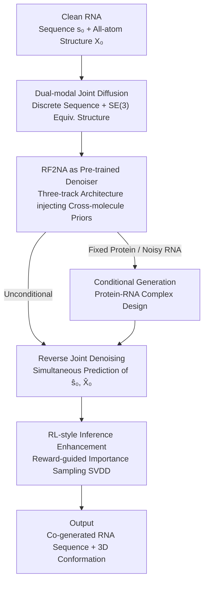

# A Joint Diffusion Model with Pre-Trained Priors for RNA Sequence-Structure Co-Design

**Conference**: ICLR2026  
**OpenReview**: [https://openreview.net/forum?id=cpc63YrVWN](https://openreview.net/forum?id=cpc63YrVWN)  
**Code**: TBD  
**Area**: Computational Biology / Diffusion Models / Generative Molecular Design  
**Keywords**: RNA Design, Sequence-Structure Co-generation, Pre-trained Priors, Discrete Diffusion, SE(3) Equivariant Diffusion

## TL;DR
This work utilizes the pre-trained biomacromolecular structure prediction model RoseTTAFold2NA directly as a diffusion denoiser within a joint framework of "discrete sequence diffusion + SE(3) equivariant structure diffusion" (RiboDiff). With minimal RNA 3D data, it simultaneously generates RNA sequences and all-atom 3D conformations. In tasks involving single-stranded RNA, RNA-protein complexes, and protein-conditioned binding, self-consistency metrics significantly outperform diffusion/flow-matching baselines trained from scratch.

## Background & Motivation
**Background**: RNA is a core molecule in cells responsible for catalysis, regulation, and information transmission. The "de novo design" of RNA sequences that fold into specified 3D structures is of great significance for synthetic biology, RNA drugs, and nanotechnology. However, RNA de novo design has long lagged behind protein design. While the protein field has successfully transformed pre-trained structure prediction models (like RoseTTAFold) into diffusion generators (e.g., RFdiffusion), RNA design mostly relies on training diffusion or flow-matching models from scratch on small, RNA-specific datasets.

**Limitations of Prior Work**: The core bottleneck is the **extreme scarcity of experimentally determined RNA 3D structures**—the authors could only utilize approximately 15k entries from RNASolo after filtering. Training a generative model from scratch on such a small dataset leads to either overfitting or poor coverage. Existing works generally follow three paths with significant drawbacks: (1) Inverse folding (gRNAde, RiboDiffusion) only optimizes sequences given a fixed 3D backbone and cannot "grow shapes" from scratch; (2) Joint generation (MMDiff, RiboGen) produces sequences and structures together but involves dedicated models trained from scratch on scarce RNA data, resulting in low design precision; (3) Two-stage pipelines (RNA-FrameFlow generates the backbone, then gRNAde performs inverse folding) decouple sequence and structure, leading to sub-optimal global solutions as sequences are not co-optimized during structure generation.

**Key Challenge**: RNA sequence and structure are **strongly bi-directionally coupled** (sequences determine folding via base pairing/stacking, while structure constrains the feasible sequence space), yet data is insufficient for models to learn this coupling from scratch. The tension lies between respecting this coupling with insufficient data versus decoupling it and losing design quality.

**Goal**: To achieve true de novo joint generation of "sequence + all-atom 3D structure" without increasing RNA 3D data, while flexibly supporting unconditional generation, complex generation, and protein-conditioned binding scenarios.

**Key Insight**: The authors adopt the successful paradigm from protein design: **discriminative pre-training + generative refinement**. The key observation is that RoseTTAFold2NA (RF2NA) has been unifiedly pre-trained on large-scale data of proteins, RNA, DNA, and their complexes, learning cross-molecular priors such as RNA structure formation, protein-RNA recognition, and sequence-structure relationships. Since this knowledge is already encoded in the weights, RF2NA can be used directly as a diffusion denoiser to reuse these priors during generation, circumventing the RNA data scarcity issue.

**Core Idea**: Embed the pre-trained RF2NA as a denoising network into a dual diffusion process comprising discrete (sequence) and continuous SE(3) equivariant (structure) components. This allows cross-molecular priors to drive the joint sequence-structure generation of RNA—marking the first diffusion framework for RNA joint generation built upon a pre-trained biomacromolecular model.

## Method

### Overall Architecture
RiboDiff solves the sampling of the joint distribution $p(s, X)$, where $s \in \{A,C,G,U,N\}^L$ is a nucleotide sequence of length $L$, and $X \in \mathbb{R}^{L \times N_a \times 3}$ represents the all-atom 3D coordinates (up to $N_a=27$ heavy atoms per nucleotide). The approach follows a standard "forward noise / reverse denoising" diffusion loop, using two mathematically distinct noise channels: sequence follows **discrete absorbing state diffusion** (collapsing toward a uniform distribution), and structure follows **SE(3) equivariant continuous diffusion** (Gaussian for translation, Isotropic Gaussian on SO(3) or IGSO(3) for rotation). Both channels **share the same denoiser** at each reverse step—a fine-tuned RF2NA—which takes noisy $(s_t, X_t)$ and time step $t$ to simultaneously predict the clean sequence $\hat{s}_0$ and structure $\hat{X}_0$, explicitly building the sequence-structure coupling into every step.

Specifically, RNA is represented as "sequence one-hot/category index + a local frame $F_i=(R_i, t_i)$ for each nucleotide." The local frames are constructed from C4', C1', and glycosidic nitrogen N1/N9 atoms via Gram-Schmidt orthogonalization to ensure SE(3) equivariance. During training, sequences/structures are randomly Bernoulli-masked so that a single model learns sequence-to-structure prediction, inverse folding, and joint generation. During inference, it supports unconditional generation, protein-conditioned generation (fixing protein structure while adding noise to RNA), and reward-based RL-style importance sampling to guide samples toward high quality.

### Key Designs

**1. Pre-trained RF2NA as a Diffusion Denoiser: Filling the RNA Data Gap with Discriminative Priors**

This directly addresses the bottleneck of "insufficient RNA 3D data for training diffusion from scratch." RF2NA is originally a three-track structure prediction network: the sequence track handles 1D features $h^{(1D)} \in \mathbb{R}^{L \times d_{seq}}$, the pair track maintains inter-residue relationships $h^{(2D)} \in \mathbb{R}^{L \times L \times d_{pair}}$, and the structure track iteratively refines SE(3) equivariant features $h^{(3D)}$ alongside coordinate frames $\{F_i\}$. Information is exchanged between tracks via attention. Instead of redesigning the network, the authors **reuse the pre-trained RF2NA backbone as a shared representation**, adding three diffusion heads: a sequence head for category logits, a translation head for per-residue translation noise, and a rotation head for tangential velocity on SO(3). Time step embeddings $e(t)$ are injected into all tracks. Fine-tuning uses pre-trained weights, preserving cross-molecular priors (protein-RNA interactions, structural motifs, sequence-structure relations) and significantly improving sample efficiency in low-data RNA scenarios. This differs fundamentally from MMDiff/RiboGen, which rely solely on $\sim 15k$ RNA data points for inductive bias.

**2. Joint Dual-modal Process: Discrete Sequence + SE(3) Equivariant Structure Diffusion**

Sequences are discrete categories, and structures are continuous geometries. To handle these correctly, the authors use two diffusion channels. For sequences, an absorbing state discrete diffusion is used: the forward transition matrix is $Q_t = (1-\beta_t^{seq})I + \beta_t^{seq}U$ (where $U$ is uniform transition and $\beta_t^{seq}$ follows a cosine schedule $\cos(\frac{\pi}{2}\cdot\frac{t}{T})^2$), gradually eroding the sequence into a uniform distribution. The marginal distribution has a closed-form solution $q(s_t|s_0)=\text{Categorical}(s_t; \bar{Q}_t s_0)$. For structures, each atomic position is decomposed as $x_{i,a}=R_i r_{i,a}+t_i$. Translation follows standard Gaussian $q(t_t|t_0)=\mathcal{N}(t_t; \sqrt{\bar\alpha_t^{trans}}t_0, (1-\bar\alpha_t^{trans})I_3)$, and rotation follows IGSO(3) on SO(3): $q(R_t|R_0)=\text{IGSO(3)}(R_t; R_0, \kappa_t)$. The concentration parameter $\kappa_t$ decays over time towards a uniform distribution on SO(3). Sampling uses axis-angle representations and the Rodrigues formula for matrix exponentials. The reverse process benefits from RF2NA's inherent SE(3) equivariance: for any $g=(R_g,t_g)\in\text{SE(3)}$, $f_{\text{RF2NA}}(s_t, g\cdot X_t, t)=(\hat{s}_0, g\cdot\hat{X}_0)$. Thus, the entire generation process respects rotation and translation symmetries. Although the channels differ mathematically, they **share the same denoiser and predict $\hat{s}_0$ and $\hat{X}_0$ simultaneously**, ensuring sequence and structure are calibrated at each step.

**3. Three-track Pair Representation Supporting Protein-Conditioned Generation**

Therapeutic scenarios often require designing RNA that binds to specific proteins (aptamers, riboswitches). RiboDiff achieves this by splitting the system into a fixed protein $P$ and a designable RNA $R$. The forward process **adds noise only to the RNA component, keeping the protein structure fixed**: $q(X_t^{RNA}, s_t^{RNA}|X_0^{RNA}, s_0^{RNA}, X^{prot}, s^{prot})=q(X_t^{RNA}|X_0^{RNA})\cdot q(s_t^{RNA}|s_0^{RNA})$. The reverse process denoises the RNA within the protein context. This works because RF2NA's **pair track already encodes cross-chain interactions**: the pairing features between protein and RNA residues, $h_{ij}^{inter}=f_{bind}(h_i^{prot}, h_j^{RNA})+f_{geom}(X_i^{prot}, X_j^{RNA})$, directly characterize the potential binding interface. The protein context thus shapes the RNA denoising trajectory toward compatible conformations.

**4. RL-style Inference Enhancement (SVDD): Pushing Quality Without Re-training**

To further improve quality during inference, the authors introduce Sequential Value-guided Discrete Diffusion (SVDD). At a noisy state $(X_t, s_t)$, $M$ candidate next states $(X_{t-1}^{(m)}, s_{t-1}^{(m)})$ are sampled according to the standard reverse process. Rewards $r_m$ (evaluating sample quality) are calculated for each candidate, and the best is selected via $m^*=\arg\max_m [r^{(m)} + \tau\log p_\theta(X_{t-1}^{(m)}, s_{t-1}^{(m)}|X_t, s_t, t)]$, where $\tau$ balances reward maximization and distribution fidelity. This guides samples toward better interfaces or structures without modifying model parameters. The computational cost is managed by using a small $M$ (e.g., 10).

### Loss & Training
The total loss combines sequence accuracy, structural precision, and physical plausibility: $L_{total}=\lambda_{seq}L_{seq}+\lambda_{str}L_{str}+\lambda_{rmsd}L_{rmsd}+\lambda_{geom}L_{geom}+\lambda_{lj}L_{lj}$. Here, $L_{seq}$ is nucleotide cross-entropy; $L_{str}$ is Frame Aligned Point Error (FAPE) to ensure local geometry; $L_{rmsd}$ constrains global structure after optimal superposition; $L_{geom}$ maintains stereochemistry (bond lengths/angles); and $L_{lj}$ is the Lennard-Jones potential to prevent atomic clashes. During training, $t\sim U(1,T)$ is sampled, and Bernoulli masks ($m_{seq}, m_{str}\sim\text{Bernoulli}(p_{mask})$) allow the model to learn structure prediction, inverse folding, and joint generation simultaneously.

## Key Experimental Results

### Main Results
Evaluation focuses on self-consistency metrics: scRMSD (co-designed structure vs. structure re-predicted from the generated sequence), scTM-score, lDDT, sequence self-consistency recovery (scSeqRec), and qTMclust diversity.

**De Novo Single-stranded RNA Design (RNASolo, Success: scRMSD < 5Å):**

| Method | Success Rate (%↑) | scRMSD (Å↓) | scTM (↑) | lDDT (↑) | scSeqRec (%↑) | Diversity (↑) |
|--------|-------------------|-------------|----------|----------|---------------|---------------|
| Random | 0.00 | 39.74 | 0.05 | 0.23 | 1.06 | 0.99 |
| MMDiff | 8.86 | 35.77 | 0.12 | 0.33 | 23.90 | 1.00 |
| RNA-FrameFlow + gRNAde | 15.52 | 18.65 | 0.32 | 0.43 | 45.65 | 0.76 |
| **RiboDiff** | **97.38** | **3.43** | **0.71** | **0.74** | **48.57** | 1.00 |

scRMSD decreased from MMDiff's 35.7Å to 3.43Å (a >10× reduction), while the success rate reached 97.38% with diversity maintained at 1.00, indicating that high quality does not sacrifice structural variety.

**Joint Design of RNA-Protein Complexes:**

| Method | scRMSD (Å↓) | scTM (↑) | lDDT (↑) | scSeqRec (%↑) | Diversity (↑) |
|--------|-------------|----------|----------|---------------|---------------|
| Random | 43.51 | 0.002 | 0.26 | 0.59 | 1.00 |
| MMDiff | 30.84 | 0.015 | 0.38 | 17.46 | 0.96 |
| **RiboDiff** | **7.43** | **0.422** | **0.71** | **52.91** | 1.00 |

**Protein-Conditioned RNA Binder Design (Ground Truth comparison):** RiboDiff achieved a GT-SeqRec of 56.26% and GT-RMSD of 13.20Å in the RF2NA pre-training split, nearly doubling the sequence recovery of RNAFlow-Base (27.98%). Performance remained stable across sequence similarity splits, demonstrating generalization beyond near-homologs.

### Ablation Study

| Config | scRMSD (Complex, Å↓) | GT-RMSD (Cond., Å↓) | ipTM (Cond., ↑) |
|--------|----------------------|---------------------|-----------------|
| RiboDiff | 7.43 | 13.20 | 0.166 |
| RiboDiff + SVDD | **6.41** | **12.43** | **0.187** |

SVDD ($M=10$) consistently improved scRMSD, GT-RMSD, and interface ipTM without parameter updates, proving that reward-guided selection effectively pushes samples toward better interfaces.

### Key Findings
- **Pre-trained Priors are the Main Driver**: MMDiff's scRMSD was $\sim35Å$ on low-data RNA, whereas RiboDiff reached 3.43Å by leveraging RF2NA, confirming the "pre-training + generative refinement" paradigm's efficacy in the RNA domain.
- **Joint Optimization vs. Two-stage**: Two-stage methods showed lower success (15.52%) and diversity (0.76), validating the necessity of sequence-structure co-optimization.
- **Consistency Across Tasks**: Significant leads in single-strand, complex, and conditional tasks suggest the advantage stems from pre-trained priors rather than overfitting.
- **Diminishing Returns of SVDD**: Increasing candidates $M$ improves attributes but with diminishing returns; $M=10$ provides a good trade-off.

## Highlights & Insights
- **Transferring "Structure Prediction as Denoiser" to RNA**: While RFdiffusion pioneered this for proteins, this work is the first to apply it to RNA joint generation using the unified RF2NA model, allowing "free" use of cross-molecular knowledge (especially protein-RNA interfaces).
- **Three-track Architecture Enabling Conditional Generation**: No extra modules are needed for conditional design; the pair track's encoding of cross-chain interactions naturally shapes the RNA denoising trajectory.
- **Dual-mode Shared Denoiser**: Sharing a network between discrete sequence and SE(3) continuous structure diffusion explicitly builds bi-directional coupling into the sampling process—a design transferable to any "label + geometry" co-generation task.
- **RL-based Inference Enhancement**: SVDD provides a zero-cost way to improve quality by using reward-guided selection, which can be easily plugged into other diffusion generators.

## Limitations & Future Work
- **Limited Absolute Binding Accuracy**: GT-RMSD in protein-conditioned tasks remains in the $10-15Å$ range, which may be insufficient for high-precision drug design.
- **Dependence on RF2NA's Boundary**: The model is limited by the scope of RF2NA's pre-training; priors may fail if the target molecule type or interaction is not covered.
- **Data Scale Ceiling**: While pre-training bypasses data scarcity for training, the 15k RNASolo entries are still limited, and generalization to completely novel fold topologies requires further validation.
- **Future Directions**: Combining learned energy with physical potentials (solvation/electrostatics), using schedule-free or flow-diffusion hybrids for faster sampling, and introducing uncertainty calibration.

## Related Work & Insights
- **vs RFdiffusion (Protein)**: Similar philosophy of using structure prediction models as denoisers. RiboDiff extends this to RNA joint generation and RNA-protein conditional design using unified pre-training.
- **vs MMDiff / RiboGen (Joint)**: RiboDiff significantly outperforms these zero-shot models by leveraging the RF2NA pre-trained engine (scRMSD reduction from 35Å to 3.4Å).
- **vs RNA-FrameFlow + gRNAde (Two-stage)**: Decoupled pipelines suffer from lower success rates and reduced diversity; RiboDiff's joint optimization avoids these issues.
- **vs gRNAde / RiboDiffusion (Inverse Folding)**: These require a fixed 3D backbone; RiboDiff generates the 3D shape from scratch.
- **vs RNAFlow / RiboFlow (Conditional)**: These often rely on complex pipelines or external tools for specific conditions; RiboDiff provides a unified framework for unconditional and protein-conditioned generation.

## Rating
- Novelty: ⭐⭐⭐⭐⭐ First to embed a unified biomacromolecular model (RF2NA) into a diffusion framework for RNA sequence-structure co-design.
- Experimental Thoroughness: ⭐⭐⭐⭐ Extensive tasks and ablations; however, some baseline comparisons (e.g., RiboGen) were only qualitative.
- Writing Quality: ⭐⭐⭐⭐ Clear motivation and derivation; complete formulas.
- Value: ⭐⭐⭐⭐⭐ Directly addresses the data scarcity bottleneck in RNA de novo design with high practical value for RNA therapeutics.

<!-- RELATED:START -->

## Related Papers

- [\[ICLR 2026\] FlexRibbon: Joint Sequence and Structure Pretraining for Protein Modeling](flexribbon_joint_sequence_and_structure_pretraining_for_protein_modeling.md)
- [\[ICML 2025\] eccDNAMamba: A Pre-Trained Model for Ultra-Long eccDNA Sequence Analysis](../../ICML2025/computational_biology/eccdnamamba_a_pre-trained_model_for_ultra-long_eccdna_sequence_analysis.md)
- [\[ICLR 2026\] Constrained Diffusion for Protein Design with Hard Structural Constraints](constrained_diffusion_for_protein_design_with_hard_structural_constraints.md)
- [\[CVPR 2026\] HINGE: Adapting a Pre-trained Single-Cell Foundation Model to Spatial Gene Expression Generation from Histology Images](../../CVPR2026/computational_biology/adapting_a_pre-trained_single-cell_foundation_model_to_spatial_gene_expression_g.md)
- [\[ICLR 2026\] Multi-state Protein Sequence Design with DynamicMPNN](multi-state_protein_sequence_design_with_dynamicmpnn.md)

<!-- RELATED:END -->
