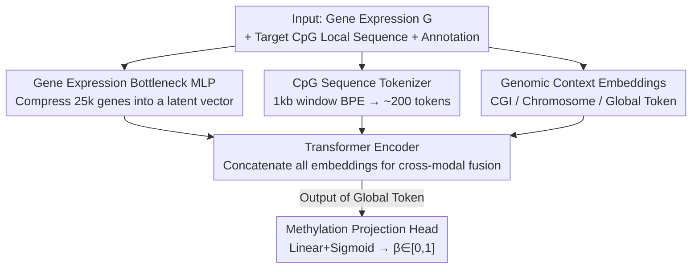

# A New Paradigm for Genome-wide DNA Methylation Prediction Without Methylation Input

**Conference**: ICLR2026  
**OpenReview**: [https://openreview.net/forum?id=8wQ7Oc08vo](https://openreview.net/forum?id=8wQ7Oc08vo)  
**Code**: TBD  
**Area**: Computational Biology / Epigenetic Foundation Models  
**Keywords**: DNA Methylation, Gene Expression Context, Transformer, Genome-wide Prediction, Foundation Models

## TL;DR
MethylProphet is a "gene context + DNA sequence" driven Transformer foundation model that **completely eliminates the need for any measured methylation values as input**. By utilizing only a single sample's gene expression profile and the local DNA sequence around each CpG site, it can infer genome-wide methylation levels (~28 million CpGs) and generalize to CpG sites and samples never seen during training.

## Background & Motivation
**Background**: DNA methylation (DNAm) is a core epigenetic modification regulating gene expression, cell differentiation, and disease occurrence, primarily occurring at CpG sites and quantified by $\beta$ values ($\in[0,1]$). However, the cost of genome-wide methylation sequencing is extremely high: the human genome contains approximately 28 million CpGs, but common array platforms (e.g., Illumina 450K/EPIC) only measure 1–3%. Whole-Genome Bisulfite Sequencing (WGBS), which provides full coverage, is too expensive for large-scale deployment. Consequently, most CpGs are "missing" in any given dataset, creating a high-dimensional sparse matrix problem with massive missingness.

**Limitations of Prior Work**: Recent deep learning methods (generative Transformers like DeepCpG, CpGPT, or MethylGPT) can learn global representations of methylation but fall under the "imputation paradigm"—**they still require partial measured methylation values as input during inference** to fill in unobserved sites based on observed ones. This presents two critical flaws: first, they are ineffective for new samples without any existing methylation measurements; second, their pre-training is usually limited to ~ $10^4$ CpGs (~0.03% of the genome), failing to generalize to entirely new CpG sites. Other methods (MuLan-Methyl, MethylNet, etc.) focus only on the small subset of CpGs present on arrays, naturally limiting their coverage.

**Key Challenge**: There is a trade-off between coverage (WGBS is too expensive) and accessibility (imputation models require prior partial observations). The root of the problem is that existing models treat "methylation" as both input and output, creating a dependency on pre-existing methylation data.

**Goal**: Can we completely bypass the need for "any measured methylation" and directly infer the entire methylation map from more accessible signals? Sub-problems include: (1) what signal can replace methylation input; (2) how to generalize to tens of millions of CpGs (including unseen ones) without assigning independent parameters to each site.

**Key Insight**: The authors leverage the biological fact that there is a strong correlation between gene expression levels and DNA methylation patterns. Gene expression data is far more accessible across various tissues and conditions than methylation data. Thus, the "global context of methylation" can be provided by gene expression, while "site-specific specificity" is provided by the DNA sequence.

**Core Idea**: Using "gene expression profile (global biological state) + CpG local DNA sequence (site-specific)" as context, a Transformer is used to directly regress the methylation value of each CpG. **The input contains no methylation values**, shifting from an "imputation paradigm" to a "gene context prediction paradigm."

## Method

### Overall Architecture
MethylProphet aims to solve the following: given a sample's gene expression vector $G\in\mathbb{R}^{N_g}$ ($N_g\approx 25,000$ genes) and a local DNA sequence $S_i$ of length $L$ around a target CpG site $i$ along with its annotation $a_i$, learn a function $f_\theta:(G, S_i, a_i)\mapsto \hat{y}_i\in[0,1]$. The pipeline consists of three modules: a **Gene Expression Bottleneck MLP** that compresses the 25k-dimensional profile into a compact vector; a **CpG Sequence Tokenizer + Context Embedding** that encodes the local sequence and genomic annotations into tokens; and finally, a **Transformer Encoder** for cross-modal fusion, where a global token carries the final prediction.

A Transformer backbone is used because self-attention naturally captures long-range CpG dependencies within kb-scale sequences and seamlessly integrates heterogeneous embeddings (sequence, expression, annotation) without specialized modules. It also follows the scaling law—improving as more data is provided, which is ideal for genome-wide scale prediction.

### Key Designs

**1. Gene Expression Bottleneck MLP: Encoding the Transcriptome in a Latent Vector**

Directly feeding 25k genes as individual tokens into a Transformer would cause an explosion in the quadratic complexity of self-attention. However, selecting only a subset of genes might lose global biological state information. The authors use a Bottleneck MLP to compress the entire expression profile into a compact embedding: $x_{gene}=\phi(W_2\,\sigma(W_1 G + b_1)+b_2)$, where $\sigma$ is GeLU and $\phi$ is LayerNorm. This provides (i) efficient compression, (ii) minimal inductive bias, (iii) preservation of long-range dependencies within the transcriptome, and (iv) generalization to unseen samples by learning expression-to-methylation mapping rather than specific sample IDs.

**2. CpG Sequence Tokenizer: Sequence Context Instead of IDs**

Assigning a learnable embedding to each of the 28 million CpGs would require ~86GB of parameters and would fail to generalize to unseen sites. Instead, the authors represent a CpG via its "sequence context": a ~1000bp window centered at the site is tokenized using variable-length BPE (inspired by DNABERT-2) into ~200 subword tokens ($x^{DNA}_j$). This allows the model to transfer knowledge between different sites sharing similar motifs, enabling reasonable predictions for "entirely new CpGs."

**3. Genomic Context Embeddings: Positional Priors**

Local sequences alone are insufficient, as similar sequences in different regions may exhibit different methylation behaviors. The authors layer three types of learnable priors: **CpG Island (CGI) Context** (distinguishing island, shore, shelf, or open sea/ocean), **Chromosome Indicator** ($x_{chr}(k)$ for encoding chromosome-specific baselines), and a **Global Token** ($x_{GLB}$, acting similarly to the CLS token in BERT) as an aggregation node. This resolves ambiguity when sequences are similar but context differs.

**4. Transformer Encoder and Global Token Prediction**

All embeddings are concatenated into a single input sequence $Z_i=[x_{GLB},\,x_{gene},\,\{x^{DNA}_j\}_{j=1}^L,\,x_{CGI},\,x_{chr}]$ and fed into stacked bidirectional self-attention layers. This allows complex interactions, such as how gene expression affects the interpretation of sequence tokens. The final state of the global token $x^{out}_{GLB}$ is passed through a projection head (Linear + Sigmoid) to regress the methylation value.

### Loss & Training
The model is trained end-to-end to minimize the Mean Squared Error (MSE) between predicted and true methylation values. Training is supervised and relies on large-scale paired "gene expression–methylation" data. At inference, only gene expression and sequence are needed. Training was conducted at a massive scale: ENCODE utilized ~1.6 billion CpG-sample pairs (~322 billion tokens), and TCGA (chr1) used ~450 million pairs (~91 billion tokens).

## Key Experimental Results

### Data and Evaluation Setup
Evaluation used ENCODE (97 matched WGBS + RNA-seq tissue samples) for genome-wide pan-tissue prediction, and TCGA (10,932 matched methylation + RNA-seq samples) for pan-cancer prediction. Three scenarios were evaluated to test both in-distribution and out-of-distribution (OOD) generalization: Train CpG–Val Sample (new sample, old site), Val CpG–Train Sample (old sample, new site), and Val CpG–Val Sample (new sample + new site, OOD). Metrics include MAS-PCC (Median Across Sample Pearson), MAC-PCC (Median Across CpG Pearson), MSE, and MAE.

### Main Results
On ENCODE, MethylProphet outperformed the Levy-Jurgenson CNN+attention baseline across all splits:

| ENCODE Split | Metric | Baseline | MethylProphet |
|--------------|--------|----------|---------------|
| Train CpG–Val Sample | MAS-PCC | 0.2878 | **0.3436** |
| Train CpG–Val Sample | MAC-PCC | 0.8355 | **0.9398** |
| Val CpG–Train Sample | MAS-PCC | 0.5453 | **0.7165** |
| Val CpG–Train Sample | MAC-PCC | 0.7959 | **0.9297** |
| Val CpG–Val Sample (OOD) | MAS-PCC | 0.1930 | **0.3411** |
| Val CpG–Val Sample (OOD) | MAC-PCC | 0.8037 | **0.9330** |

Significant leads were also observed in TCGA pan-cancer (e.g., Train CpG–Val Sample MAS-PCC improved from 0.2630 → **0.5455**).

### Ablation Study (Comparison with Imputation Paradigm)
Even though CpGPT and MethylGPT use a different paradigm requiring methylation input, ours was compared in-distribution (Val CpG–Train Sample):

| Model | ENCODE MAS-PCC | ENCODE MAC-PCC | TCGA chr1 MAS-PCC | TCGA chr1 MAC-PCC |
|-------|----------------|----------------|-------------------|-------------------|
| DeepCpG | 0.0317 | 0.5560 | -0.0080 | 0.4237 |
| CpGPT | 0.3192 | **0.9401** | 0.4794 | 0.9250 |
| MethylGPT | 0.2964 | 0.8953 | 0.4358 | 0.8357 |
| **Ours** | **0.3689** | 0.9400 | **0.5453** | **0.9253** |

Ours achieved the highest MAS-PCC while maintaining MAC-PCC parity with CpGPT, despite being the only model capable of prediction without methylation input.

### Key Findings
- **Cross-CpG (MAC-PCC) is easier to predict than cross-sample (MAS-PCC)**: Global trends in methylation profiles are easier to learn (MAC-PCC > 0.9), while predicting specific variations across individuals (MAS-PCC) remains the primary challenge.
- **High-variance CpGs are more accurate**: Prediction MAS-PCC increases with the variance of the CpG site across samples, indicating the model captures informative variable sites.
- **Preservation of Biological Structure**: Results accurately replicate co-methylation dynamics within CGIs and UMAP clusters align with tissue/cancer types.

## Highlights & Insights
- **Paradigm Shift**: Breaking the dependency on methylation input by using gene expression for global state and sequence for local specificity enables whole-genome inference for samples never before sequenced for methylation.
- **Sequence Context as the Key to Generalization**: Using BPE-tokenized local DNA sequences instead of fixed site IDs solves both parameter explosion and the inability to generalize to unseen sites.
- **Bottleneck MLP for High-Dimensional Inputs**: Successfully handles 25k gene inputs while avoiding the quadratic complexity of Transformer self-attention.
- **Value of Scaling**: Training on hundreds of billions of tokens establishes it as a true foundation model for epigenetics.

## Limitations & Future Work
- **Cross-sample prediction (MAS-PCC) is still relatively low** (0.3–0.5 in many cases), suggesting predicting inter-individual variation—crucial for clinical targets—remains difficult.
- **TCGA evaluation was limited to Chr1** due to scale; pan-cancer conclusions require verification across more chromosomes.
- **Dependence on paired training data**: While inference only requires gene expression, the training phase still relies on large-scale matched datasets.
- Future Directions: Incorporating stronger sequence encoders, explicitly modeling co-methylation structures, and optimizing specifically for cross-sample variation.

## Related Work & Insights
- **vs. CpGPT / MethylGPT**: These require partial methylation input and are limited to specific CpG subsets. Ours offers a paradigm shift in accessibility.
- **vs. DeepCpG**: Early CNN methods that rely on neighboring CpGs, resulting in lower PCC and no "zero-input" capability.
- **vs. scGPT / Geneformer**: Inherits the philosophy of learning general representations from massive biological data but shifts the target from expression modeling to cross-modal methylation regression.

## Rating
- Novelty: ⭐⭐⭐⭐⭐ 
- Experimental Thoroughness: ⭐⭐⭐⭐ 
- Writing Quality: ⭐⭐⭐⭐ 
- Value: ⭐⭐⭐⭐⭐ 

<!-- RELATED:START -->

## Related Papers

- [\[ICML 2025\] Latent Imputation before Prediction: A New Computational Paradigm for De Novo Peptide Sequencing](../../ICML2025/computational_biology/latent_imputation_before_prediction_a_new_computational_paradigm_for_de_novo_pep.md)
- [\[ICLR 2026\] Test-Time Adaptation without Source Data for Out-of-Domain Bioactivity Prediction](test-time_adaptation_without_source_data_for_out-of-domain_bioactivity_predictio.md)
- [\[ICLR 2026\] Adaptive Data-Knowledge Alignment in Genetic Perturbation Prediction](adaptive_data-knowledge_alignment_in_genetic_perturbation_prediction.md)
- [\[ICLR 2026\] AntigenLM: Structure-Aware DNA Language Modeling for Influenza](antigenlm_structure-aware_dna_language_modeling_for_influenza.md)
- [\[ICLR 2026\] PatchDNA: A Flexible and Biologically-Informed Alternative to Tokenization for DNA](patchdna_a_flexible_and_biologically-informed_alternative_to_tokenization_for_dn.md)

<!-- RELATED:END -->
