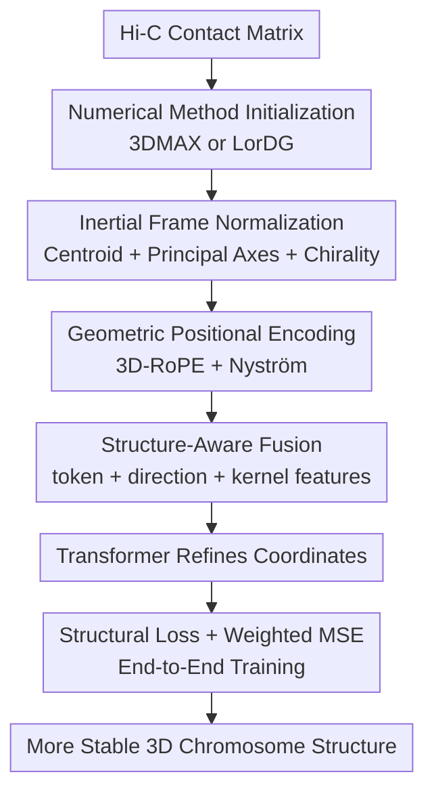

# A Resolution-Agnostic Geometric Transformer for Chromosome Modeling Using Inertial Frame

**Conference**: ICLR2026  
**OpenReview**: [https://openreview.net/forum?id=OwLl8Xi6JG](https://openreview.net/forum?id=OwLl8Xi6JG)  
**Code**: https://github.com/yize1203/InertialGenome  
**Area**: Computational Biology  
**Keywords**: 3D Genome Reconstruction, Hi-C, Chromosome Modeling, Geometric Transformer, Cross-resolution Transfer

## TL;DR
InertialGenome utilizes an inertial frame to normalize initial 3D chromosome coordinates into a stable pose, then refines these coordinates using a Transformer equipped with 3D-RoPE and Nyström structural encoding. It outperforms traditional optimization methods and Graph Neural Network baselines across two single-cell Hi-C datasets, multiple resolutions, and various biological functional validations.

## Background & Motivation
**Background**: 3D genome research aims to recover the spatial conformation of chromosomes within the cell nucleus from chromatin contact frequencies measured by experiments such as Hi-C. The standard pipeline typically segments the genome into continuous bins to obtain a contact matrix. Utilizing the inverse relationship between contact frequency and spatial distance, the problem is transformed into 3D coordinate reconstruction. Early methods were mostly numerical optimization or distance geometry approaches like 3DMAX, LorDG, and miniMDS. Recent methods like HiC-GNN and HiCEGNN treat the Hi-C matrix as a graph and use GNNs or equivariant GNNs to directly predict 3D structures.

**Limitations of Prior Work**: Low-resolution Hi-C maps are denser and relatively less noisy but only describe global contours. High-resolution Hi-C maps capture local details like loops and TADs but are sparser, noisier, and harder to optimize. Traditional numerical methods search in high-dimensional non-convex spaces, incurring high computational costs and susceptibility to initial conditions. Although deep models are faster, many treat contacts merely as graph edges without explicitly utilizing the geometric priors of the chromosome 3D point cloud itself. Strongly equivariant constrained models like HiCEGNN handle rotation and translation symmetry but may limit expressiveness, especially when dealing with asymmetric structures like directional or anchored loops.

**Key Challenge**: 3D chromosome reconstruction requires insensitivity to arbitrary rotation and translation (as the same structure remains identical when rotated), while simultaneously preserving geometric orientation, long-range distances, and chain-like spatial organization. Existing methods either lack stable pose normalization, sacrifice expressiveness via overly strong symmetry constraints, or fail to generalize well across different resolutions.

**Goal**: The authors aim to solve the resolution-agnostic 3D chromosome reconstruction problem: given initial coordinates $C^*$ generated by Hi-C matrices and traditional methods, the model outputs more accurate coordinates $\hat{C}$. Furthermore, the model must work stably across various resolutions (e.g., 320kb, 160kb, 80kb, 40kb or 1MB, 500KB, 250KB, 100KB) and transfer global structures learned at low resolutions to high-resolution reconstruction.

**Key Insight**: The authors observe that while 3D chromosome structures lack an absolute orientation, the point cloud shape itself can define a set of principal axes. By aligning each input structure to its own inertial frame, unnecessary variations caused by arbitrary poses are eliminated. Within this normalized coordinate system, the Transformer can use geometric positional encoding to model relative distances and long-range structures, removing the need for the model to simultaneously learn "how to align poses" and "how to refine structures."

**Core Idea**: Replace rigid SE(3) equivariant constraints with inertial frame normalization, and inject 3D-RoPE and Nyström kernel approximations into the Transformer. This allows the model to perceive local relative positions, global low-rank distance structures, and cross-resolution geometric patterns within a unified pose.

## Method

### Overall Architecture
The input to InertialGenome is not the raw Hi-C matrix itself, but a set of initial 3D coordinates $C^*=\{c_i\}_{i=1}^N$ obtained from the Hi-C contact matrix using numerical methods such as 3DMAX or LorDG. The model first translates the point cloud to the centroid and aligns it with the principal inertial axes to obtain normalized coordinates $S=\{s_i\}_{i=1}^N$. Subsequently, the token ID of each genomic bin, normalized coordinates, orientation information, and Nyström structural embeddings are fused as Transformer inputs. Finally, the model predicts refined 3D coordinates, trained with a combination of structural preservation loss and weighted distance regression loss.

From a data flow perspective, the key is not reinventing the first step from Hi-C to distance matrices, but creating a geometric refiner on top of existing initial structures. This positioning allows InertialGenome to be attached to 3DMAX or LorDG as IG-3DMAX and IG-LorDG variants, explaining why the model significantly reduces scale errors and pose instability of raw numerical methods while still being influenced by initialization quality.

### Key Designs
**1. Inertial Frame Normalization: Converting Arbitrary Poses into Comparable Coordinates**

Absolute rotation and translation of 3D chromosome coordinates have no biological meaning; the distance matrix remains unchanged if a structure is rotated. Feeding these coordinates directly to a standard Transformer forces the model to learn task-irrelevant pose variations. Using strong equivariant GNNs might restrict the model to an overly narrow family of symmetric functions. InertialGenome adopts a middle-ground approach: define the coordinate system using the input point cloud itself and model within that system.

The procedure starts by calculating the centroid $\bar{c}=\frac{1}{N}\sum_i c_i$ and translating each point to $c'_i=c_i-\bar{c}$. Then, the normalized inertial tensor is estimated as $\hat{I}=\frac{1}{N}\sum_i(\|c'_i\|^2 I_3-c'_i(c'_i)^T)$. Eigen-decomposition $\hat{I}=L\Lambda L^T$ provides the eigenvectors $l_x,l_y,l_z$ representing the principal axes. To avoid mirror inconsistency from axis flipping, the authors use the farthest point $c_{max}$ and its signs in the principal coordinates to correct the first two axes using $\mathrm{sign}(p_x)$ and $\mathrm{sign}(p_y)$, ensuring a right-handed system via $l_z=l_x\times l_y$. The final normalized coordinates are $s_i=Rc'_i$.

The value of this design lies in pre-processing "pose invariance" into a deterministic step. As long as the principal axes are stable, similar chromosome structures will fall into similar coordinate systems, allowing the Transformer to focus on refining local distances and global topology rather than adapting to random rotations. The authors also analyze boundaries: if the spectral gap $\delta=\mu_1-\mu_2$ is small, principal axes become sensitive to perturbations; thus, Gram matrix embeddings (which often have near-coplanar, spectral-degenerate inputs) are less suitable for inertial alignment than 3DMAX/LorDG outputs.

**2. Geometric Positional Encoding: Perceiving Relative Orientation and Long-range Distance**

Standard positional encodings in Transformers serve 1D sequences, whereas tokens in chromosome reconstruction possess both bin order and 3D spatial coordinates. InertialGenome splits positional encoding into two complementary paths: 3D-RoPE for relative spatial displacement in query-key inner products, and Nyström encoding for global distance relationships via low-rank kernel features.

3D-RoPE maps 3D coordinates $s_i=(s_{x_i},s_{y_i},s_{z_i})$ to three independent 2D rotation subspaces corresponding to the $x$, $y$, and $z$ axes. After applying rotation operators $R_{s_i}$ to queries and keys, the inner product becomes $(R_{s_1}q)^T(R_{s_2}k)=q^T R_{s_1-s_2}k$, naturally making attention scores dependent on relative displacement. Three modes are implemented: Selective (rotating half the features), Separate (projecting both halves but only rotating one), and Full (rotating the entire embedding).

Since axial RoPE primarily encodes relative direction rather than the complete global distance matrix, the paper adds Nyström positional encoding. By fixing $m$ anchors $u_k$ in 3D space, an RBF kernel $\kappa_g(s_i,s_j)=\exp(-\|s_i-s_j\|^2/(2\sigma_g^2))$ is constructed for each scale $\sigma_g$. Token-to-anchor similarity vectors $V_{g,i}$ are projected using the Cholesky factor of the anchor-anchor Gram matrix to obtain low-rank kernel embeddings $\tilde{k}_{g,i}$. Multi-scale concatenations pass through a linear layer to produce $E_{\text{nyström}}(s_i)$. This allows the model to compress non-local geometric patterns between distant bins without explicitly calculating the full $N\times N$ distance matrix.

**3. Structure-Aware Fusion: Integrating Bin Semantics, Orientation, and Kernel Structure**

Each genomic bin is more than just a 3D point; it has a positional identity along the sequence. The model learns token embeddings $E_{token}(t_i)$ for bin IDs $t_i$ and concatenates them with normalized coordinates $s_i$ for a base representation $x_i=[E_{token}(t_i);s_i]$. Subsequently, three geometric components are fused: the base representation $x_i$, unit orientation $s_i/\|s_i\|$, and Nyström structural embedding $E_{\text{nyström}}(s_i)$, forming $h_i^0=\mathrm{Concat}(x_i,s_i/\|s_i\|,E_{\text{nyström}}(s_i))$.

This fusion is more potent than simply "appending coordinates." $x_i$ preserves sequence identity and raw coordinates; $s_i/\|s_i\|$ exposes direction relative to the centroid, helping distinguish structures at the same radius but different angles; the Nyström branch provides multi-scale global proximity. The 3D-RoPE enhancement is then added to this fused representation. The self-attention mechanism thus utilizes both sequence tokens and 3D geometry without hardcoding a fixed graph topology.

**4. Loss & Training: Aligning Local Topology and Precise Distances**

Using only coordinate MSE might refine numerical proximity but destroy neighborhood topology; using only structural distribution loss might achieve good relative relationships but inaccurate absolute distances. InertialGenome combines both: $L_{total}=\alpha L_{struct}+\beta L_{weighted\ mse}$, where $\beta=1-\alpha$.

The structural loss converts the input distance matrix $D$ into neighborhood probabilities $p_{j|i}=\frac{\exp(-D_{ij})}{\sum_{k\neq i}\exp(-D_{ik})}$ and does the same for predicted coordinates $q_{j|i}$. The model minimizes a bidirectional KL divergence: $L_{struct}=\lambda KL(P\|Q)+(1-\lambda)KL(Q\|P)$ with $\lambda=0.1$. This ensures the predicted structure retains "who is close to whom" while accounting for both missing real neighbors and false neighbors.

Weighted MSE targets Hi-C characteristics: high contact frequencies usually correspond to shorter distances, which are more reliable constraints. Distances are weighted based on their rank, focusing the average squared error $(y_{ij}-\hat{y}_{ij})^2$ on more critical local interactions like loops and intra-TAD structures.

### Mechanism
Consider a chromosome at 320kb resolution segmented into $N$ bins. A traditional pipeline generates an initial 3D point cloud $C^*$ from the Hi-C matrix. The absolute orientation of this point cloud might be arbitrary. InertialGenome first calculates the centroid and principal axes to obtain normalized coordinates $S$. In the Transformer, a bin can simultaneously attend to sequence-neighbors and 3D-neighbors (even if sequence-distant). The output refined coordinates $\hat{s}_i$ must satisfy both the global distance matrix and the local neighborhood probability distributions derived from Hi-C. This logic remains valid when transferring from 320kb to 80kb or 40kb, as the global organization serves as a structural prior.

## Key Experimental Results

### Main Results
Evaluation was conducted on two single-cell Hi-C datasets: human frontal cortex and B-Lymphocyte. Metrics include dSCC (Spearman correlation between predicted and ground truth distances, higher is better) and dRMSE (root mean square error of distances, lower is better). Baselines include 3DMAX, LorDG, HiC-GNN, and HiCEGNN.

| Dataset / Resolution | Metric | Ours (Best) | Strong Baseline | Gain/Difference |
|--------|------|------|----------|------|
| Frontal cortex 320KB | dSCC ↑ | IG-3DMAX 0.9006 | HiCEGNN 0.5804 | Significant correlation increase |
| Frontal cortex 320KB | dRMSE ↓ | IG-LorDG 0.1544 / IG-3DMAX 0.1697 | HiCEGNN 0.2744 | Clear error reduction (Original 3DMAX dRMSE was 23.1587) |
| Frontal cortex 40KB | dSCC ↑ | IG-3DMAX 0.7187 | HiCEGNN 0.2506 | Maintained advantage at high resolution |
| Frontal cortex 40KB | dRMSE ↓ | IG-3DMAX 0.2410 | HiCEGNN 0.4317 | More accurate fine-grained reconstruction |
| B-Lymphocyte 1MB | dSCC ↑ / dRMSE ↓ | IG-3DMAX 0.9209 / 0.0822 | HiCEGNN 0.8847 / 0.0839 | Slight lead at coarse resolution |
| B-Lymphocyte 100KB | dSCC ↑ / dRMSE ↓ | IG-3DMAX 0.8708 / 0.0790 | HiCEGNN 0.8017 / 0.0795 | Higher correlation maintained at fine resolution |

Cross-resolution transfer experiments (320kb to 160kb, 80kb, 40kb) showed that IG-3DMAX consistently outperformed the original models at high resolutions. For instance, at 40kb, dSCC improved from 0.6132 (Original) to 0.6528 (Full RoPE), while HiCEGNN's performance actually dropped during transfer.

### Ablation Study
| Configuration | Key Metrics | Description |
|------|---------|------|
| Full (Ours) | 320KB dSCC 0.9030 / dRMSE 0.1547 | Overall best performance |
| w/o Inertial | 320KB dRMSE 0.1641；80KB dRMSE 0.2185 | Error increases without pose normalization |
| w/o RoPE | 320KB dSCC 0.8976；40KB dRMSE 0.2454 | Performance drops without relative spatial encoding |
| w/o Nyström | 160KB dRMSE 0.1998；40KB dRMSE 0.2496 | Fine-resolution error increases without long-range structures |
| $\alpha/\beta=0.1/0.9$ | 320KB dRMSE 0.1696 | Best balance between topology and distance |
| $\alpha/\beta=1.0/0.0$ | 40KB dRMSE 0.2788 | Pure structural loss harms absolute coordinate accuracy |

### Key Findings
- IG-3DMAX is the most stable variant overall.
- Inertial frames are most effective for physical/regularized reconstruction inputs (3DMAX/LorDG) rather than spectral-degenerate Gram inputs.
- Biological validation: IG-3DMAX correctly predicts shorter intra-TAD distances compared to inter-TAD distances (ratios ~0.8), whereas HiCEGNN shows less significant differentiation.
- A/B compartment validation: Ours significantly clusters same-compartment regions, while HiCEGNN struggles with A-A/A-B distinction.
- FISH validation: Loop anchor distance predictions match biological expectations (e.g., L1-L2 loop distance 0.8 vs control 3.3).

## Highlights & Insights
- **Pose invariance via deterministic normalization rather than equivariant networks**: This uses the canonical frame to standardize inputs while allowing the Transformer full expressive freedom.
- **3D-RoPE and Nyström Combination**: This dual-path approach effectively models both local relative displacements and long-range nuclear contacts.
- **Resolution-Agnostic Value**: Learning global organization at low resolutions and transferring to high resolutions reduces dependence on expensive high-depth sequencing data.
- **Biological Significance over Mathematical Metrics**: Validation via TADs, compartments, and FISH proves that predicted coordinates reflect real chromatin organization.
- **Spectral Stability Analysis**: Use of the Davis-Kahan theorem explains why inertial frames require a sufficient spectral gap to stay stable across perturbations.

## Limitations & Future Work
- **Dependency on Initialization**: As a refinement framework, quality depends on the initial 3DMAX/LorDG output.
- **Single Modality**: Currently focuses on Hi-C. Future work could integrate RNA-seq, epigenetic markers, or CTCF binding signals.
- **Generalization Scope**: While testing on two datasets, larger-scale cross-species or cross-platform generalization remains to be explored.
- **Computational Complexity**: While Nyström reduces costs, high-resolution Transformer sequences can still be heavy; more details on partitioning strategies are needed for genome-wide scales.

## Related Work & Insights
- **vs 3DMAX / LorDG**: Ours acts as a geometric refiner for their outputs to reduce scale errors and instability.
- **vs HiC-GNN**: Ours utilizes explicit 3D coordinates and spatial positional encoding rather than just graph convolutions.
- **vs HiCEGNN**: Ours replaces strict SO(3) equivariance with pose normalization, achieving better performance on asymmetric biological structures.
- **Inspiration**: Tasks involving biological 3D structures (proteins, organelles) can benefit from "canonical frame normalization + geometric positional encoding" when absolute orientation is irrelevant but long-range spatial relationships are critical.

## Rating
- **Novelty**: ⭐⭐⭐⭐ Combines inertial frame theory with 3D-RoPE and Nyström for a novel cross-resolution application.
- **Experimental Thoroughness**: ⭐⭐⭐⭐ Covers multiple resolutions, baselines, and biological validations, though cross-platform generalization could be broader.
- **Writing Quality**: ⭐⭐⭐⭐ Clear structure and methodology.
- **Value**: ⭐⭐⭐⭐⭐ Provides a potent geometric modeling tool that could significantly lower the cost of high-resolution 3D genome reconstruction.

<!-- RELATED:START -->

## Related Papers

- [\[ICLR 2026\] Rigidity-Aware Geometric Pretraining for Protein Design and Conformational Ensembles](rigidity-aware_geometric_pretraining_for_protein_design_and_conformational_ensem.md)
- [\[ICML 2025\] Geometric Generative Modeling with Noise-Conditioned Graph Networks](../../ICML2025/computational_biology/geometric_generative_modeling_with_noise-conditioned_graph_networks.md)
- [\[AAAI 2026\] Efficient Chromosome Parallelization for Precision Medicine Genomic Workflows](../../AAAI2026/computational_biology/efficient_chromosome_parallelization_for_precision_medicine_genomic_workflows.md)
- [\[ICLR 2026\] FACET: A Fragment-Aware Conformer Ensemble Transformer](facet_a_fragment-aware_conformer_ensemble_transformer.md)
- [\[ICLR 2026\] Protein Structure Tokenization via Geometric Byte Pair Encoding](protein_structure_tokenization_via_geometric_byte_pair_encoding.md)

<!-- RELATED:END -->
