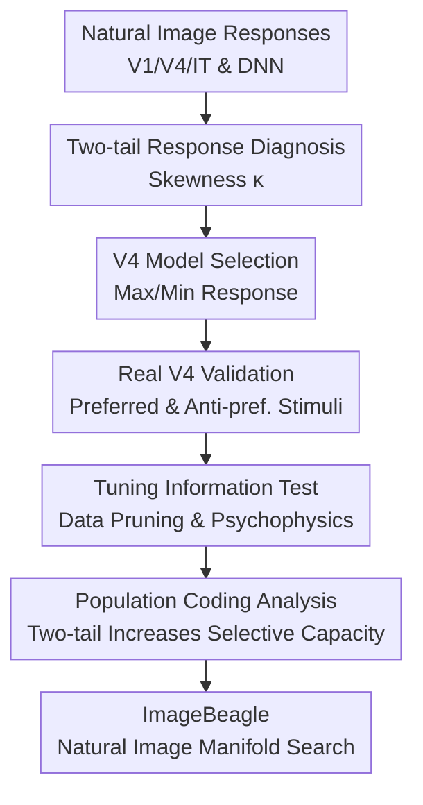

# A tale of two tails: Preferred and anti-preferred natural stimuli in visual cortex

**Conference**: ICLR 2026  
**OpenReview**: [https://openreview.net/forum?id=RZ8esDBqMJ](https://openreview.net/forum?id=RZ8esDBqMJ)  
**Code**: https://github.com/cowleygroup/Gondur_et_al_2026.git; ImageBeagle: https://github.com/cowleygroup/ImageBeagle.git  
**Area**: Computational Neuroscience / Visual Cortex  
**Keywords**: V4 Visual Cortex, Anti-preferred Stimuli, Neural Tuning, Two-tailed Response Distribution, ImageBeagle  

## TL;DR
This paper discovers that primate visual cortex V4 neurons do not just possess a "preferred stimulus" end; instead, they simultaneously exhibit preferred images that enhance firing and anti-preferred images that suppress baseline firing. Through electrophysiological validation, encoding models, psychophysical experiments, and the ImageBeagle search tool, the authors demonstrate that anti-preferred stimuli are an indispensable half for understanding V4 tuning.

## Background & Motivation
**Background**: Visual neuroscience has long centered on understanding neural selectivity by identifying "what stimuli a neuron likes." From Hubel and Wiesel's orientation selectivity in V1 to higher-order visual cortex sensitivity to faces, shapes, textures, or object categories, the mainstream narrative has been searching for the preferred stimulus that maximizes neural response. Visual DNNs in machine learning inherited this picture: convolutional filters plus ReLU form sparse activations, where deep units typically respond strongly only to a few images.

**Limitations of Prior Work**: This narrative implicitly assumes that the response distribution of neurons is "one-tailed": a few images trigger high responses, while most images are merely low-response or nearly silent "background." The problem is that this assumption easily lumps all low-response images into "uninformative background," thereby overlooking natural images that actively suppress neural firing below baseline. For intermediate-to-high-level visual areas like V4, the stimulus space is high-dimensional natural imagery rather than simple parameters like orientation or color. Whether anti-preferred stimuli truly exist, carry interpretable features, or affect downstream readout has not been systematically answered.

**Key Challenge**: If V4 neurons truly encode only one preferred end like ReLU units, searching for maximum response images would suffice to characterize tuning. However, if they possess a dynamic range on both positive and negative sides around the baseline, then minimum response images are not "non-responsive" but represent another class of readable features. This contradiction directly impacts how the visual cortex is modeled and how DNN representations align with biological neural representations.

**Goal**: The authors address four progressive questions: First, do real neurons in V4 and other visual areas exhibit a two-tailed response distribution? Second, can model-predicted anti-preferred natural images be causally validated in real macaque V4 recordings? Third, do anti-preferred images truly help estimate neural tuning for other natural images? Fourth, what computational value do anti-preferred features provide for population coding and efficient stimulus search?

**Key Insight**: The paper starts from a counter-intuitive observation: the response distribution of real V4 neurons to natural images is not strongly right-skewed like the deep ReLU units of ResNet50, but closer to a distribution with extrema at both ends. Instead of stopping at statistical description, the authors treat "anti-preferred" as an experimentally testable stimulus category, using data-driven V4 models to select minimum-response natural images and validating in real electrophysiological recordings whether these suppressed firing.

**Core Idea**: Reframing V4 tuning from a one-tailed problem of "searching only for maximum response features" to a two-tailed problem of "simultaneously searching for extrema at both ends that enhance or suppress baseline responses."

## Method

### Overall Architecture
This paper establishes a computational neuroscience experimental pipeline: identifying the two-tail phenomenon via response distribution skewness, selecting preferred and anti-preferred images from large-scale natural image databases using data-driven V4 models, and validating the functional significance of anti-preferred stimuli through real V4 recordings, teacher-student tuning estimation, human psychophysics, and population readout analysis. Finally, the authors develop ImageBeagle to enable efficient "hunting" for target stimuli in 10-million-scale natural image libraries.

The key to the process is transforming "anti-preferred" from a statistical tail into an actionable object. The paper first quantifies the response distribution skewness $\kappa$ for each neuron or DNN unit. Then, compact V4 model neurons are used to pick samples with the highest and lowest predicted responses across 500,000 to 30 million natural images. These samples are subsequently tested in experiments and behaviors.

### Key Designs
**1. Two-tail Response Diagnosis: Splitting "Low-response Background" into a True Anti-preferred Tail**

The authors quantify the response distribution of each unit to natural images using skewness $\kappa$. ReLU-style one-tailed units have many near-zero responses and few maximal responses, leading to strong right-skewness ($\kappa \approx 2$ or greater). If neurons have both high-response images and images below baseline, the distribution is closer to two-tailed ($\kappa \approx 0$). Comparing this across V4 data, public V1/V4/IT data, and DNN layers, the authors found V4 median $\kappa=0.87$ (or $0.41$ in another dataset), while ResNet50 mid-layer post-ReLU units median was $\approx 2.06$, reaching $4.43$ in deep layers.

**2. Model Selection and Closed-loop Validation: Finding Tails via Models and Verifying in Neurons**

To rule out that the low-response tail is just noise or passive silence from blank images, the authors utilized data-driven compact V4 models (response predictors for each real V4 neuron). For each V4 model neuron, approximately 500,000 natural images were input to identify the 10 highest (preferred) and 10 lowest (anti-preferred) predicted response images. These were then presented to macaques in fixation tasks. Experimental results showed that anti-preferred images fell into the bottom response quantile (median $q=0.055$) and actively suppressed firing below the gray-screen baseline.

**3. Tuning Information Test: Training with Both Ends to Test Generalization**

The authors investigated whether anti-preferred stimuli contain generalizable tuning information using a teacher-student framework. Five-layer CNN students were trained to estimate tuning using different datasets: preferred images only, anti-preferred only, both ends, random images, or non-preferred (median-response) images. Evaluations were performed on held-out random natural images using $R^2$. Results showed that using both ends outperformed random selection when training samples were $< 5000$, whereas using either end alone was inferior to random.

**4. ImageBeagle and Capacity Analysis: Two-tailed Tuning as a Resource used in Population Coding**

The individual V4 model's preferred and anti-preferred images differed significantly. Analysis suggested that the V4 population independently samples positive and negative features from the visual distribution. To test the "selective capacity" hypothesis, an adapter DNN performed Caltech-101 object recognition using V4 model neuron responses. The original two-tailed responses outperformed preferred-only units; matching the same accuracy required $2.5\times$ as many preferred-only model neurons. ImageBeagle was introduced to solve the search problem, using a ResNet50 feature-based neighbor graph to efficiently find extrema on the natural image manifold within ~10,000 evaluations.

### Mechanism
Suppose a researcher seeks to understand what a V4 model neuron "hates." Traditionally, one might only look at the top 10 images. In this work's pipeline, 500,000 images are processed to extract the top 10 and bottom 10. If the bottom 10 images—visually rich natural scenes—suppress real V4 firing below baseline (verified via PSTH against gray screen), they are identified as anti-preferred features. If training a student model with "top + bottom" predicts held-out random image responses better than "top only," the bottom tail is confirmed as an integral part of the neuron's tuning function.

### Loss & Training
The study does not propose a single new end-to-end loss but involves training in three areas. First, V4 model neurons were distilled from multi-session V4 image-response pairs. Second, for response prediction, the authors compared linear mapping with LRL (Linear-ReLU-Linear) mapping, which uses $1\times1$ convolution, LayerNorm, and ReLU before a final linear map to handle DNN units' mismatch with V4 preferred/anti-preferred ends. Third, student CNNs (5 layers, 100 filters each) were trained via Adam ($10^{-4}$ learning rate) using various data pruning strategies to assess tuning estimation accuracy.

## Key Experimental Results

### Main Results
| Question | Data / Setting | Key Metric | Finding | Note |
|:---|:---|:---|:---|:---|
| Is V4 two-tailed? | Author's V4 data, $n=219$ | Skewness $\kappa$ | V4 median $\kappa=0.87$ | Significantly lower than post-ReLU ResNet50 ($\kappa=2.06$) |
| Other visual areas? | Public V1/V4/IT data | Skewness $\kappa$ | V1: $1.17$, V4: $0.41$, IT: $0.69$ | Biological hierarchy is more two-tailed than deep DNNs |
| DNN depth trend | ResNet50 early/mid/late | Skewness $\kappa$ | early: $0.99$, late: $4.43$ | Gets more one-tailed with depth, opposite of biology |
| Validation of anti-pref. | 500k image top/bottom | Quantile $q$ | pref. $q=0.985$, anti-pref. $q=0.055$ | Model-selected images suppress real V4 firing |
| Human interpretability | Psychophysics task | Mean accuracy | Pref.+Anti-pref. $\approx 80.5\%$ | Humans use both ends to understand V4 tuning |
| Population capacity | Caltech-101 adapter | Neuron ratio | Preferred-only needs $2.5\times$ | Two-tailed responses increase selective capacity |

### Ablation Study
| Configuration | Key Metric | Description |
|:---|:---|:---|
| Pre-ReLU Linear Mapping | Lower V4 prediction than post-ReLU | Pre-ReLU is two-tailed, but its negative features may not align with V4 |
| Post-ReLU Linear Mapping | Better for conventional methods | Single-tailed feature banks can be linearly combined to fit two-tailed V4 |
| LRL Mapping | Significantly better than linear | ReLU within mapping makes it robust to distribution mismatches |
| Preferred-only Tuning | Lower $R^2$ than both-ends | Single-end samples overfit to differences among strong responses |
| Both-ends Training | Best in small sample regime | Two ends provide the necessary global boundaries for the tuning function |
| ImageBeagle vs Random | $\approx 10$k eval to 30M peak | Manifold hill-climbing on neighbor graphs outperforms random search |

### Key Findings
- V4 anti-preferred stimuli are visually concrete natural images that actively suppress firing below baseline, rather than just "blank" or low-contrast images.
- The difference between V4 and DNNs is not a simple pre-ReLU vs. post-ReLU distinction; pre-ReLU negative features do not necessarily align with V4 anti-preferred features.
- Tuning estimation requires both tails; neither preferred-only nor anti-preferred-only provides a complete tuning constraint.
- Humans leverage both preferred and anti-preferred reference images to predict V4 model responses, while anti-preferred images are less helpful for ResNet50 units.
- The V4 population likely performs independent sampling of positive and negative features, allowing the same number of neurons to provide a richer readout basis for downstream areas.

## Highlights & Insights
- The most impactful highlight is elevating "anti-preferred stimulus" from a mere valley in traditional tuning curves to a complete research object in high-dimensional natural image space.
- The paper is cautious about the V4-DNN comparison: the fact that post-ReLU DNNs predict V4 well does not mean ReLU is biologically realistic; it may just mean that many one-tailed features can be linearly combined to fit two-tailed neural responses.
- Data pruning experiments clarify that training only on max responses leads to overfitting internal class variations, while excluding the anti-preferred tail misses half of the tuning boundary.
- ImageBeagle emphasizes finding extrema on the natural image manifold rather than relying on synthetic images, which are more interpretable and more likely to maintain validity in real neurons.

## Limitations & Future Work
- The real V4 recording scale ($n=219$) is small relative to the whole area; stability of anti-preferred features across layers and tasks needs larger-scale validation.
- While MUA vs. SUA issues were discussed in the appendix, the ideal evidence remains large-scale, stable single-unit recordings.
- V4 model neurons serve as surrogates; if the models themselves are deficient in fitting the anti-preferred tail, certain capacity conclusions might be biased.
- The use of 34 visual statistics and CLIP embeddings is a limited perspective; more complex visual semantics or neural population structures might exist.
- Future work should search for anti-preferred stimuli systematically across the visual hierarchy (V1, V2, V4, IT) to determine if these features arise through inhibitory circuits or population normalization.

## Related Work & Insights
- **vs. Classic LN Models**: LN models view neurons as single filters; this work demonstrates V4 units act as bi-directional drivers with dynamic baselines.
- **vs. Preferred-stimulus Optimization**: Extends the optimization logic from "max-activation" (Ponce et al.) to "min-activation" natural stimuli.
- **vs. Brain-Score Alignment**: Notes that high prediction scores don't guarantee internal mechanism alignment (two-tail vs. one-tail mismatch).
- **vs. Explainable AI**: Natural exemplars are more interpretable for humans in V4 than in deep DNN units when it comes to the anti-preferred end.

<!-- RELATED:START -->

## Related Papers

- [\[ICLR 2026\] Uncovering Semantic Selectivity of Latent Groups in Higher Visual Cortex with Mutual Information-Guided Diffusion](uncovering_semantic_selectivity_of_latent_groups_in_higher_visual_cortex_with_mu.md)
- [\[NeurIPS 2025\] MEIcoder: Decoding Visual Stimuli from Neural Activity by Leveraging Most Exciting Inputs](../../NeurIPS2025/computational_biology/meicoder_decoding_visual_stimuli_from_neural_activity_by_leveraging_most_excitin.md)
- [\[ICLR 2026\] Learning Brain Representation with Hierarchical Visual Embeddings](learning_brain_representation_with_hierarchical_visual_embeddings.md)
- [\[ICLR 2026\] Model-Guided Microstimulation Steers Primate Visual Behavior](model-guided_microstimulation_steers_primate_visual_behavior.md)
- [\[ICLR 2026\] MindPilot: Closed-loop Visual Stimulation Optimization for Brain Modulation with EEG-guided Diffusion](mindpilot_closed-loop_visual_stimulation_optimization_for_brain_modulation_with_.md)

<!-- RELATED:END -->
