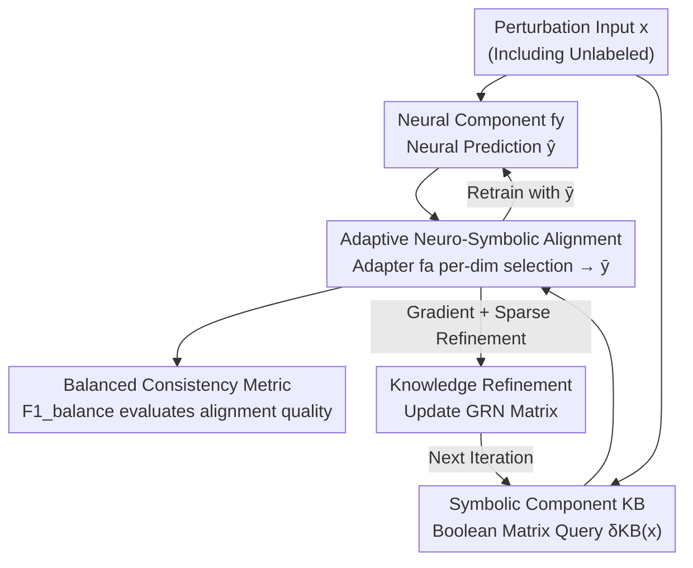

# Adaptive Data-Knowledge Alignment in Genetic Perturbation Prediction

**Conference**: ICLR2026  
**OpenReview**: [https://openreview.net/forum?id=CxLaZWbUjc](https://openreview.net/forum?id=CxLaZWbUjc)  
**Code**: TBD  
**Area**: Computational Biology / Neuro-symbolic Learning / Interpretable Machine Learning  
**Keywords**: Genetic Perturbation Prediction, Abductive Learning, Neuro-symbolic Alignment, Gene Regulatory Networks, Knowledge Refinement

## TL;DR
ALIGNED integrates data-driven neural networks with expert-curated gene regulatory knowledge within an Abductive Learning (ABL) framework. It utilizes a gradient-free adapter to decide whether to trust data or knowledge on a per-gene basis and subsequently refines the regulatory knowledge base using predictions. It achieves the highest "Balanced Consistency" across several large-scale perturbation datasets and re-discovers biologically meaningful regulatory relationships.

## Background & Motivation
**Background**: Predicting "how the genome-wide transcriptome changes after knocking out or overexpressing a specific gene" is a core task in understanding cellular systems and drug discovery. Current mainstream approaches take two paths: one is purely data-driven, training large-scale models (e.g., scGPT, scFoundation) on massive single-cell data to learn latent representations; the other is a hybrid approach, incorporating prior gene regulatory knowledge (e.g., GEARS using GO graphs) as an inductive bias.

**Limitations of Prior Work**: Pure data-driven models are black boxes, offering no explanation for "why a gene is predicted to be up-regulated" or which regulatory relationship is at play. While hybrid methods utilize knowledge, they treat it as a **static constraint**, meaning knowledge only assists prediction unidirectionally without being corrected or updated by the data. Neither path provides an interpretable and evolving understanding of biological mechanisms.

**Key Challenge**: To achieve end-to-end bidirectional "Data ↔ Knowledge" integration, the primary obstacle is the inherent inconsistency between the two. The paper observes that in common knowledge bases (OmniPath, GO, EcoCyc) and datasets (Norman, Precise1k), **42%–71% of regulatory relationships in the data are absent from knowledge bases**, and at least **14% directly conflict** with knowledge base annotations. Furthermore, knowledge bases may be outdated or biased toward well-studied pathways. Naively merging these two noisy sources causes errors to **propagate bidirectionally**, compromising both neural learning and knowledge refinement.

**Goal**: Given systematic inconsistencies, the objective is to achieve high prediction accuracy while grounding predictions in interpretable biological priors and enabling reverse refinement of the knowledge base. This requires an adaptive mechanism to "judge per-gene whether to trust data or knowledge" and a metric to evaluate the balance between both.

**Key Insight**: The authors adopt the **Abductive Learning (ABL)** paradigm proposed by Zhi-Hua Zhou, which was designed to align neural predictions with symbolic knowledge bases through consistency optimization when they disagree. By encoding Gene Regulatory Networks (GRNs) into Boolean matrices for symbolic reasoning, the neural network and symbolic components each produce a prediction, which an adapter then reconciles.

**Core Idea**: A **gradient-free trained adapter** performs a binary selection between neural and symbolic predictions per output dimension (per gene) to form a neuro-symbolic fusion prediction. This fusion prediction is then used for **reverse, sparse refinement of the knowledge base**, allowing data and knowledge to mutually correct each other through iterations.

## Method

### Overall Architecture
ALIGNED formalizes the problem as a **ternary classification**: learning a function $f:\{-1,0,1\}^n \to \{-1,0,1\}^n$, where the input represents the perturbation state of each gene ($-1$ knockout / $0$ no perturbation / $1$ overexpression) and the output is the direction of change in gene expression (down-regulated / unchanged / up-regulated).

The framework consists of three components: the **Neural Component** $f_y$ is a neural network (MLP or GNN with KB embedding) that directly predicts responses from input; the **Symbolic Component** KB compiles GRN activation ($+$) and inhibition ($-$) relationships into $n\times n$ Boolean adjacency matrices $\langle R^{(k)}_+, R^{(k)}_-\rangle$, performing efficient deductive queries via matrix operations $\delta_{KB}(x)=(R^{(k)}_+-R^{(k)}_-)^\top x$ (where $k$ controls the path length of indirect regulation); the **Adapter** $f_a$ learns to fuse the two based on reliability.

The workflow is as follows: Jointly initialize $f_y$ and $f_a$ on labeled data. For every input (including unlabeled ones), both neural and symbolic components generate predictions. In the **Adaptive Alignment** phase, the adapter outputs a binary indicator vector $a$ to select the source per dimension, resulting in the fusion prediction $\bar y$. This is followed by **Bidirectional Updates**: retraining the neural component using $\bar y$ and **refining** the symbolic GRN. This alignment and refinement cycle can be iterated (denoted as A, R, A-R, A-R-A...). Three elements persist throughout: an evaluation metric, an alignment mechanism, and a refinement mechanism.

### Key Designs

**1. Balanced Consistency Metric: Accounting for both Data and Knowledge**

Traditional metrics only consider prediction accuracy (data consistency), ignoring whether predictions violate biological priors. Thus, black-box models may fit noise to achieve high scores without explaining mechanisms. ALIGNED defines **Balanced Consistency** $F1_{balance}$, which combines the "macro-F1 against test data" and the "macro-F1 against symbolic deduction $\delta_{KB}(x)$" using a generalized mean with $\gamma>1$:

$$F1_{balance}(f(x),x,y,KB)=\left(\tfrac{1}{2}F1(y,f(x))^{-\gamma}+\tfrac{1}{2}F1(\delta_{KB}(x),f(x))^{-\gamma}\right)^{-1/\gamma}$$

The $\gamma>1$ setting causes the mean to **penalize the weakest score**—if either F1 is too low, the overall score is significantly reduced. This forces the model to neither fit data at the expense of knowledge nor stick to knowledge at the expense of accuracy. This serves as the primary metric for all experiments. The data-knowledge inconsistency $Inc(D_l,KB)=\sum_{x,y}\|\delta_{KB}(x)-y\|_0$ quantifies the conflicts shown in Figure 1, distinguishing itself from local Known Relationships Retrieval by respecting the entire GRN structure and transitivity.

**2. Adaptive Neuro-Symbolic Alignment: Gradient-Free Selection per Gene**

This addresses the core "who to trust" question per gene. The adapter outputs a binary vector $a=f_a(x)$, where the fusion prediction is $\bar y_i=\hat y_i$ (if $a_i=0$, trust neural) or $\bar y_i=\delta_{KB}(x)_i$ (if $a_i=1$, trust symbolic). The adapter's objective $L_a$ consists of three terms: ① **Inconsistency term** $Inc(a,x,\hat y,KB)=\|\delta_{KB}(x)-\bar y\|_0$, encouraging fusion results not to conflict with the knowledge base; ② **Knowledge usage limit** $L_{len}(a)=\max\{\|a\|_0-\theta,0\}$, which prevents over-reliance on the symbolic side; ③ **Weighted representation** $L_{weight}(a)=w^\top(1-a)+(1-w)^\top a$, where $w$ combines the "count of samples where the gene conflicts with KB" and "GO annotation volume"—genes better characterized in the KB (higher $w_i$) tend toward symbolic prediction, while others (knowledge-sparse or high-conflict) lean toward neural. The total loss is $L_a=Inc+C_l L_{len}+C_w L_{weight}$ (Eq. 4).

The difficulty lies in minimizing $L_a$ while querying discrete symbolic structures, which is a **combinatorial optimization** problem. The authors use **REINFORCE** to train $f_a$ and initialize the sampling distribution with $w$ to reduce complexity; $f_a$ shares input and embedding layers with $f_y$. The overall objective $\min_{f_y,f_a} L$ (Eq. 5) = cross-entropy on labeled data + $L_a(a,x,\hat y)\log f_a(x)$ on all data (policy-gradient form, $L_a$ does not backpropagate gradients).

**3. Gradient-based Sparse Knowledge Refinement: Minimal Changes via Prediction**

Steps 1 and 2 ground prediction in knowledge; this step reverses the direction—using reliable neuro-symbolic predictions to **update the GRN**, filling gaps and correcting errors. The hurdle is that Boolean logic (Eq. 1) is non-differentiable. The authors introduce an approximation function $\varepsilon_t(X)_{i,j}=1-\exp(-tX_{i,j})$ (where $X_{i,j}\ge0$) to relax Boolean elements into reals, enabling gradient-based optimization. The refinement goal (Eq. 6) fits the relaxed GRN to the neuro-symbolic prediction $\langle X_u,\bar Y\rangle$ with an **$l_1$ sparse regularization**:

$$\min_{\bar R^{(0)}_+,\bar R^{(0)}_-}\sum_{x,y}\big\|\varepsilon_{t_k}(\bar R^{(k)}_+-\bar R^{(k)}_-)^\top x-y\big\|_2^2+\lambda\big(\|\varepsilon_{t_0}(\bar R^{(0)}_+)-R^{(0)}_+\|_1+\|\varepsilon_{t_0}(\bar R^{(0)}_-)-R^{(0)}_-\|_1\big)$$

Solved via proximal gradient descent, the $l_1$ term applies a "**minimal modification**" inductive bias: regulatory relationships are altered only with sufficient evidence, preventing noise or shortcut patterns in the data from corrupting the meaningful biological structure of the GRN. This proves superior to non-sparse baselines using Frobenius norms.

### Loss & Training
Training utilizes both labeled data $D_l$ and unlabeled data $D_u$: Jointly initialize $f_y,f_a$ on $D_l$. In the alignment phase, jointly optimize $f_y,f_a$ using REINFORCE per Eq. 5 ($L_a$ doesn't pass gradients). In the refinement phase, update the GRN matrix using proximal gradient descent per Eq. 6. Alignment (A) and Refinement (R) alternate until convergence or a limit $T$. Progressive configurations (A, A-R, A-R-A-R) were evaluated.

## Key Experimental Results

### Main Results
On three large-scale perturbation datasets (Norman Human K562, Dixit Mouse BDMC, Adamson Human K562), ALIGNED was compared with SOTA models like GEARS, scGPT, scFoundation, State, and Linear. For fairness, **knowledge refinement was disabled** in this set to focus on alignment.

| Dataset | Metric | ALIGNED | Prev. SOTA | Conclusion |
|---------|--------|---------|------------|------------|
| Norman / Dixit / Adamson | Knowledge Consistency | Significantly Highest | Low | Large Gain |
| Same as above | Data Consistency | Slightly Higher | Comparable | No loss in accuracy |
| Same as above | Balanced Consistency | Highest | Low | Optimal overall |

Progressive iteration results on the E. coli genome (EcoCyc KB, 315 regulators / 3004 targets) (Table 1, GNN version):

| Configuration | Data Consistency | Knowledge Consistency | Balanced Consistency |
|---------------|------------------|-----------------------|----------------------|
| GNN only | 0.3773 | 0.3605 | 0.3689 |
| A (Alignment only) | 0.3876 | 0.3714 | 0.3800 |
| A-R | 0.3876 | 0.4520 | 0.4130 |
| A-R-A-R | 0.3878 | 0.5348 | 0.4288 |

Each round of "Alignment + Refinement" continuously boosted knowledge consistency (0.36→0.45→0.53) without degrading data consistency, leading to steady gains in balanced consistency.

### Ablation Study

| Config | Impact | Mechanism |
|--------|--------|-----------|
| GNN only → A | Knowledge Consistency ↑ | Adapter effectively assimilates symbolic info |
| A → A-R | Large Knowledge Consistency ↑ | Symbolic refinement provides extra boost; accuracy remains stable |
| Random GRN as KB | Degenerates to pure neural | The adapter defaults to the neural side absent meaningful priors |
| Remove $Inc$ term | Weaker knowledge alignment | This term is the primary driver for aligning with knowledge |
| Remove $L_{len}$ limit | Over-reliance on symbolic | Usage limit prevents knowledge misuse |
| Random weight $w$ | Worse balance | $w$ helps balance accuracy vs. knowledge usage volume |

Regarding robustness of refinement (synthetic data with noise-injected GRN): F1 for rebuilding interactions remains $>0.7$ even at **40% noise**. Within **20% noise**, the reconstructed GRN topology (modularity, assortativity) remains close to the original. Enrichment scores on most KEGG pathways showed no significant change after refinement, indicating re-discovery of biologically meaningful relationships across databases.

### Key Findings
- The combination of "Alignment + Refinement" provides the greatest contribution: alignment alone raises knowledge consistency, while refinement adds a significant layer, **always without sacrificing data consistency**—exactly as intended by the $F1_{balance}$ design.
- The weighting vector $w$ is the critical signal for the adapter's per-gene decision: trust symbolic for well-characterized genes and neural for sparse/conflicting ones.
- Sparse refinement recovers GRNs under high noise thanks to the "minimal change" bias of $l_1$; non-sparse baselines are significantly more fragile.

## Highlights & Insights
- **Metric as Method**: $F1_{balance}$ uses the generalized mean ($\gamma>1$) to explicitly penalize weaknesses, baking the "accuracy + grounding" requirement into optimization and evaluation. This "penalize the weakest" approach is transferable to any multi-objective scenario where no goal can be sacrificed.
- **Bidirectional Knowledge Utilization**: Unlike previous hybrid methods that treat knowledge as static, Ours allows data to refine knowledge with a "minimal change" $l_1$ constraint. This preserves structure while allowing biological understanding to "evolve."
- **REINFORCE + Differentiable Relaxation**: A dual-strategy for non-differentiability—using REINFORCE for discrete symbolic queries and $\varepsilon_t(\cdot)$ for Boolean matrix relaxation. Selecting optimizers based on the nature of the obstacle is a valuable design pattern.

## Limitations & Future Work
- The framework relies on **ternary (-1/0/1) GRN representations**, losing continuous information like regulatory strength and dose effects, which is needed for quantitative dynamics.
- Knowledge refinement validation uses synthetic data (injecting noise into OmniPath), which is a semi-artificial setting; real-world knowledge errors may not follow uniform noise distributions.
- The symbolic side relies on compiling GRNs into Boolean matrices with a fixed $k$ to approximate indirect regulation. There are many hyperparameters ($k$, $\gamma$, $\theta$, $\lambda$), and their tuning/robustness for new species/KBs requires further investigation.
- The convergence and sampling variance of REINFORCE on very large genomes are potential risks; while initial sampling helps, scalability remains a factor.

## Related Work & Insights
- **vs GEARS (GNN hybrid)**: GEARS treats knowledge as a static inductive bias for unidirectional prediction; ALIGNED is **bidirectional**—using knowledge to correct predictions and predictions to refine knowledge, with adaptive selection.
- **vs scGPT / scFoundation (Data-driven foundation models)**: These learn latent representations from massive data but are black boxes; ALIGNED’s symbolic component makes predictions traceable to specific regulatory links, yielding significantly higher Knowledge Consistency.
- **vs Classic Abductive Learning (ABL)**: Standard ABL assumes a relatively reliable KB to correct neural predictions; Ours addresses the reality where **both** are unreliable and conflicting, extending ABL for noisy knowledge scenarios via balanced consistency and weighted adapters.

## Rating
- Novelty: ⭐⭐⭐⭐⭐ Adapting ABL to genetic perturbation with bidirectional refinement is highly novel.
- Experimental Thoroughness: ⭐⭐⭐⭐ Coverage of Human/Mouse/Bacteria + synthetic robustness + ablation, though refinement validation is synthetic-heavy.
- Writing Quality: ⭐⭐⭐⭐ Logical clarity, complete equations, but high density of symbols/figures requires careful reading.
- Value: ⭐⭐⭐⭐⭐ Provides a framework for "interpretable and evolvable biological mechanism understanding," significant for drug discovery.

<!-- RELATED:START -->

## Related Papers

- [\[ACL 2026\] AROMA: Augmented Reasoning Over a Multimodal Architecture for Virtual Cell Genetic Perturbation Modeling](../../ACL2026/computational_biology/aroma_augmented_reasoning_over_a_multimodal_architecture_for_virtual_cell_geneti.md)
- [\[ICLR 2026\] Towards Knowledge-and-Data-Driven Organic Reaction Prediction: RAG-Enhanced and Reasoning-Powered Hybrid System with LLMs](towards_knowledgeanddatadriven_organic_reaction_prediction_ragenhanced_and_reaso.md)
- [\[ICLR 2026\] scDFM: Distributional Flow Matching for Robust Single-Cell Perturbation Prediction](scdfm_distributional_flow_matching_model_for_robust_single-cell_perturbation_pre.md)
- [\[ICML 2026\] What Makes a Representation Good for Single-Cell Perturbation Prediction?](../../ICML2026/computational_biology/what_makes_a_representation_good_for_single-cell_perturbation_prediction.md)
- [\[AAAI 2026\] Dual-Path Knowledge-Augmented Contrastive Alignment Network for Spatially Resolved Transcriptomics](../../AAAI2026/computational_biology/dual-path_knowledge-augmented_contrastive_alignment_network_for_spatially_resolv.md)

<!-- RELATED:END -->
