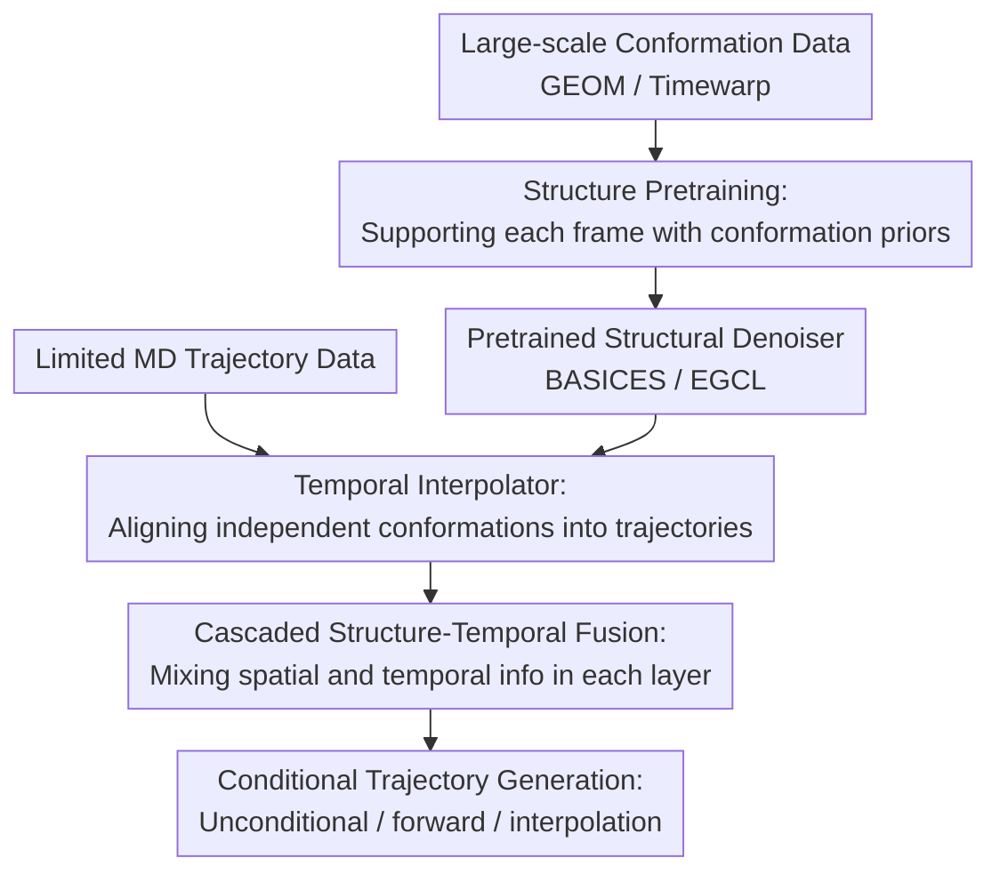

# Align Your Structures: Generating Trajectories with Structure Pretraining for Molecular Dynamics

**Conference**: ICLR 2026  
**OpenReview**: [https://openreview.net/forum?id=OKQYMeWlGa](https://openreview.net/forum?id=OKQYMeWlGa)  
**Code**: https://github.com/ani11452/Align_Your_Structures  
**Area**: Computational Biology / Molecular Dynamics  
**Keywords**: Molecular Dynamics Generation, Structure Pretraining, Equivariant Diffusion Model, Temporal Interpolator, Conformation Generation

## TL;DR
This paper proposes EGINTERPOLATOR: it first trains an equivariant diffusion structure model on large-scale static molecular conformation data, and then learns inter-frame correlations on a small amount of MD trajectories using a temporal interpolator, generating trajectories for small molecules, drug molecules, tetrapeptides, and protein monomers that more closely resemble real molecular dynamics.

## Background & Motivation
**Background**: Molecular Dynamics (MD) approximates atomic motion over time using numerical integration and is a core tool in drug discovery, materials science, and biophysics. While traditional MD offers clear physical interpretability, it requires very small time steps over long durations, leading to high computational costs, especially for explicit solvent and macromolecular systems. Recently, geometric diffusion models, equivariant graph networks, and trajectory generation models have emerged as learned alternatives or accelerators for MD, aiming to learn trajectory distributions directly from data.

**Limitations of Prior Work**: High-quality MD data covering a wide range of molecular types is difficult to obtain. Existing generative MD models are often trained on a few molecules or limited molecular families, making them prone to memorizing the trajectory statistics of specific systems rather than learning dynamical laws transferable to arbitrary molecules. Furthermore, an MD trajectory is not a single static frame but a spatio-temporal object of $T \times N \times 3$: each frame must be a reasonable conformation, and there must be realistic temporal correlation between frames.

**Key Challenge**: Static conformation data is relatively abundant and informs the model about "what a molecule might look like in 3D space"; however, MD trajectory data is expensive and contains information on "how these structures evolve continuously over time." If a model attempts to learn the full joint distribution $p_{md}(x^{[T]})$ directly from a small amount of MD data, it must simultaneously learn structural common sense and temporal dependencies, magnifying both optimization difficulty and data requirements.

**Goal**: The authors aim to decompose MD trajectory generation into two more manageable problems: first, learning a structural prior for each frame from large-scale conformation data; second, focusing on adding inter-frame correlations using limited MD data. This goal covers three tasks: unconditional trajectory generation, forward simulation given an initial frame, and interpolation/transition path sampling given start and end frames.

**Key Insight**: The paper draws inspiration from extending "image models to video models": static structures are analogous to images, while MD trajectories are analogous to videos. Instead of training a trajectory diffusion model from scratch to handle both space and time, it is better to first train a strong structure model and then overlay temporal layers, allowing the temporal module to align independent conformations into dynamic trajectories.

**Core Idea**: Use large-scale conformation pretraining to provide the chemical plausibility of each frame, and then use an equivariant temporal interpolator to continuously push the "frame-independent structural distribution" toward the "frame-correlated MD distribution."

## Method
### Overall Architecture
The input to EGINTERPOLATOR is a molecular graph $(h, E)$ and a target atomic coordinate trajectory $x^{[T]} \in \mathbb{R}^{T \times N \times 3}$, and the output is an MD trajectory that satisfies molecular structural constraints and temporal correlations. The process consists of two stages: first, training the BASICES structural diffusion model on conformation data such as GEOM-QM9 / GEOM-Drugs; second, freezing or largely preserving this structural model while training an additional temporal interpolator on limited MD trajectories.

In the first stage, only single-frame conformations are considered to learn $p_{cf}(x)$. In the second stage, each time frame is fed into the same structural denoiser to obtain a set of frame-level structural denoising predictions. A temporal network then models temporal consistency between these predictions and the noisy trajectories. In this way, the model does not fit $p_{md}(x^{[T]})$ from random initialization but starts from a frame-independent distribution $\hat{p}_{md}(x^{[T]})=\prod_{t=0}^{T-1}p_{cf}(x^{(t)})$ and gradually adds the temporal coupling found in MD.

The three contribution nodes in the figure correspond to the following three key designs: Structure Pretraining handles single-frame chemical plausibility under data scarcity; the Temporal Interpolator turns independent frames into trajectories with dynamical correlation; and Cascaded Structure-Temporal Fusion extends this mixture from the output layer into the network blocks, allowing for denser interaction between spatial and temporal information. Forward simulation and interpolation are conditional applications of the same generator rather than separate methods.

### Key Designs
**1. Structure Pretraining: Supporting each frame with conformation priors**

Each frame in an MD trajectory must first be a reasonable molecular conformation; otherwise, the "time series" has no physical meaning. The paper first trains a geometric diffusion conformation model $\epsilon^{cf}_{\theta}$, using Equivariant Graph Convolutional Layers (EGCL) to predict diffusion noise on single-frame molecular graphs. The conformation training objective is the standard DDPM noise regression: given a noisy conformation $x_{\tau}=\sqrt{\bar{\alpha}_{\tau}}x_0+\sqrt{1-\bar{\alpha}_{\tau}}\epsilon$, the model minimizes $\|\epsilon-\epsilon_{\theta}(x_{\tau},\tau)\|_2^2$.

The value of this pretraining stage is not just "using more data." It embeds hard constraints like bond lengths, bond angles, chirality, and ring structures from 3D chemistry into the model beforehand, so that subsequent MD training does not have to rediscover these static laws from limited trajectories. The authors denote the frame-independent trajectory distribution induced by the structural model as $\hat{p}_{md}(x^{[T]})=\prod_t p^{cf}_{\theta}(x^{(t)})$: it is not yet MD because it lacks temporal correlation, but it serves as a structural anchor much closer to the target than pure Gaussian noise.

**2. Temporal Interpolator: Aligning independent conformations into trajectories**

If the pretrained structural model were simply applied to each frame independently, the result would be like a video of randomly ordered reasonable conformations: each frame looks correct, but they jump erratically over time. The core module of the paper is the temporal interpolator, which blends the structural model output $\hat{\epsilon}^{md}=[\epsilon^{cf}_{\theta}(x^{(t)}_{\tau},\tau)]_{t=0}^{T-1}$ with the temporal network output for the final trajectory denoising prediction:

$$
\epsilon^{md}_{\theta,\phi}(x^{[T]}_{\tau},\tau)=\alpha\hat{\epsilon}^{md}+(1-\alpha)\epsilon^{tp}_{\phi}(x^{[T]}_{\tau},\hat{\epsilon}^{md},\tau)
$$

Here, $\epsilon^{tp}_{\phi}$ is parameterized by an equivariant temporal attention network $s^{tp}_{\phi}$ and explicitly receives the structural model's predictions as input rather than just seeing the raw noisy trajectories. Intuitively, the temporal network does not determine "how to denoise this entire trajectory" from scratch; instead, it learns "which frames should move together and which transition paths should be smoother" based on the denoising directions already provided by the structural model. The paper also provides a theoretical explanation: the interpolation rule allows the temporal network to implicitly learn an intermediate distribution $\tilde{p}_{md}(x^{[T]}) \propto p_{md}(x^{[T]})^{\beta}\hat{p}_{md}(x^{[T]})^{1-\beta}$, where $\beta=1/(1-\alpha)$. This transforms the difficult problem of fitting the joint MD distribution into a transition from a frame-independent structural distribution to the true MD distribution.

**3. Cascaded Structure-Temporal Fusion: Mixing spatial and temporal information in each layer**

While simply stacking a temporal module after the structural model is possible, the paper finds this information flow to be too coarse. The CASC version pushes the interpolation operation down into each network block: a temporal block is initialized alongside each pretrained EGCL spatial layer. The temporal block consists of ETLayer + EGCL + ETLayer and introduces learnable mixing coefficients $\alpha^{(l)}$ between the spatial output, temporal attention output, and coordinate/invariant feature updates.

This design offers two benefits. First, early layers can rely more on pretrained structural information to prevent trajectory training from destroying basic geometry. Later layers can gradually allow the temporal module to dominate, learning true dynamical statistics like torsion angle relaxation, slow variable transitions, and metastate occupancy. Second, linear interpolation preserves SE(3) equivariance: if the input is rotated globally, the vector outputs of both the structure and temporal networks rotate accordingly, and the blended denoising direction remains consistent. This is critical for molecular systems, as physical trajectories should not depend on the coordinate system's orientation.

**4. Conditional Trajectory Generation: One diffusion model for three MD tasks**

Instead of designing three separate models for unconditional generation, forward simulation, and interpolation, the paper uses a conditioning mask to control which frames serve as input conditions. In unconditional generation, all frames are denoised; in forward simulation, frame 0 is used as a control signal, and loss is computed only for subsequent frames; in interpolation, both the start and end points are fixed, and only intermediate frames are denoised.

This conditioning approach unifies training and inference. Specifically, in interpolation, the model generates short paths crossing high-potential metastates rather than blindly rolling out ordinary MD. In forward simulation, the model can use block diffusion rollouts to concatenate 1.3 ns segments into 5.2 ns or longer trajectories. The unified interface also allows experiments to verify whether the structural pretraining idea is consistently effective across different tasks.

### Loss & Training
Structure pretraining uses a single-frame diffusion noise prediction loss:

$$
L_{conf}=\mathbb{E}_{x_0\sim D_{conf},\tau,\epsilon}\|\epsilon-\epsilon_{\theta}(x_{\tau},\tau)\|_2^2
$$

The MD fine-tuning stage uses a trajectory-level noise prediction loss:

$$
L_{md}=\mathbb{E}_{x^{[T]}_0\sim D_{md},\tau,\epsilon^{[T]}}\|\epsilon^{[T]}-\epsilon^{md}_{\theta,\phi}(x^{[T]}_{\tau},\tau)\|_2^2
$$

Training utilizes 1000 diffusion steps and a linear noise schedule. In small molecule tasks, the structural model BASICES uses 6 EGCL layers with a hidden dimension of 128; the trajectory model adds temporal attention modules alongside each layer. Trajectory-level Kabsch alignment is also employed, aligning the noisy and clean trajectories in global rotation and translation before recalculating the target noise, preventing the model from misinterpreting coordinate system differences as dynamical signals. For forward simulation and interpolation, conditional frames enter the network via a mask, but the loss is only applied to the frames that need to be generated.

## Key Experimental Results

### Main Results
The paper first evaluates unconditional generation and forward simulation on small molecules. The metric used is Jensen-Shannon Divergence (JSD), where lower values indicate that the generated trajectory's distributions of bond angles, bond lengths, torsion angles, and slow dynamics are closer to real MD. QM9 is used for unconditional generation, and Drugs for forward simulation.

| Dataset / Task | Method | Bond Angle JSD ↓ | Bond Length JSD ↓ | Torsion JSD ↓ | TICA 0,1 JSD ↓ |
|--------|------|------:|------:|------:|------:|
| QM9 / Uncond. | GeoTDM | 0.691 | 0.676 | 0.489 | 0.691 |
| QM9 / Uncond. | EGInterpolator-Simple | 0.357 | 0.263 | 0.381 | 0.652 |
| QM9 / Uncond. | EGInterpolator-CASC | 0.305 | 0.210 | 0.363 | 0.636 |
| Drugs / Forward | GeoTDM | 0.640 | 0.643 | 0.498 | 0.712 |
| Drugs / Forward | EGInterpolator-Simple | 0.208 | 0.258 | 0.385 | 0.660 |
| Drugs / Forward | EGInterpolator-CASC | 0.173 | 0.142 | 0.377 | 0.650 |
| Drugs / Forward | MD Oracle | 0.036 | 0.030 | 0.215 | 0.610 |

These results indicate that structure pretraining is particularly helpful for geometric distributions. For instance, in Drugs forward simulation, the Bond Length JSD for CASC drops from 0.643 (GeoTDM) to 0.142, suggesting that the generated structures deviate much less from real bond length statistics. Torsion and TICA metrics improve synchronously, showing that the model does not just generate "static-looking" molecules but more closely approximates slow dynamics.

Energy analysis further supports this. The paper uses TorchANI2x to estimate the Wasserstein-1 distance of the energy distributions between generated and real trajectories:

| Dataset | EGInterpolator vs GT W1 ↓ | GeoTDM vs GT W1 ↓ | Description |
|--------|------:|------:|------|
| QM9 | 0.8127 | 2.9201 | Ours is closer to real trajectory energy distribution |
| Drugs | 0.7728 | 12.7664 | GeoTDM shows significantly larger energy deviation in drugs |
| Tetrapeptide | 0.3806 | 12.8636 | Energy advantage maintained even when scaling to tetrapeptides |

### Ablation Study
The core ablation compares a Naive version without structure pretraining, a Stack version without interpolation/cascaded structures, and the full model. The table below excerpts key results from Table 2 in the main text.

| Dataset | Configuration | Bond Angle JSD ↓ | Bond Length JSD ↓ | Torsion JSD ↓ | TICA 0,1 JSD ↓ |
|------|------|------:|------:|------:|------:|
| QM9 | EGInterpolator-Naive | 0.538 | 0.583 | 0.441 | 0.680 |
| QM9 | EGInterpolator | 0.305 | 0.210 | 0.363 | 0.636 |
| Drugs | EGInterpolator-Stack | 0.325 | 0.330 | 0.414 | 0.673 |
| Drugs | EGInterpolator-Naive | 0.332 | 0.386 | 0.455 | 0.698 |
| Drugs | EGInterpolator | 0.173 | 0.142 | 0.377 | 0.650 |

The ablation is straightforward: without structure pretraining, the model performs significantly worse on hard geometric constraints like bond lengths and angles. Simply stacking temporal modules without the proposed interpolation/cascaded design also fails to reach the level of the full model. Experiments in the appendix with $\alpha=1$ further demonstrate that independent conformation generation alone cannot learn non-trivial temporal correlations; after shuffling, torsion decorrelation collapses to a baseline of 5.2 ps, while the full model achieves an average torsional decorrelation time of 185.64 ps on Drugs.

### Key Findings
- Structure pretraining primarily improves geometric and energy realism: the improvements in bond length, bond angle, and energy W1 are the most significant, consistent with the design goal of "learning reasonable structures first."
- The temporal interpolator indeed learns non-trivial dynamics: TICA, MSM occupancy, and torsion decorrelation are all closer to reference MD than GeoTDM, rather than just randomly arranging reasonable conformations.
- CASC generally outperforms SIMPLE: mixing spatial/temporal info at each layer provides denser interaction; CASC further reduces JSD in QM9 and Drugs experiments.
- The model tends to generate high-probability valid paths in interpolation tasks: in Drugs transition path sampling, the 0.52 ns generated trajectory achieves the lowest JSD and highest average path probability. While the real MD oracle has a higher valid path rate, the proposed model more effectively focuses on generating high-probability transitions.
- Trends still hold when scaled to tetrapeptides and protein monomers, though MDGen's specialized torsion-angle representation retains an advantage in peptide torsion tasks, suggesting that coordinate-level and torsion-centric models have different applicable regimes.

## Highlights & Insights
- The clearest insight of this paper is decomposing MD trajectory generation into "structural plausibility" and "temporal correlation." This decomposition naturally leverages the fact that conformation data is cheaper than MD trajectories while avoiding the difficulty of a trajectory model learning too much at once from limited data.
- The temporal interpolator is more than just a fine-tuning head; it treats the structural model output as input for the temporal model and blends them with a learnable $\alpha$. This design allows the temporal module to mathematically correspond to an intermediate distribution between $\hat{p}_{md}$ and $p_{md}$, offering much stronger interpretability than simply "stacking a temporal attention layer."
- Maintaining SE(3) equivariance is crucial. For molecular dynamics, global rotation and translation should not change the physical trajectory distribution. Placing both structural and temporal modules within an equivariant framework improves data efficiency and reduces the risk of the model learning coordinate system biases.
- Multi-task unification is elegantly handled. Unconditional generation, forward simulation, and interpolation are all implemented via conditioning masks, suggesting that this framework is a general trajectory diffusion model rather than being over-tuned for a single benchmark.
- Experiments look beyond geometric distributions to include TICA, MSM, torsion decorrelation, energy W1, and long rollout block deterioration. These metrics cover static structure, slow dynamics, and energy plausibility, making them more persuasive than just showing generated molecular diagrams.

## Limitations & Future Work
- Generated trajectories still do not reach the physical precision of a real MD oracle. Particularly in QM9 torsional decorrelation, the generated average is only 13.59 ps compared to 101.0 ps in real MD, indicating that the time scales of fast and slow processes may still be compressed or distorted.
- Error accumulation persists in long-term rollouts. The 16-block analysis in the appendix shows that the model does not suffer from the severe energy breakdown seen in GeoTDM, but W1 error increases in later segments, meaning short-segment diffusion concatenation cannot yet fully replace long-time integration.
- Modeling peptide torsions is not necessarily superior to specialized torsion representations. Compared to MDGen, the proposed model has advantages in bond angle/length and energy distribution but lags in backbone/side-chain torsion JSD, suggesting that macromolecular flexible motion might require stronger internal coordinate or torsion-aware mechanisms.
- Structure pretraining data itself has biases. Conformer sets from GEOM, Timewarp, or those extracted from MDGen/Timewarp do not equal the true Boltzmann distribution, and pretraining priors may carry non-physical sampling preferences into trajectory generation.
- Future work could consider explicitly incorporating force, energy, Boltzmann weighting, or force-field consistency into training or inference. While the paper recognizes the importance of energy metrics, the current approach remains primarily data-driven diffusion loss, leaving room to strengthen physical constraints.

## Related Work & Insights
- **vs GeoTDM**: GeoTDM is a diffusion model directly targeting geometric trajectories, emphasizing equivariant trajectory modeling. In contrast, this paper uses a conformation diffusion model as a structural anchor and then uses a temporal interpolator to learn dynamical correlations. This paper generally outperforms GeoTDM in small molecule and Drugs experiments across bond length, angle, torsion, TICA, and energy distribution.
- **vs Timewarp / EquiJump**: These methods learn temporal propagation in an autoregressive or stochastic interpolant fashion, which often faces error accumulation and inflexible task conditioning. This paper generates entire blocks of trajectories via diffusion, supporting unconditional, forward, and interpolation tasks, although error accumulation in long rollouts remains a shared challenge.
- **vs MDGen**: MDGen is strong in molecular dynamics trajectory generation, particularly with its peptide torsion representation. The coordinate-level equivariant diffusion model in this paper is more natural for bond length/angle and energy distributions but may not yet surpass torsion-centric representations for the slow dynamics of peptide chain torsion.
- **vs Static Conformation Models (GeoDiff / ConfGF / EDM)**: Static conformation models only solve the "reasonable 3D structure" problem and do not model the temporal correlation of trajectories. This paper transforms such models into the structural base for an MD generator, finding a very practical downstream use for conformation pretraining.
- **Insights**: Similar reasoning could be transferred to other scientific time-series generation tasks. For any problem where "single-frame/state data is abundant but true time-series data is expensive," one could consider training a state generation model first and then using a lightweight temporal module to learn dynamical coupling, such as in material phase transition paths, protein conformational transitions, robot contact dynamics, or climate local process simulations.

## Rating
- Novelty: ⭐⭐⭐⭐☆ The combination of structure pretraining and temporal interpolation is clear and theoretically grounded via intermediate distributions; the core idea naturally adapts video generation to MD.
- Experimental Thoroughness: ⭐⭐⭐⭐⭐ Covers QM9, Drugs, tetrapeptides, and protein monomers, and evaluates unconditional, forward, interpolation, ablation, energy, and long rollouts, making for a very comprehensive evaluation.
- Writing Quality: ⭐⭐⭐⭐☆ The main storyline is clear, and the figures and formulas support the understanding of the method. However, there are many experiments in the appendix, and some details regarding data preprocessing and evaluation subsets require careful tracking.
- Value: ⭐⭐⭐⭐⭐ Highly valuable for molecular dynamics generation under data scarcity, especially in demonstrating how to translate large-scale structural data into trajectory generation capabilities.

<!-- RELATED:START -->

## Related Papers

- [\[ICLR 2026\] Take Note: Your Molecular Dataset Is Probably Aligned](take_note_your_molecular_dataset_is_probably_aligned.md)
- [\[ICLR 2026\] Learning Flexible Forward Trajectories for Masked Molecular Diffusion](learning_flexible_forward_trajectories_for_masked_molecular_diffusion.md)
- [\[ICLR 2026\] FlexRibbon: Joint Sequence and Structure Pretraining for Protein Modeling](flexribbon_joint_sequence_and_structure_pretraining_for_protein_modeling.md)
- [\[ICLR 2026\] MarS-FM: Generative Modeling of Molecular Dynamics via Markov State Models](mars-fm_generative_modeling_of_molecular_dynamics_via_markov_state_models.md)
- [\[ICLR 2026\] MolEditRL: Structure-Preserving Molecular Editing via Discrete Diffusion and Reinforcement Learning](moleditrl_structure-preserving_molecular_editing_via_discrete_diffusion_and_rein.md)

<!-- RELATED:END -->
