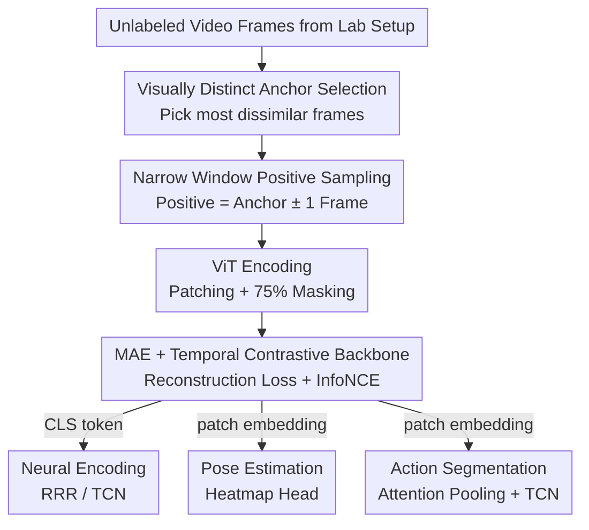

# Animal behavioral analysis and neural encoding with transformer-based self-supervised pretraining

**Conference**: ICLR 2026  
**OpenReview**: [https://openreview.net/forum?id=AeqPIRKUni](https://openreview.net/forum?id=AeqPIRKUni)  
**Code**: TBD  
**Area**: Computational Biology / Neuroscience / Self-supervised Representation Learning  
**Keywords**: Animal behavior analysis, neural encoding, self-supervised pretraining, masked autoencoder, temporal contrastive learning, Vision Transformer

## TL;DR
BEAST utilizes a dual-objective of "masked autoencoding + temporal contrastive learning" to pretrain a ViT backbone on unlabeled behavioral videos collected from a single experimental setup. This single model outperforms specialized, heavily annotated models across three neuroethological tasks: neural encoding, pose estimation, and action segmentation.

## Background & Motivation
**Background**: A consensus in modern neuroscience is that the brain can only be truly understood through the lens of behavior. Laboratories generally use cameras to record animal behavior and extract three types of information: (1) neural encoding, which extracts behavioral features to predict synchronized brain activity; (2) pose estimation, which tracks anatomical keypoints; and (3) action segmentation, which classifies behavioral states such as grooming, rearing, or social interaction frame-by-frame.

**Limitations of Prior Work**: Currently, these three tasks rely on distinct specialized models that require substantial manual annotation. Pose estimation requires labeling thousands of frames, and action segmentation often necessitates pose estimation as a preprocessing step (which is labor-intensive and introduces errors). Furthermore, massive amounts of **unlabeled** video produced daily in controlled experiments are rarely utilized.

**Key Challenge**: While general-purpose self-supervised vision models (e.g., DINOv2, CLIP, VideoPrism) are powerful, they are trained on internet images/videos. Their data distribution differs significantly from lab behavioral videos, which feature static backgrounds, fixed camera angles, and changes driven solely by the animal. Meanwhile, specialized methods operate in isolation without shared pretraining. Neither approach fully exploits the "gold mine" of unlabeled laboratory videos.

**Goal**: To develop a **universal backbone** learned from raw video via self-supervised pretraining that can be reused for multiple tasks while minimizing reliance on manual labels.

**Key Insight**: The authors capitalize on the unique properties of experimental videos—static backgrounds and fixed viewpoints where information is embedded in frame-by-frame appearance and temporal dynamics. They employ MAE to capture fine-grained appearance and temporal contrastive loss to capture dynamics, making them complementary.

**Core Idea**: Building on VIC-MAE (MAE + contrastive loss), the authors introduce a critical adaptation for neuroscience: **restricting positive samples to a narrow window of ±1 frame** relative to the anchor. This allows the model to learn truly discriminative behavioral representations in long-duration videos where actions recur, resulting in BEAST (BEhavioral Analysis via Self-supervised pretraining of Transformers).

## Method

### Overall Architecture
The input to BEAST consists of raw behavioral video frames. The output is a ViT backbone providing two types of features: the CLS token for global representation and patch embeddings for spatial information. During pretraining, each frame is divided into patches with 75% randomly masked. The remaining patches pass through the ViT encoder. One branch connects to a decoder to reconstruct masked pixels ($L_{\text{MSE}}$), while the other maps the CLS token via a nonlinear projection head to a contrastive space. In this space, temporally adjacent frames are brought together while distant frames or those from other videos are pushed apart ($L_{\text{InfoNCE}}$). After pretraining, the backbone is paired with different heads: a regressor for neural encoding (using the CLS token), a heatmap head for pose estimation, and a TCN for action segmentation (the latter two using patch embeddings).

### Key Designs

**1. MAE + Temporal Contrastive Dual-objective Backbone: Capturing Appearance and Dynamics Simultaneously**

A standalone MAE loss excels at reconstructing low-level pixel details but is largely insensitive to temporal changes. Conversely, tasks like neural encoding and action segmentation require temporal information. BEAST forces a single ViT to handle both: the reconstruction loss $L_{\text{MSE}}=\frac{1}{N}\sum_{p=1}^{N}(x_p-\hat{x}_p)^2$ learns appearance from 25% of visible patches, while the temporal contrastive loss injects temporal structure. The total loss is $L = L_{\text{MSE}} + \lambda \cdot L_{\text{InfoNCE}}$. Ablations show that MAE-only variants (VIT-M) are strong at pose estimation but weak at temporal tasks, while contrastive-only variants (VIT-C) fail at pose estimation. BEAST balances both.

**2. Narrow Time-Window Positive Sampling: Locking Positives to ±1 Frame**

This is the core modification of BEAST relative to VIC-MAE. VIC-MAE allows **any two frames** within the same video to form a positive pair. While suitable for short clips, behavioral experiments are long-duration where the same behavior repeats. Treating distant frames of the same behavior as positives can "blur" the representation. BEAST restricts the positive sample for an anchor $x^v_t$ to $x^v_{t\pm1}$ only. All other frames are treated as negatives. The InfoNCE loss is calculated on nonlinear projections $\{z^p_b\}$ of CLS embeddings: $L_{\text{InfoNCE}}=-\frac{2}{B}\sum_{i\in A}\log\frac{\exp(z^p_i\cdot z^p_{i'})}{\sum_{j\neq i}\exp(z^p_i\cdot z^p_j)}$, where $i'$ is the positive sample and $A$ is the set of $B/2$ anchors in a batch.

**3. Visually Distinct Anchor Selection: Enhancing Informational Density**

Restricting positives to ±1 frame is insufficient if the anchors themselves are redundant. BEAST selects initial anchors by choosing frames that are most **visually dissimilar** to each other. this ensures that anchors cover diverse behaviors and poses, providing more informative and challenging samples for contrastive learning.

**4. Task-Adaptive Feature Mapping: CLS Token vs. Patch Embedding**

The backbone serves three distinct tasks by extracting different features. Neural encoding requires a global state, thus using the CLS token fed into linear (Reduced Rank Regression, RRR) or nonlinear (Temporal Convolution Network, TCN) encoders. Pose estimation requires spatial localization, utilizing patch embeddings fed into a heatmap head for end-to-end fine-tuning. Action segmentation uses multi-head attention pooling on patch embeddings, concatenated with difference features of adjacent frames, then processed by a TCN.

### Loss & Training
Total loss: $L = L_{\text{MSE}} + \lambda \cdot L_{\text{InfoNCE}}$. the model is initialized with ImageNet weights, uses a 0.75 masking ratio, and is trained for 800 epochs using AdamW with cosine annealing. Training takes approximately 25 hours on 8 Nvidia A40 GPUs. $\lambda$ is tuned via validation sets.

## Key Experimental Results

### Main Results
Evaluation was performed across species (mice, weak electric fish), recording techniques (Neuropixels, 2-photon calcium imaging), and single/multi-animal settings.

Zero-shot Neural Encoding (BPS, TCN nonlinear encoder, N=842 neurons / 5 sessions, higher is better):

| Method | IBL | IBL-whisker |
|------|------|------|
| VIT-M (IN, ImageNet+MAE only) | 0.321 ± 0.013 | 0.301 ± 0.012 |
| VIT-M (IN+PT, with in-domain pretraining) | 0.331 ± 0.013 | 0.311 ± 0.013 |
| VIT-C (IN+PT, contrastive only) | 0.314 ± 0.013 | 0.283 ± 0.011 |
| BEAST (IN+PT) | 0.292 ± 0.012 | 0.309 ± 0.013 |
| **BEAST (IN+PT+FT, fine-tuned)** | **0.347 ± 0.014** | **0.326 ± 0.013** |

Key Observation: Even VIT-M (IN) without fine-tuning exceeds baseline keypoint/PCA methods, proving that behavioral videos contain far more information than just poses. In-domain pretraining further improves performance, and BEAST outperforms both pure MAE and pure contrastive variants.

Pose Estimation: In low-data scenarios with only **100 labeled frames**, BEAST outperforms ResNet-50 (AP-10K pretrained) and ViT (ImageNet pretrained) across four datasets, with a wider margin on difficult keypoints.

Action Segmentation (macro-F1): On the IBL dataset, BEAST ensembles match keypoint ensembles (F1 ≈ 0.89). On CalMS21, BEAST outperforms SimBA and TREBA, reaching an ensemble F1 of **0.84** (ranking in the top 15 of the AIcrowd challenge)—notably without needing pose estimation labels.

### Ablation Study

| Configuration | Impact | Description |
|------|------|------|
| MAE Only (VIT-M) | Strong Pose, Weak Temporal | Biased toward low-level pixel features |
| Contrastive Only (VIT-C) | Poor Pose Estimation | Biased toward high-level temporal structures |
| MAE + Contrastive (BEAST) | Best Overall | Complementary features |
| ±1 Frame vs. VIC-MAE Pairs | Narrow window is significantly better | Better suited for long-duration behavioral video |
| Visually Distinct Anchors | Measurable gain | Improves contrastive robustness |

### Key Findings
- **Dual Loss Complementarity**: MAE handles low-level details while contrastive loss provides high-level structure; removing either hurts specific task categories.
- **Positive Window is Decisive**: Changing from "any frame" to "±1 frame" is the key to adapting contrastive learning to long-duration behavioral videos to prevent label noise from recurring actions.
- **Whisker pads carry high neural information**: BPS results on IBL vs. IBL-whisker are similar, suggesting whisker pad activity represents a large portion of brain-related behavioral info in those areas.
- **Non-keypoint representations outperform keypoints**: Representations derived directly from video consistently beat those derived from pose estimation, confirming that pose tracking discards rich behavioral information.

## Highlights & Insights
- **Universal Pretraining**: A single self-supervised backbone serves three very different tasks (encoding, pose, segmentation), providing a "lab-specific foundation model" paradigm.
- **Narrow Time-Window Sampling**: A simple yet precise modification that addresses the "recurring behavior" problem in long-duration recordings.
- **Bypassing Pose Estimation**: Action segmentation can be performed directly via patch embeddings, liberating researchers from the need to label thousands of frames for pose networks.
- **Compute-Friendly for Small Labs**: 25 hours on 8 GPUs makes this accessible for individual labs to train custom models on their own data.

## Limitations & Future Work
- **Setup-Specific**: BEAST emphasizes "experiment-specific" training; changes in background or camera angle require retraining, lacking a unified cross-setup foundation model.
- **Static Structure Dependency**: The method thrives on static backgrounds and fixed cameras; its performance on free-moving or dynamic backgrounds is unverified.
- **CalMS21 Performance**: While strong, it remains behind the challenge leader (0.84 vs 0.89), suggesting room for improvement in complex social behavior modeling.
- **Future Directions**: Exploring joint pretraining across multiple setups and species, or introducing longer-range temporal modeling.

## Related Work & Insights
- **vs. VIC-MAE**: While both use MAE and contrastive loss, VIC-MAE uses arbitrary pairs. BEAST's narrow window and distinct anchor selection are shown to be significantly superior for behavioral data.
- **vs. General Foundation Models (DINOv2/CLIP)**: BEAST outperforms these internet-pretrained models by utilizing in-domain unlabeled video that matches the specific experimental distribution.
- **vs. Specialized Pose Estimation (DeepLabCut/SLEAP)**: These rely on heavy keypoint annotation. BEAST outperforms them in low-data (100-frame) regimes.
- **vs. Trajectory-Based Methods (TREBA/SimBA)**: These require pose estimation as a prerequisite. BEAST achieves higher F1 scores on CalMS21 by learning directly from raw video.

## Rating
- Novelty: ⭐⭐⭐⭐ Targeted adaptation of self-supervised objectives for the unique structure of behavioral video.
- Experimental Thoroughness: ⭐⭐⭐⭐⭐ Comprehensive evaluation across species, tasks, and recording technologies.
- Writing Quality: ⭐⭐⭐⭐ Clear logic from motivation to execution.
- Value: ⭐⭐⭐⭐⭐ Highly practical for neuroscience labs with limited annotation resources.

<!-- RELATED:START -->

## Related Papers

- [\[ICLR 2026\] Pretraining with Re-parametrized Self-Attention: Unlocking Generalization in SNN-Based Neural Decoding Across Time, Brains, and Tasks](pretraining_with_re-parametrized_self-attention_unlocking_generalizationin_snn-b.md)
- [\[ICML 2026\] Learning the Neighborhood: Contrast-Free Multimodal Self-Supervised Molecular Graph Pretraining](../../ICML2026/computational_biology/learning_the_neighborhood_contrast-free_multimodal_self-supervised_molecular_gra.md)
- [\[ICLR 2026\] CryoLVM: Self-supervised Learning from Cryo-EM Density Maps with Large Vision Models](cryolvm_self-supervised_learning_from_cryo-em_density_maps_with_large_vision_mod.md)
- [\[ICLR 2026\] CellDuality: Unlocking Biological Reasoning in LLMs with Self-Supervised RLVR](cellduality_unlocking_biological_reasoning_in_llms_with_self-supervised_rlvr.md)
- [\[ICLR 2026\] Coupled Transformer Autoencoder for Disentangling Multi-Region Neural Latent Dynamics](coupled_transformer_autoencoder_for_disentangling_multi-region_neural_latent_dyn.md)

<!-- RELATED:END -->
