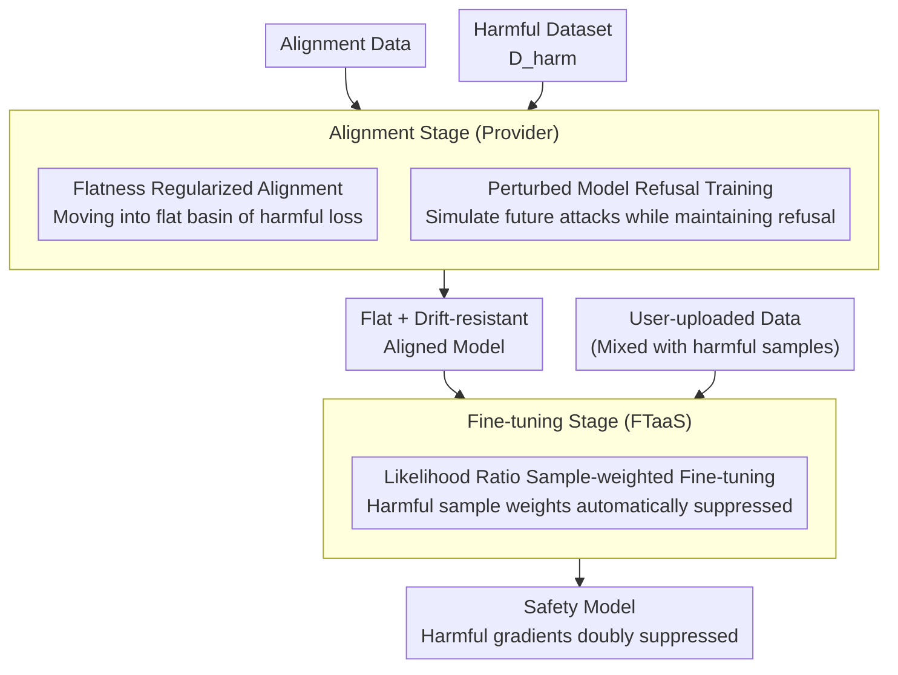

# Antibody: Strengthening Defense Against Harmful Fine-Tuning for Large Language Models via Attenuating Harmful Gradient Influence

**Conference**: ICLR 2026  
**arXiv**: [2603.00498](https://arxiv.org/abs/2603.00498)  
**Code**: To be released  
**Area**: Computational Biology  
**Keywords**: Harmful Fine-tuning Attack, Safety Alignment, Loss Flatness, Sample Weighting, FTaaS Safety  

## TL;DR
The Antibody defense framework is proposed: during the alignment stage, flatness regularization forces the model into a flat region of harmful loss (small gradients $\rightarrow$ difficult to attack); during the fine-tuning stage, a sample weighting scheme based on the model's safety knowledge (likelihood ratio of target completion vs. refusal) is used to suppress the learning of harmful samples. The average Harmful Score is reduced from $15.29\%$ to $7.04\%$.

## Background & Motivation

**Background**: FTaaS (e.g., fine-tuning services from OpenAI/Mistral) allows users to upload data to fine-tune LLMs. However, user-submitted data may contain harmful samples (intentional or unintentional), leading to the compromise of safety alignment.

**Limitations of Prior Work**: (a) Alignment-stage defenses (e.g., Vaccine/Booster) are static and cannot adapt to different attack configurations (high steps, large learning rates); (b) Fine-tuning stage defenses (e.g., Lisa/SafeInstr) either provide insufficient protection or impair task performance; (c) Most methods exhibit a severe tradeoff between safety and task performance.

**Key Challenge**: Standard SFT does not distinguish between benign and harmful samples—all gradients are aggregated for updates, allowing even a small number of harmful samples to poison the model.

**Goal**: Design a defense that works synergistically across both alignment and fine-tuning stages to thoroughly suppress the influence of harmful gradients without harming benign task learning.

**Key Insight**: Approaching from the perspective of gradient influence—if gradients of harmful samples are naturally small after alignment (flat region) and further down-weighted during fine-tuning, their influence can be effectively eliminated.

**Core Idea**: Flat harmful loss during alignment (small gradients) + Likelihood ratio weighting during fine-tuning (low weights for harmful samples) $\rightarrow$ Dual suppression of harmful gradients.

## Method

### Overall Architecture
Antibody protects the FTaaS scenario: the model is first safety-aligned by the provider and then opened for fine-tuning with user data, which may contain harmful samples. Its mechanism performs dual suppression of "harmful gradients" in both **alignment** and **fine-tuning** stages. The alignment stage optimizes $\mathcal{L}_{\text{align}}(\theta) + \lambda_t \mathcal{L}_{\text{sharp}}(\theta) + \lambda_{\text{refusal}}(\theta_{\text{pert}})$, aligning while pushing the model into a flat basin of harmful loss and training the "attack-perturbed" model to maintain refusal, resulting in a flat and drift-resistant aligned model. In the fine-tuning stage, sample-weighted updates $\theta_{t+1} \leftarrow \theta_t - \eta \sum_i w_{\theta_t}(x_i,y_i) \nabla \ell_{\theta_t}(x_i,y_i)$ are used, automatically assigning small weights to harmful samples to further suppress their gradients.

### Key Designs

**1. Flatness Regularized Alignment: Making aligned harmful loss inherently flat**

Standard safety alignment only lowers the current harmful loss but ignores the surrounding landscape—if the landscape is steep, an attacker can rapidly lower harmful loss with a few high-learning-rate fine-tuning steps, collapsing the alignment. Antibody optimizes the "flatness" of this landscape during alignment, defining sharpness as how much harmful loss can be decreased within a $\rho$-neighborhood: $\mathcal{L}_{\text{sharp}}(\theta) = \mathcal{L}_{\text{harm}}(\theta) - \min_{\phi \in \mathcal{B}_\rho(\theta)} \mathcal{L}_{\text{harm}}(\phi)$. Minimizing this forces the model into a flat basin of harmful loss. This term and the alignment objective form a dual-objective optimization. The update direction $\delta_t^* = \nabla \mathcal{L}_{\text{align}} + \lambda_t \nabla \mathcal{L}_{\text{sharp}}$ is solved using KKT conditions from Theorem 4.1, where weights $\lambda_t$ adapt during training. In a flat region, any perturbation near $\theta$ (i.e., subsequent fine-tuning) cannot significantly reduce harmful loss, making the gradients of harmful samples naturally small during fine-tuning—this is the first layer of suppression.

**2. Likelihood Ratio Sample-weighted Fine-tuning: Using model safety knowledge as a detector**

Standard SFT aggregates gradients from all samples in a batch without distinction. Antibody dynamically weights each sample to block this path: for sample $(x_i, y_i)$, it calculates the log-likelihood ratio of "target completion" relative to "refusal" $r_\theta(x_i,y_i) = \log \frac{\pi_\theta(y_i|x_i)}{\pi_\theta(y_r|x_i)}$, then normalizes this into weight $w_{\theta_t}(x_i,y_i)$ via softmax. The parameter update is $\theta_{t+1} \leftarrow \theta_t - \eta \sum_i w_{\theta_t}(x_i,y_i) \nabla \ell_{\theta_t}(x_i,y_i)$. Crucially, a well-aligned model naturally prefers outputting refusal $y_r$ for harmful prompts, resulting in low likelihood ratios and small softmax weights for harmful samples, automatically suppressing their gradients. This repurposes safety knowledge embedded during alignment as an implicit detector without extra classifiers or labels—this is the second layer of suppression.

**3. Perturbed Model Refusal Training: Preventing erosion of the weighting mechanism**

Persistent fine-tuning might cause parameter drift, potentially allowing harmful samples to gradually increase their likelihood ratios and invalidate the weighting mechanism. Antibody simulates this drift during alignment by taking a step along the normalized gradient of harmful loss to get perturbed parameters $\theta_{\text{pert}} = \theta - \rho \frac{\nabla \mathcal{L}_{\text{harm}}}{\|\nabla \mathcal{L}_{\text{harm}}\|}$. It then trains this "attack-perturbed" model to maintain a high refusal probability for harmful prompts using a regularization term $\mathcal{L}_{\text{refusal}}(\theta_{\text{pert}})$. This ensures that even if fine-tuning pushes parameters away, the refusal tendency and low-likelihood ratio weights are maintained over time.

Theoretical explanations using eNTK analysis (Propositions 4.2 and 4.3) prove that when a batch's effective gradient is dominated by benign samples, the loss for harmful test samples remains unchanged (safety preserved) while benign test loss decreases (task learned)—weighted updates naturally act selectively.

## Key Experimental Results

### Main Results (Llama-2-7B, GSM8K+20% harmful samples)

| Method | HS↓ | FA↑ | Description |
|------|-----|-----|------|
| SFT | 23.94 | 10.90 | No defense |
| Vaccine | 23.60 | 11.70 | Alignment stage |
| Lisa | 5.86 | 9.23 | Fine-tuning stage, poor task performance |
| Booster | 9.06 | 16.27 | Alignment stage |
| **Antibody** | **1.24** | **15.07** | Dual-stage synergy |

### Cross-dataset Average

| Method | Average HS↓ | Average FA↑ |
|------|---------|--------|
| Lisa | 15.29 | 60.97 |
| Booster | 19.04 | 65.20 |
| **Antibody** | **7.04** | **Competitive** |

Antibody's HS is $8+$ percentage points lower than the runner-up, Lisa.

### Ablation Study
- Removing flatness regularization $\rightarrow$ HS increases (harmful gradients not small enough during fine-tuning)
- Removing sample weighting $\rightarrow$ HS increases (harmful sample contributions not suppressed)
- Removing perturbed refusal training $\rightarrow$ Weighting mechanism degrades after long fine-tuning

### Key Findings
- The combination of flatness regularization and sample weighting is critical; either alone is less effective than the combination.
- Likelihood ratio weights (Figure 2) naturally separate harmful and benign samples during training without explicit labeling.
- Antibody is particularly effective with large data volumes (Figure 1), whereas other methods see safety deteriorate as data increases.

## Highlights & Insights
- The **Dual Gradient Suppression** logic is clear: Layer 1 (flat region) makes gradients inherently small $\rightarrow$ Layer 2 (weighting) further reduces weight $\rightarrow$ Harmful influence is thoroughly suppressed.
- **Utilizing implicit safety knowledge for detection** (likelihood ratio) is ingenious—no extra classifiers, labels, or prior knowledge of sample toxicity required.
- **eNTK theoretical analysis** provides a rigorous explanation of how mini-batch weighted updates selectively influence different sample types.
- The link to **Booster** (which defaults to Antibody when $\lambda_t$ is constant) demonstrates the framework's generalizability.

## Limitations & Future Work
- Requires access to a harmful dataset $\mathcal{D}_{\text{harm}}$ during alignment; changes in harmful types may require realignment.
- Validated in LoRA fine-tuning; effects on full-parameter fine-tuning remain unknown.
- Selection of the refusal template $y_r$ may influence likelihood ratio calculations—different styles might yield different results.
- Robustness under higher ratios of harmful data ($50\%+$) requires verification.
- Higher computational overhead compared to standard SFT due to likelihood ratio calculation and inner-loop perturbation steps.

## Related Work & Insights
- **vs. Vaccine**: Vaccine uses embedding perturbations for robustness, while Antibody uses loss flatness; the latter has clearer theoretical support.
- **vs. Booster**: Booster is a special case of Antibody; Antibody's adaptive $\lambda_t$ and weighting mechanism provide significant additional gains.
- **vs. Lisa**: Lisa alternates between safety and task data but cannot identify harmful samples within a batch; Antibody's weighting scheme achieves sample-wise discrimination.

## Rating
- Novelty: ⭐⭐⭐⭐ Combination of flatness regularization and likelihood ratio weighting is engineering-wise clever, though individual components are known.
- Experimental Thoroughness: ⭐⭐⭐⭐⭐ Comprehensive across 4 datasets × 3 models + ablation + theory.
- Writing Quality: ⭐⭐⭐⭐⭐ Rigorous theoretical derivation and very intuitive visualization of weight distributions.
- Value: ⭐⭐⭐⭐⭐ Direct practical significance for FTaaS safety; HS reduction from $15\% \rightarrow 7\%$ is a significant advancement.

<!-- RELATED:START -->

## Related Papers

- [\[ICLR 2026\] Fine-Tuning Diffusion Models via Intermediate Distribution Shaping](fine-tuning_diffusion_models_via_intermediate_distribution_shaping.md)
- [\[ICLR 2026\] Thompson Sampling via Fine-Tuning of LLMs](thompson_sampling_via_fine-tuning_of_llms.md)
- [\[ICLR 2026\] Iterative Distillation for Reward-Guided Fine-Tuning of Diffusion Models in Biomolecular Design](iterative_distillation_for_reward-guided_fine-tuning_of_diffusion_models_in_biom.md)
- [\[ICLR 2026\] Towards Understanding the Shape of Representations in Protein Language Models](towards_understanding_the_shape_of_representations_in_protein_language_models.md)
- [\[ICML 2026\] Constrained Flow Optimization via Sequential Fine-Tuning for Molecular Design](../../ICML2026/computational_biology/constrained_flow_optimization_via_sequential_fine_tuning_for_molecular_design.md)

<!-- RELATED:END -->
