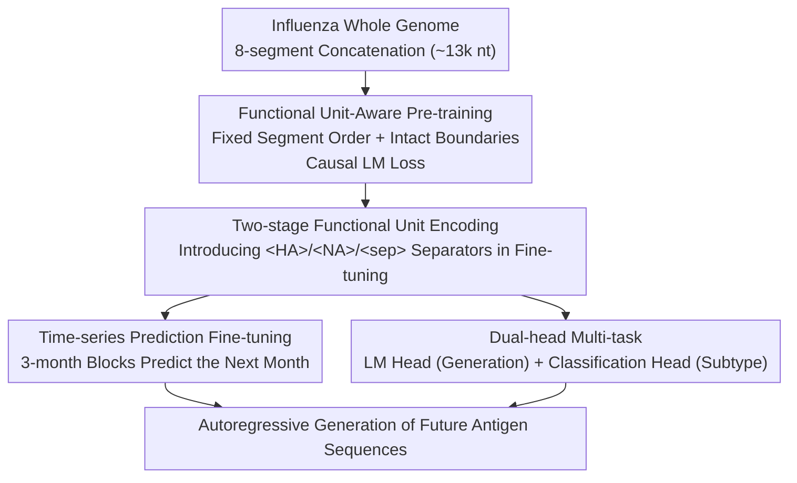

# AntigenLM: Structure-Aware DNA Language Modeling for Influenza

**Conference**: ICLR 2026  
**arXiv**: [2602.09067](https://arxiv.org/abs/2602.09067)  
**Code**: [https://github.com/peilab-cnic/AntigenLM](https://github.com/peilab-cnic/AntigenLM)  
**Area**: Biological Sequence Generation / DNA Language Models  
**Keywords**: DNA Language Models, Influenza Virus Prediction, Functional Unit Encoding, Whole-Genome Modeling, Vaccine Design  

## TL;DR
AntigenLM is a GPT-2 style DNA language model that preserves the integrity of genomic functional units. By pre-training and fine-tuning on whole genomes of influenza viruses, it autoregressively predicts antigen sequences of future dominant strains, significantly outperforming the evolutionary model beth-1 and general-purpose genomic models in amino acid mismatch rates.

## Background & Motivation
**Background**: Influenza viruses evolve rapidly to escape host immunity, requiring frequent updates to vaccine strains. Current WHO vaccine recommendations rely on phylogenetic tree dynamics (e.g., LBI) and site-level evolution prediction models (e.g., beth-1).

**Limitations of Prior Work**:
   - Site-level models (beth-1) treat mutations as independent events, failing to capture co-evolution across segments.
   - General genomic foundation models (DNABERT, HyenaDNA) are trained on heterogeneous multi-species corpora, losing species-specific structural information.
   - Protein-level models (ESM, ProtGPT2) completely ignore nucleotide-level evolutionary mechanisms such as synonymous mutations, non-coding regulatory elements, and codon adaptability.

**Key Challenge**: Viral evolution is driven by coordinated interactions across multiple segments of the entire genome (RNA-RNA interactions, segment reassortment constraints, polymerase-antigen co-adaptation). Fragmented modeling loses critical signals.

**Goal**: To construct a DNA language model that preserves the integrity of functional units to capture whole-genome dependencies at the nucleotide level for accurate influenza antigen sequence prediction.

**Key Insight**: The influenza genome is compact (~13k nucleotides), making it suitable for whole-genome modeling using a single Transformer. By maintaining a fixed order and intact boundaries for the 8 gene segments, the model learns cross-segment co-evolutionary patterns.

**Core Idea**: Maintaining the integrity and correct arrangement of genomic functional units during pre-training allows the DNA language model to capture high-order evolutionary constraints across segments.

## Method

### Overall Architecture
AntigenLM adopts a GPT-2 style decoder-only Transformer architecture. The input is the whole-genome nucleotide sequence of Influenza A virus (up to 13k tokens), and the output is the autoregressively generated next nucleotide. The pipeline consists of two stages: (1) **Functional unit-aware pre-training** on 54,512 complete influenza genomes (keeping 8 segments in a fixed order with intact boundaries to implicitly learn cross-segment co-evolution); (2) **Dual-head multi-task** fine-tuning for **time-series antigen prediction** and subtype classification, introducing explicit separator tokens.

### Key Designs

**1. Functional Unit-Aware Pre-training: Feeding the entire genome to learn cross-segment co-evolution**

General DNA models are trained on heterogeneous multi-species corpora and often truncate long sequences into fragments, losing influenza-specific structural information. AntigenLM concatenates the 8 gene segments (PB2, PB1, PA, HA, NP, NA, MP, NS) into a single whole-genome sequence in a fixed descending order by length. Each training sample maintains the complete genome, with a positional encoding range of 13k covering the full length without truncation. Training follows the standard causal language model loss:

$$\mathcal{L}_{\text{CLM}} = -\sum_{t=1}^{T-1} \log p(x_{t+1} \mid x_{\leq t})$$

By preserving segment order and boundary integrity, the attention mechanism can model cross-segment co-evolutionary dependencies (e.g., compensatory mutations between HA and NA), which are signals unavailable in fragmented training.

**2. Two-stage Functional Unit Encoding: Implicit boundary learning and explicit generation control**

No segment markers are added during pre-training; the model implicitly learns segment boundaries through fixed order and positional encodings. During fine-tuning, special tokens such as `<HA>`, `<NA>`, and `<sep>` are introduced to explicitly partition functional regions, guiding attention focus and constraining decoding to prevent cross-segment confusion. This retains the generality of pre-training while achieving precise controllable generation for downstream tasks.

**3. Time-series Prediction Fine-tuning: Sequencing multiple timestamps to capture evolutionary direction**

Antigen prediction is framed as "predicting the HA/NA sequences of the next month using those from three consecutive months." The input format is $\text{block}^{(1)}\text{block}^{(2)}\text{block}^{(3)}\text{block}^{(\star)}$, where each block is defined as `<subtype><HA>HA<NA>NA<sep>`. The causal LM loss is optimized for the entire sequence during training. During inference, future blocks are generated autoregressively after feeding three historical blocks. Concatenating antigen sequences from multiple timestamps implicitly encodes the evolutionary trajectory into the context, allowing the model to infer the direction of evolution from sequence change patterns.

**4. Dual-head Multi-task: Generation head for global dynamics, classification head for representation quality**

A shared Transformer backbone is used with two heads: an LM head predicts the next nucleotide (weight-tied with the embedding matrix), and a classification head extracts the hidden state from the sentinel token to project subtype logits using cross-entropy. The generation task captures global evolutionary dynamics, while the classification task provides supervisory signals to improve representation quality.

### Loss & Training
- Pre-training: Standard causal LM loss, AdamW optimizer (learning rate $1 \times 10^{-4}$, 5% linear warmup + cosine decay, dropout 0.1, gradient clipping 1.0).
- Effective batch size = 32 genomes/step (8 GPUs × 1 sample × 4 gradient accumulations).
- Model scale: Compact architecture with 6 Transformer layers, 384 hidden dimensions, 6 attention heads, and 1536 FFN internal dimensions.

## Key Experimental Results

### Main Results — Next-Season Antigen Sequence Prediction (Japan, post-2022)

| Method | H1N1-HA AA Mismatch | H3N2-HA AA Mismatch | H1N1-NA AA Mismatch | H3N2-NA AA Mismatch |
|------|--------------|--------------|--------------|--------------|
| Current WHO System | ~10+ | ~10+ | ~2 | ~5+ |
| beth-1 | ~6-8 | ~6-8 | ~1-2 | ~3-4 |
| LBI | High | High | — | — |
| **Ours (AntigenLM)** | **~3-4** | **~3-4** | **<1** | **~1-2** |

- AntigenLM reduces mismatches by >70% compared to WHO recommendations on H1N1-HA and H3N2-NA, and by ~50% compared to beth-1.
- Next-month prediction: Average of 3-4 amino acid mismatches for HA (<1% of 566 AAs) and 1-2 for NA (<0.5% of 469 AAs).

### Ablation Study — Comparison of Pre-training Strategies

| Pre-training Config | Next-month Prediction Token Perplexity | Seq. Gen. Validity | Subtype Class. F1 |
|-----------|-------------------|-------------|-----------|
| Full-genome (Ours) | **1.26** | High | **99.81%** |
| Incomplete-genome (Random Crop) | 3.55 | Low (Invalid sequences) | Lower, high confusion |
| Segment-wise (Single Segment) | 4.42 | Medium | Lower |
| Antigen-only (nuc) | 4.56 | Medium | 100% (Subtype determined by antigen) |
| Antigen-only (protein) | — | Medium | 100% |

### Key Findings
- **Whole-genome context is critical**: Removing non-HA/NA segments increased perplexity from 1.26 to 4.56, indicating that segments like PB1, PB2, and PA provide meaningful predictive signals.
- **Functional unit integrity outweighs data volume**: Use of the same data volume with disrupted segment boundaries (Incomplete-genome) yielded the worst results.
- **Cross-subtype generalization**: Despite H7N9 making up only 4.68% of pre-training and 0.3% (48 sequences) of fine-tuning data, AntigenLM predicted it accurately.
- **Geographical generalization**: AntigenLM significantly outperformed beth-1 on unseen US data (training used only Europe and Asia).

## Highlights & Insights
- **Generalizability of functional unit preservation**: This principle applies not only to influenza but to any genome with clear functional structures (e.g., segmented RNA viruses).
- **Victory of compact models with domain specialization**: A small 6-layer model specifically designed for influenza whole genomes outperformed much larger general genomic models.
- **Elegance of two-stage encoding**: Allowing the model to learn structure freely during pre-training while using markers for control during fine-tuning balances generality and controllability.

## Limitations & Future Work
- Predictions are inherently probabilistic and should supplement, not replace, expert decision-making.
- Validation is limited to Influenza A; generalization to other pathogens (e.g., SARS-CoV-2, HIV) is unknown.
- The model scale is small (6 layers); scaling may be required for more complex genomes.
- Training data is subject to geographical sampling bias in GISAID.

## Related Work & Insights
- **vs beth-1**: beth-1 models site-level independent mutations, whereas AntigenLM models cross-segment co-evolution; AntigenLM is superior across all tasks.
- **vs HyenaDNA/DNABERT**: General DNA models lose species-specific structures during multi-species training, often generating invalid sequences (length bias, missing markers).
- **vs ProtGPT2**: Protein-level models fail to capture nucleotide-level evolutionary signals such as synonymous mutations.

## Rating
- Novelty: ⭐⭐⭐⭐ Functional unit-aware pre-training is a novel design principle, though the architecture is standard GPT-2.
- Experimental Thoroughness: ⭐⭐⭐⭐⭐ Comprehensive evaluation including 5 pre-training ablations, 3 baseline comparisons, and cross-subtype/cross-geography generalization.
- Writing Quality: ⭐⭐⭐⭐ Logical flow with complete motivational derivation.
- Value: ⭐⭐⭐⭐ Direct application value for vaccine design and broad significance for structural preservation in genomic modeling.

<!-- RELATED:START -->

## Related Papers

- [\[ICML 2026\] DNAChunker: Learnable Tokenization for DNA Language Models](../../ICML2026/computational_biology/dnachunker_learnable_tokenization_for_dna_language_models.md)
- [\[ICLR 2026\] PatchDNA: A Flexible and Biologically-Informed Alternative to Tokenization for DNA](patchdna_a_flexible_and_biologically-informed_alternative_to_tokenization_for_dn.md)
- [\[ICLR 2026\] FlexRibbon: Joint Sequence and Structure Pretraining for Protein Modeling](flexribbon_joint_sequence_and_structure_pretraining_for_protein_modeling.md)
- [\[ICLR 2026\] Automatic and Structure-Aware Sparsification of Hybrid Neural ODEs with Application to Glucose Prediction](automatic_and_structure-aware_sparsification_of_hybrid_neural_odes_with_applicat.md)
- [\[ICLR 2026\] Physically Valid Biomolecular Interaction Modeling with Gauss-Seidel Projection](physically_valid_biomolecular_interaction_modeling_with_gauss-seidel_projection.md)

<!-- RELATED:END -->
