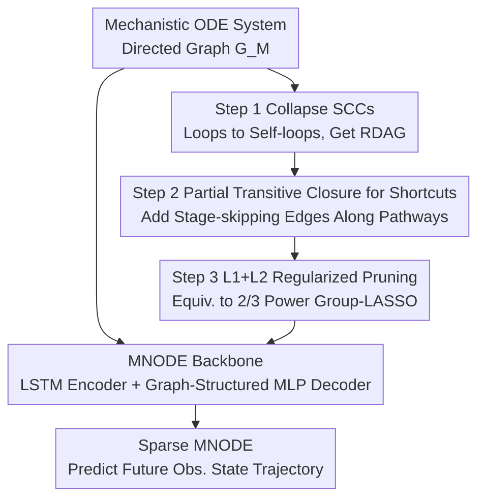

# Automatic and Structure-Aware Sparsification of Hybrid Neural ODEs with Application to Glucose Prediction

**Conference**: ICLR 2026  
**OpenReview**: [https://openreview.net/forum?id=QBzFrjEF59](https://openreview.net/forum?id=QBzFrjEF59)  
**Code**: To be confirmed (the paper states it was submitted with supplementary materials)  
**Area**: Computational Biology / Hybrid Neural ODEs / Model Reduction / Time-Series Prediction  
**Keywords**: Mechanistic Neural ODEs, Graph Sparsification, L1/L2 Regularization, Glucose Prediction, Model Reduction

## TL;DR
Addressing the pain points of "excessive latent variables and overfitting on small datasets" when embedding mechanistic models into neural ODEs, this paper proposes a three-step hybrid graph sparsification algorithm, HGS (Merging Strongly Connected Components → Adding Shortcuts → L1/L2 Regularization for edge pruning). It automatically selects subgraphs that are both sparse and maintain mechanistic interpretability, achieving better and more robust predictions with fewer parameters on synthetic data and real-world T1D glucose prediction.

## Background & Motivation
**Background**: In small-data scenarios such as healthcare and physiology, "hybrid modeling"—combining the inductive bias of mechanistic models with the flexibility of neural networks—is often more powerful than pure black-box or pure white-box approaches. A mainstream approach is built on Neural ODEs: representing a mechanistic ODE system as a directed graph (nodes as state variables/inputs, edges as interactions), and then using a set of small neural networks connected according to the graph structure to learn the derivatives of each state, resulting in a so-called Mechanistic Neural ODE (MNODE).

**Limitations of Prior Work**: Mechanistic models in physiology/medicine are often made large to characterize delays, heterogeneity, and multi-compartment processes—a SOTA "carbohydrate-insulin-glucose" model may have over 20 latent states, but less than 5 observable states and only 2 inputs. After hybridization, the extra flexibility brought by neural networks can make some latent states redundant or even harmful: when data is scarce, redundant states significantly raise model variance, leading to overfitting and offsetting the benefits the mechanistic model was supposed to provide.

**Key Challenge**: "Reducing" this mechanistic graph is difficult via existing routes. Classical reductions in biochemistry (time-scale separation, quasi-steady-state approximation) require deep domain knowledge and trial and error; graph pruning methods in the GNN community (topology-based selection, subgraph sampling, optimized sparsification) are almost entirely data-driven and agnostic to domain knowledge, failing to guarantee the retention of key mechanistic structures; non-gradient greedy searches are prohibitively expensive on high-dimensional ODEs. Thus, there is a clear gap: a need for a reduction scheme that is both computationally efficient and capable of improving prediction performance while maintaining mechanistic integrity.

**Goal**: Design an algorithm for MNODE that automatically selects states/edges and optimizes structure, satisfying three criteria: computational efficiency (gradient-differentiable), mechanistic rationality (pruned graphs remain physically interpretable), and better prediction (no overfitting on small data and enhanced robustness).

**Key Insight**: Combine "domain-knowledge-guided graph modification" with "data-driven regularization"—the former, rooted in classical reduction and graph theory, constrains the search space to "mechanistically reasonable sparse graphs"; the latter uses L1/L2 regularization to prune edges via gradients during training, which is efficient and aligns with observational data.

**Core Idea**: Replace pure data-driven pruning with a three-step Hybrid Graph Sparsification (HGS)—first, collapse loops into an acyclic graph to ensure numerical stability; second, add "shortcut edges" along mechanistic pathways to allow for reducing latent states; finally, use L1/L2 regularization (equivalent to a more aggressive group LASSO) to compress redundant edge weights to zero.

## Method

### Overall Architecture
The method consists of two layers. The bottom layer is the **prediction backbone, MNODE**: an encoder-decoder sequence model where the encoder (LSTM) takes historical observations and produces an initial estimate of the system's latent states; the decoder takes these initial values and future exogenous inputs to perform forward Euler integration state-by-state according to the mechanistic directed graph $G_M$ using a set of feedforward networks $\{NN_i\}$, rolling out the future observable state trajectory. The task is time-series prediction: given past context $\{S^P_{obs}, X^P\}$ and future inputs $X^F$, predict future observable states $S^F_{obs}$ (in the glucose task, predicting the next 60 minutes of glucose using the past 210 minutes of history).

The upper layer is the **reduction algorithm, HGS (Hybrid Graph Sparsification)**, which applies three steps to the mechanistic graph fed into the MNODE: Step 1 collapses all maximal strongly connected components (MSCC) into super-nodes to obtain a relaxed directed acyclic graph (RDAG) (containing self-loops); Step 2 performs a partial transitive closure along "input → observable state" mechanistic pathways to supplement the graph with "stage-skipping" shortcut edges; Step 3 assigns a weight to each edge and uses a hybrid L1 (edge weights) + L2 (network weights) regularization to drive redundant edges to zero, thereby automatically selecting edges/states. These three steps correspond to "ensuring stability / enabling state reduction / data-driven pruning," and none can be omitted (removing any step leads to a significant performance drop in ablation studies).

### Key Designs

**1. MNODE Backbone: Turning Mechanistic Graphs into Differentiable Neural Dynamical Systems**

This is the vehicle for prediction, solving the problem of "how to make neural networks flexible yet constrained by mechanistic structure." The mechanistic ODE system is represented as a directed graph $G_M=(V_M,E_M)$, where nodes are states $S$ and inputs $X$, and edges $(s_j,s_i)$ represent the direction of influence of $s_j$ on the derivative of $s_i$. Instead of learning a black-box right-hand side, MNODE assigns a feedforward network to each state $s_i$ that only sees its "parent nodes" $S_{pa(i)},X_{pa(i)}$:

$$\frac{ds_i(t)}{dt}=NN_i(S_{pa(i)}(t),X_{pa(i)}(t),t)$$

In practice, forward Euler discretization is used: $s^{t_{h+1}}_i=s^{t_h}_i+(t_{h+1}-t_h)NN_i(S^{t_h}_{pa(i)},X^{t_h}_{pa(i)},t_h)$. The encoder uses a standard LSTM to compress history into initial latent states $\hat S_{lat}(0)$, and the decoder rolls out predictions from these values. Thus, the flexibility of the neural network is restricted within the connections allowed by the mechanistic graph—this is precisely why "hybrid modeling" wins over pure black-boxes on small data, and it is also what the subsequent three steps aim to refine.

**2. Step 1 Collapse Strongly Connected Components: Removing Loops for Numerical Stability**

Mechanistic graphs are generally not acyclic, and ODE systems with loops are prone to exploding gradients and stiffness during training, requiring complex parameter constraints to manage. Step 1 collapses all maximal strongly connected components $C_i$ into super-nodes, delegating complex intra-loop dynamics to neural network approximation, resulting in a relaxed directed acyclic graph (RDAG) that only allows self-loops.

Why it works: Once acyclic, nodes can be rearranged in topological order, making the system Jacobian upper-triangular where eigenvalues are diagonal elements. Thus, system stability can be guaranteed by only constraining the diagonal elements (which are far fewer and simpler constraints), without needing to design constraints for each loop individually. The authors also argue that the predictive loss from collapsing is small—neural networks are sufficient to approximate the complex dynamics within components. This step is customizable: users can choose not to collapse certain MSCCs based on domain knowledge, and the subsequent steps remain compatible; causal interpretability can be preserved by restoring feedback loops via "temporal unrolling" as time-lagged dependencies.

**3. Step 2 Partial Transitive Closure for Shortcuts: Enabling the Model to Reduce Latent States**

After collapsing, the graph is sparse but not flexible enough—to truly reduce latent states on a pathway, one must allow "skipping intermediate states." Step 2 takes each "input $x$ → observable state $s$" mechanistic pathway, identifies its cut-set $D_{x,s}$ (nodes whose removal disconnects $x$ and $s$) to induce a subgraph $G^a_{x,s}$, and performs a **partial transitive closure** on it, adding the resulting shortcut edges back to the original RDAG to form an augmented graph $G^{a,c}$.

The authors use a vivid analogy: a physiological pathway is like a student progressing from grade 9 to grade 12; normally, it goes 9→10→11→12 step-by-step. A transitive closure is equivalent to adding all "grade-skipping" links (9 directly to 11/12); a "partial" transitive closure is a more cautious version that allows some skipping but prohibits extreme jumps (e.g., 9 directly to 12). The biological motivation is that different physiological processes pass through different numbers of intermediate states (e.g., quasi-steady-state approximation in chemical kinetics eliminates fast variables). Adding shortcuts gives the model the freedom to match these differences, while the partial closure avoids introducing "input directly to output" edges unsupported by mechanism, preserving necessary latent dynamics. This step is also customizable (e.g., using full closure or omitting certain shortcuts).

**4. Step 3 L1+L2 Hybrid Regularization: Data-Driven Pruning of Redundant Edges**

The first two steps constrain the search space to "mechanistically reasonable sparse graph candidates"; the final step uses data to decide which ones to prune. A weight $w_{(u,v)}$ is assigned to each edge of the augmented graph $G^{a,c}$, and element-wise weighting $W\odot S^a_{pa(i)}$ is applied to parent node features during message passing. Regularization is then added to the MSE prediction loss:

$$\sum_{cases,h}\big\|S^{a,t_h}_{obs}-\hat S^{a,t_h}_{obs}\big\|_2^2+\lambda_1\sum_{(u,v)\in E^{a,c}}|w_{u,v}|+\lambda_2\|\Theta\|_2^2$$

L1 penalizes edge weights $W$ to encourage sparsity (LASSO-style pushing of redundant edges to zero), while L2 penalizes decoder weights $\Theta$ to improve identifiability. An elegant theoretical link is provided: this regularization is equivalent to a variation of "first-layer group LASSO," where the norm of the first-layer weight vector $\Gamma_{(u,v)}=w_{(u,v)}\Theta_{(u,v)}$ corresponding to each edge is raised to the $2/3$ power $\sum\|\Gamma_{(v,u)}\|_2^{2/3}$—which has a steeper gradient than the power of 1 used in standard group LASSO, pushing toward zero more aggressively, with $\Gamma_{(u,v)}=0 \iff$ edge $(u,v)$ is deleted. $\lambda$ is selected via K-fold cross-validation. The authors explicitly state that this method is **not** intended to recover the true causal graph (the expressivity of NNs allows different graphs to produce equivalent MNODEs, making true support recovery theoretically impossible); the goal is only to efficiently induce sparsity and generate data-driven hypotheses for clinical validation.

## Key Experimental Results

> Note: Results in the paper are presented as bar charts (Figure 1, 2) without numerical tables; the values below are estimates based on the charts and are intended to show trends and rankings. Refer to the original text for precise values.

### Main Results

Synthetic Data: Two sparsity mechanisms (true sparsity / quasi sparsity), two starting graphs (refined / comprehensive redundant), sample sizes of 100 and 1000, test set of 10,000. Metrics: RMSE (prediction), Peak RMSE (robustness), ENP (Effective Non-zero Parameters, measuring sparsity).

| Object of Comparison | Setting | HGS Performance | Conclusion |
|----------------------|---------|-----------------|------------|
| Black-box models (LSTM/BNODE/TCN/S4D/Trans) | Sample size 100 | RMSE/Peak RMSE best, lowest ENP | HGS leads significantly on small data |
| Black-box models | Sample size 1000 | TCN slightly exceeds HGS in RMSE, but HGS remains most robust | Regularization bias appears as data increases |
| Other reduction methods (NS/EGL/EN/RD/GD/NR) | refined graph | Slightly better (small gap) | Everyone performs well when the graph is clean |
| Other reduction methods | comprehensive redundant graph | Leads significantly, lowest ENP | HGS advantage increases with redundancy |

Real-world Data (T1DEXI glucose prediction: 342 sequences / 105 T1D patients, measured every 5 mins; history 210 mins, prediction 60 mins; mechanistic model uses FDA-approved 2013 UVA-Padova version):

| Metric | HGS (approx.) | Best Black-box/Reduction (approx.) | Remarks |
|--------|---------------|------------------------------------|---------|
| RMSE | ~34.5 | Black-box ~36–46; reduction NR ~37.5 | HGS lowest |
| Peak RMSE | ~100–120 | Others ~150–260 | Robustness advantage most pronounced |
| Diagnostic Accuracy | ~0.78 | Others ~0.75–0.77 | 3-way accuracy (High/Normal/Low glucose) |
| Variance | Lowest (≈0 scale) | Others significantly higher | Small model variance |
| ENP | ~6000 | DK/Black-box higher | Fewer parameters |

### Ablation Study

| Configuration | Key Metrics | Description |
|---------------|-------------|-------------|
| Complete HGS (Step 1+2+3) | Best in all metrics | All three steps are necessary |
| W/o Step 1 (no loop collapse) | Significant drop | Loss of stability from acyclic structure |
| W/o Step 2 (no shortcuts) | Significant drop | Inability to reduce latent states on pathways |
| W/o Step 3 (no regularization) | Significant drop | Loss of data-driven pruning |

### Key Findings
- All three steps are indispensable: Removing any step leads to a significant performance drop, indicating that "mechanistic graph modification + data regularization" are complementary rather than redundant.
- HGS is unique because it doesn't just push for sparsity; it introduces **new structural shortcuts** (visible in adjacency matrix heatmaps) that regularization alone cannot reach, thanks to Step 2.
- Mechanistic interpretability gains: In the glucose task, HGS actively pruned edges corresponding to the glucagon feedback loop, suggesting that "impaired glucagon response in hypoglycemia may similarly persist during exercise-induced hypoglycemia"—a new hypothesis to guide subsequent clinical research.

## Highlights & Insights
- **Linking graph-theoretic stability directly to training design**: Using the chain of "collapsing SCCs → acyclic → upper-triangular Jacobian → eigenvalues as diagonal elements" to simplify numerical stability into diagonal constraints is a solid justification of "why prune this way," rather than empirical pruning.
- **L1+L2 equivalent to 2/3 power group LASSO**: Reparameterizing simple edge-weight LASSO proves it is equivalent to a sparsity penalty with a steeper gradient than standard group LASSO. This theoretically explains why it is more aggressive in pushing edges to zero—a reparameterization trick transferable to other "multiplicative gating + neural network" sparsification scenarios.
- **The restraint of "partial" transitive closure**: Not blindly adding all jumping edges, but prohibiting mechanistically unsupported input-to-output direct connections, reflects a design philosophy of "data-driven but respecting mechanistic boundaries."
- **Honest disclaimer on true support recovery**: Explicitly acknowledging that neural network expressivity makes the true causal graph unidentifiable and focusing only on "hypothesis generation" avoids the common pitfall of over-interpreting sparse results as causal discovery.

## Limitations & Future Work
- **Diminishing returns with more data**: When the sample size reaches 1000, TCN overtakes HGS in RMSE. The authors admit that regularization-induced bias may outweigh variance benefits in large-data regimes; the "sweet spot" is small data.
- **Reliance on a decent mechanistic prior**: The entire workflow starts from a mechanistic directed graph. If no reliable mechanistic model exists in a domain (unlike the FDA-level UVA-Padova), HGS's "structure-aware" advantage cannot be leveraged.
- **Results presented via bar charts lack numerical tables and significance details**: Most comparisons in synthetic and real experiments rely on bar charts, and some rankings are close, making it difficult to judge statistical significance (except where the authors explicitly mention "significant on comprehensive graphs").
- **Real-world verification limited to one task**: Although the method claims generality, it was only tested on T1D glucose prediction. Its transferability across other diseases or systems remains to be verified.

## Related Work & Insights
- **vs. Zou et al. (2024) Greedy Stepwise Reduction**: Their approach uses greedy stepwise selection, while Ours uses gradient-based L1/L2, which is more efficient and performs better—analogous to the advantage of LASSO over stepwise regression in linear models. GD (greedy) was even omitted on comprehensive graphs due to excessive time costs.
- **vs. GNN-based optimized graph sparsification (Li 2020 L0 constraint, Jiang 2021 Elastic Net, Jiang 2023 Exclusive Group LASSO)**: These directly sparsify adjacency matrices without regard for mechanistic structure. Ours sparsifies edge weights in message passing and performs domain-guided pruning first to limit the search to physically feasible graphs, making it more suitable for hybrid models requiring mechanistic consistency.
- **vs. Classical Biochemical Reduction (Time-scale separation / Quasi-steady-state approximation)**: Those require heavy domain expertise and trial and error, whereas Ours automates and data-drives the "elimination of fast variables" through the shortcut mechanism in Step 2.
- **vs. LASSO/group LASSO families**: Traditional LASSO produces sparsity patterns in NNs that are hard to interpret. Ours anchors sparsity to the mechanistic graph structure, yielding domain-aligned and interpretable results.

## Rating
- Novelty: ⭐⭐⭐⭐ Combing graph stability analysis, partial transitive closure, and 2/3 power group LASSO into MNODE reduction is novel and well-justified.
- Experimental Thoroughness: ⭐⭐⭐⭐ Synthetic tests (two mechanisms, two graphs, two sample sizes) + real T1D multi-metric + comprehensive ablation, though bar charts limit data precision.
- Writing Quality: ⭐⭐⭐⭐ Clear motivation, vivid analogies (grade-skipping, student pathways), and rigorous mathematical definitions.
- Value: ⭐⭐⭐⭐ Provides an interpretable, parameter-efficient, and robust solution for the real-world pain point of medical small-data, with the ability to generate clinically verifiable hypotheses.

<!-- RELATED:START -->

## Related Papers

- [\[ICLR 2026\] Temporally Detailed Hypergraph Neural ODEs for Disease Progression Modeling](temporally_detailed_hypergraph_neural_ode_for_disease_progression_modeling.md)
- [\[ICLR 2026\] AntigenLM: Structure-Aware DNA Language Modeling for Influenza](antigenlm_structure-aware_dna_language_modeling_for_influenza.md)
- [\[ICLR 2026\] Towards Knowledge-and-Data-Driven Organic Reaction Prediction: RAG-Enhanced and Reasoning-Powered Hybrid System with LLMs](towards_knowledgeanddatadriven_organic_reaction_prediction_ragenhanced_and_reaso.md)
- [\[ICLR 2026\] Automatic Image-Level Morphological Trait Annotation for Organismal Images](automatic_image-level_morphological_trait_annotation_for_organismal_images.md)
- [\[ICLR 2026\] I2Mole: Interaction-aware Invariant Molecular Learning for Generalizable Drug-Drug Interaction Prediction](i2mole_interaction-aware_invariant_molecular_learning_for_generalizable_property.md)

<!-- RELATED:END -->
