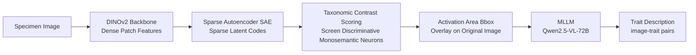

# Automatic Image-Level Morphological Trait Annotation for Organismal Images

**Conference**: ICLR 2026  
**OpenReview**: [https://openreview.net/forum?id=oFRbiaib5Q](https://openreview.net/forum?id=oFRbiaib5Q)  
**Code**: [osu-nlp-group.github.io/sae-trait-annotation](https://osu-nlp-group.github.io/sae-trait-annotation/)  
**Area**: Computational Biology / Morphological Trait Annotation / Sparse Autoencoders  
**Keywords**: Sparse Autoencoders, Monosemantic Neurons, Morphological Traits, Multimodal Large Language Models (MLLMs), BIOSCAN, Dataset Construction  

## TL;DR
Sparse Autoencoders (SAEs) trained on foundation model features are utilized as "interpretable part detectors" to automatically localize biologically significant morphological structures in insect images. These localized regions are then processed by Multimodal Large Language Models (MLLMs) to generate trait descriptions, eliminating the need for manual expert annotation and resulting in the BIOSCAN-TRAITS dataset containing 80,000 trait annotations.

## Background & Motivation
**Background**: Morphological traits (quantifiable physical features such as body length, tibia ratio, and wing chord) are critical variables linking species to ecological functions, predicting ecological niches and environmental responses with up to 85% accuracy. Over 3 billion specimens exist in global natural history collections, but trait data remains trapped in an "analog bottleneck."

**Limitations of Prior Work**: Trait measurement currently relies on manual expert efforts. Even with digital assistance, measuring a single character takes minutes, and a comprehensive trait survey would require "person-century" levels of expert labor. Furthermore, protocols are highly heterogeneous across taxa (e.g., wing chord for birds vs. elytra length for beetles), leading to subjective biases and difficulties in cross-dataset integration.

**Key Challenge**: Automated trait mining encounters a "worst-case scenario" for machine learning: (1) high inter-taxa heterogeneity causes feature manifolds to warp significantly across taxonomic units (taxonomic domain shift); (2) unpredictable specimen poses, preservation artifacts, and cluttered backgrounds amplify distribution shifts; and (3) trait targets occupy tiny and variable local regions in images. Standard supervised learning fails under this triple challenge of "label scarcity + non-stationary morphology + minuscule targets."

**Goal**: To automatically produce spatially localized, interpretable, and biologically sound trait descriptions under weak supervision (using only images and taxonomic labels without trait annotations) and to construct datasets at scale.

**Core Idea**: **[SAE as an Interpretable Part Detector]** Training an SAE on frozen foundation model features uses sparsity and non-negativity constraints to push latent units toward single, reusable visual causes (monosemantic neurons). Activation zones map back to compact spatial regions (e.g., "hind leg femur," "dorsal eye pattern," "leaf tip"). This completes localization and categorical focus before calling the language model, downgrading the MLLM's task from "describing the whole image" to "describing this specific part," which significantly reduces hallucinations and background leakage.

## Method

### Overall Architecture
Given a specimen image, dense patch features are first extracted using a backbone (DINOv2-base) and fed into a pre-trained ReLU SAE to obtain sparse latent codes. Discriminative latent units—those strongly active for the target species but nearly silent for close relatives—are selected via "taxonomic contrast" scoring. Their activation zones are cropped into tight bounding boxes and overlaid onto the original image. Finally, the boxed images are fed to an MLLM (Qwen2.5-VL-72B) to generate fine-grained trait descriptions. The entire pipeline is modular and requires no trait-level supervision.

### Key Designs

**1. SAE as a Part Detector: Forcing neuron monosemanticity through sparsity and non-negativity.** The SAE encodes intermediate dense vectors $z\in\mathbb{R}^d$ into high-dimensional sparse codes for reconstruction: $u=W_e(z-b_d)+b_e$, $g(z)=\mathrm{ReLU}(u)$, $\tilde z=W_d\,g(z)+b_d$. The training objective $J(\phi)=\lVert z-\tilde z\rVert_2^2+\alpha R(g(z))$ balances reconstruction error and sparsity. Sparsity (only a few units fire per image) and ReLU non-negativity (activations cannot cancel out) force each latent unit to correspond to a single reusable visual cause rather than a mixture of cues. Post-training, latent activations naturally map back to compact spatial regions, justifying their use as "unsupervised part detectors." The paper observes neuron 4852 consistently activating on wings and 13860 on antennae across multiple families, validating monosemanticity.

**2. Discriminative Trait Screening via Taxonomic Contrast: Locking discriminative traits using frequency differences.** Not all active neurons represent "traits"; many represent general structures shared across relatives. The paper calculates activation frequencies at the species and genus levels, normalized as $f_s(z)=C_{species}[s][z]/\sum_{z'}C_{species}[s][z']$ and $f_g(z)$. A triple-condition $f_s(z)>t_{freq}\wedge f_g(z)>t_{freq}\wedge f_s(z)>f_g(z)$ (Algorithm 1) selects latent units that appear significantly more often within a species than within its genus. The intuition is that a unit is valuable only when it is strongly active for the focus species and weakly active for relatives, corresponding to the fine-scale discriminative structures recorded by taxonomists. $t_{freq}$ acts as a precision-recall knob.

**3. Localization-First + Multi-image Consensus: Focusing the MLLM and suppressing hallucinations.** By achieving locality and taxonomic focus before the MLLM call, the model is tasked only with "describing this boxed part," which mechanistically reduces hallucinations of backgrounds. This is further enhanced by prompting with multiple images of the same species simultaneously; the model is encouraged to focus on shared morphological traits consistent across specimens while suppressing incidental details specific to a single image (consensus-driven extraction), converging broad outputs into high-precision traits.

## Key Experimental Results

Dataset: BIOSCAN-5M insect specimens (including images, DNA barcodes, taxonomy, geography, and size; 9.2% with species-level labels). The SAE was trained on the full set, while trait generation used the species-level subset. Evaluation involved 30 randomly sampled trait descriptions per configuration, scored by three domain experts on a 5-point scale and normalized by the annotator mean.

### Main Results: Gain from SAE Localization

| Method | #Images | #Tokens | Avg. Raw Score | Avg. Normalized Score |
| :--- | :--- | :--- | :--- | :--- |
| MLLM | 1 | 413 | 3.01 | 3.00 |
| MLLM | 3 | 940 | 3.12 | 3.15 |
| MLLM + SAE | 1 | 411 | 3.92 | 3.84 |
| MLLM + SAE | 3 | 1,072 | 4.01 | **3.91** |

Adding SAE-extracted patches increased the average human rating from 3.15 to 3.91 in the multi-image setting, highlighting the role of spatial localization in fine-grained trait extraction.

### Ablation Study: SAE Sparsity and Frequency Thresholds

| Method | α | t_freq | SAE MSE | SAE L0 | Avg. Score |
| :--- | :--- | :--- | :--- | :--- | :--- |
| MLLM+SAE | 2e−4 | 1e−2 | 8.8e−3 | 1081.1 | 3.84 |
| MLLM+SAE | 4e−4 | 3e−3 | 2.7e−2 | 690.4 | **3.91** |
| MLLM+SAE | 4e−4 | 1e−2 | 2.7e−2 | 690.4 | 3.58 |
| MLLM+SAE | 8e−4 | 3e−3 | 5.4e−2 | 242.2 | 3.87 |

Lower sparsity (smaller α, larger L0) performed better, as wider activation sets provided more stable part candidates covering complete anatomy. The frequency threshold $t_{freq}$ shows a precision-coverage payoff between 3e−3 and 1e−2.

### Key Findings
- Compared to the diffuse heatmaps of Grad-CAM (which mix multiple cues and are not species-discriminative), SAE explicitly isolates species-specific monosemantic neurons, leading to clearer trait decoupling.
- Cost: DINOv2+SAE preprocessing takes 7.26 ms/image. MLLM inference is the main bottleneck at 4.62 s/annotation, with a throughput of 208.9 annotations/hour/GPU (2×H100).
- Final Output (BIOSCAN-TRAITS): 19,000 images, 80,000 traits (average 4.2 traits/image).

## Highlights & Insights
- **Repurposing interpretability tools for productivity**: While SAEs are typically used for "post-hoc explanation" of model internals, this work treats monosemantic neurons as label-free part detectors.
- **Mechanistic hallucination suppression via localization**: Reducing the task dimension to "describe the local area" before the MLLM call is more robust than direct global description—a paradigm useful for any fine-grained VLM task prone to hallucination.
- **Taxonomic contrast scoring** formalizes "what counts as a trait" as the frequency difference across taxa, aligning with taxonomic intuition.
- **Scalable pipeline**: Requiring only images and labels makes it applicable to vast repositories like iNaturalist or TreeOfLife, enabling mass conversion of species-labeled galleries into trait-labeled databases.

## Limitations & Future Work
- Validation was limited to insects (BIOSCAN-5M); generalizability across other groups (plants, birds, fungi) remains to be empirically tested, especially regarding taxonomic domain shifts.
- Trait quality evaluation relied on a small sample size (30 samples) and natural language descriptions rather than quantifiable measurement values.
- Dependency on 72B-scale MLLMs for high performance makes inference costs high.
- Downstream validation was limited to zero-shot classification; while stable, the gain (34.8 to 39.9 on BioCLIP) serves as preliminary evidence.

## Related Work & Insights
- **Sparse Autoencoders**: Extension from early generative models to discovering monosemantic features in LLM activations; this paper extends the line to biological vision.
- **Fine-Grained Visual Recognition (FGVR)**: This work addresses the core challenge of localizing tiny discriminative cues in the presence of background noise.
- **Trait Extraction Paradigm**: The shift from using VAEs or herbarium segmentation to SAE-based interpretable extraction provides a robust path against digitalization artifacts.
- For researchers working on VLM hallucination or part discovery, the "localization-first, description-later" approach is a highly reusable framework.

## Rating
- **Novelty**: ⭐⭐⭐⭐ — Repurposing SAE monosemantic neurons as label-free part detectors is a novel shift in perspective.
- **Experimental Thoroughness**: ⭐⭐⭐ — Systemic ablations are present, but the evaluation sample size is small and limited to one taxonomic group.
- **Writing Quality**: ⭐⭐⭐⭐ — The analysis of the "worst-case scenario" is persuasive, and the methodology is clearly presented.
- **Value**: ⭐⭐⭐⭐ — Provides a scalable path for injecting biological supervision into datasets, with practical implications for ecology and foundation models.

<!-- RELATED:START -->

## Related Papers

- [\[ICLR 2026\] Automatic and Structure-Aware Sparsification of Hybrid Neural ODEs with Application to Glucose Prediction](automatic_and_structure-aware_sparsification_of_hybrid_neural_odes_with_applicat.md)
- [\[ICLR 2026\] Learning Residue Level Protein Dynamics with Multiscale Gaussians](learning_residue_level_protein_dynamics_with_multiscale_gaussians.md)
- [\[ICLR 2026\] CP-Agent: Context-Aware Multimodal Reasoning for Cellular Morphological Profiling under Chemical Perturbations](cp-agent_contextaware_multimodal_reasoning_for_cellular_morphological_profiling_.md)
- [\[ICLR 2026\] FragFM: Hierarchical Framework for Efficient Molecule Generation via Fragment-Level Discrete Flow Matching](fragfm_hierarchical_framework_for_efficient_molecule_generation_via_fragment-lev.md)
- [\[CVPR 2025\] Semantic and Expressive Variation in Image Captions Across Languages](../../CVPR2025/computational_biology/semantic_and_expressive_variations_in_image_captions_across_languages.md)

<!-- RELATED:END -->
