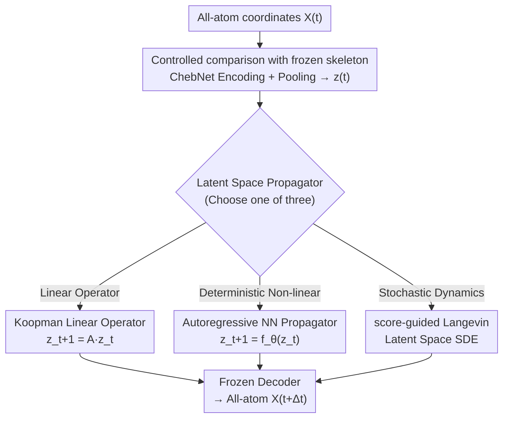

# Beyond Ensembles: Simulating All-Atom Protein Dynamics in a Learned Latent Space

**Conference**: ICLR2026  
**OpenReview**: [https://openreview.net/forum?id=AwowReRWXI](https://openreview.net/forum?id=AwowReRWXI)  
**Code**: TBD  
**Area**: Computational Biology / Protein Dynamics / Generative Models  
**Keywords**: Latent space simulation, all-atom protein dynamics, autoregressive propagator, Koopman operator, score-guided Langevin

## TL;DR
This paper embeds a temporal propagator, GLDP, into the pre-trained LD-FPG all-atom latent space, upgrading it from "only sampling static conformational ensembles" to "simulating conformational evolution over time." By conducting a fair comparison of three types of propagators (autoregressive neural network, Koopman linear operator, and score-guided Langevin) within the same frozen latent space, it concludes that autoregressive NNs are the most stable for long trajectories and most accurate for backbone dynamics; Langevin is the sharpest for side-chain thermodynamics; and Koopman serves as a lightweight but relatively rigid interpretable baseline.

## Background & Motivation
**Background**: Studying slow functional movements of proteins (folding, ligand binding, allosteric switching) has traditionally relied on Molecular Dynamics (MD) simulations. However, these movements occur on rugged energy landscapes and are dominated by rare events, making brute-force MD computationally prohibitive. A growing alternative is the "representation-first" route: re-encoding the simulation into an encoder–propagator–decoder pipeline, where the encoder compresses high-dimensional atomic coordinates into a low-dimensional continuous latent space, the propagator advances the state in this simplified space, and the decoder maps the latent trajectory back to all-atom coordinates.

**Limitations of Prior Work**: The recent generative model LD-FPG demonstrated that the long-standing challenge of "pre-defining well-behaved collective variables" can be circumvented—it learns to represent static equilibrium ensembles as all-atom deformations relative to a reference structure, serving as a powerful all-atom ensemble generator. However, LD-FPG only samples "possible conformations" and **completely lacks modeling of the temporal evolution between these conformations**. Essentially, it provides independent snapshots without dynamics or kinetic timescales.

**Key Challenge**: The propagator responsible for "advancing the state" in latent space faces a triangle trade-off: physical fidelity, long-term stability, and expressive power. While various propagators like Koopman linear operators, neural sequence models, and score/diffusion-driven stochastic dynamics have been proposed, they often use different encoders and evaluation systems, making it difficult to cleanly compare their respective strengths and failure modes.

**Goal**: (1) To supplement LD-FPG with a "temporal dimension," enabling true dynamics simulation rather than just ensemble sampling; (2) To conduct a fair comparison of three mainstream propagator classes within the **same frozen latent space** under a controlled setting to clarify their respective sweet spots and failure modes.

**Key Insight**: Since the encoder-decoder of LD-FPG already ensures "local geometric validity" (bond lengths and angles), it can be frozen as a fixed coordinate system while only replacing the intermediate propagator. This ensures that performance differences are attributed solely to the "propagation rules" rather than being confounded by encoder quality.

**Core Idea**: By freezing the LD-FPG encoder-decoder and swapping only the propagator in its latent space, a controlled comparison of "Autoregressive NN / Koopman / score-guided Langevin" isolates the true impact of the propagation mechanism on stability, ensemble fidelity, and kinetic timescales.

## Method

### Overall Architecture
The skeleton of GLDP (Graph Latent Dynamics Propagator) follows the LD-FPG encoder–decoder but inserts a temporal propagator that operates **strictly within the latent space**. The encoder and decoder remain frozen in all experiments. The pipeline follows four steps:

1.  **Encoding**: A Chebyshev Graph Neural Network (ChebNet) maps all-atom coordinates $X(t)\in\mathbb{R}^{N\times3}$ to per-atom embeddings.
2.  **Pooling**: A deterministic pooling layer aggregates per-atom embeddings into a single compact latent vector $z(t)\in\mathbb{R}^d$ ($d\ll 3N$).
3.  **Propagation**: GLDP uses a learned transition function to advance the latent state $z_t\to z_{t+1}$; this step is where the three classes of propagators are compared.
4.  **Decoding**: The frozen decoder reconstructs the evolved $z_{t+1}$ into all-atom coordinates $\hat X(t+1)$.

The latent temporal update is unified as $z_{t+1}=f(z_t)+\eta_t,\ \eta_t\sim\mathcal{N}(0,\sigma_\eta^2 I)$, where $f$ is the propagator and $\eta_t$ is optional rollout noise. Propagators are fitted using standardized latent vectors based on training statistics. Running dynamics in latent space rather than $3N$-dimensional Cartesian space prevents rapid error accumulation and violations of stereochemical constraints, as the LD-FPG latent space encodes deformations relative to a physical reference, naturally anchoring dynamics within valid basins.

### Key Designs

**1. Controlled comparison with frozen framework: Fixing the encoder-decoder and swapping only the propagator**

The fundamental methodological choice is to freeze the ChebNet encoder and all-atom decoder of LD-FPG rather than retraining them. This eliminates the noise of varying encoder quality that previously confounded comparisons of different propagators. By fixing reconstruction quality, differences in stability, ensemble fidelity, and timescales are cleanly attributed to the propagation rules. Additionally, since the decoder ensures local geometry, the propagator can focus on learning slow collective motions on a smoothed energy surface.

**2. Koopman Linear Operator: Approximating latent evolution with a linear mapping**

The Koopman variant assumes latent evolution can be approximated by a time-invariant linear operator $z_{t+1}\approx A z_t,\ A\in\mathbb{R}^{d\times d}$. $A$ is estimated via Dynamic Mode Decomposition (DMD):
$$\min_A\|Y-AX\|_F^2$$
where $X$ and $Y$ are snapshot matrices offset by one frame. To ensure stability, SVD with truncation to rank $r$ is used to filter noise and focus on dominant modes. While interpretable (eigenvalues correspond to dynamic modes), the linear assumption often suppresses fluctuations and narrows the energy landscape.

**3. Autoregressive NN Propagator: Directly learning a deterministic non-linear transition**

This propagator uses a neural network to parameterize $z_{t+1}=f_\theta(z_t)$, trained with a one-step MSE target:
$$L(\theta)=\frac{1}{M-1}\sum_{t=0}^{M-2}\|f_\theta(z_t)-z_{t+1}\|^2$$
It is not restricted by linearity and can fit complex transitions. To handle error accumulation during long rollouts, dropout and weight decay are applied. During inference, Gaussian rollout noise $\eta_i$ is added, calibrated to match one-step residual variance. It proved to be the most stable propagator, maintaining backbone dihedral distributions without collapsing.

**4. score-guided Langevin Propagator: Driving stochastic simulation with learned equilibrium score**

This involves two phases. **Phase 1**: Training a time-conditional denoiser $\epsilon_\theta(z_t,t)$ using a DDPM-style variance-preserving (VP) schedule. The score of the perturbed data is $s(z_t)=\nabla_z\log p_t(z_t)\approx-\epsilon_\theta(z_t,t)/\sqrt{1-\bar\alpha_t}$. **Phase 2**: Integrating an overdamped Langevin SDE using Euler–Maruyama:
$$z_{t+1}=z_t+T\Delta t\,s(z_t)+\sqrt{2T\Delta t}\,\eta_t,\ \eta_t\sim\mathcal{N}(0,\sigma_\eta^2 I)$$
The drift term corresponds to the gradient of an effective energy surface. Its sweet spot lies in side-chains; thermodynamic-consistent drift combined with isotropic noise effectively samples sharp, multimodal rotamer distributions, though it is sensitive to score estimation quality and integration steps.

### Loss & Training
- **Autoregressive NN**: One-step MSE loss $L(\theta)$.
- **Koopman**: Closed-form least squares with SVD truncation, gradient-free.
- **Langevin**: VP-based denoising loss for the score network; temperature $T$ and step size $\Delta t$ are critical hyperparameters.
- All propagators share the frozen LD-FPG skeleton.

## Key Experimental Results

### Main Results
GLDP (specifically the NN variant, GLDP-NN) was compared against LSS, MD-Gen, and GeoTDM on systems including ADP, 7JFL, 1R6W, and A1AR. Metrics included Dihedral/Coord JSD, Contact correlation, and TICA slow timescales $t_1$.

| System | Model | Dihedral JSD (BB/SC) | Coord JSD (BB/SC) | Contact Corr. | TICA $t_1$ |
|------|------|------|------|------|------|
| A1AR | Ground Truth | — | — | — | 1058.85 |
| A1AR | LSS | 0.134 / 0.146 | 0.657 / 0.602 | 0.971 | Unstable |
| A1AR | MD-Gen | 0.033 / 0.088 | 0.106 / 0.117 | 0.941 | 85.4 |
| A1AR | **GLDP** | **0.019 / 0.067** | **0.063 / 0.087** | **0.985** | **650.2** |

On A1AR, GLDP outperformed others significantly, achieving the lowest JSD and highest contact correlation (0.985) while recovering a physically reasonable $t_1 \approx 650$. GeoTDM failed on larger systems (7JFL, A1AR) due to exceeding 80GB H100 VRAM, highlighting the scalability of latent propagation.

### Ablation Study
Comparison of propagator fidelity for free energy surfaces (JSD):

| Propagator | ADP $(\phi,\psi)$ | A1AR $(\phi,\psi)$ | A1AR $(\chi_1,\chi_2)$ |
|------|------|------|------|
| Koopman | 0.138 | 0.043 | 0.121 |
| Autoregressive NN | **0.061** | **0.019** | 0.067 |
| Langevin | 0.164 | 0.052 | **0.058** |

**Stability**: Autoregressive NN completed 10,000 frames without failure across all systems. Langevin was less stable on smaller systems (ADP) due to score noise but reached 7,476 frames on A1AR.

### Key Findings
- **NN for Backbone, Langevin for Side-chains**: Autoregressive NNs are precise and stable for backbone dihedrals. Conversely, Langevin excels at side-chain rotamers, sampling sharp multimodal distributions despite higher variance.
- **Koopman Rigidity**: The linear assumption suppresses fluctuations, narrowing free energy basins and failing to capture transition corridors in GPCR activation surfaces.
- **Activation Surfaces**: On the A2AR GPCR, non-linear propagators (NN/Langevin) better describe the full activation path between inactive and active states.

## Highlights & Insights
- **Controlled Comparison Paradigm**: Fixing the encoder-decoder allows propagation rules to be the sole independent variable, a methodology transferable to other encoder–propagator–decoder architectures.
- **Explicit Trade-offs**: The study clearly delineates stability (NN), fine-grained physical accuracy (Langevin), and lightweight interpretability (Koopman).
- **Repurposing Diffusion Denoisers**: Using a DDPM denoiser to query scores at low noise levels for Langevin drift is an elegant way to avoid training separate energy models.
- **Hybrid Guidance**: The results suggest a future direction of using NN for stable long-range integration of collective variables and Langevin for local side-chain sampling.

## Limitations & Future Work
- **Per-system Modeling**: GLDP requires separate training for each protein; it does not yet generalize across different proteins.
- **Dynamics Approximation**: Since it evolves coordinates without momentum/pressure control, timescales are diagnostic and do not represent wall-clock time or strict physical dynamics.
- **Hyperparameter Sensitivity**: Langevin requires careful per-system calibration of $\Delta t$ and suffers from robustness issues on small systems.
- **Reconstruction Bound**: Fidelity is capped by the frozen decoder's reconstruction limit.

## Related Work & Insights
- **vs LD-FPG**: Upgrades static ensemble sampling to temporal dynamics simulation.
- **vs MD-Gen / GeoTDM**: Avoids the VRAM bottlenecks of coordinate-space diffusion, enabling simulation of large transmembrane proteins.
- **vs VAMPnets / Koopman variants**: While those focus on learning dynamics-aware encoders, Ours focuses on the behavior of different propagation mechanisms once the latent space is already established.

## Rating
- **Novelty**: ⭐⭐⭐⭐ (Extending ensemble generators to dynamics via a controlled comparison of three propagator classes).
- **Experimental Thoroughness**: ⭐⭐⭐⭐⭐ (Broad range of systems, multiple metrics including TICA and stability).
- **Writing Quality**: ⭐⭐⭐⭐⭐ (Clear framework, honest about limitations).
- **Value**: ⭐⭐⭐⭐ (Provides practical guidelines for propagator selection in latent protein simulation).

<!-- RELATED:START -->

## Related Papers

- [\[ICLR 2026\] BioMD: All-atom Generative Model for Biomolecular Dynamics Simulation](biomd_all-atom_generative_model_for_biomolecular_dynamics_simulation.md)
- [\[ICLR 2026\] Rigidity-Aware Geometric Pretraining for Protein Design and Conformational Ensembles](rigidity-aware_geometric_pretraining_for_protein_design_and_conformational_ensem.md)
- [\[ICLR 2026\] Towards All-atom Foundation Models for Biomolecular Binding Affinity Prediction](towards_all-atom_foundation_models_for_biomolecular_binding_affinity_prediction.md)
- [\[ICLR 2026\] Pallatom-Ligand: an All-Atom Diffusion Model for Designing Ligand-Binding Proteins](pallatom-ligand_an_all-atom_diffusion_model_for_designing_ligand-binding_protein.md)
- [\[ICLR 2026\] One Protein Is All You Need](one_protein_is_all_you_need.md)

<!-- RELATED:END -->
