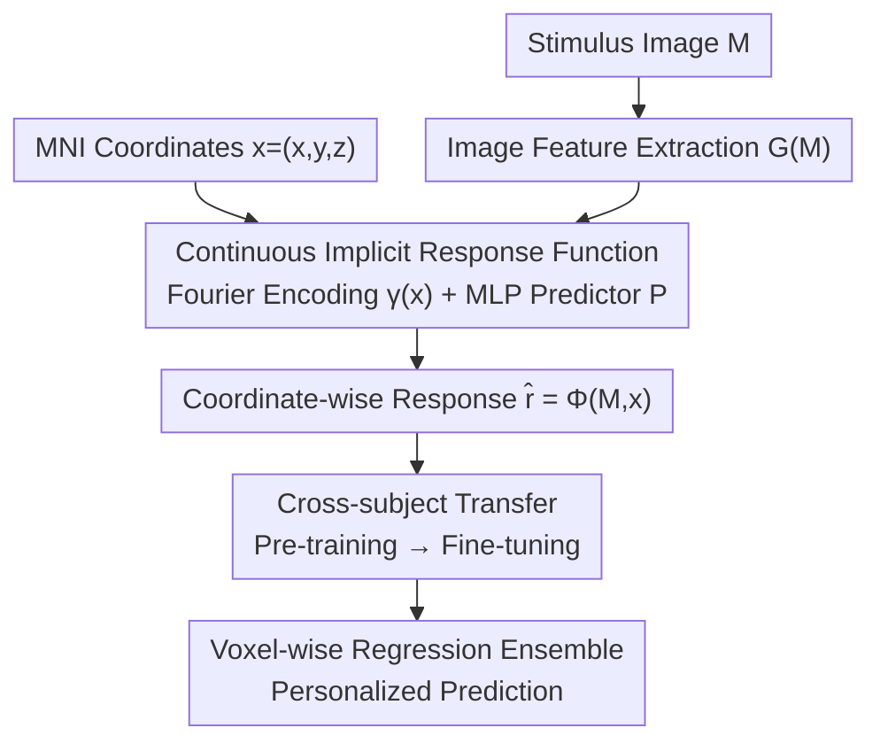

# Beyond Grid-Locked Voxels: Neural Response Functions for Continuous Brain Encoding

**Conference**: ICLR2026  
**OpenReview**: [https://openreview.net/forum?id=wBKXuuLZbc](https://openreview.net/forum?id=wBKXuuLZbc)  
**Code**: https://github.com/haomiao8/NRF  
**Area**: Computational Neuroscience / Brain Encoding / Implicit Neural Representation  
**Keywords**: fMRI encoding model, implicit neural representation, MNI anatomical coordinates, cross-subject transfer, data-efficient

## TL;DR
This paper proposes NRF (Neural Response Function), which transforms fMRI visual encoding from "regressing discrete voxel vectors for each subject" to "learning a continuous implicit function $\Phi(M,x)$ in standard MNI anatomical space." By taking an image $M$ and coordinates $x=(x,y,z)$ as input to directly predict the brain response at that location, the model leverages local smoothing of voxels and cross-subject anatomical alignment. This allows the model to significantly outperform traditional encoding models in low-data scenarios (with only a few hundred images) and supports fine-tuning and transferring a pre-trained model from one subject to new subjects.

## Background & Motivation
**Background**: The goal of neural encoding models is to predict brain responses (typically measured by fMRI) to natural images, serving as a core tool for investigating representations in the visual cortex. The prevailing approach involves "flattening" fMRI volumes into a 1D vector in $\mathbb{R}^n$ (where $n$ is the number of voxels for that subject) and training a regressor to map image features directly to this flattened vector.

**Limitations of Prior Work**: This discrete representation has two fundamental flaws. First, it **discards 3D structure**: by flattening volumes into vectors, anatomically adjacent and functionally highly correlated voxels are treated as independent outputs, completely erasing local spatial context. Second, it is **tied to a single subject**: the model's output dimension equals the voxel count of a specific subject. Since voxel counts and grids vary across individuals, knowledge learned on one subject cannot be directly transferred to another, requiring a new model to be trained from scratch for every new subject.

**Key Challenge**: The brain itself is a **continuous 3D structure**: adjacent voxels within the same subject exhibit similar response patterns (local smoothness), and the visual cortex is highly conserved across different subjects (e.g., FFA and EBA align well under the MNI standard template). However, traditional encoding models treat the brain as a collection of unrelated discrete sampling points, wasting the statistical efficiency provided by these natural structures and performing poorly when data is scarce. In reality, while projects like NSD collect tens of thousands of trials over a year, most studies only collect a few hundred trials per subject, further magnifying the inefficiency of discrete models in low-data scenarios.

**Goal**: To enable encoding models to (1) utilize the local smoothness of voxels, (2) share knowledge across subjects, and (3) decouple from the specific voxel grid resolution used during training.

**Key Insight**: The authors draw inspiration from Implicit Neural Representations (INR, such as NeRF, SIREN, and DeepSDF) in computer vision. These methods do not store signals on fixed grids but instead parameterize signals as a continuous function of coordinates $\to$ values, naturally supporting queries at any resolution. The authors apply this "coordinate-conditioned continuous function" concept to fMRI encoding: since the brain is a continuous 3D structure, rather than using discrete voxels, they learn a continuous field defined over anatomical coordinates.

**Core Idea**: Replace the discrete "image $\to$ flattened voxel vector" regression with a continuous implicit function $\Phi(M,x)=\hat r$. By using anatomical coordinates as input conditions, the neuroscience priors of local smoothness and cross-subject alignment are directly injected into the model learning process.

## Method

### Overall Architecture
NRF aims to accurately predict fMRI visual responses even when data is scarce and to enable cross-subject transfer. Its core shift is changing the encoding problem from discrete regression to **coordinate-conditioned continuous field prediction**: given a stimulus image $M$ and a coordinate $x=(x,y,z)\in\mathbb{R}^3$ in the standard MNI anatomical space, the model outputs the predicted response at that location $\hat r\in\mathbb{R}$, denoted as:

$$\Phi(M, x) = \hat r.$$

The entire pipeline follows two paths. **Single-subject encoding path**: The image is first passed through a feature extraction block $G$ to obtain an embedding $G(M)$. The coordinate $x$ is encoded into $\gamma(x)$ using Fourier features. The two are concatenated and fed into an MLP predictor $P$ to output the response. During training, images and voxels are randomly sampled for end-to-end optimization. **New-subject adaptation path**: An NRF pre-trained on other subjects is taken and end-to-end fine-tuned using a small amount of data from the new subject. Finally, a voxel-wise regression ensemble of multiple fine-tuned base models is performed to obtain personalized predictions for that subject. Intuitively, $\Phi$ maps each anatomical position $x$ to a "functional embedding" (characterizing the sensitivity of that position to specific stimulus features), and $\hat r$ comes from comparing this functional embedding with the stimulus representation. This is equivalent to learning a **continuous functional atlas**, where the anatomical position provides the base and the learned offsets carry the tuning. This decomposition into "anatomical location $\times$ functional identity" is exactly why a single model can share parameters across subjects with different voxel grids.

### Key Designs

**1. Continuous Implicit Response Function: Replacing Flattened Voxel Vectors with a Continuous Field over Anatomical Coordinates**

To address the fundamental issues of "discarding 3D structure" and "subject-dependency," NRF no longer outputs a fixed-length voxel vector but instead models the brain response as a continuous function $\Phi$ defined over $\mathbb{R}^3$. This is instantiated through two components: a feature extraction block $G$ that extracts and fuses multi-scale features from image $M$ to get embedding $G(M)$, and an implicit predictor $P$ conditioned on both $G(M)$ and spatial coordinates. The coordinates are first encoded using Fourier features:

$$\gamma(x)=[\cos(2\pi b_1^\top x),\sin(2\pi b_1^\top x),\dots,\cos(2\pi b_m^\top x),\sin(2\pi b_m^\top x)]^\top,$$

where $b_j$ is sampled from an isotropic Gaussian (a standard INR operation that allows the MLP to fit high-frequency variations in coordinates). Subsequently, $G(M)$ and $\gamma(x)$ are concatenated and fed into the MLP to obtain $\Phi(M,x)=P(G(M),\gamma(x))$. The effectiveness derived from this is twofold: since $\Phi$ is defined on continuous coordinates, predictions are explicitly "grounded" in anatomical locations, allowing adjacent and functionally related voxels to naturally share information through shared coordinates rather than being calculated independently; meanwhile, the model can query at any resolution, completely decoupling it from the voxel grid during acquisition and achieving resolution-independent modeling and analysis.

**2. Data-Efficient Training Objective: Convex Combination of MSE and Cosine Similarity**

In low-data scenarios, it is necessary both to predict accurately and to preserve the overall pattern of the response. Pure MSE tends to minimize absolute error while ignoring the direction of the response vector. NRF follows the loss used by Beliy et al., taking a convex combination of Mean Squared Error and Cosine Similarity between the predicted response $\hat r$ and the ground truth fMRI $r$:

$$L(\hat r, r) = (1-\alpha)\lVert \hat r, r\rVert_2 + \alpha\cdot\cos(\angle(\hat r, r)),$$

where $\alpha=0.1$, balancing "absolute error minimization (MSE)" and "representational alignment (Cosine Similarity)" (⚠️ refer to the original text for the exact formula). Training utilizes batches of 32 random images; for each image, 2000 voxels and their responses are randomly sampled from approximately 13,000–15,000 voxels for that subject. The model uses Adam optimization with a learning rate of 3e-3, jointly training $G$ and $P$ end-to-end. This strategy of "randomly sampling voxels instead of processing the entire volume" leverages the advantage of continuous fields—the model does not need to see all voxels every time and can learn smooth mappings from sparse sampling, which is a source of its data efficiency.

**3. Cross-Subject Fine-tuning: Direct Transfer via Shared MNI Coordinates**

The scarcity of data for new subjects is the biggest hurdle for encoding models. Discrete models require training from scratch for each new subject because they are tied to specific voxel grids. Because NRF's responses are defined in the standard MNI space, different subjects naturally fall within the same anatomical coordinate system, supporting direct transfer. A model pre-trained on a source subject can be fine-tuned on a new subject's coordinates and responses without requiring voxel resampling. The authors fine-tune both components of $\Phi$—$G$ (visual processing) and $P$ (visual-to-anatomical mapping)—end-to-end, arguing that individuals vary in both "how they process visual content" and "how they map that content to anatomical locations." Ablation studies (§5.3 perturbation of coordinate translations) further prove that transfer performance drops significantly when MNI coordinates are shuffled, confirming that cross-subject gains come from anatomical alignment.

**4. Voxel-wise Regression Ensemble: "Mixing" Knowledge from Multiple Source Subjects into a Target Subject**

A single fine-tuned model carries knowledge from only one source subject, and simple averaging might erase subject-specific variability. NRF performs a **voxel-wise regression ensemble** on $K$ fine-tuned base models. For each voxel $v$, let the prediction of the $k$-th base model for the $i$-th image be $\hat r_v^{(k,i)}$. Using the limited adaptation data of the new subject, a set of voxel-specific weights $w_{v,k}$ and a bias $b_v$ are learned via least squares:

$$\min_{\{w_{v,k},b_v\}}\sum_{i=1}^{N}\Big(r_v^{(i)}-\sum_{k=1}^{K}w_{v,k}\hat r_v^{(k,i)}-b_v\Big)^2,$$

At inference time, the final prediction for that voxel is $\hat r_v=\sum_{k=1}^{K}w_{v,k}\hat r_v^{(k)}+b_v$. The beauty of this approach is that because weights are learned per voxel, the ensemble is not just simple denoising or smoothing; it flexibly "picks" which source subject's knowledge is most suitable for that specific location, thereby preserving individual variance while fusing multi-source knowledge. Ablations show that while simple averaging slightly improves voxel-level accuracy, it damages semantic fidelity (leading to worse decoded images), whereas voxel-wise regression is superior in both voxel-level and semantic-level decoding.

### Loss & Training
- Single-subject training: Loss is a convex combination of MSE and Cosine Similarity ($\alpha=0.1$), Adam, lr=3e-3, batch size of 32 images with 2000 voxels sampled per image, end-to-end joint training of $G$ and $P$.
- New-subject adaptation: Two steps—first, end-to-end fine-tuning (both $G$ and $P$), followed by a voxel-wise least-squares regression ensemble across multiple fine-tuned base models.

## Key Experimental Results

### Main Results
The NSD dataset (8 subjects viewing 10,000 MS COCO natural images, 7T fMRI) was used, with the nsdgeneral ROI mask focusing on the visual cortex. Evaluation was performed on Subj01/02/05/07 (subjects who completed all sessions). Approximately 9,000 images were used for training and 1,000 for testing per subject. Metrics are divided into two levels: voxel-level (voxel-wise Pearson $r$, MSE) and semantic-level (feeding predicted responses into a pre-trained MindEye2 decoder to reconstruct images, then calculating PixCorr/SSIM/AlexNet/Incep/CLIP/Eff/SwAV).

Comparison with baselines using full data (~9k images) (mean of the median values across 4 subjects):

| Method | Pearson↑ | MSE↓ | PixCorr↑ | SSIM↑ |
|------|----------|------|----------|-------|
| Linear Regression | 0.323 | 0.353 | 0.186 | 0.271 |
| fWRF | 0.343 | 0.361 | 0.303 | 0.341 |
| MindSimulator (Trials=5) | 0.355 | 0.385 | 0.201 | 0.298 |
| **NRF (Ours)** | **0.358** | **0.345** | 0.261 | 0.371 |

NRF leads at the voxel level (highest Pearson, lowest MSE) and is comparable to baselines at the semantic level. The authors specifically point out that fWRF's semantic scores are unusually high (even exceeding results from real fMRI decoding), which they attribute to "decoder bias"—fWRF's output, while having lower neural accuracy, matches the distribution of the pre-trained decoder more closely, leading to inflated semantic metrics. Thus, semantic metrics should be viewed as rough references for reconstruction quality rather than strict measures of encoding model quality.

The advantage is most evident in low-data scenarios (Figure 2a): **With only 200 training images, NRF outperforms baselines trained with 800+ images.** The authors attribute this to the anatomical awareness provided by coordinate conditioning, which allows the model to extract response smoothness even from scarce data.

New-subject adaptation (Subj 1/2/5 pre-training $\to$ Subj7 adaptation, Table 2, median voxel values):

| Adaptation Images | Method | Pearson↑ | SSIM↑ | CLIP↑ |
|----------|------|----------|-------|-------|
| Full (subj7 scratch) | — | 0.269 | 0.367 | 0.846 |
| 20 | NRF scratch | 0.076 | 0.195 | 0.545 |
| 20 | NRF finetune ensemble | 0.114 | 0.366 | 0.729 |
| 200 | NRF scratch | 0.180 | 0.284 | 0.716 |
| 200 | NRF finetune ensemble | 0.227 | 0.372 | 0.873 |
| 800 | NRF finetune ensemble | 0.251 | 0.382 | 0.895 |

Key finding: **NRF with finetune+ensemble using only 200 adaptation images (Pearson 0.227) outperforms the model trained from scratch on full data in most semantic metrics (e.g., SSIM 0.372 > 0.367, CLIP 0.873 > 0.846)**, and finetune+ensemble consistently outperforms scratch across all data volumes.

### Ablation Study
Ablation of voxel-wise regression ensemble (Subj1/2/5 $\to$ Subj7, 200 images, Table 3):

| Configuration | Pearson↑ | PixCorr↑ | CLIP↑ | Note |
|------|----------|----------|-------|------|
| finetune ensemble (voxel-wise) | 0.227 | 0.255 | 87.3% | Best in both voxel and semantic levels |
| finetune average (simple average) | 0.253 | 0.167 | 74.9% | Slightly higher Pearson, but semantic fidelity collapses |
| finetune base (subj1→7) | 0.220 | 0.246 | 86.9% | Single source model |
| finetune base (subj2→7) | 0.232 | 0.243 | 82.4% | Single source model |
| finetune base (subj5→7) | 0.225 | 0.226 | 82.4% | Single source model |

In addition, perturbation experiments to "probe anatomical awareness" (Figure 4) showed: (a) accuracy drops when coordinate-response pairs are shuffled (breaking local smoothness), especially in low-data scenarios, with global shuffling causing the largest drop; (b/c) transfer performance degrades when MNI coordinates are translated (breaking cross-subject alignment), also with the greatest impact in low-data scenarios.

### Key Findings
- **Voxel-wise Regression vs. Simple Average**: Simple averaging can slightly increase voxel-level Pearson (0.253 > 0.227) but collapses semantic fidelity (PixCorr 0.255 $\to$ 0.167, CLIP 87.3% $\to$ 74.9%). This suggests that averaging suppresses individual subject variations, whereas voxel-wise regression "mixes expert knowledge per position" rather than just denoising.
- **Anatomical Priors as the Source of Performance**: Shuffling or translating coordinates significantly degrades performance (especially in low-data settings), directly proving that NRF's data efficiency stems from utilizing the structural priors of local smoothness and cross-subject anatomical alignment.
- **Low-Data Gains are Most Significant**: Whether in single-subject encoding or cross-subject transfer, NRF's advantage becomes more pronounced as the number of trials decreases, addressing the real-world pain point of data scarcity.

## Highlights & Insights
- **Introducing the INR "Coordinate $\to$ Value Continuous Field" Paradigm to fMRI Encoding**: $\Phi(M,x)$ simultaneously solves the old problems of "losing 3D structure" and "subject-dependency" with a clean approach—since the brain is continuous, stop pretending it is a collection of independent voxels.
- **Decomposition of Anatomical Location $\times$ Functional Identity**: Coordinates provide the anatomical base, and learned offsets carry the functional tuning. This decomposition is fundamental to a single model sharing parameters across subjects with different voxel grids and validates the intuition of a "continuous functional atlas."
- **Voxel-wise Regression Ensemble is a Transferable Trick**: When you have multiple source domain models and limited target domain data, learning a set of least-squares combination weights per element is better at preserving target-domain specificity than simple averaging—this idea can be transferred to any low-data "multi-source personalized adaptation" problem.
- **Honest Reflection on Semantic Metrics**: The authors proactively identify that fWRF's inflated semantic scores stem from decoder bias, reminding practitioners that using pre-trained decoders to evaluate encoding models introduces distributional bias. This self-critique is more valuable than simple performance chasing.

## Limitations & Future Work
- **Limited to Visual Cortex + Natural Images**: Experiments are restricted to the nsdgeneral visual ROI of NSD and COCO images. Generalization to other brain areas or other stimulus modalities (language, auditory) has not been verified.
- **Dependency on MNI Registration Quality**: The entire cross-subject transfer framework is built on the premise that subjects are accurately registered to the MNI space. Coordinate translation ablations show that performance degrades significantly when alignment is broken; registration errors or populations with large individual anatomical differences may weaken the gains.
- **Semantic Evaluation Constrained by the Decoder**: Semantic metrics rely on the specific pre-trained MindEye2 decoder, which introduces decoder bias (as admitted by the authors). It is not a clean measure of encoding quality.
- **Computational/Data Costs of Ensembling**: Finetuning+ensemble requires multiple pre-trained base models from source subjects. The impact of the number of source subjects, how to select them, and the cost of scaling to many subjects were limited in discussion.
- **Future Improvements**: Extending the continuous field to the whole brain, introducing stronger image encoders, or explicitly modeling individual anatomical deformations (rather than relying solely on MNI registration) are potential directions.

## Related Work & Insights
- **vs. Traditional Voxel-wise Encoding (fWRF, Linear Regression, VAE-based)**: These methods flatten fMRI into 1D vectors, perform independent regressions per voxel, and are tied to a single subject. NRF models responses as continuous coordinate functions, utilizing smoothness and alignment. The difference lies in "discrete independent points vs. continuous anatomical field," with the advantages of data efficiency, resolution independence, and cross-subject transfer.
- **vs. Encoding with Spatial Priors (e.g., Bayesian Retinotopic Templates, Multi-parameter Spatial Frequency Fitting)**: These methods only introduce spatial priors locally, while the overall framework remains discrete. NRF injects anatomical structure into the entire learning process.
- **vs. Cross-Subject Decoding (MindEye2, Adaptive Pooling, Coordinates as Positional Encodings for Attention)**: That line of work focuses on "decoding stimuli from observed discrete voxel grids." Even if coordinates are used, they remain tied to specific acquired voxels. NRF works in the opposite direction (encoding) and treats coordinates as inputs to a continuous field rather than auxiliary features for discrete voxels, supporting queries at any location and cross-subject adaptation without resampling.
- **vs. Implicit Neural Representations (SIREN, NeRF, DeepSDF, Occupancy Net)**: NRF borrows the coordinate + Fourier feature + MLP continuous field representation but is the first to apply it to computational neuroscience, proving that "continuous field + anatomical grounding" brings data efficiency and generalization.

## Rating
- Novelty: ⭐⭐⭐⭐⭐ First introduction of the INR continuous field paradigm to fMRI encoding, reframing a two-decade-old discrete problem.
- Experimental Thoroughness: ⭐⭐⭐⭐ Single-subject + cross-subject + perturbation probing + ensemble ablations are included, but limited to the visual cortex and the single NSD dataset.
- Writing Quality: ⭐⭐⭐⭐ Clear motivation, and the self-reflection on semantic metrics is a plus; some formula formatting is slightly unrefined.
- Value: ⭐⭐⭐⭐⭐ Directly addresses the real-world pain points of "data scarcity + non-transferability" in fMRI encoding, providing a deployable and scalable new paradigm for "brain digital twins."

<!-- RELATED:START -->

## Related Papers

- [\[ICLR 2026\] Continuous Multinomial Logistic Regression for Neural Decoding](continuous_multinomial_logistic_regression_for_neural_decoding.md)
- [\[ICLR 2026\] TRIBE: Trimodal Brain Encoder for Whole-Brain fMRI Response Prediction](tribe_trimodal_brain_encoder_for_whole-brain_fmri_response_prediction.md)
- [\[ICLR 2026\] Animal behavioral analysis and neural encoding with transformer-based self-supervised pretraining](animal_behavioral_analysis_and_neural_encoding_with_transformer-based_self-super.md)
- [\[ICLR 2026\] OmniMouse: Scaling properties of multi-modal, multi-task Brain Models on 150B Neural Tokens](omnimouse_scaling_properties_of_multi-modal_multi-task_brain_models_on_150b_neur.md)
- [\[ICLR 2026\] DeepSADR: Deep Transfer Learning with Subsequence Interaction and Adaptive Readout for Cancer Drug Response Prediction](deepsadr_deep_transfer_learning_with_subsequence_interaction_and_adaptive_readou.md)

<!-- RELATED:END -->
