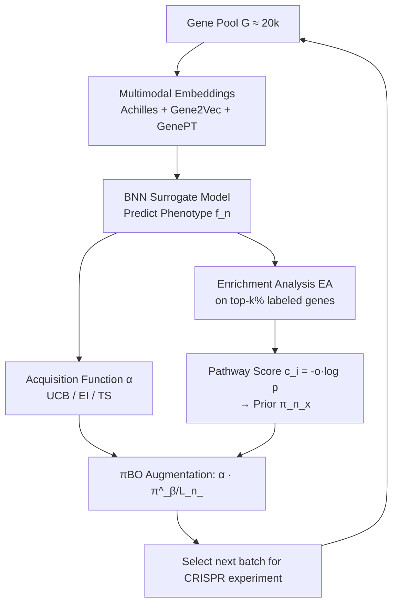

# BioBO: Biology-informed Bayesian Optimization for Perturbation Design

**Conference**: ICLR 2026  
**OpenReview**: [https://openreview.net/forum?id=CF3kJrAwmV](https://openreview.net/forum?id=CF3kJrAwmV)  
**Code**: TBD  
**Area**: Computational Biology / Bayesian Optimization / Genetic Perturbation Experimental Design  
**Keywords**: Bayesian Optimization, Perturbation Design, Multimodal Gene Embeddings, Enrichment Analysis, πBO, CRISPR Screen  

## TL;DR
BioBO integrates multimodal gene representations (Achilles + Gene2Vec + GenePT) into the surrogate model of Bayesian Optimization and utilizes enrichment analysis (EA) results as priors within the πBO framework to augment acquisition functions. This approach improves the labeling efficiency of CRISPR gene knockout screens by 25–40% while providing pathway-level interpretable design rationales.

## Background & Motivation
**Background**: Early drug discovery relies on CRISPR-Cas9 knockout screens to perturb genes individually and observe cellular phenotypes to infer gene functions and identify therapeutic targets. However, with approximately 20,000 protein-coding genes in humans, exhaustive perturbation is experimentally infeasible. Thus, a sample-efficient strategy is required to find high-value targets with minimal experiments. Bayesian Optimization (BO) excels at this by using processes like Gaussian Processes or Bayesian Neural Networks (BNN) as surrogate models to fit the response surface and employing acquisition functions (e.g., EI/UCB/TS) to balance the exploitation of known optima and exploration of uncertain regions.

**Limitations of Prior Work**: Existing works applying BO to gene perturbation design (e.g., GeneDisco, DiscoBAX) generally use **unimodal, generic gene embeddings**, failing to fully leverage biological prior knowledge. Conversely, Enrichment Analysis (EA), a parallel biological approach, identifies pathways statistically over-represented among top genes to provide mechanistic insights. However, EA has two major flaws: **(i) Lack of granularity**—it treats all unobserved genes in the same pathway as equally promising; **(ii) Pure exploitation without exploration**—it focuses solely on known biology, repeatedly selecting significant pathways while ignoring non-significant ones.

**Key Challenge**: BO offers principled exploration-exploitation trade-offs but lacks biological domain knowledge, whereas EA possesses rich biological priors but lacks granularity and exploration. No existing method combines them in a theoretically sound manner.

**Goal**: Construct a unified framework that **infuses BO with biological domain knowledge using EA, while providing EA with granularity and exploration capabilities via BO**, ensuring that the integration does not compromise the original convergence guarantees of BO.

**Core Idea**: **A two-pronged approach** — merging multimodal gene representations on the surrogate modeling side to improve prediction quality near the optimum; and converting pathway scores from enrichment analysis into prior distributions $\pi_n(x)$ within the πBO framework on the acquisition function side to bias the search direction, with the bias automatically decaying as data increases.

## Method

### Overall Architecture
BioBO introduces two orthogonal modifications to the standard BO loop: **Surrogate Modeling side** combines multimodal gene embeddings for the BNN to improve local prediction accuracy; **Acquisition Function side** performs enrichment analysis on currently labeled top genes, converting the representativeness of pathways containing unlabeled genes into a prior probability. This prior is then multiplied into any myopic acquisition function using πBO. Both modifications integrate into the BO framework without altering its structure, allowing plug-and-play application to UCB/EI/TS, resulting in BioUCB/BioEI/BioTS.

### Key Designs

**1. Multimodal Gene Representation Fusion: Sharpening predictions near the optimum.** Existing works utilize only the Achilles descriptors (unimodal). BioBO introduces two additional embeddings: Gene2Vec (self-supervised gene-gene relationships from Gene Ontology) and GenePT (literature-based embeddings generated via ChatGPT). The study explores simple concatenation $f([x, x_{g2v}, x_{\text{GenePT}}])$ and latent-space fusion using cross-attention. Section 4.3 reveals a counter-intuitive finding: fusion **does not** improve the global predictive quality of the surrogate (global log-likelihood LL correlates negatively with BO top-k recall). Instead, it **improves predictions for the small subset of points near the optimum**—LL@top-1% shows high Spearman correlation with top-k recall (0.49 for IFN-γ and 0.64 for IL-2). This suggests that BO only requires the surrogate to accurately rank high-value candidates and locate local optima.

**2. Enrichment Analysis Prior: Converting statistical significance into gene selection probabilities.** In each iteration, labeled genes are ranked by phenotype, and the top-10% are selected as the "gene set of interest" $S_n$. For each predefined pathway $P_i$, a p-value is calculated using a hypergeometric distribution and Bonferroni-corrected to $p_{adj}(P_i)$. Combined with the odds ratio $o(P_i)$, a representative score $c(P_i)=-o(P_i)\log p(P_i)$ is derived. The prior for an unlabeled gene $x$ is aggregated from the scores of all significant pathways ($p_{adj}<0.05$) it belongs to:

$$s_n(x) = \text{logit}\!\left(\tfrac{1}{U_n}\right) + \tfrac{1}{t}\,\underset{\{P_i \mid x\in P_i,\, p_n^{adj}(P_i)<0.05\}}{\text{agg}}\big[c_n(P_i)\big], \quad \pi_n(x) = \frac{e^{s_n(x)}}{\sum_x e^{s_n(x)}}$$

Where $U_n$ is the number of unlabeled genes. A temperature $t$ controls the influence of EA information; as $t\to\infty$, $\pi$ becomes uniform. This step addresses the "lack of granularity" in pure EA by weight-adjusting genes within the same pathway based on specific pathway representativeness.

**3. πBO Augmented Acquisition Function + No-harm Guarantee: Decaying priors.** BioBO applies the prior to the acquisition function via πBO rather than greedy selection:

$$\pi\alpha_{p(f_n|D_n)}(x) = \alpha_{p(f_n|D_n)}(x)\,\pi_n(x)^{\frac{\beta}{L_n}}$$

The exponent $\beta/L_n$ is crucial—where $\beta$ is user confidence and $L_n$ is the current number of labeled samples. As more data is collected, the prior weight decays, shifting trust toward the surrogate model. This provides a **no-harm guarantee**: for myopic acquisition functions, the regret of BioEI is bounded by the regret of standard EI, $L_n(\text{BioEI}_n)\le C_{\pi,n}L_n(\text{EI}_n)$, where $C_{\pi,n}=(\max_x\pi_n/\min_x\pi_n)^{\beta/L_n}$. Thus, even with a biased or incorrect EA prior, BioBO asymptotically reverts to standard BO performance.

## Key Experimental Results

Datasets: 5 genome-wide CRISPR assays from GeneDisco (focusing on IFN-γ and IL-2); Achilles as base descriptors plus Gene2Vec and GenePT; BNN surrogate; UCB/EI/TS/DiscoBAX acquisition functions; EA using Gene Ontology (GO) and Hallmark (HM). Metric: Cumulative Top-k Recall.

### Main Results (Cumulative top-k recall, higher is better)

| Acquisition | IFN-γ Fusion | IFN-γ Achilles | IL-2 Fusion | IL-2 Achilles |
|---|---|---|---|---|
| EI | 0.093 | 0.072 | 0.148 | 0.130 |
| BioEI-GO (Ours) | 0.098 | 0.085 | 0.147 | 0.138 |
| BioEI-HM (Ours) | 0.096 | 0.076 | 0.153 | 0.130 |
| TS | 0.083 | 0.068 | 0.142 | 0.119 |
| BioTS-GO (Ours) | 0.095 | 0.073 | 0.147 | 0.142 |
| BioTS-HM (Ours) | 0.097 | 0.097 | 0.153 | 0.123 |
| UCB | 0.100 | 0.077 | 0.174 | 0.143 |
| BioUCB-GO (Ours) | 0.102 | 0.098 | 0.169 | 0.158 |
| **BioUCB-HM (Ours)** | **0.109** | 0.085 | **0.178** | 0.163 |
| Random | 0.050 | 0.050 | 0.049 | 0.048 |

BioBO outperformed other methods in 23 out of 24 settings. The optimal combination was **Fused embeddings + BioUCB-HM**.

### Ablation Study

| Dimension | Comparison | Key Observation |
|---|---|---|
| Multimodal Fusion | Achilles/Gene2Vec/GenePT | Fusion consistently outperforms unimodal; reduces label cost by 4%–40%. |
| BO vs Random | Random | All BO functions beat random; UCB saves 25%–75% labeling. |
| Pure EA | Random | Greedy EA selection beats random but lacks exploration. |
| EA Impact | UCB | BioUCB outperforms both UCB and pure EA; improves efficiency by ~20%. |
| DiscoBAX | — | Underperformed due to implementation issues noted in official repo. |

### Key Findings
- **Mechanism**: Gains from fusion originate from "local optimality" rather than global accuracy. Top-k recall correlates strongly with LL@top-1% (Spearman up to 0.64).
- **Interpretability**: BioUCB-HM selects designs with significantly stronger Hallmark enrichment signals than UCB. For the MYC TARGETS V1 pathway, BioUCB-HM achieved an overlap of 187/200 and a combined score of $4.37\times10^5$, providing a coherent mechanistic explanation.

## Highlights & Insights
- **Dual-completion perspective**: Instead of just adding features, the framework identifies that BO lacks domain knowledge while EA lacks granularity/exploration, creating a synergetic mutual-compensation via πBO.
- **No-harm guarantee**: Crucial for real-world adoption. Since biological priors are often noisy or biased, the decay mechanism ensures the model can recover from poor priors.
- **Surrogate diagnostic**: The insight that "global LL $\neq$ BO performance" challenges the naive assumption that more accurate surrogates always yield better BO results, offering methodological value to the broader BO community.

## Limitations & Future Work
- **Retrospective evaluation**: Simulations were performed on fully labeled GeneDisco pools; real-world performance without ground-truth phenotypes remains to be seen.
- **Dependency on pathway databases**: EA priors rely on GO/Hallmark. For novel or "orphan" genes with sparse annotations, the prior offers little information.
- **Hyperparameter sensitivity**: Choices like top-k% (10%), $t=0.1$, and $\beta$ require more cross-phenotype/cell-line validation.
- **Future Work**: Deepening latent-space cross-attention, incorporating more "omics" modalities (expression, PPI), and validation in real-world closed-loop wet-lab experiments.

## Related Work & Insights
- **BO in Gene Perturbation**: Directly builds on GeneDisco (2021) and DiscoBAX (2023) but addresses their unimodal limitations.
- **πBO (2022)**: Provides the theoretical foundation for augmented acquisition and no-harm guarantees.
- **Multimodal Embeddings**: Utilizes Gene2Vec (2019) and GenePT (2025) for heterogeneous biological signals.
- **Insight**: This paradigm of "translating mature domain tools (EA/p-values) into BO priors with decay mechanisms" is transferable to other scientific design problems like material screening or clinical trials.

## Rating
- **Novelty**: ⭐⭐⭐⭐ — Principles of πBO applied to enrichment analysis with no-harm guarantees.
- **Experimental Thoroughness**: ⭐⭐⭐⭐ — Extensive datasets and surrogate diagnostics, though limited to retrospective analysis.
- **Writing Quality**: ⭐⭐⭐⭐ — Clear motivation and logical flow.
- **Value**: ⭐⭐⭐⭐ — High practical value for drug target prioritization.

<!-- RELATED:START -->

## Related Papers

- [\[ICLR 2026\] PatchDNA: A Flexible and Biologically-Informed Alternative to Tokenization for DNA](patchdna_a_flexible_and_biologically-informed_alternative_to_tokenization_for_dn.md)
- [\[NeurIPS 2025\] Is Sequence Information All You Need for Bayesian Optimization of Antibodies?](../../NeurIPS2025/computational_biology/is_sequence_information_all_you_need_for_bayesian_optimization_of_antibodies.md)
- [\[ICML 2025\] Empower Structure-Based Molecule Optimization with Gradient Guided Bayesian Flow Networks](../../ICML2025/computational_biology/empower_structure-based_molecule_optimization_with_gradient_guided_bayesian_flow.md)
- [\[ICLR 2026\] scDFM: Distributional Flow Matching for Robust Single-Cell Perturbation Prediction](scdfm_distributional_flow_matching_model_for_robust_single-cell_perturbation_pre.md)
- [\[ICML 2026\] Constrained Flow Optimization via Sequential Fine-Tuning for Molecular Design](../../ICML2026/computational_biology/constrained_flow_optimization_via_sequential_fine_tuning_for_molecular_design.md)

<!-- RELATED:END -->
