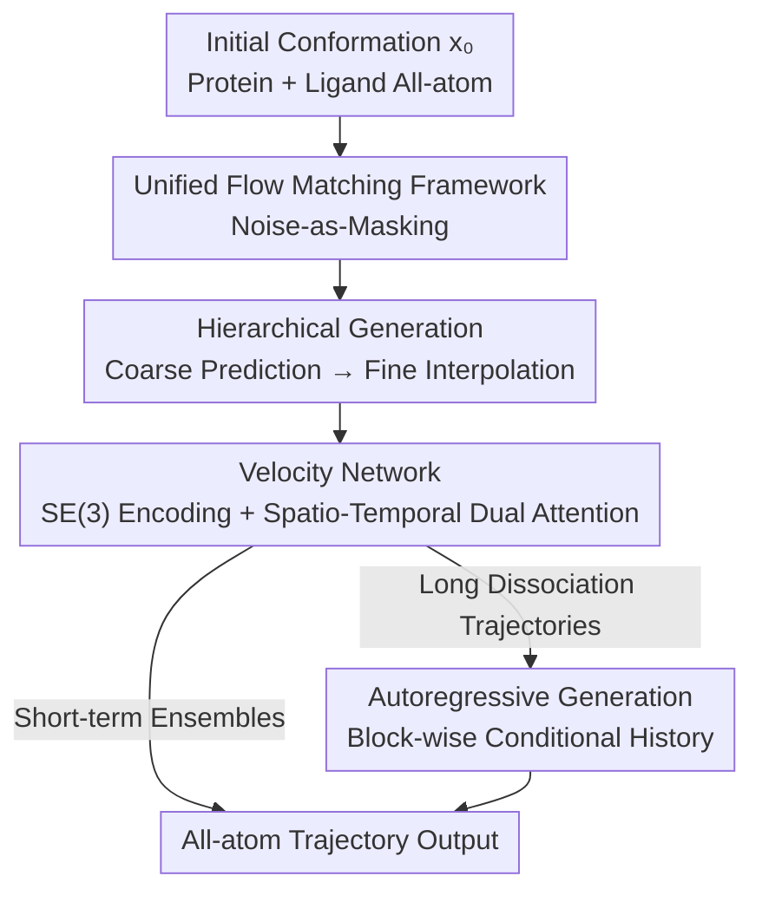

# BioMD: All-atom Generative Model for Biomolecular Dynamics Simulation

**Conference**: ICLR2026  
**OpenReview**: [https://openreview.net/forum?id=LQDeJk6NOr](https://openreview.net/forum?id=LQDeJk6NOr)  
**Code**: To be confirmed  
**Area**: Computational Biology / Molecular Dynamics / Generative Models / Flow Matching  
**Keywords**: Molecular Dynamics, All-atom Generation, Flow Matching, Protein-Ligand, Dissociation Path

## TL;DR
BioMD is the first all-atom generative molecular dynamics model for protein-ligand systems. Using a hierarchical flow matching framework of "coarse-grained prediction + fine-grained interpolation," it compresses long-range trajectories (including ligand dissociation paths) that traditionally take hours of MD into tens of seconds, successfully reconstructing dissociation paths for 97.1% of systems in DD-13M.

## Background & Motivation
**Background**: Molecular dynamics (MD) simulation is a core tool in computational chemistry and drug discovery. By numerically integrating Newton's equations of motion, it produces trajectories of atoms evolving over time, revealing dynamic information such as conformational ensembles, binding sites, and dissociation channels. Recently, machine learning has begun to serve as an "accelerated surrogate" for MD, with models for generating protein conformational ensembles, neural network potentials trained on quantum data, and high-precision structure predictors like AlphaFold 3.

**Limitations of Prior Work**: Traditional MD is limited by extreme computational overhead—even with PME reducing complexity to $O(N\log N)$, force calculation remains the most expensive part. To resolve femtosecond-level high-frequency atomic vibrations, time steps must be extremely small, causing the simulatable physical time to be constrained to very short scales. Biologically meaningful processes (microseconds to milliseconds) are thus almost impossible to sample directly with all-atom MD. While ML methods have progressed, they are generally stuck in two types of limitations: one type (e.g., various conformational ensemble generators) only provides "possible conformations" or final bound states, **lacking a time dimension** and failing to show dynamical channels between states; the other type attempting to model trajectories often oversimplifies—NeuralMD treats protein atoms as static and only moves the ligand, while MDGen is designed for peptides/proteins and does not handle small molecule ligands.

**Key Challenge**: Generating complete trajectories for protein-ligand complexes is hindered by the complexity of the protein-ligand energy surface and the scarcity of high-quality trajectory training data. Furthermore, direct modeling of long trajectories poses the dual challenges of excessive sequence length and error accumulation.

**Key Insight**: The authors observe a key fact (Figure 1 in the paper)—at short time scales, conformations remain almost unchanged; significant global motion only appears when the time window is expanded. Therefore, the "large-step evolution" and "local details" of long trajectories can be decoupled.

**Core Idea**: Long trajectory generation is split into two steps—first, use a large step size (taking one frame every $k=10$ frames) to **predict** a coarse-grained trajectory, then **interpolate** to fill in intermediate frames within each coarse interval. Both steps are unified within the same conditional flow matching model, switching tasks through different "noise-as-masking" schedules. This both shortens the sequence length for modeling and suppresses long-range error accumulation.

## Method

### Overall Architecture
The goal of BioMD is: given the initial conformation of a complex (the first frame $x_0$), generate the subsequent all-atom trajectory $X_T=\{x_0,x_1,\dots,x_T\}$, where each frame $x_t=[x_t^P, x_t^\ell]\in\mathbb{R}^{N\times3}$ contains both protein and ligand Cartesian coordinates. The entire pipeline is: first, an SE(3) Graph Transformer encodes the initial conformation into single-node and pair representations as conditions; then, a unified velocity network (FlowTrajectoryTransformer) processes the entire trajectory sequence at once to predict the velocity field of each frame under conditional flow matching. The hierarchical framework uses two different masking schedules to allow the same model to perform coarse-grained "prediction" first and then fine-grained "interpolation." For long dissociation trajectories, it switches to an autoregressive mode to generate block by block. The generated coordinates are then constrained by several physical auxiliary losses to ensure bond lengths, avoid collisions, and suppress rigid body drift.

### Key Designs

**1. Unified Flow Matching Framework: Using "Noise-as-Masking" to integrate prediction and interpolation into the same model**

The foundation of the method is a conditional flow matching (FM) model. The authors' ingenuity lies in making the distinction between "known frames vs. frames to be generated" entirely represented by an **independent noise level for each frame**, rather than training separate networks for prediction and interpolation. For a sequence $X=\{x_{t_1},\dots,x_{t_L}\}$, a time variable $\tau_{t_i}\sim U(0,1)$ is independently sampled for each frame during training. Frames are corrupted into $x_{t_i}^\tau=\tau_{t_i}x_{t_i}+(1-\tau_{t_i})\epsilon_i$ (where $\epsilon_i\sim\mathcal N(0,I)$), and the corresponding ground truth velocity field is $u_{t_i}^\tau=(x_{t_i}-x_{t_i}^\tau)/(1-\tau_{t_i})$. The velocity model $u_\theta$ takes the entire noisy sequence and static conditions $Z$ (initial coordinates, amino acid sequence, ligand atom types) to regress the velocities of all frames at once. The objective is the mean squared error over the entire sequence:

$$\mathcal L_{\text{flow}}=\text{MSE}\big(u_\theta(X_T, Z, T),\, U_T\big).$$

Here, $\tau=1$ indicates a "clean/known" frame (i.e., unmasked), while $\tau=0$ indicates a frame starting from pure noise to be generated (i.e., masked). This approach draws from the "noise-as-masking" concept in Diffusion Forcing—independently adding noise to each frame means that by simply changing the $\tau$ schedule, the model can flexibly condition on any arbitrary trajectory segment. Thus, different tasks are merely different masking schedules rather than different networks. The authors also distinguish between two coordinate parameterizations: BioMD-rel predicts coordinate changes relative to an anchor frame, while BioMD-abs predicts absolute coordinates; the following explanation focuses on absolute coordinates.

**2. Hierarchical Generation: Coarse-grained prediction for the skeleton, fine-grained interpolation for the details**

This is the core mechanism by which BioMD suppresses long-range error accumulation, directly addressing the observation that "short-term conformations are almost unchanged, while significant motion occurs over the long term." In the first stage (coarse-grained prediction), one frame is taken every $k=10$ steps from the complete trajectory to obtain a sparse sequence $X_C=\{x_0,x_k,x_{2k},\dots\}$. The first frame is fixed as known ($\tau_0=1$), and $\tau$ for the remaining frames are sampled independently from $U(0,1)$, allowing the model to predict the entire coarse trajectory velocity given only the initial frame. During inference, two strategies are supported: **one-shot generation** (all future frames are integrated from noise to $\tau=1$ in parallel using an ODE solver like Euler); and **autoregressive (AR)** (generating block by block with size $j$, where previously generated history frames have $\tau$ fixed to 1 as clean conditions, and the $\tau$ for $j$ frames within the current block evolve from 0 to 1 together, then merging them into history for the next block). The second stage (fine-grained interpolation) completes middle frames $\{x_{ik+1},\dots,x_{(i+1)k-1}\}$ within each coarse interval. It **reuses the same $u_\theta$ and training framework**, simply fixing the two anchor frames $x_{ik}, x_{(i+1)k}$ as known ($\tau=1$) while intermediate frames start from noise and are integrated once more:

$$\hat Y_{ik}^{\tau+\Delta\tau}=\hat Y_{ik}^{\tau}+u_\theta(\hat X_I^T, Z_{\text{seq}}, T)\cdot \Delta\tau.$$

This decoupling models "long-range evolution" and "local dynamics" separately, shortening the sequence length processed at one time and preventing errors from amplifying infinitely along a long chain. Subsequent analysis (5.4) shows that the hierarchical framework keeps bond length/angle MAE for the AR model stable below 0.1 Å / 0.1 rad, within the range of thermal fluctuations, allowing for correction via lightweight local relaxation.

**3. Velocity Network: All-atom modeling + Spatio-temporal dual attention**

BioMD models directly on all-atom Cartesian coordinates rather than relying on coarse-grained backbones or internal coordinates like torsion angles. This allows it to capture subtle structural changes critical to real dynamics, following the all-atom modeling philosophy of AlphaFold 3. The network first uses an SE(3) Graph Transformer to encode the initial conformation, producing rich single-node and pair representations as conditions. The core generation module, FlowTrajectoryTransformer, operates on the entire trajectory sequence. Each block stacks two types of attention: **AttentionPairBias** handles spatial interactions within a frame (between different atoms/tokens in the same frame), and **TemporalAttention** handles time dependencies across frames (focusing on the same atom/token across different time steps). By alternating these attentions, the model processes spatial and temporal information simultaneously, which is crucial for accurate trajectory prediction. The entire velocity network has approximately 341M parameters, serving as the key to unifying the structure encoder and temporal generator into a single architecture.

**4. Autoregressive Generation: Solving the "large-step static, small-step divergent" dilemma**

On long dissociation trajectories like DD-13M, if one were to perform parallel denoising for all future frames like MISATO, the model would average over many possible paths due to a lack of historical guidance, resulting in an almost stationary ligand. BioMD uses AR to break long-range prediction into multiple steps, using generated frames to guide subsequent ones, thereby truly "walking out" of the dissociation path. Section 5.4 of the paper distills this into a clear failure spectrum: non-hierarchical methods are trapped between two failure modes—if the AR step is too large, the trajectory is nearly static; if it is too small, errors accumulate into physically unrealistic structures. BioMD's hierarchical framework makes AR errors controllable. Experimentally, BioMD-rel (AR-5) achieves a dissociation success rate of 70.9% in a single attempt and 97.1% in ten attempts. On 6EY8, it not only replicates two known paths from metadynamics but also discovers a new path, demonstrating the exploratory capability of generative methods.

### Loss & Training
In addition to the main matching objective $\mathcal L_{\text{flow}}$, the authors add three physical auxiliary losses on the final predicted coordinates to improve structural rationality: **Ligand bond length loss** (constrains predicted distances between bonded atoms to approach ground truth, following AlphaFold 3 to maintain local structure); **Collision loss** (imposes a squared penalty on non-bonded atom pairs that are too close, covering both protein-ligand and intra-ligand interactions to avoid spatial conflicts); and **Ligand geometric center loss** (penalties the deviation between the predicted ligand geometric center and ground truth to suppress unrealistic rigid body drift). Two coordinate parameterization variants, BioMD-rel and BioMD-abs, are provided, favoring exploratory sampling and precise path reconstruction, respectively.

## Key Experimental Results

### Main Results
Physical stability and conformational flexibility were evaluated on MISATO (approx. 20k protein-ligand interaction trajectories focusing on pocket dynamics):

| Dataset | Metric | BioMD-abs | NeuralMD | Description |
|--------|------|-----------|----------|------|
| MISATO | Intra-ligand Clash ↓ | .0019 | .0114 | Clash score orders of magnitude lower than baseline |
| MISATO | Ligand RMSF Corr. ↑ | .4789 | .3405(SDE) | 42.8% higher than NeuralMD |
| MISATO | Protein RMSF Corr. ↑ | .6854 | — | Other methods generally cannot simulate protein motion |

Dissociation path reconstruction and success rates were evaluated on DD-13M (26.6k dissociation trajectories, 565 complexes, avg. 480 frames):

| Model | Unbinding Path RMSD ↓ | Success@1 | Success@10 |
|------|----------------------|--------|---------|
| Static | .6504 | 0 | 0 |
| BioMD-abs (AR-5) | .5645 | .5676 | .7941 |
| BioMD-rel (AR-5) | .7055 | .7088 | **.9706** |

On ATLAS (1390 single-chain proteins, 100 ns trajectories), BioMD achieved SOTA in 9 out of 13 metrics. Compared to MDGen under the same "sequence + initial frame" setting, it showed comprehensive improvement, with the Global RMSF correlation coefficient $r$ increasing by approximately 52% (0.50→0.76).

### Ablation Study

| Configuration | Key Phenomenon | Description |
|------|---------|------|
| Non-AR (Parallel) | Ligand nearly static | Lack of historical guidance, averages over multiple paths |
| AR-5 (Hierarchical) | Bond/Angle MAE < 0.1 Å / 0.1 rad | Controllable error, correctable by lightweight relaxation |
| BioMD-abs | Better Protein RMSF / Path RMSD | Better at global conformation and precise path replication |
| BioMD-rel | Significantly higher success | Better at exploration while maintaining local chemical fidelity |

### Key Findings
- The hierarchical framework is the key to suppressing error accumulation: it allows AR to introduce errors while keeping local geometric errors within the range of thermal fluctuations; non-hierarchical methods inevitably fall into the "large-step static / small-step divergent" dilemma.
- abs and rel form a functional duality: abs favors precise replication of known dynamics, while rel favors exploration of new paths; they can be selected based on simulation goals.
- Computational efficiency is striking: metadynamics takes approx. 2654 steps (approx. 1 hour on a single GPU) to find the first dissociation path; BioMD generates a complete path in 10 seconds using 50 coarse-grained steps. Generating a full 100 ns trajectory takes approx. 56 seconds.

## Highlights & Insights
- **"Noise-as-Masking" unifies prediction and interpolation**: By encoding task differences into per-frame independent $\tau$, one network serves two purposes, eliminating multi-model engineering. This logic can be transferred to any "partial condition + sequence generation" scenario.
- **Hierarchical decoupling of long-range/local**: Capturing the physical prior that "short-term is almost unchanged," splitting long trajectories into sparse skeletons + interval interpolation is a brilliant engineering trade-off to reduce both sequence length and error accumulation.
- **Ability to discover new paths**: Replicating a third path in addition to two known dissociation paths on 6EY8 suggests that generative methods are not just "snapshot accelerators" for MD but also have the potential to explore unknown channels.
- **All-atom + Spatio-temporal dual attention**: Directly modeling Cartesian coordinates with task-specific spatial and temporal attention is the root cause of its superiority over ligand-only methods in protein flexibility metrics.

## Limitations & Future Work
- The authors acknowledge that BioMD's generalization to longer time scales (µs/ms) or rare events outside the training distribution is still limited and is an important future direction.
- AR variants introduce observable error accumulation; although suppressed by the hierarchical framework and correctable by local relaxation, it suggests that error control remains a concern for even longer trajectories.
- DD-13M is generated by metadynamics; the task is essentially "path replication" and does not necessarily represent true thermodynamic/dynamic behavior. Success rate metrics should be interpreted in this context.
- Evaluation was mainly performed on systems with protein sequences ≤800 and ligands ≤100 heavy atoms; scalability for larger systems has not been fully verified.

## Related Work & Insights
- **vs Conformational Ensemble/Binding Pose Generation (BioEmu, DynamicBind, DynamicFlow)**: These learn equilibrium distributions or recover poses and are essentially "time-independent"—they can sample conformations but do not provide dynamical channels between them. BioMD generates time-ordered trajectories, filling in this time axis.
- **vs Trajectory Learning Methods (MDGen, ConfRover, EquiJump)**: These mostly focus on protein monomer dynamics. BioMD uses all-atom modeling to handle both protein and small molecule ligands, comprehensively outperforming MDGen under the ATLAS setting.
- **vs NeuralMD**: NeuralMD treats the protein receptor as static; BioMD allows both protein and ligand to evolve together, thus providing protein RMSF correlations (which are nearly zero for other methods).

## Rating
- Novelty: ⭐⭐⭐⭐⭐ First all-atom generative MD for protein-ligands, with a solid combination of hierarchical flow matching and noise-as-masking.
- Experimental Thoroughness: ⭐⭐⭐⭐⭐ Evaluation across three major datasets, covering physical stability, flexibility, paths, efficiency, and discovery of new paths.
- Writing Quality: ⭐⭐⭐⭐ Clear structure, coherent logic in motivation and methods; some hyperparameter choices (like $k=10$) rely on appendix ablations.
- Value: ⭐⭐⭐⭐⭐ Compressing hour-level MD to seconds and enabling the exploration of dissociation channels has direct practical value for drug discovery.

<!-- RELATED:START -->

## Related Papers

- [\[ICLR 2026\] Towards All-atom Foundation Models for Biomolecular Binding Affinity Prediction](towards_all-atom_foundation_models_for_biomolecular_binding_affinity_prediction.md)
- [\[ICLR 2026\] Beyond Ensembles: Simulating All-Atom Protein Dynamics in a Learned Latent Space](beyond_ensembles_simulating_all-atom_protein_dynamics_in_a_learned_latent_space.md)
- [\[ICLR 2026\] MarS-FM: Generative Modeling of Molecular Dynamics via Markov State Models](mars-fm_generative_modeling_of_molecular_dynamics_via_markov_state_models.md)
- [\[ICLR 2026\] Triangle Multiplication is All You Need for Biomolecular Structure Representations](triangle_multiplication_is_all_you_need_for_biomolecular_structure_representatio.md)
- [\[ICLR 2026\] Pallatom-Ligand: an All-Atom Diffusion Model for Designing Ligand-Binding Proteins](pallatom-ligand_an_all-atom_diffusion_model_for_designing_ligand-binding_protein.md)

<!-- RELATED:END -->
