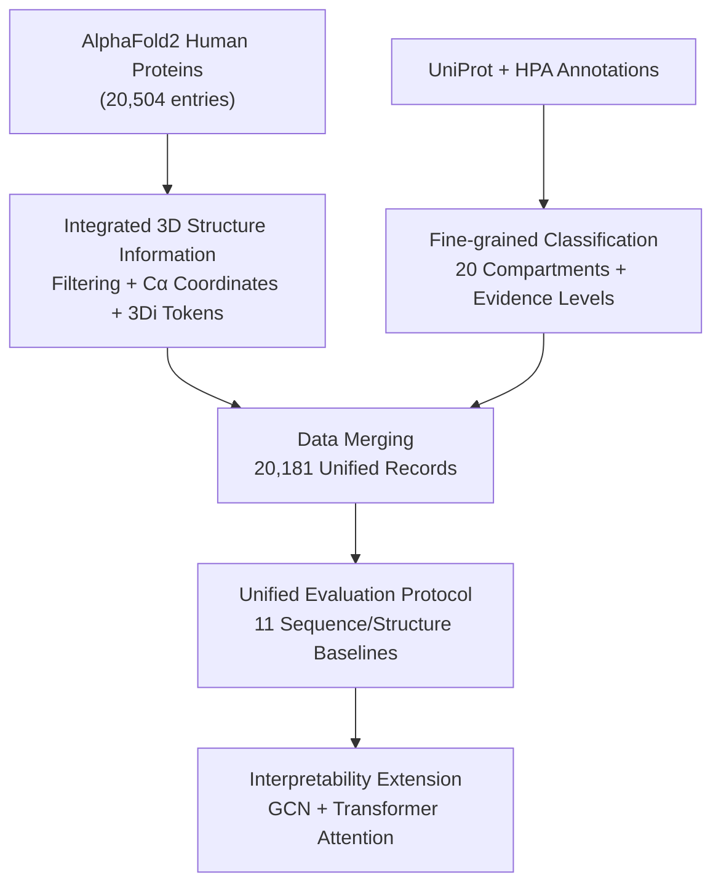

# CAPSUL: A Comprehensive Human Protein Benchmark for Subcellular Localization

**Conference**: ICLR2026  
**OpenReview**: [https://openreview.net/forum?id=wJn4WbvSpK](https://openreview.net/forum?id=wJn4WbvSpK)  
**Code**: TBD (Paper states full data and code are provided in Supp. L)  
**Area**: Computational Biology / Protein Representation Learning / Datasets & Benchmarks  
**Keywords**: Subcellular Localization, Protein 3D Structure, AlphaFold2, Fine-grained Annotation, Structure-based Models  

## TL;DR
CAPSUL constructs the first human protein benchmark (20,181 proteins) that provides both 3D structure information and 20 fine-grained subcellular localization labels. By evaluating 11 sequence/structure baselines under a unified framework, it demonstrates the necessity of 3D structures for localization prediction and discovers a decisive $\alpha$-helix localization pattern in the Golgi apparatus through attention visualization, aligning with experimental evidence.

## Background & Motivation
**Background**: Determining the compartment (nucleus, mitochondria, Golgi, etc.) where a protein is localized is a fundamental task for drug target identification and functional annotation. Recently, data-driven AI methods have become mainstream—given a protein, predicting its subcellular localization can significantly save the time and cost of traditional wet-lab experiments.

**Limitations of Prior Work**: However, the field relies almost exclusively on a single widely accepted dataset, DeepLoc, which only provides amino acid **sequence** information. This has led to the proliferation of "sequence-only" models that infer localization solely from 1D sequences. Biologically, it is well-known that subcellular localization is closely related to a protein's **spatial conformation**: for example, the nuclear localization signal (NLS) of the transcription factor NF-$\kappa$B is exposed only under specific 3D conformations. Sequence-only models cannot capture this information.

**Key Challenge**: On one hand, structure-based protein representation models (benefiting from AF2's ability to compute reliable structures for massive proteins) have shown great power in classification and generation tasks. On the other hand, for subcellular localization—a task clearly dependent on structure—there is **no dataset providing 3D structure inputs**, preventing structure-based models from being utilized. DeepLoc also suffers from coarse-grained compartment divisions (e.g., grouping the nuclear membrane and nucleolus into "nucleus"), which masks specific localization mechanisms and hinders the discovery of biological patterns.

**Goal**: To build a human protein subcellular localization dataset that enables structure-based methods and uncovers detailed biological laws, requiring two components: (1) comprehensive 3D structure information and (2) fine-grained localization classification.

**Key Insight**: Utilize AlphaFold2 to obtain 3D coordinates for each protein and FoldSeek to discretize structures into 3Di tokens. Cross-reference localization annotations from UniProt and HPA databases, followed by expert validation, to refine compartments into 20 categories.

**Core Idea**: Instead of inventing a new model, this work focuses on filling the gap with a unified benchmark featuring "3D structure + fine-grained labels + experimental evidence levels." This allows structure-based methods to be evaluated fairly for the first time and uses attention mechanisms to translate learned structural patterns into biologically verifiable explanations.

## Method

### Overall Architecture
CAPSUL is a pipeline for "data construction + evaluation protocol" rather than a new model architecture. Data construction involves three steps (Figure 1): **Step 1** retrieves all human protein structures from the AlphaFold2 database, filters for quality, extracts $C\alpha$ coordinates, and converts them into 3Di tokens via FoldSeek. **Step 2** collects fine-grained localization labels from UniProt and HPA, aggregating them into 20 compartments and assigning experimental evidence levels. **Step 3** merges structural data and labels by protein ID. Each record contains the protein ID, labels, sequence, length, 3Di tokens, and $C\alpha$ coordinates. A total of 20,181 high-quality proteins are obtained, split into training/validation/test sets (70%:15%:15%).

After dataset construction, a unified evaluation protocol is established: 11 sequence-based and structure-based models are connected to a unified "Encoder + Classifier" head. Evaluation uses Precision, Recall, and F1 (micro/macro). Additional explorations include reweighting, single-label classification to alleviate class imbalance, and an extension injecting Transformer layers into GCNs for enhanced interpretability.

### Key Designs

**1. Integrated 3D Structure Information: Feeding Structure Models**

This directly addresses the lack of 3D inputs. The authors retrieved 20,504 human protein structures from AF2, kept only those marked as active in UniProt (20,401), and removed "fragmented predictions" caused by AF2's sliding window strategy, resulting in 20,181 consistent structures. For each protein, $C\alpha$ atomic coordinates are extracted, and 3Di tokens are generated via FoldSeek. Each protein thus has three representations: sequence, $C\alpha$ coordinates (for GNNs), and 3Di tokens (for low-overhead modeling).

**2. Fine-grained Classification + Evidence Levels: Label Reliability**

CAPSUL refines compartments into 20 categories (Nucleus, Nuclear Envelope, Nucleolus, Nucleoplasm, Cytoplasm, Cytosol, Cytoskeleton, Centrosome, Mitochondria, ER, Golgi, Plasma Membrane, Endosome, Lipid Droplet, Lysosome/Vacuole, Peroxisome, Vesicle, Primary Cilium, Secreted, Sperm). Crucially, **experimental evidence levels** are assigned: UniProt entries with ECO:0000269 are Level 1; other evidence forms are Level 2; no evidence is Level 0. HPA annotations are Level 1. On average, each protein has 2.51 labels, with 85.7% supported by experimental evidence.

**3. Unified Evaluation Protocol: Fair Comparison**

Models are decomposed into "Encoder + Classifier." For the sequence side, the sequence $S=(s_1,\dots,s_n)$ passes through $f_{seq}(S)$ to get embeddings $H$, followed by mean pooling $\bar h=\frac{1}{n}\sum_{i=1}^{n} h_i$ and an MLP classifier $\hat y=\phi(\bar h)$. For the structure side, proteins are modeled as graphs $G=(V,E)$ using $C\alpha$ coordinates, followed by graph encoders and pooling. Training uses binary cross-entropy:
$$L_{BCE}=-\frac{1}{m}\sum_{i=1}^{m}[y_i\log(\hat y_i)+(1-y_i)\log(1-\hat y_i)]$$
Tested models include DeepLoc 2.1, ESM-2, ESM-C (sequence), and CDConv, GearNet-Edge, FoldSeek (structure), among others.

**4. GCN + Transformer Interpretability Extension**

A Transformer encoder is added after a GCN-based model to leverage attention weights. In the Golgi apparatus prediction (100% precision), the authors visualized the top 20 residues by attention score. For diverse proteins (MFNG, B3GALT2, GIMAP1), the model consistently focused on similar **$\alpha$-helical transmembrane domains** (20-30 amino acids length). This discovery matches wet-lab evidence showing that transmembrane domain topology affects Golgi localization by regulating lipid membrane anchorage.

### Loss & Training
The primary evaluation uses BCE multi-label loss. To mitigate imbalance, two strategies were explored: (1) **Reweighting** using inverse frequency $w_c=\frac{1}{f_c}$, log-inverse frequency $w_c=\frac{1}{\log(1+f_c)}$, or Focal loss $L_c=-w_c\sum_i[y_{ic}(1-\hat y_{ic})^\gamma\log(\hat y_{ic})+(1-y_{ic})\hat y_{ic}^\gamma\log(1-\hat y_{ic})]$; (2) **Single-label classification** training separate binary classifiers for rare classes where F1 < 0.1.

## Key Experimental Results

### Main Results
Under the unified protocol, pretrained ESM-C 600M is the strongest overall, while CDConv performs best among structure models.

| Method | Type | Micro F1 | Macro F1 | Micro Precision | Micro Recall |
| :--- | :--- | :--- | :--- | :--- | :--- |
| ESM-2 650M (Fine-tuned) | Seq | 0.375 | 0.150 | 0.647 | 0.264 |
| **ESM-C 600M (Fine-tuned)** | Seq | **0.495** | 0.263 | 0.690 | 0.386 |
| ESM-C 600M (Random Init) | Seq | 0.338 | 0.135 | 0.598 | 0.236 |
| FoldSeek | Struc | 0.248 | 0.092 | 0.605 | 0.156 |
| CDConv (+ Transformer head) | Struc | 0.452 | 0.226 | 0.632 | 0.352 |
| GearNet-Edge (+ Transformer head) | Struc | 0.417 | 0.235 | 0.546 | 0.337 |
| ESM-C + CDConv Fusion | Fusion | 0.476 | 0.235 | 0.634 | 0.381 |

Core observations: (1) Large-scale pretraining is vital for sequence models. DeepLoc performs poorly due to coarse-grained pretraining. (2) 3D structures are decisive; CDConv/GearNet-Edge outperform randomly initialized ESM-C.

### Ablation Study
Replacing $C\alpha$ coordinates with **randomly sampled** coordinates leads to a performance collapse, proving that real structure information is driving the results:

| Configuration | Micro F1 | Micro Precision | Micro Recall |
| :--- | :--- | :--- | :--- |
| CDConv (Random $C\alpha$) | 0.329 | 0.586 | 0.229 |
| **CDConv (Real Coordinates)** | **0.452** | 0.632 | 0.352 |
| GearNet-Edge (Random $C\alpha$) | 0.348 | 0.450 | 0.283 |
| **GearNet-Edge (Real Coordinates)** | **0.417** | 0.546 | 0.337 |

### Key Findings
- **Structural information is critical**: Randomizing $C\alpha$ coordinates dropped the Micro F1 of CDConv from 0.452 to 0.329.
- **Class imbalance is the main bottleneck**: Rare compartments (Lipid Droplet, Peroxisome) often show zero prediction accuracy; reweighting significantly improved Macro F1 (e.g., GearNet-Edge 0.235 $\rightarrow$ 0.304).
- **Structure models capture non-trivial patterns**: Graph Mamba and GearNet-Edge outperform sequence models in certain few-shot classes.
- **Contrastive learning and fusion hold potential**: Adding contrastive loss for CDConv improved F1 for Endosome and Primary Cilium.

## Highlights & Insights
- **Evidence levels as first-class citizens**: CAPSUL provides experimental evidence levels for each label, setting a quality standard for protein datasets.
- **Translating black boxes to verified science**: The consistent identification of $\alpha$-helices for Golgi localization demonstrates the potential for data-driven discovery of cell biology laws.
- **Clean ablation methodology**: The randomized coordinate test provides definitive proof of the structural signal's utility.
- **Unified evaluation design**: Projecting all methods into a unified encoder-classifier framework allows for the first head-to-head comparison between sequence and structural paradigms.

## Limitations & Future Work
- **Absolute performance remains low**: The best Micro F1 (0.495) and Macro F1 (0.263) indicate the task is far from solved.
- **Structure models haven't surpassed sequence models**: While useful, structure-based methods still trail pretrained ESM-C. Aligning sequence and 3D modalities is a future direction.
- **AF2 dependency**: Structural information relies on predictions; the impact of AF2 errors hasn't been fully quantified.
- **Prospects**: Causal discovery between 3D structure and localization using CAPSUL.

## Related Work & Insights
- **vs. DeepLoc / setHARD**: These lack structural input and fine-grained labels. CAPSUL fills all three gaps (Structure, Fine-grained, Evidence).
- **vs. PEER**: PEER evaluated sequence models on DeepLoc; CAPSUL enables evaluations for structure-based models.
- **vs. ESM-2 / ESM-C**: This work complements sequence LMs by showing that spatial conformation signals can provide information sequence LMs might miss.

## Rating
- Novelty: ⭐⭐⭐⭐ First benchmark with 3D + fine-grained + evidence levels; fills a major gap in the community.
- Experimental Thoroughness: ⭐⭐⭐⭐⭐ 11 baselines, randomization ablations, reweighting strategies, and a biological interpretability case study.
- Writing Quality: ⭐⭐⭐⭐ Clear chain from motivation to data construction to interpretation.
- Value: ⭐⭐⭐⭐⭐ Provides a high-quality platform for a long-neglected task and demonstrates discovery of verifiable biological patterns.

<!-- RELATED:START -->

## Related Papers

- [\[ICLR 2026\] GeomMotif: A Benchmark for Arbitrary Geometric Preservation in Protein Generation](geommotif_a_benchmark_for_arbitrary_geometric_preservation_in_protein_generation.md)
- [\[ICLR 2026\] PepBenchmark: A Standardized Benchmark for Peptide Machine Learning](pepbenchmark_a_standardized_benchmark_for_peptide_machine_learning.md)
- [\[ICLR 2026\] Optimal Transport Unlocks End-to-End Learning for Single-Molecule Localization](optimal_transport_unlocks_end-to-end_learning_for_single-molecule_localization.md)
- [\[ICLR 2026\] The Human Brain as a Dynamic Mixture of Expert Models in Video Understanding](the_human_brain_as_a_dynamic_mixture_of_expert_models_in_video_understanding.md)
- [\[ICML 2026\] TadA-Bench: A Million-Variant Benchmark for Future-Round Discovery Toward Agentic Protein Engineering](../../ICML2026/computational_biology/tada-bench_a_million-variant_benchmark_for_future-round_discovery_toward_agentic.md)

<!-- RELATED:END -->
