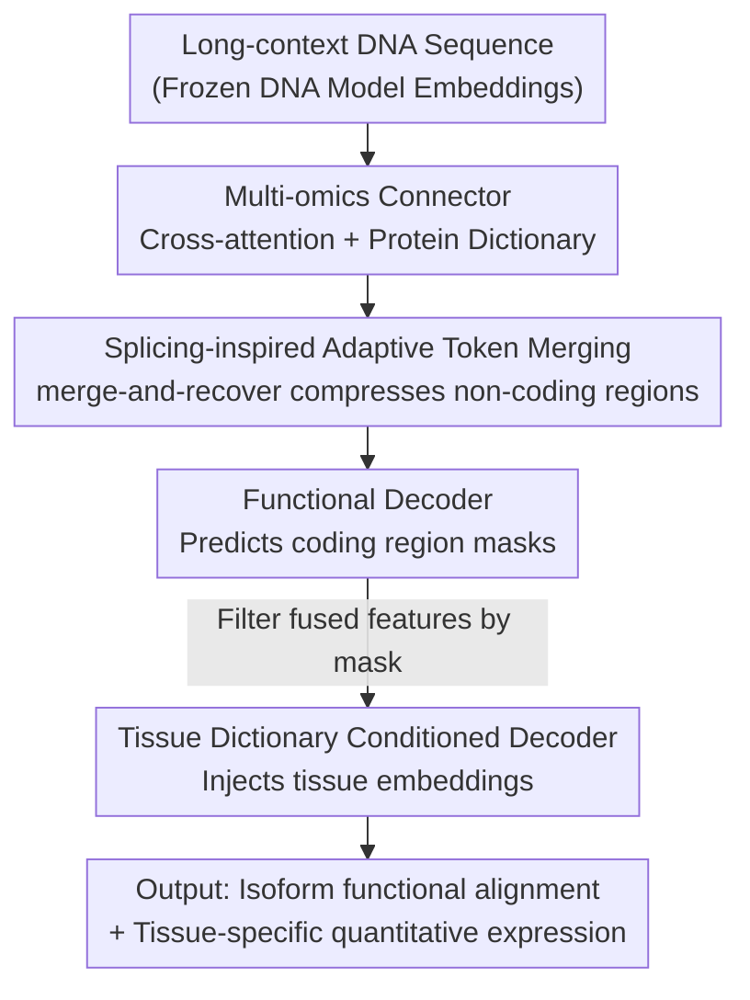

# CDBridge: A Cross-omics Post-training Bridge Strategy for Context-aware Biological Modeling

**Conference**: ICLR2026  
**OpenReview**: [https://openreview.net/forum?id=Hk4Fb6kaYF](https://openreview.net/forum?id=Hk4Fb6kaYF)  
**Code**: TBD  
**Area**: Computational Biology / Cross-omics Modeling  
**Keywords**: Central Dogma, Cross-omics Bridging, Post-training, Tissue-aware Expression Prediction, Adaptive Token Merging

## TL;DR
CDBridge proposes a "post-training bridge" strategy to connect pre-trained frozen DNA and protein models without re-training. Through a two-stage alignment involving "splicing-inspired adaptive token merging + tissue-conditioned decoder," the model achieves both qualitative functional alignment (DNA→Protein) and quantitative gene expression prediction across various tissue contexts for the first time.

## Background & Motivation
**Background**: Mapping genomic DNA sequences to "context-specific quantitative expression" is a core problem in computational biology. Currently, two types of models handle different aspects: single-cell foundational models (scGPT, scFoundation, GeneCompass) capture tissue/cell contexts but operate at the gene ID level without seeing underlying DNA sequences; sequence-to-expression expert models (Enformer, AlphaGenome, Isoformer) process DNA sequences but either work on pre-cropped fragments or average multiple isoforms, smoothing out dynamic splicing information.

**Limitations of Prior Work**: Although existing cross-omics models (CD-GPT, LucaOne, etc.) unify DNA/RNA/protein representations, they focus mostly on qualitative tasks (functional transfer, sequence classification). They ignore two critical biological mechanisms—**alternative splicing** (one gene producing multiple proteins) and **isoform reuse**. Furthermore, they generally overlook the fact that the expression level of the same DNA sequence varies drastically across different tissues. Consequently, quantitative expression—the ultimate determinant of phenotype—remains largely unresolved.

**Key Challenge**: The authors identify two specific obstacles creating this gap: (1) **Severe sequence length mismatch**—a gene often spans hundreds of thousands of base pairs (DNA tokens $\sim 10^4$), while its encoded protein consists of only hundreds of amino acids ($\sim 10^2$); (2) **Ambiguity in context mapping**—alternative splicing and isoform reuse create an inherent "one-to-many" relationship from DNA to protein, where the same sequence follows different splicing paths in different tissues.

**Goal**: To map "full-length DNA sequences" to "tissue-aware quantitative expression" while balancing qualitative (functional alignment) and quantitative (expression regression) aspects, without expensive end-to-end multi-omics re-training.

**Key Insight**: Since single-omics DNA and protein models are already powerful, there is no need to train a unified large model from scratch. Borrowing the idea of "lightweight connectors bridging frozen encoders" from multimodal AI (similar to CLIP/BLIP), the authors apply it to biology while addressing the extreme length disparities and one-to-many mappings unique to the field.

**Core Idea**: A "post-training bridge" framework is used to freeze DNA and protein foundation models, training only intermediate connectors and decoders. Length mismatch is addressed using **splicing-inspired adaptive token merging** to compress non-informative non-coding regions, and environmental dependence is resolved via a **tissue-dictionary conditioned decoder** that injects tissue context.

## Method

### Overall Architecture
CDBridge is a two-stage post-training framework built on **frozen** DNA foundation models (e.g., Evo) and protein foundation models. It uses RNA as an implicit biological intermediary, following the constraints of the "Central Dogma" ($DNA \rightarrow RNA \rightarrow Protein \rightarrow Expression$) to align cross-modal representations.

The input is a raw DNA sequence with long context, and the output consists of two results: (1) functional region masks per token (identifying protein-coding areas), and (2) quantitative expression levels of target proteins under specific tissue conditions. The process involves two stages:

- **Stage 1 (Sequence Context Learning)**: A cross-attention multi-omics connector projects full-length DNA embeddings into a "functionally meaningful protein space." Splicing-inspired adaptive token merging compresses the long sequence to highlight coding regions, and a functional decoder predicts functional masks.
- **Stage 2 (Environmental Context Learning)**: Using the fused features from Stage 1, a tissue dictionary serves as a condition for a conditional decoder to predict isoform-level protein expression within specific tissue contexts.

To evaluate this new setting, the authors constructed **GTEx-Benchmark**, requiring models to solve long-range exon dependencies, isoform reuse, and tissue-specific expression.

### Key Designs

**1. Multi-omics Connector: "Translating" DNA to Protein Space via Protein Dictionary + Cross-attention**

Stage 1 addresses the length mismatch between DNA ($\sim 10^4$ tokens) and proteins ($\sim 10^2$ tokens), as well as the semantic gap caused by different pre-training objectives (DNA embeddings capture genome-wide context, while protein embeddings focus on functional amino acid chains). The authors design a sequence-context-aware connector to project DNA space to protein space. Given DNA embeddings $X_{\text{DNA}} \in \mathbb{R}^{L \times d}$, a learnable protein token dictionary $T_{\text{prot}} \in \mathbb{R}^{M \times d}$ is introduced (initialized via k-means clustering of training set protein embeddings). These dictionary tokens act as keys/values, while DNA embeddings act as queries for cross-attention:

$$\text{Attn}(X_{\text{DNA}}, T_{\text{prot}}, T_{\text{prot}}) = \text{softmax}\!\left(\frac{X_{\text{DNA}} T_{\text{prot}}^{\top}}{\sqrt{d}}\right) T_{\text{prot}}.$$

The dictionary tokens serve as "protein prototypes," allowing each DNA position to retrieve its corresponding functional semantics. This outperforms direct alignment (where Figure 2(a) shows misalignment) or manual cDNA alignment (where Figure 2(b) shows a representation gap) because the dictionary provides biologically meaningful anchors.

**2. Splicing-inspired Adaptive Token Merging: Focus Computation on Coding Regions**

Functional signals in long DNA are sparse and localized (exons code, introns do not). Full-sequence computation is expensive and noisy. Based on ToMe, the authors design a strategy mimicking "transcriptional splicing": DNA token indices are randomly split into disjoint sets $A$ and $B$. Each $i \in A$ finds its most similar partner $j^*(i) = \arg\max_{j \in B} \frac{\langle x_i, x_j\rangle}{\|x_i\|\cdot\|x_j\|}$ in $B$. If similarity exceeds a threshold $\tau$, the pair is merged by averaging $\tilde{x}_i = \frac{1}{2}(x_i + x_{j^*(i)})$, keeping $i$ and discarding $j^*(i)$. The threshold $\tau$ is determined by the merge rate, which is randomly sampled from a Gaussian distribution during training to simulate varying compression strengths.

The "recoverable" aspect is key: a mapping $\pi$ tracks which tokens survived or were merged. During "unmerge," discarded tokens are filled back using their partner's embeddings to restore the original length $\hat{X}_{\text{DNA}}$ for a lightweight Transformer decoder to predict functional regions. This "merge-and-recover" is a variant of MAE, but instead of random masking, it is **adaptive** based on token similarity, thus being saliency-aware and positionally aligned. A notable byproduct (Figure 5) is that even without exon mask supervision, the model spontaneously preserves coding tokens and merges non-coding ones.

**3. Tissue Dictionary Conditioned Decoder: Modeling "Same Sequence, Different Expression"**

Stage 1 handles structural alignment, but Stage 2 addresses tissue-specific expression (e.g., Brain vs. Heart). The authors build a tissue dictionary $T_{\text{Envir}} \in \mathbb{R}^{C \times M \times d}$ ($C$ tissues, $M$ cell tokens) using a single-cell foundational model (scGPT). Bulk RNA data is processed through the model and pooled into global embeddings $t_c$ representing cellular states. The conditional decoder uses the tissue vector as a query and cross-attends to compressed DNA representations $\tilde{X}_{\text{DNA}}$, outputting $M$ tokens: $\{\hat{p}_m\}_{m=1}^{M} \sim p(\{p_m\}_{m=1}^{M} \mid \tilde{X}_{\text{DNA}}, t_c)$. These tokens support both isoform-aware protein embedding (via contrastive loss) and scalar regression for quantitative expression.

Addressing potential "info leakage," the authors demonstrate that tissue vectors are derived from mean-pooling across $\sim 19k$ genes, diluting the signal of any single target gene. Control experiments (Table 4) show that using only tissue embeddings without DNA features drops $R^2$ to near zero, proving they function as conditions rather than independent predictors.

**4. GTEx-Benchmark: Testing Long-range Dependency and Tissue Specificity**

The authors developed GTEx-Benchmark based on GTEx v8 and Ensembl, covering 40 human tissues. It pairs DNA sequences, protein sequences, tissue-specific RNA expression, and functional annotations for protein-coding genes. A strict 80%/10%/10% split by gene ID prevents leakage, and ultra-long genes (>200k bp) are excluded. Unlike Enformer/Isoformer benchmarks, it necessitates identifying distal exons and managing exon reuse across isoforms.

### Loss & Training
Two-stage training: Stage 1 uses a functional decoder for token-level functional mask supervision (predicting coding regions post merge-and-recover). Stage 2 employs dual objectives: contrastive loss for qualitative isoform-protein alignment and a scalar regression head for quantitative tissue-conditioned expression. DNA and protein backbones remain frozen throughout.

## Key Experimental Results

### Main Results: Tissue-aware Gene Expression Prediction
Isoform-level expression prediction on five GTEx tissues using $R^2$ and Spearman correlation. CDBridge significantly outperforms sequence-only baselines and expert models without tissue conditioning:

| Model | Type | Mean $R^2$ | Mean Spearman |
|------|------|-----------|---------------|
| DNABERT-2 | Sequence-only | -0.004 | 0.317 |
| Evo2-7B | Sequence-only | 0.021 | 0.324 |
| LucaOne | Sequence-only(Cross-omics) | 0.001 | 0.309 |
| Enformer | Expert Expression | 0.127 | 0.122 |
| AlphaGenome | Expert Expression | 0.248 | 0.438 |
| Isoformer (w/o TSS Align.) | Expert Expression | -0.315 | 0.309 |
| **CDBridge (Ours)** | Cross-omics Bridge | **0.387** | **0.618** |

> Note: The official Isoformer ($R^2=0.530$, Spearman=0.720) relies on TSS-aligned data settings. Without TSS alignment, its performance drops to $R^2=-0.315$. CDBridge achieves the highest Spearman correlation among comparable methods.

Regarding zero-shot generalization (Figure 4), using a leave-tissue-out protocol, CDBridge performs similarly on unseen tissues as it does on seen ones. Enformer/Isoformer cannot perform unseen tissue prediction without re-training their fixed-dimension output heads.

### Key Findings
- **Tissue conditioning is vital for quantitative expression**: Removing tissue context drops $R^2$ to 0.215, while adding tissue clustering increases it to 0.387. This gain (+0.366) identifies environmental context as the primary contributor to quantitative accuracy.
- **Control Exp**: Using labels only with tissue embeddings yields $R^2 \approx 0.020$, proving tissue signals aren't "leaking" the answer but acting as true conditions.
- **Explainability**: DNA tokens spontaneously align to coding regions (Figure 5), and activated isoform tokens shift according to tissue type (Figure 6).

## Highlights & Insights
- **Efficiency of "Post-training Bridge"**: Achieving cross-omics and tissue-aware capabilities without re-training massive backbones mirrors successful multimodal AI strategies (CLIP/BLIP) in the biological domain.
- **ToMe as "Splicing"**: Reinterpreting token merging as transcriptional splicing provides an "ah-ha" moment: the model naturally learns to ignore introns and focus on exons.
- **Dictionary Anchors**: Using k-means prototypes for dictionaries provides biologically meaningful discrete anchors for cross-modal alignment, proving more stable than direct embedding-to-embedding mapping.

## Limitations & Future Work
- **Exclusion of ultra-long genes**: Genes > 200k bp (top 2% tail) are excluded, though they often involve the most complex regulation.
- **Absolute $R^2$**: A mean $R^2$ of 0.387 leaves room for improvement for reliable clinical quantitative prediction.
- **Dependency on backbones**: Performance is capped by the quality of frozen DNA/protein foundation models and scGPT tissue embeddings.

## Related Work & Insights
- **vs Sequence Models (Evo2, NTv2)**: These lack protein information and tissue context, resulting in near-zero quantitative prediction; CDBridge fills this gap via connectors and decoders.
- **vs Cross-omics Foundational Models (LucaOne, CD-GPT)**: These require expensive end-to-end pre-training and often ignore splicing/environment factors. CDBridge provides a modular, lightweight alternative.
- **vs Expert Expression Models (Enformer, Isoformer)**: These cannot generalize zero-shot to unseen tissues due to fixed output heads. CDBridge's tissue dictionary conditioning overcomes this structural limitation.

## Rating
- Novelty: ⭐⭐⭐⭐⭐ 
- Experimental Thoroughness: ⭐⭐⭐⭐ 
- Writing Quality: ⭐⭐⭐⭐ 
- Value: ⭐⭐⭐⭐⭐ 

<!-- RELATED:START -->

## Related Papers

- [\[ICML 2026\] STRIDE: Post-Training LLMs to Reason and Refine Bio-Sequences via Edit Trajectories](../../ICML2026/computational_biology/stride_post-training_llms_to_reason_and_refine_bio-sequences_via_edit_trajectori.md)
- [\[AAAI 2026\] MergeDNA: Context-aware Genome Modeling with Dynamic Tokenization through Token Merging](../../AAAI2026/computational_biology/mergedna_context-aware_genome_modeling_with_dynamic_tokenization_through_token_m.md)
- [\[ICLR 2026\] AntigenLM: Structure-Aware DNA Language Modeling for Influenza](antigenlm_structure-aware_dna_language_modeling_for_influenza.md)
- [\[ICLR 2026\] CP-Agent: Context-Aware Multimodal Reasoning for Cellular Morphological Profiling under Chemical Perturbations](cp-agent_contextaware_multimodal_reasoning_for_cellular_morphological_profiling_.md)
- [\[ICLR 2026\] Controllable Diffusion-based Generation for Multi-channel Biological Data](controllable_diffusion-based_generation_for_multi-channel_biological_data.md)

<!-- RELATED:END -->
