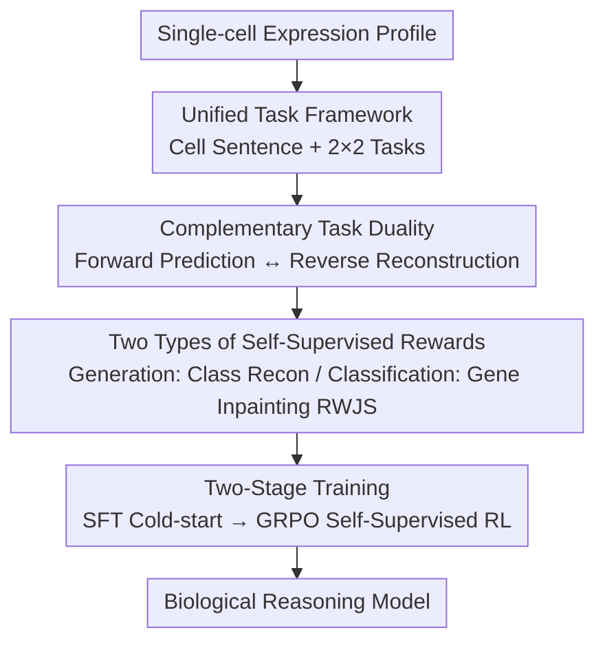

# CellDuality: Unlocking Biological Reasoning in LLMs with Self-Supervised RLVR

**Conference**: ICLR2026  
**OpenReview**: [https://openreview.net/forum?id=I4meJN28Ol](https://openreview.net/forum?id=I4meJN28Ol)  
**Code**: To be confirmed  
**Area**: LLM Reasoning / Computational Biology / Self-Supervised Reinforcement Learning  
**Keywords**: Single-cell Reasoning, RLVR, Task Duality, Self-Supervised Reward, GRPO

## TL;DR
CellDuality organizes four types of single-cell biological reasoning tasks into a unified framework and utilizes "complementary task duality"—where the model forward-predicts a biological outcome and then reversely reconstructs the original input conditions from that outcome, using reconstruction fidelity as an intrinsic reward—to perform RLVR alignment without any ground-truth labels. This enables a 3B Llama model to achieve SOTA on tasks such as cell type annotation, drug sensitivity classification, and perturbation response generation, narrowing the gap with the "supervised RLVR oracle" by 35–56% on OOD perturbation prediction.

## Background & Motivation
**Background**: Using LLMs for "biological reasoning" is a core objective in computational biology—enabling models to infer mechanistic causal chains from cellular data (e.g., why a cell is sensitive to a specific drug) rather than just making predictions. Existing single-cell foundation models (scGPT, Geneformer, C2S-Scale, etc.) have already learned effective representations of transcriptomic data.

**Limitations of Prior Work**: The authors summarize three current shortcomings. First, most models are optimized for **prediction**, excelling at learning correlation patterns (cell type annotation, drug sensitivity classification) but are not explicitly trained to produce coherent, explanatory reasoning steps. Second, the few "reasoning-capable" models remain stuck in the **logical constraint** paradigm; for instance, Cell-o1 models reasoning as deductive puzzle-solving rather than open-ended, hypothesis-driven scientific inquiry. Third, a **trade-off between depth and generality** exists: specialist models reason deeply on single tasks, while multi-task generalists like InstructCell lack equivalent mechanistic insight.

**Key Challenge**: A promising direction is RLVR (Reinforcement Learning from Verifiable Rewards), which has significantly enhanced reasoning in domains like mathematics and coding. However, it is nearly unusable in biology—**most biological outcomes are non-verifiable**. For example, there is no unique "correct" answer for a generated gene sequence of a conditioned cell, making it impossible to score with a deterministic verifier. This lack of verification signals fundamentally blocks the training of unified models in open-ended causal scenarios.

**Goal**: Can a reliable intrinsic reward signal be constructed directly from the **structure** of these biological problems to enable Reinforcement Learning (RL) without external supervision?

**Key Insight**: Inspired by DuPO, the authors observed that many biological reasoning tasks are naturally paired—if the forward question is "cell + drug → new cell," the reverse is "new cell + known cell → what drug." If the forward prediction is correct and logically consistent, the model should be able to reconstruct the original input from the output. Higher reconstruction accuracy indicates higher forward credibility.

**Core Idea**: Use the consistency of "complementary task duality" as an intrinsic reward. The fidelity of reconstructing the original input serves as a direct measure of the forward output's biological and logical consistency. This extends RLVR from verifiable domains to unverifiable biological domains, requiring no ground-truth labels for the entire RL process.

## Method

### Overall Architecture
CellDuality aims to solve "RL alignment on single-cell tasks without verifiable labels." The approach involves: first, converting single-cell expression profiles into sorted "Cell Sentences" (text sequences of top-K genes in descending order of expression) fed into a unified framework covering four types of reasoning tasks; then, using a small, high-quality CoT dataset for SFT cold-starting to teach the model the "language and format" of biological reasoning; and finally, performing self-supervised RL (GRPO) on large-scale unlabeled data, using intrinsic rewards generated by "complementary task duality" to align the model with biological/logical consistency.

The four tasks are organized into a 2×2 matrix, with the horizontal axis representing task type (Classification / Generation) and the vertical axis representing two major biological themes (**Cell Identity** and **Cell Dynamics**): cell type annotation (cell → label), conditional cell generation (label → cell), drug sensitivity classification (cell + drug → label), and perturbation response generation (cell + drug → new cell).

### Key Designs

**1. Unified Task Framework: Framing Reasoning within Cell Sentence + 2×2 Tasks**

To address the issue that existing models either only predict or only reason on single tasks, the authors frame the problem using a unified data structure and task set. A cell $c=\{g_1,g_2,\dots,g_K\}$ is represented as a sequence of top-K genes sorted in **descending** order of expression (the Cell Sentence). Perturbations are defined as $p=\{\text{operation},\text{target}\}$ (knockdown / overexpression), while cell types $t$ and sensitivity labels $s$ are categories from predefined sets. All inputs are concatenated into a text prompt $x$, and the model autoregressively produces $y=\{z,a\}$ (reasoning trajectory $z$ + final answer $a$). The 2×2 matrix spans from static identity to causal dynamics, enabling the "forward / reverse" pairing essential for duality rewards.

**2. Complementary Task Duality: Rewriting Unsupervised Problems as Self-Verifiable Ones**

This is the core of the paper. Directly applying RL to the four tasks lacks scalable reward sources. The authors rewrite a single biological problem into a pair of **mutually verifying** tasks: the primal task $T_p:\mathcal{X}\to\mathcal{Y}$ segments the input space into known components $x_k$ and unknown components $x_u$ ($\mathcal{X}=\mathcal{X}_k\cup\mathcal{X}_u$); the complementary dual task $T_{cd}:(y,x_k)\mapsto\hat{x}_u$ uses the primal output $y$ and known component $x_k$ to reconstruct the unknown component. A pair $(T_p,T_{cd})$ satisfies the "complementary consistency principle" if and only if:

$$\forall x\in\mathcal{X},\ y=T_p(x):\quad d\big(x_u,\,T_{cd}(y,x_k)\big)\le\epsilon,$$

where $d(\cdot,\cdot)$ is a domain-specific distance metric and $\epsilon\ge0$ is a tolerance threshold. This principle converts unsupervised problems into self-verifiable ones: reconstruction fidelity $d(x_u,\hat{x}_u)$ directly measures the logic and biological consistency of the forward output $y$. Unlike classic dual learning, it uses $x_k$ as a contextual anchor, bypassing irreversibility and asymmetry.

**3. Two Types of Self-Supervised Rewards: Category Reconstruction and Conditional Gene Inpainting**

To implement the duality principle, two reward designs are used. For **generation tasks** (perturbation response, conditional cell generation), the forward pass produces a high-dimensional cell sequence ($c_{post}$ or $c$), and the reverse pass reconstructs a categorical input label (drug $s$ or cell type $t$). The reward is a binary signal:

$$r(y\mid x)=\mathbb{I}(\hat{x}_u=x_u),$$

based on the intuition that a biologically plausible cell sequence should unambiguously encode its generation conditions. For **classification tasks** (cell type annotation, drug sensitivity), the forward output is low-information, making it impossible to reconstruct an entire cell. Thus, the authors designed **conditional gene inpainting**: the input cell sequence is split into visible parts $c_{obs}$ and hidden parts $c_{hid}$ (treated as $x_u$). The reverse task reconstructs $\hat{c}_{hid}$ given $c_{obs}$ and the predicted label. The reward is a continuous score $r(\hat{t}\mid c)=\mathrm{RWJS}(c_{hid},\hat{c}_{hid})$. Here, RWJS (Rank-Weighted Jaccard Similarity) weights the standard Jaccard index by the inverse rank of genes $w(g,c)=1/\mathrm{rank}(g,c)$, emphasizing high-expression genes:

$$\mathrm{RWJS}(c^*,c_{gen})=\frac{\sum_{g\in S^*\cap S_{gen}}\frac{w(g,c^*)+w(g,c_{gen})}{2}}{\sum_{g\in S^*}w(g,c^*)+\sum_{g\in S_{gen}\setminus S^*}w(g,c_{gen})},$$

where $S^*=\mathrm{Set}(c^*)$ and $S_{gen}=\mathrm{Set}(c_{gen})$, ranging from 0 to 1. This forces the model to base classification on deep understanding of cellular gene signatures.

**4. Two-Stage Training: SFT Cold-start + GRPO Self-Supervised RL**

Since raw RL models cannot initially "speak" biological reasoning, SFT is used for cold-starting. SFT data $\mathcal{D}_{SFT}$ is generated by teacher models (GPT-4o, Gemini 2.5 Pro) with CoT, filtered by task-specific quality checks: strict rejection sampling for classification and Rank-Aware Filtering (RWJS threshold) for generation. Dual prompts $x_{dual}=(y^*,x_k)$ are also constructed to explicitly teach reverse reasoning. The second stage uses GRPO for self-supervised alignment on unlabeled data $\mathcal{D}_{RL}$: for each prompt, $G$ candidates are sampled, each receiving a reward based on dual task performance. Advantages $A_k$ are normalized within the group:

$$\mathcal{J}_{GRPO}(\theta)=\mathbb{E}\big[\min(\rho_t A_t,\ \mathrm{clip}(\rho_t,1-\epsilon_c,1+\epsilon_c)A_t)-\beta D_{KL}(\pi_\theta\Vert\pi_{ref})\big],$$

where $\rho_t=\pi_\theta(y_t\mid x)/\pi_{\theta_{old}}(y_t\mid x)$. The process is entirely independent of ground-truth labels.

### Loss & Training
The base model is Llama-3.2-3B. SFT runs for 3 epochs at a learning rate of $1\mathrm{e}{-5}$. RL uses GRPO with group size $G=8$, train batch 512, mini-batch 32, and 200 steps. Training utilized 8×A6000 GPUs.

## Key Experimental Results

### Main Results
A single multi-task model vs. specialized models trained on specific benchmarks.

| Task | Dataset/Metric | CellDuality | SFT-only | Representative Baseline |
|------|------|------|------|------|
| Cell Type Annotation (ID) | Segerstolpe-2016 Acc. | 99.81 | 98.76 | InstructCell 100.0 |
| Cell Type Annotation (OOD) | Bastidas-Ponce-2019 F1 | 78.12 | 57.24 | InstructCell 88.69 |
| Drug Sensitivity (ID) | GSE117872 Acc. | 97.23 | 96.78 | InstructCell 100.0 |
| Perturbation Response (OOD sci-Plex3) | scFID ↓ | 0.038 | 0.045 | C2S-Scale GRPO(GT) 0.02 |
| Conditional Generation (ID) | Human Immune kNN@3 ↑ | 26.34 | 24.92 | C2S-160M 25.88 |

On OOD perturbation response generation, duality-guided RL yields significant improvements over SFT and narrows the gap with the "supervised oracle" by **35–56%**.

### Ablation Study
Comparison of "Self-Supervised RL vs. Ground-Truth Supervised RL," both initialized from the same SFT checkpoint.

| Configuration | He-2020-Liver Acc. | He-2020-Liver F1 | sci-Plex3 scFID ↓ |
|------|------|------|------|
| Llama-3.2-3B-Instruct (Vanilla) | 22.45 | 52.82 | - |
| SFT-only | 95.83 | 94.67 | 0.045 |
| RL with Ground-Truth (Oracle) | 97.21 | 94.85 | 0.025 |
| Ours (Self-Supervised RL) | 96.34 | **95.41** | 0.038 |

### Key Findings
- Self-supervised RL consistently outperforms SFT-only and significantly closes the gap with the supervised oracle, even **surpassing** the oracle in Macro F1 on He-2020-Liver (95.41 vs 94.85), suggesting duality consistency learns more robust boundaries.
- Rewards (binary for generation, continuous RWJS for classification) rise steadily during RL, confirming that duality signals are optimizable and do not collapse.
- Competitiveness is maintained across OOD and cross-species (e.g., GSE110894 mouse bone marrow) scenarios.

## Highlights & Insights
- **Converting "Unverifiable" to "Self-Verifiable"**: Bypasses the limitation of RLVR in biology by validating the ability to reconstruct the input rather than checking an output that has no single ground truth.
- **Conditional Inpainting for Low-Info Labels**: Cleverly addresses categorical outputs by hiding part of the gene sequence and requiring reconstruction, using RWJS to ensure high-expression genes drive the reward.
- **Sample/Label Efficiency**: Reaches or exceeds supervised oracle performance with zero ground-truth labels during RL, crucial for expensive wet-lab biology.
- **Contextual Anchoring**: Using $x_k$ as an anchor to solve irreversibility in duality learning is a transferable technique for other self-supervised designs.

## Limitations & Future Work
- **Proxy Reward Risks**: Logical consistency in reconstruction does not guarantee biological truth; the model might learn "shortcuts" that are self-consistent but mechanistically wrong.
- **Reverse Task Dependency**: Reconstruction quality is limited by the reverse module's capability; both ends might converge on a "false consistency."
- **Scale and Base Model**: Only verified on Llama-3.2-3B with 200 RL steps; scaling remains unexplored.
- **OOD Gaps**: Still lags behind specialists like InstructCell on certain OOD benchmarks (F1 78.12 vs 88.69).

## Related Work & Insights
- **vs DuPO**: Adapts duality to unverifiable biological domains using domain-specific forms like conditional gene inpainting.
- **vs Cell-o1 / ESCARGOT**: Moves beyond pure logical puzzles or external knowledge graphs toward open-ended reasoning from cellular data.
- **vs scGPT / Geneformer / C2S-Scale**: Complements representation learning by explicitly optimizing reasoning consistency via RL.
- **vs Standard RLVR**: Substantially expands the boundaries of RLVR by providing verifiers where deterministic ones were previously absent.

## Rating
- Novelty: ⭐⭐⭐⭐⭐ 
- Experimental Thoroughness: ⭐⭐⭐⭐ 
- Writing Quality: ⭐⭐⭐⭐ 
- Value: ⭐⭐⭐⭐⭐ 

<!-- RELATED:START -->

## Related Papers

- [\[ICLR 2026\] CryoLVM: Self-supervised Learning from Cryo-EM Density Maps with Large Vision Models](cryolvm_self-supervised_learning_from_cryo-em_density_maps_with_large_vision_mod.md)
- [\[ICLR 2026\] Lost in Tokenization: Context as the Key to Unlocking Biomolecular Understanding in Scientific LLMs](lost_in_tokenization_context_as_the_key_to_unlocking_biomolecular_understanding_.md)
- [\[ICLR 2026\] Animal behavioral analysis and neural encoding with transformer-based self-supervised pretraining](animal_behavioral_analysis_and_neural_encoding_with_transformer-based_self-super.md)
- [\[ICLR 2026\] Towards Knowledge-and-Data-Driven Organic Reaction Prediction: RAG-Enhanced and Reasoning-Powered Hybrid System with LLMs](towards_knowledgeanddatadriven_organic_reaction_prediction_ragenhanced_and_reaso.md)
- [\[ICML 2026\] Learning the Neighborhood: Contrast-Free Multimodal Self-Supervised Molecular Graph Pretraining](../../ICML2026/computational_biology/learning_the_neighborhood_contrast-free_multimodal_self-supervised_molecular_gra.md)

<!-- RELATED:END -->
