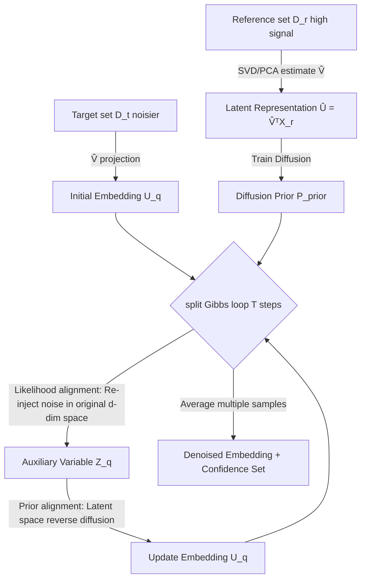

# Clustering by Denoising: Latent Plug-and-Play Diffusion for Single-Cell Embeddings

**Conference**: ICLR 2026  
**OpenReview**: [https://openreview.net/forum?id=zxlbh55PhC](https://openreview.net/forum?id=zxlbh55PhC)  
**Code**: [https://github.com/dommeier/dice](https://github.com/dommeier/dice)  
**Area**: Computational Biology / Single-cell RNA Sequencing / Probabilistic Methods  
**Keywords**: Single-cell sequencing, denoising, plug-and-play diffusion, posterior sampling, Gibbs sampling, uncertainty quantification, cell clustering

## TL;DR
Adapting "Plug-and-Play (PnP) diffusion denoising" to the single-cell context, DICE is proposed: it performs diffusion priors in a low-dimensional latent space for denoising while re-injecting noise into the original high-dimensional observation space to "steer" the sampling trajectory. This avoids the collapse issue where different cell types are crowded together in PCA latent space, allowing high-quality reference data to denoise noisier target data, significantly improving clustering and cell-type separability.

## Background & Motivation
**Background**: Single-cell RNA sequencing (scRNA-seq) enables the characterization of cellular heterogeneity at individual cell resolution. The standard pipeline involves dimensionality reduction (typically PCA) $\rightarrow$ clustering $\rightarrow$ manual annotation based on marker genes to build a "cell atlas."

**Limitations of Prior Work**: scRNA-seq data is extremely noisy, containing both technical artifacts (like capture efficiency variations) and biological stochasticity. Standard clustering algorithms amplify these noises, leading to unreliable labels. Crucially, linear dimensionality reduction like PCA can project distinct cell types into the same region (latent space collapse). Denoising within such compressed representations loses the geometric information required for precise guidance.

**Key Challenge**: Directly porting PnP diffusion from the imaging domain is non-trivial—image pixel noise is largely independent, whereas gene expression has intrinsic low-rank structures and complex correlations. Furthermore, denoising must preserve the relationship structure between cells for correct clustering. Existing Bayesian single-cell methods (VAEs like scVI, approximate message passing like empirical Bayes denoisers) rely on restrictive generative assumptions, require parametric noise modeling, and scale poorly to high-dimensional latent spaces.

**Goal**: Reformulate single-cell denoising as an **inverse problem**—recovering clean gene expression from noisy measurements without imposing strong generative assumptions, enabling high-signal reference datasets (e.g., SMART-seq2) to enhance noisier target datasets (e.g., droplet-based scRNA-seq).

**Key Insight**: **Separation of "observation space" and "denoising space."** The learned diffusion prior performs denoising in a low-dimensional latent space. To guide this process, noise is re-injected into the original high-dimensional observation space—termed "input-space steering." This keeps the denoising trajectory faithful to the original data structure while adaptively balancing the prior and observation via a tunable parameter $\rho$, and quantifying uncertainty through the average of multiple samples.

## Method

### Overall Architecture
DICE (Diffusion Induced Cell Embeddings) is built upon a low-rank factor model $X_i = V U_i + \varepsilon_i$, where $V$ is the factor loading matrix spanning the transcriptional space, $U_i$ represents the low-dimensional biological signal, and $\varepsilon_i$ is noise. The reference and target sets share the same loading matrix $V$ learned from the reference data, thereby projecting the target data into a latent space consistent with the reference for knowledge transfer. The process consists of two stages: THE **Training Phase** uses SVD on the reference set $D^{(r)}$ to estimate $\hat V$, then trains a diffusion model as a prior $P_{\text{prior}}$ on the 15–25 dimensional latent representations obtained via $\hat V^\top X^{(r)}$; the **Inference Phase** runs a split Gibbs sampler for each query cell, alternating between "likelihood alignment" and "prior alignment" steps, using the average of multiple samples as the denoised embedding.

### Key Designs

**1. Posterior Sampling + Auxiliary Variable Splitting: Decoupling likelihood and diffusion prior.** The goal is to sample from the posterior $\pi(U\mid X)\propto f(X-UV^\top\mid U)\,P_{\text{prior}}(U)$. However, satisfying local reconstruction constraints (likelihood) and global manifold structures (implicit diffusion prior) simultaneously is difficult. DICE draws from split Gibbs by introducing an auxiliary variable $Z_i$ to replace $U_i$ in the likelihood, then enforcing consistency between $U_i$ and $Z_i$ via a Gaussian penalty, yielding the augmented distribution:

$$P_\rho(X_i, U_i, Z_i)\propto \exp\Big(-\log f(X_i - V Z_i) - \tfrac{1}{2\rho^2}\lVert U_i - Z_i\rVert_2^2 - \log P_{\text{prior}}(U_i)\Big).$$

This alignment penalty is manually introduced (not from standard conjugation), which allows for "plug-and-play" use of an implicitly defined diffusion prior during inference, enabling efficient posterior sampling even when the likelihood is non-Gaussian and the prior has no explicit form.

**2. Input-space Steering: Likelihood step re-injects noise in high-dim observation space (The most critical design).** The Gibbs sampler alternates between two steps—the Prior Alignment step (Line 5) performs standard reverse diffusion in the latent space: $x_{t-1}=\frac{1}{\sqrt{\alpha_t}}\big(x_t-\frac{1-\alpha_t}{\sqrt{1-\bar\alpha_t}}\hat\varepsilon_\theta(x_t)\big)+\sqrt{1-\alpha_t}\,z_t$; whereas the **Likelihood Alignment step (Line 4) does not occur in latent space but returns to the original $d$-dimensional observation space** to re-inject noise through $\log f(X_q - \hat V Z_q)$. This directly resolves PCA latent space collapse—by imposing data consistency constraints in the high-dimensional space where geometric relations are preserved, the denoising trajectory is "steered" towards biologically meaningful structures hidden by compression, rather than denoising blindly in a collapsed latent space.

**3. Annealing Schedule for Parameter $\rho$: Adaptive balancing of prior and observation.** $\rho_s$ controls the alignment strength between $U_i$ and $Z_i$: a larger $\rho$ emphasizes population-level prior structures (suitable for noisy queries), while a smaller $\rho$ remains faithful to the observed expression profile. During inference, an annealing schedule $\{\rho_s\}_{s=1}^T$ is used (e.g., linearly decreasing from 5 to 0.5), with the reverse diffusion chain length chosen such that $\bar\alpha_{t_0}\approx(1+\rho_s^2)^{-1}$. It preserves data-specific signals when distributions align and relies on the prior for stability when input is extremely noisy—an adaptivity traditional clustering/imputation methods lack.

**4. Closed-form Updates under Gaussian Likelihood + Uncertainty via Sampling.** Single-cell data often undergoes log1p transformation and is modeled with Gaussian noise. In this case, the likelihood step has a closed-form solution (Proposition 3.1):

$$Z_q^{(s)}\sim\mathcal{N}_k\Big(\Lambda\big(\hat V^\top X_q+\tfrac{1}{\rho_s^2}U_q^{(s)}\big),\ \Lambda\Big),\quad \Lambda=\big(\hat V^\top\hat V+\tfrac{1}{\rho_s^2}I_k\big)^{-1},$$

avoiding the iterative overhead of general proximal schemes. Furthermore, **running DICE multiple times for the same query cell and observing the dispersion of embeddings** allows for the construction of confidence sets: if inputs map consistently to a cluster center (high confidence) or split between two clusters (high uncertainty), $\rho$ directly controls the size of the confidence set—providing quantified reliability for downstream soft labeling.

## Key Experimental Results

### Main Results (Synthetic Data)
In a controlled setup with $d=2000$, $k=15$, and two balanced Gaussian mixture components representing cell types, PCA and DICE were compared across four types of train-test drift:

| Setup (Drift Type) | Silhouette PCA | Silhouette DICE | cLISI PCA | cLISI DICE |
|---|---|---|---|---|
| 1 Matched Distribution | 0.25 | **0.37** | 1.27 | **1.17** |
| 2 Signal Strength Drift (Noise ×10) | 0.24 | **0.36** | 1.27 | **1.17** |
| 3 Noise Model Drift (Heavy-tailed t) | 0.22 | **0.34** | 1.32 | **1.18** |
| 4 Latent Prior Drift (Heavy-tail mix + High noise) | 0.22 | **0.28** | 1.35 | **1.27** |

(Higher Silhouette is better, lower cLISI is better). DICE consistently outperformed PCA across all four drifts, demonstrating robustness to likelihood misspecification, prior misspecification, and signal degradation.

### Main Results (Real Single-cell Data)
Used CITE-seq (PBMC immune cells, ~30 subtypes) and Human Fetal Brain development (cross-dataset label transfer) to compare mainstream denoising pipelines:

| Method | CITE-seq ARI | CITE-seq NMI | Neo-Cortex ARI | Neo-Cortex NMI |
|---|---|---|---|---|
| **DICE** | **0.805** | **0.740** | **0.393** | **0.553** |
| PCA | 0.745 | 0.689 | 0.347 | 0.496 |
| ALRA | 0.604 | 0.713 | 0.310 | 0.474 |
| kNN (15) | 0.735 | 0.683 | 0.268 | 0.442 |
| MAGIC | 0.674 | 0.648 | 0.317 | 0.502 |
| NMF | 0.448 | 0.430 | 0.209 | 0.220 |
| scVI (10) | 0.641 | 0.595 | – | – |

DICE consistently led across most metrics. On CITE-seq, it performed significantly better at separating CD4/CD8 T cell sub-lineages and difficult MAIT cells (often requiring multi-modal data); on fetal brain data, the classic excitatory developmental trajectory (RG→IPC→nEN→EN) was continuous in DICE embeddings, whereas it was fractured and noisy in PCA.

### Key Findings
- **Denoising can surpass training distributions**: By training the prior on a high-signal reference and denoising a low-signal target with averaging, the quality can exceed the reference data itself.
- **Cross-dataset transfer is effective**: Training on Nowakowski and testing on Polioudakis (different tissues, related but distinct cell types) still yielded a lead, validating robustness to real distribution drifts.
- **Acceptable efficiency**: Training on CITE-seq took approx. 36 minutes, inference approx. 12 minutes (single RTX PRO 6000).

## Highlights & Insights
- **The "Separation of Observation and Denoising Spaces" is a clean insight**: Denoising is done in the low-dimensional latent space (which diffusion priors handle well and scalably), but navigation signals come from the high-dimensional original space (preserving geometry), solving the PCA collapse issue.
- **Likelihood-free**: It does not require an explicit generative model or pre-modeling of noise structures, learning the prior directly from data, making it much more flexible than VAE/Empirical Bayes methods.
- **Uncertainty quantification as a free byproduct**: Using the dispersion of repeated samples to construct confidence sets, with $\rho$ interpretably controlling size, is practical for clinical and soft-labeling applications.
- **Successful domain transfer of PnP ideas**: Properly tailors the split Gibbs / input-space consistency from image inverse problems to the low-rank and relational needs of single-cell data.

## Limitations & Future Work
- **Linear low-rank + i.i.d. Gaussian noise assumption**: The factor model $X=VU+\varepsilon$ is linear. Extending to non-linear structures and relaxing i.i.d. noise assumptions is listed as primary future work.
- **Sampling efficiency**: Split Gibbs requires T=100–200 iterations, with reverse diffusion chains at each step; there is room for optimization.
- **Dependency on high-quality reference sets**: The method performs best when the reference set noise is lower than the target set; the reverse scenario is not fully discussed.
- **Coverage**: Does not yet cover multi-modal or spatial information, and embedding quality has not been evaluated on clinically meaningful downstream tasks.

## Related Work & Insights
- **PnP Diffusion**: Xu & Chi 2024's split Gibbs and various PnP frameworks (Zhu 2023, Go 2023) are direct influences; DICE's contribution is tailoring these to single-cell data.
- **Single-cell Bayesian/Generative Methods**: scVI (VAE) and empirical Bayes approximate message passing (Zhong 2022, Nandy & Ma 2024) are benchmarks—DICE uses likelihood-free diffusion priors to escape their parametric noise modeling and latent space limitations.
- **Traditional Denoising**: MAGIC, ALRA, kNN smoothing, and NMF are baselines, with Seurat/Harmony as standard pipelines.
- **Insight**: When an inverse/denoising problem benefits from compressed modeling but loses guidance info, explicitly separating the "modeling space" and "navigation/consistency space" is a reusable paradigm—worthy of transfer to other low-rank scientific data (e.g., spatial transcriptomics, proteomics).

## Rating
- **Novelty**: ⭐⭐⭐⭐ — The "latent denoising + input-space steering" design effectively addresses single-cell needs, despite the underlying split Gibbs PnP concept being borrowed.
- **Experimental Thoroughness**: ⭐⭐⭐⭐ — Covers synthetic drifts, two real datasets, 7 baselines, multiple metrics, cross-dataset transfer, and uncertainty visualization.
- **Writing Quality**: ⭐⭐⭐⭐ — Clear logic from motivation to contradiction to method. Complete formulas and algorithms.
- **Value**: ⭐⭐⭐⭐ — High demand for single-cell atlas construction; the ability to denoise dirty data with clean references and provide uncertainty quantification is highly practical.

<!-- RELATED:START -->

## Related Papers

- [\[ICML 2026\] Plug-and-Play Guidance for Discrete Diffusion Models via Gradient-Informed Logit Correction](../../ICML2026/computational_biology/plug-and-play_guidance_for_discrete_diffusion_models_via_gradient-informed_logit.md)
- [\[ICML 2026\] Scalable Single-Cell Gene Expression Generation with Latent Diffusion Models](../../ICML2026/computational_biology/scalable_single-cell_gene_expression_generation_with_latent_diffusion_models.md)
- [\[ICLR 2026\] Learning Explicit Single-Cell Dynamics Using ODE Representations](learning_explicit_single-cell_dynamics_using_ode_representations.md)
- [\[ICLR 2026\] PETRI: Learning Unified Cell Embeddings from Unpaired Modalities via Early-Fusion Joint Reconstruction](petri_learning_unified_cell_embeddings_from_unpaired_modalities_via_early-fusion.md)
- [\[ICLR 2026\] scDFM: Distributional Flow Matching for Robust Single-Cell Perturbation Prediction](scdfm_distributional_flow_matching_model_for_robust_single-cell_perturbation_pre.md)

<!-- RELATED:END -->
