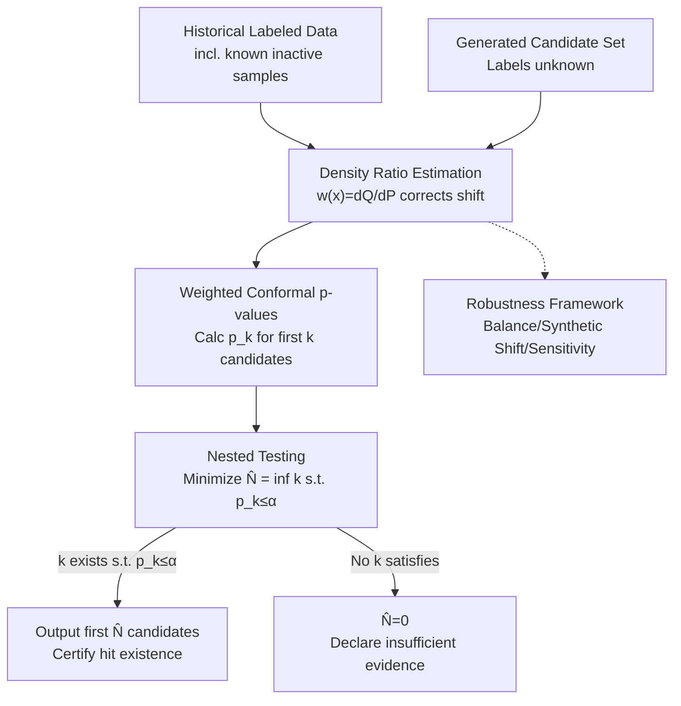

# ConfHit: Conformal Generative Design with Oracle Free Guarantees

**Conference**: ICLR 2026  
**arXiv**: [2603.07371](https://arxiv.org/abs/2603.07371)  
**Code**: None  
**Area**: Computational Biology  
**Keywords**: conformal prediction, generative design, drug discovery, density ratio, statistical guarantee

## TL;DR

Ours proposes the ConfHit framework, which utilizes density ratio-weighted conformal permutation p-values to achieve "certification" (judging if a generated batch contains a hit) and "design" (refining candidate sets while maintaining statistical guarantees). ConfHit provides finite-sample $1-\alpha$ coverage guarantees for generative molecular design without requiring experimental oracle validation and in the presence of distribution shifts.

## Background & Motivation

**Background**: Deep generative models (VAEs, diffusion, autoregressive Transformers) excel in molecular discovery. However, practical deployment requires guarantees that generated molecules satisfy target properties—which typically necessitates expensive wet-lab or in-vivo experimental validation. Conformal Prediction (CP) provides a model-agnostic statistical guarantee framework and has recently been extended to generative tasks (Quach et al., 2023; Shahrokhi et al., 2025). **Limitations of Prior Work**: (a) **Requirement for oracle access**—existing CP generation methods require experimental validation (synthesis + testing) of newly generated samples, which is prohibitively expensive and infeasible in drug discovery; (b) **Distribution shift**—the distribution $Q$ of generated samples may differ from the distribution $P$ of historical labeled data, violating exchangeability assumptions; (c) **Budget constraints**—under limited generation budgets, it cannot be guaranteed that a valid molecule is included, requiring an honest declaration of "insufficient confidence" rather than blind claims of success. **Key Challenge**: Providing statistical guarantees without validating new samples while handling distribution shifts—a fundamental difficulty for classic CP frameworks. **Goal**: Address two core problems: (i) **Certification**—given a generated batch, can one guarantee the inclusion of at least one hit with probability $1-\alpha$? (ii) **Design**—can one refine the candidate set to a minimal subset while maintaining this guarantee? **Key Insight**: Utilize "inactive" samples from historical labeled data (known $Y_i$) and weighted exchangeability between them and generated samples (using density ratios to correct shifts), eliminating the need for an oracle. **Core Idea**: Density ratio-weighted permutation p-values + nested testing = oracle-free finite-sample guarantees.

## Method

### Overall Architecture

ConfHit answers a practical question: Can we provide a statistical guarantee that "at least one true hit exists in this batch" for a set of generated molecules **without sending them to a lab for validation**? It utilizes two components—historical data with known labels $\mathcal{D}_{\text{calib}}=\{(X_i,Y_i)\}_{i=1}^n$ ($Y_i \in \{0,1\}$ representing tested properties) and a batch of newly generated samples with unknown labels $\{X_{n+j}\}_{j=1}^N$.

The pipeline operates as follows: first, estimate the density ratio $w(x) = dQ/dP(x)$ of the generative distribution relative to the historical distribution to correct for distribution shifts. Then, construct nested subsets $\{X_{n+j}\}_{j=1}^k$ from the candidate set and calculate a weighted conformal p-value $p_k$ for each. Finally, perform nested testing to find the minimum $\hat{N} = \inf\{k: p_k \leq \alpha\}$, outputting the first $\hat{N}$ candidates as the refined set. If no $k$ satisfies $p_k \leq \alpha$, it outputs $\hat{N}=0$, declaring "insufficient evidence" rather than providing a false guarantee. Since the validity of the guarantee depends on the accuracy of the density ratio estimation, a robustness diagnostic framework is included for monitoring.

### Key Designs

**1. Weighted Conformal p-values: Quantifying "hit existence in a batch" without validation**

The difficulty of certification lies in the fact that classical CP relies on exchangeability between calibration and test samples. However, the distribution $Q$ of generated samples often differs from the historical distribution $P$. ConfHit resolves this by using ONLY the inactive samples $\{X_i: Y_i=0\}$ from historical data as a reference and applying density ratio weighting to compensate for distribution shifts, restoring **weighted exchangeability** in the sense of Tibshirani et al. (2019). This is extended from single test samples to a batch. Specifically, a randomized p-value is calculated over $B$ random permutations:

$$p_N^{\text{rand}} = \frac{\sum_{b=0}^B \bar{w}(\pi^{(b)};\bm{X}) \mathbb{1}\{V(\pi_0;\bm{X}) \leq V(\pi^{(b)};\bm{X})\}}{\sum_{b=0}^B \bar{w}(\pi^{(b)};\bm{X})}$$

Where $\bar{w}(\pi;\bm{X}) = \prod_{j=1}^k w(X_{\pi(n+j)})$ is the joint likelihood ratio of the batch, acting as the debiasing factor. **Theorem 3.1** proves that this p-value is conservative under the null hypothesis that "the batch contains no hits": $\Pr(p_N^{\text{rand}} \leq t \mid \max_{j} Y_{n+j}=0) \leq t$. This is a finite-sample, model-agnostic result independent of the scoring model quality.

**2. Nested Testing: Minimizing candidate sets without multiple testing penalties**

Certification only answers "if"; design further requires "preserving guarantees with minimal candidates." ConfHit constructs hypotheses $H_k: Y_{n+j}=0,\ \forall j \leq k$ (i.e., the first $k$ are all inactive) for each $k=1,\ldots,N$. It then monotonicizes the p-value sequence as $p_k = \max_{k' \geq k} \tilde{p}_{k'}$, takes the minimum $\hat{N} = \inf\{k: p_k \leq \alpha\}$, and outputs $\hat{\mathcal{C}} = \{X_{n+j}\}_{j=1}^{\hat{N}}$. The ingenuity lies in the nested nature of these hypotheses—if $H_k$ is true, all $H_\ell$ ($\ell \leq k$) must also be true. Thus, the stopping rule does not suffer from multiple testing issues, requiring no additional correction terms. **Theorem 3.4** provides the overall error rate control: $\Pr(\max_{j \leq \hat{N}} Y_{n+j}=0) \leq \alpha$.

**3. Robustness Framework for Density Ratio Estimation: Quantifiable guarantees when $w(x)$ is estimated**

The previous steps assume the density ratio is known. In reality, $w(x)$ is estimated, and estimation errors can invalidate guarantees. **Theorem 3.5** explicitly characterizes this uncertainty: the coverage inflation depends on the weighted error near the p-value critical region. ConfHit provides three diagnostic tools: **(1) Balance checking**—the weighted mean of calibration data should match generated data; **(2) Synthetic shift validation**—injecting known shifts into labeled data to check if p-values remain uniform; **(3) Sensitivity analysis**—perturbing weights to see if conclusions remain stable. Together, these transform "estimation accuracy" from a hidden risk into a testable metric.

### Loss & Training

The scoring function $V$ determines the power of the test (without affecting error control). The paper suggests four options: Max-pooling $V = \max_j \hat{\mu}(x_{n+j})$, Sum-of-prediction $V = \sum_j \hat{\mu}(x_{n+j})$, Rank-sum $V = \sum_j R_{n+j}$, and Likelihood ratio $V = \sum_j \log(\hat{\mu}(x_{n+j})/(1-\hat{\mu}(x_{n+j})))$. The choice of $V$ only affects the probability of detecting a batch containing a hit; the guarantee itself remains valid regardless.

## Key Experimental Results

### Main Results

**Task 1: Constrained Molecule Optimization (CMO-DRD2)**, 2 generative models:

| Model | $\alpha$ | Empirical Error Rate | Avg Candidate Set Size | Certification Rate |
|------|---------|-----------|-------------|--------|
| Hgraph2graph | 0.05 | 0.023 | 3.2 | 89% |
| Hgraph2graph | 0.10 | 0.056 | 2.1 | 94% |
| SELF-EdiT | 0.05 | 0.034 | 2.8 | 91% |
| SELF-EdiT | 0.10 | 0.068 | 1.7 | 96% |

**Task 2: Structure-Based Drug Discovery (SBDD)**, 3 generative models:

| Model | $\alpha$ | Empirical Error Rate | Avg Candidate Set Size |
|------|---------|-----------|-------------|
| TargetDiff | 0.10 | ≤0.10 | Significant < N |
| DecompDiff | 0.10 | ≤0.10 | Significant < N |
| MolCRAFT | 0.10 | ≤0.10 | Significant < N |

All models across all $\alpha$ levels consistently satisfy coverage guarantees (empirical error rate $\leq$ nominal $\alpha$).

### Ablation Study

| Ablation Component | Impact |
|--------|------|
| Remove Density Ratio Correction | Error rate exceeds $\alpha$ (guarantee invalid) |
| Different Scoring Functions | Max-pooling and Likelihood ratio have better power, but control holds for all |
| Reduce Calibration Data | p-value variance increases but guarantee still holds |
| Estimated vs. True Density Ratio | Guarantee holds approximately when estimation error is controlled (Theorem 3.5) |

### Key Findings

1. **Effective across 5 models and 2 tasks**, verifying model-agnosticism.
2. **Significant candidate refinement**: Greatly reduces set size from the original $N$, lowering experimental costs.
3. **Density ratio correction is essential**: Without it, error rates exceed $\alpha$, and guarantees fail.
4. **Capacity for honest declaration**: When generators are weak or budgets are insufficient, ConfHit outputs $\hat{N}=0$ ("insufficient confidence") rather than false guarantees.
5. **Robustness diagnostics are effective**: Balance checks and sensitivity analysis successfully identify the quality of density ratio estimation.

## Highlights & Insights

- **First oracle-free statistical guarantee framework for generative models**: Bypasses oracle requirements by leveraging the exchangeability structure of historical data, making it truly applicable to resource-constrained drug discovery.
- **Nested hypotheses avoid multiple testing corrections**: Statistically elegant—the nested structure of the testing sequence allows a simple stopping rule to control the family-wise error rate.
- **"Certification + Design" problem decomposition**: This clear separation makes the logic transparent and ensures that certification failure still provides informational value (indicating task difficulty).
- **Balance of theory and practice**: Theorem 3.5's robustness analysis combined with three diagnostic tools provides quantifiable reliability for practical deployment.

## Limitations & Future Work

- Experiments were only validated using computational oracles (DRD2 model, AutoDock Vina) rather than real-world wet-lab experiments.
- Density ratio estimation remains difficult in high-dimensional molecular spaces; estimation quality directly impacts test power.
- Currently handles single-property guarantees; simultaneous multi-property guarantees (e.g., activity + selectivity + toxicity) are an important extension.
- The covariate shift assumption $dQ/dP(x,y)=w(x)$ requires that properties are fully determined by structure, which may be too strong for certain scenarios.

## Related Work & Insights

- **vs. Quach et al. (2023)**: Classic conformal generation method, but needs an oracle to validate new samples. ConfHit bypasses this by using historical label information.
- **vs. CoDrug (Laghuvarapu et al., 2023)**: Conformal intervals for property prediction. ConfHit solves the generative design problem—guaranteeing hits in a candidate set—representing a different problem definition.
- **vs. Conformal Selection (Jin & Candès, 2023b)**: Controls the False Discovery Rate. ConfHit controls the "no-hit probability"—a different error type.
- **Insight**: Natural extension direction for conformal inference from prediction to generation; density ratio estimation and distribution shift handling are the core challenges.

## Rating

- Novelty: ⭐⭐⭐⭐⭐ Novel problem definition (oracle-free generative guarantee), high originality in the theoretical framework (nested testing + multi-sample p-values).
- Experimental Thoroughness: ⭐⭐⭐⭐ Comprehensively verified across 5 models, 2 tasks, and multiple $\alpha$ levels with robust diagnostics, though lacks real wet-lab data.
- Writing Quality: ⭐⭐⭐⭐⭐ Theoretical derivations are rigorous and clear, with tight integration between motivation and logic.
- Value: ⭐⭐⭐⭐⭐ Directly influences deployment decisions in generative drug discovery, providing a paradigm shift from "trial and error" to "guaranteed results."

<!-- RELATED:START -->

## Related Papers

- [\[ICLR 2026\] WFR-FM: Simulation-Free Dynamic Unbalanced Optimal Transport](wfr-fm_simulation-free_dynamic_unbalanced_optimal_transport.md)
- [\[ICML 2025\] Multivariate Conformal Selection](../../ICML2025/computational_biology/multivariate_conformal_selection.md)
- [\[CVPR 2026\] Stronger Normalization-Free Transformers](../../CVPR2026/computational_biology/stronger_normalization-free_transformers.md)
- [\[ICLR 2026\] MarS-FM: Generative Modeling of Molecular Dynamics via Markov State Models](mars-fm_generative_modeling_of_molecular_dynamics_via_markov_state_models.md)
- [\[ICLR 2026\] SYNC: Measuring and Advancing Synthesizability in Structure-Based Drug Design](sync_measuring_and_advancing_synthesizability_in_structure-based_drug_design.md)

<!-- RELATED:END -->
