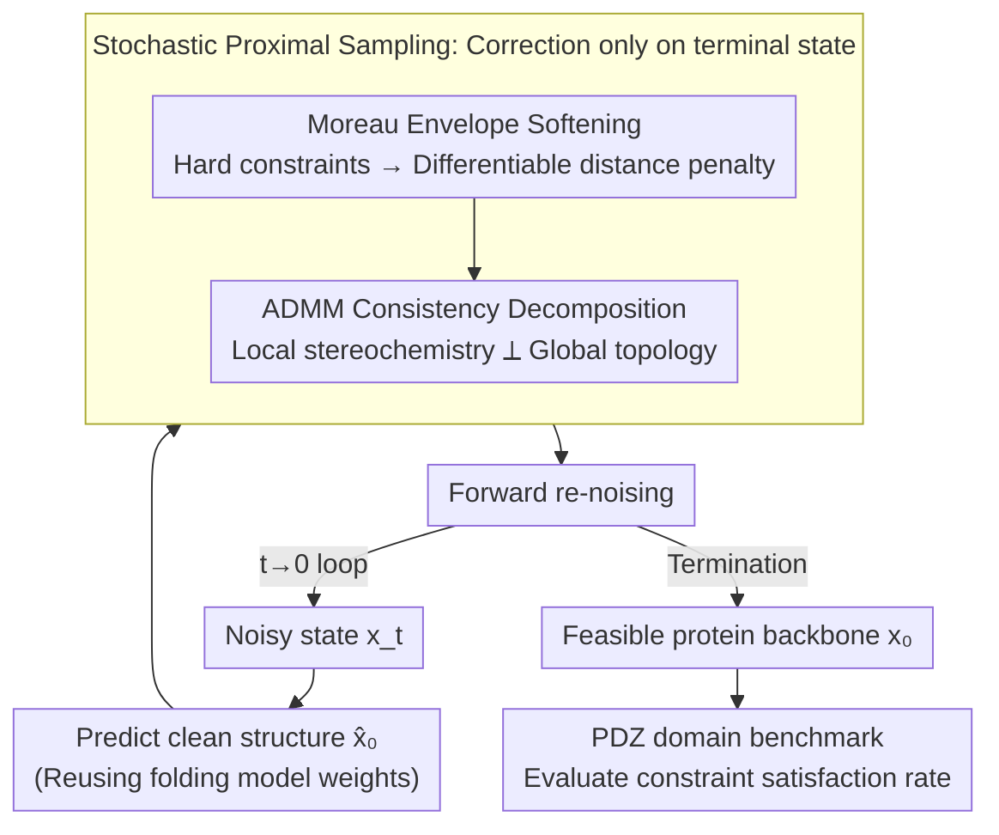

# Constrained Diffusion for Protein Design with Hard Structural Constraints

**Conference**: ICLR2026  
**OpenReview**: [https://openreview.net/forum?id=kkvqVRu2Zy](https://openreview.net/forum?id=kkvqVRu2Zy)  
**Code**: Released with supplementary materials (including PDZ benchmark)  
**Area**: Computational Biology / Protein Design / Diffusion Models  
**Keywords**: Constrained Diffusion, Protein Design, Proximal Optimization, ADMM, motif scaffolding

## TL;DR
This work reinterprets constrained diffusion as "stochastic proximal optimization." By applying feasibility corrections to the **predicted clean structure** at each step and then re-noising back to the data manifold (predict-prox-renoise), and using ADMM to decouple local stereochemistry from global topological constraints, the method achieves **100% strict satisfaction of bond length and angle constraints** in protein motif scaffolding and cavity design, with success rates far exceeding RFDiffusion-based baselines.

## Background & Motivation
**Background**: Diffusion models (represented by RFDiffusion) can effectively characterize the manifold of real protein backbones and are widely used for de novo design of monomers, complexes, and binders. Functional design often requires "scaffolding" predefined binding/catalytic motifs into generated backbones (motif scaffolding) or creating channels for substrate entry/exit (negative space/cavity constraints).

**Limitations of Prior Work**: Existing methods struggle with "exact constraints." Motif scaffolding does not guarantee that the generated backbone precisely contains the motif; hard constraints such as non-covalent hydrogen bonds, bond lengths/angles, chirality, and chain closure are almost impossible to guarantee. Negative space constraints like cavities are even harder for current generative models to express. Consequently, thousands of candidates must be generated to filter out a few geometrically valid designs using rejection sampling.

**Key Challenge**: There are two main ways to "fit" constraints into the diffusion process, but both have flaws. **Soft guidance** can only improve success rates or provide probabilistic bias; it cannot guarantee satisfaction per sample, and increasing guidance weight disturbs the diffusion trajectory, degrading performance. **Stepwise projection** (projecting the intermediate noisy state $x_t$ back to the feasible set $\mathcal{C}$ at each step) directly embeds feasibility but requires projecting onto a **highly non-convex** constraint set from a **noisy intermediate state**. This introduces statistical bias (sampling near constraint boundaries) and easily leads to local minima, disrupting the diffusion trajectory. In short: **early hard projection on noisy states leads diffusion astray**.

**Goal**: To make sampling trajectories **converge to strict feasibility in the final state** without relying on the assumption of "intermediate feasibility $x_t \in \mathcal{C}$," while maintaining the data manifold and structural diversity.

**Key Insight**: The authors view constrained diffusion through the lens of **stochastic proximal methods**. The key observation is that diffusion models already predict a "clean structure estimate" $\hat{x}_0$ at each step. Instead of operating on the noisy state, **feasibility corrections should be applied to this clean prediction**, followed by re-noising back to the correct diffusion marginal distribution.

**Core Idea**: Single-step reverse diffusion is treated as a proximal gradient step—the denoiser provides a data-driven "anchor," and feasibility is enforced by penalizing the distance to the constraint set. Sampling thus becomes a **predict → prox → renoise** loop: corrections are made only on the terminal state (clean prediction), allowing violations to shrink monotonically over steps until the final state is precisely feasible.

## Method

### Overall Architecture
The goal is to sample from the constrained distribution $p_\mathcal{C}(x_0) \propto p_\text{data}(x_0)\,\mathbf{1}\{x_0 \in \mathcal{C}\}$, ensuring the samples resemble real proteins ($p_\text{data}$) and strictly lie within the feasible set $\mathcal{C}$ (geometric/chemical constraints like bond lengths, angles, chirality, chain closure, and cavities). Standard diffusion only samples from $p_\text{data}$, so the sampling process must be modified to inject constraints.

Each step of reverse diffusion is split into three stages: **(1) Prediction**—the denoiser $x_\theta(x_t,t)$ predicts the clean structure $\hat{x}^t_0$ from the current noisy state $x_t$; **(2) Proximal Correction**—the proximal operator $\text{prox}_{\eta_t,g}$ pulls $\hat{x}^t_0$ toward the feasible set to obtain $\tilde{x}^t_0$; **(3) Re-noising**—the forward kernel $\text{FWD}(\cdot,\varepsilon)$ re-noises the corrected clean structure to $x_{t-1}$. Specifically:

$$x_t \xrightarrow{\text{predict}} \hat{x}^t_0 \xrightarrow{\text{prox}} \tilde{x}^t_0 \xrightarrow{\text{FWD}} x_{t-1}.$$

Because correction occurs on the **predicted clean state** rather than the noisy intermediate state, the pitfalls of non-convex projection under high noise are avoided. Since the corrected state is immediately re-noised to match the forward marginal at $t-1$, the trajectory stays close to the data manifold. As $t\to 0$ and $\lambda_t\eta_t \to \infty$, the final state converges arbitrarily close to $\mathcal{C}$. The proximal correction step itself is further decomposed using ADMM into "local stereochemistry" and "global topology" for collaborative solving.

### Key Designs

**1. Stochastic Proximal Sampling: Moving correction to the terminal state and replacing stepwise projection with predict-prox-renoise**

Addressing the pain point that "hard projection of non-convex constraints on noisy intermediate states biases trajectories and leads to local minima," this method does not require $x_t \in \mathcal{C}$ at every step. Instead, it applies a proximal correction only to the clean structure $\hat{x}^t_0$ predicted by the denoiser, then re-noises it. Single-step reverse diffusion is formulated as an optimization problem: the denoiser provides a data anchor, and feasibility is enforced by penalizing the distance to $\mathcal{C}$. This has a probabilistic interpretation—if the network's clean error at step $t$ is modeled as Gaussian $p(x_0\mid x_t)\propto \exp(-\tfrac{1}{2\eta_t}\|x_0-\hat{x}^t_0\|^2)$ with variance $\eta_t$, and the penalty $g$ is viewed as a soft prior $\propto\exp(-g(x_0))$, then the proximal subproblem $\tilde{x}^t_0=\text{prox}_{\eta_t,g}(\hat{x}^t_0)$ is exactly a stepwise MAP estimate of the clean state. The subsequent re-noising $x_{t-1}=\sqrt{\bar\alpha_{t-1}}\,\tilde{x}^t_0+\sigma_{t-1}\varepsilon$ restores the necessary stochasticity of the reverse chain while anchoring it toward $\mathcal{C}$. This loop is a stochastic version of a proximal gradient step, respecting diffusion dynamics while ensuring convergence to a feasible final state.

**2. Moreau Envelope Softening: Replacing hard constraint indicator functions with differentiable distance penalties and scheduling with $\lambda_t$**

If $g$ in the proximal operator is simply the indicator function of the feasible set, it reduces to an exact projection onto a non-convex set—which is ill-posed and unstable when $\hat{x}^t_0$ is far from $\mathcal{C}$. The authors replace the hard indicator with its **Moreau envelope**, yielding a smooth penalty $g(x)=\tfrac{\lambda_t}{2}\,\text{dist}_\mathcal{C}(x)^2$, where $\text{dist}_\mathcal{C}$ is the distance to the feasible set (e.g., $\inf_{y\in\mathcal{C}}\|x-y\|$ on $\text{SE}(3)$). The parameter $\lambda_t$ acts as an "inverse smoothing radius": as $\lambda_t\to\infty$, the penalty forces exact feasibility; with finite $\lambda_t$, it flexibly pulls samples toward $\mathcal{C}$. For scheduling, since the re-noising variance $\sigma_t^2$ shrinks over steps, $\lambda_t$ is increased accordingly—feasibility only dominates when the denoiser's $\hat{x}^t_0$ is already sufficiently accurate. By setting the trust weight $\eta_t=\sigma_{t-1}^2$, the proximal subproblem and diffusion variance remain on the same scale. Theoretically (Thm 6.1), a single proximal step shrinks violations by $(2\lambda_t\eta_t)^{-1/2}$, and the final state becomes arbitrarily close to the constraint set as $\lambda_t\eta_t\to\infty$. If $\lambda_t=c_t/\eta_t$ and $c_t$ tightens near the end, the expected violation decreases monotonically (Thm 6.2).

**3. ADMM Consistency Decomposition: Decoupling and solving local stereochemistry and global topology**

Local stereochemical variables (bond lengths/angles of adjacent atoms) and global variables (topology, long-range residue interactions) are strongly coupled in $\mathcal{C}$. Residues far apart in sequence may be adjacent in the folded structure; forcing a global constraint (e.g., non-covalent bond constraints for a β-sheet) can significantly disturb nearby local geometry, destroying fidelity and making the proximal step computationally complex. However, this "separable local + global" structure is an opportunity. The authors write the feasible point as $x\in\mathcal{C}_\text{local}\cap\mathcal{C}_\text{global}$ and decompose the penalty as $g=g_\text{local}+g_\text{global}$. They **specifically incorporate the "distance to denoiser" term into the local block $F$** (ensuring the local step corrects stereochemistry while staying close to $\hat{x}^t_0$), while the global block $G$ focuses on long-range feasibility. Consensus ADMM (Douglas–Rachford proximal splitting) solves $\min_{y,z} F(y)+G(z)\ \text{s.t.}\ y=z$:

$$y^{k+1}=\text{prox}_{\rho_k,F}(y^k-u^k),\quad z^{k+1}=\text{prox}_{\rho_k,G}(z^k+u^k),\quad u^{k+1}=u^k+y^{k+1}-z^{k+1}.$$

Here $y$ and $z$ are copies of the backbone for local/global feasibility, and $u$ accumulates their inconsistency. At convergence $y=z$, the minimum of $F+G$ is found. In practice, only one ADMM iteration is performed per diffusion step, using warm-start across steps to keep the copies close. This decomposition is crucial for simultaneously satisfying "local stereochemical validity" and "global functional constraints."

**4. PDZ Domain Benchmark: The first standardized benchmark for motif scaffolding in constrained diffusion**

To evaluate designs with hard constraints, the authors curated a PDZ domain motif scaffolding benchmark. PDZ is a class of modular binding domains that recognize the unstructured C-terminus of partner proteins through β-sheet-like hydrogen bonds. The authors gathered all solved PDZ/PBM complexes from RCSB PDB, screened 72, and manually excluded poorly resolved regions or short peptides to keep 52. To allow PDZ to establish additional contact with target PBMs, they rearranged N/C terminals (cleaving at ligand-adjacent loops, trimming original ends, and completing gaps with vanilla RFDiffusion). Sequence design was done with ProteinMPNN and structure prediction with AlphaFold2, with strict filtering (self-consistency RMSD < 2.5 Å, pLDDT > 90, peptide RMSD < 2.0 Å), resulting in 31 high-confidence designs (6 of which were marked poor-posed due to geometric constraints like prolines). This benchmark fills a gap in systematic evaluation for modular domain engineering in constrained diffusion.

### Loss & Training
The method is **purely inference-time**: it does not retrain the denoiser but reuses pre-trained folding/diffusion backbones (RFDiffusion with $x_0$-prediction parameterization is used in experiments to leverage RoseTTAFold architecture and weights). All "constraints" are applied during sampling via the distance penalty $g$ in the proximal subproblem and ADMM, without introducing new training objectives. This allows per-sample satisfaction of arbitrary task-specific constraints without retraining for new constraint sets.

## Key Experimental Results

### Main Results
Two tasks: non-covalent bond design for PDZ domains and vacancy (cavity) constraint design for molecular encapsulation. The base backbone is RFDiffusion, comparing Standard, Recenter (centroid relocation guidance), and CGD (Constrained Gaussian Diffusion + SMC resampling).

**PDZ Benchmark (31,000 samples per method)**:

| Metric | Standard | Recenter | CGD | Ours |
|------|----------|----------|-----|------|
| Constraint Satisfaction (%) ↑ | 0.0 | 0.0 | 0.0 | **100.0** |
| Structural Realism (%) ↑ | (32.0) | (18.7) | (38.2) | 21.0 |
| Success Rate (%) ↑ | 0.0 | 0.0 | 0.0 | **21.0** |
| Radius of Gyration (Å) ↓ | (13.6) | (13.2) | (16.2) | **12.4** |
| Diversity (%) ↑ | N/A | N/A | N/A | **18.8** |

(Statistics in parentheses are calculated on "failed" structures.) None of the nearly 100,000 baseline samples perfectly satisfied bond distance and angle constraints; baselines often generated incorrect secondary structures. Ours achieved 100% constraint satisfaction with a 21.0% success rate (up to 83.0% on well-posed ligands). Radius of gyration and diversity also showed significant leads.

**Molecular Encapsulation / Cavity Constraint (approx. 4,000 samples per method)**:

| Metric | Standard | Recenter | CGD | Recenter+CGD | Ours |
|------|----------|----------|-----|--------------|------|
| Constraint Satisfaction (%) ↑ | 0.0 | 0.0 | 21.6 | 27.4 | **100.0** |
| Structural Realism (%) ↑ | (100.0) | (100.0) | 96.1 | 93.8 | 97.8 |
| Success Rate (%) ↑ | 0.0 | 0.0 | 20.5 | 24.2 | **97.8** |
| Radius of Gyration (Å) ↓ | (15.2) | (14.3) | 23.9 | 26.6 | **14.8** |
| Diversity (%) ↑ | N/A | N/A | 20.5 | 24.2 | **97.8** |

The task required backbones to strictly stay within a 20×40×40 Å box while avoiding an internal conical exclusion zone. The strongest baseline (Recenter+CGD) had only a 24.2% success rate and an inflated radius of gyration (indicating loose/unfolded states), while Ours achieved a 97.8% success rate (about **4x** higher) with a radius of gyration (14.8 Å) comparable to standard diffusion, balancing feasibility and compactness.

### Ablation Study
The main tables include comparisons that serve as ablations—the core variable is the "constraint injection method":

| Configuration | Constraint Satisfaction | Description |
|------|-----------|------|
| Standard (No injection) | 0% | Pure RFDiffusion, relies entirely on rejection sampling |
| Recenter (Centroid guidance) | 0% | Soft bias, fails to manage global bond/exclusion constraints |
| CGD (Guidance + SMC) | 0–27.4% | Importance sampling, remains a probabilistic bias |
| Ours (Proximal Correction + ADMM) | **100%** | Strict feasibility per sample |

### Key Findings
- **"Where to correct" is more important than "how hard to correct"**: Moving corrections from the noisy intermediate state to the predicted clean final state is the fundamental reason for jumping from 0% to 100% satisfaction.
- **Soft guidance hits a ceiling**: CGD/Recenter perform well on local geometric realism but fail on global non-covalent bonds or non-convex exclusion zones—confirming the limitations of "guidance as probabilistic bias."
- **ADMM decomposition preserves local fidelity**: Directly applying global non-covalent bond constraints to β-strands disrupts nearby stereochemistry; decoupling allows the local block to maintain "geometric correction + closeness to denoiser," avoiding this destruction.
- **No quality trade-off**: The radius of gyration remains consistent with standard diffusion, showing that strict feasibility is not achieved at the cost of loose or unrealistic structures.

## Highlights & Insights
- **Elegant Perspective Shift**: Re-formulating "constrained diffusion" as "stochastic proximal optimization" makes the predict-prox-renoise step a natural stochastic version of a proximal gradient step. This provides a probabilistic interpretation (stepwise MAP) and allows the use of proximal theory to prove feasibility bounds.
- **"Terminal Correction + Re-noising" is a generalizable trick**: For any diffusion or flow model with $x_0$-prediction, hard constraints can be applied by "projecting/proxing on the clean prediction and re-noising back to the orbit."
- **Embedding the denoiser distance in the local block** is a clever engineering choice: It ensures the local ADMM step simultaneously fixes geometry and stays on the data manifold, preserving structural realism.
- **Cavity/Negative Space Constraints** are explicitly expressed as non-convex exclusion zones, which is much more general than hacks like "inserting an α-helix placeholder and deleting it," pointing toward controllable pocket/channel design.

## Limitations & Future Work
- **Dependency on Base Model Quality**: As an inference-time wrapper, the final structural realism is limited by the capacity of the denoiser (e.g., RFDiffusion). If the prediction is poor, proximal correction cannot save it.
- **Constraints must be differentiable/proximal**: It is not obvious how to incorporate complex, implicit, or discrete functional constraints (e.g., sequence-level designability).
- **Single ADMM sweep + warm-start**: This is an engineering trade-off. Whether it still converges for extremely coupled constraints and how the budget per step affects final feasibility requires more finite-step characterization beyond asymptotic guarantees.
- **Evaluation focuses on structural metrics**: While constraint satisfaction and diversity are strong, downstream functional validation (binding affinity, expressibility) via wet labs is needed to confirm protein engineering value.
- **Hyperparameter scheduling is empirical**: Though $\lambda_t$ and $\eta_t$ have theoretical guidance (Thm 6.2), the exact rhythm of tightening $c_t$ still requires per-task tuning.

## Related Work & Insights
- **vs Soft Guidance (Ho & Salimans 2022, Chroma, etc.)**: These provide probabilistic biases and disturb trajectories if weights are too high; Ours achieves strict per-sample feasibility via terminal correction without disrupting diffusion dynamics.
- **vs Stepwise Projection Constrained Diffusion (Christopher et al. 2024)**: While both embed constraints, this work proves that "projection on noisy intermediate states" introduces statistical bias and gets stuck in local minima, solved here by corrected clean predictions.
- **vs Training-time Constraints (Eguchi 2022, ReQFlow, FoldFlow-2)**: Training methods require retraining for new constraints and only provide distributional guarantees; Ours is plug-and-play, per-sample feasible, and enforces hard geometric constraints rather than soft biases.
- **vs RFDiffusion / Genie 2 / OriginFlow**: These provide strong functional conditioning but often violate global constraints and rely on rejection sampling; Ours removes this dependency through proximal/ADMM packaging.

## Rating
- Novelty: ⭐⭐⭐⭐⭐ Elegant reinterpretation as stochastic proximal optimization; ADMM decoupling is clever.
- Experimental Thoroughness: ⭐⭐⭐⭐ Two tasks, multiple baselines, large sample size, 100% satisfaction benchmark; lacks wet-lab functional validation.
- Writing Quality: ⭐⭐⭐⭐⭐ Strong logic connecting motivation, theory, and implementation.
- Value: ⭐⭐⭐⭐⭐ Provides a provable, plug-and-play paradigm for hard-constrained protein design and contributes the PDZ benchmark.

<!-- RELATED:START -->

## Related Papers

- [\[NeurIPS 2025\] Constrained Discrete Diffusion](../../NeurIPS2025/computational_biology/constrained_discrete_diffusion.md)
- [\[ICML 2026\] Constrained Flow Optimization via Sequential Fine-Tuning for Molecular Design](../../ICML2026/computational_biology/constrained_flow_optimization_via_sequential_fine_tuning_for_molecular_design.md)
- [\[ICLR 2026\] SAIR: Enabling Deep Learning for Protein-Ligand Interactions with a Synthetic Structural Dataset](sair_enabling_deep_learning_for_protein-ligand_interactions_with_a_synthetic_str.md)
- [\[ICLR 2026\] A Joint Diffusion Model with Pre-Trained Priors for RNA Sequence-Structure Co-Design](a_joint_diffusion_model_with_pre-trained_priors_for_rna_sequence-structure_co-de.md)
- [\[ICLR 2026\] Iterative Distillation for Reward-Guided Fine-Tuning of Diffusion Models in Biomolecular Design](iterative_distillation_for_reward-guided_fine-tuning_of_diffusion_models_in_biom.md)

<!-- RELATED:END -->
