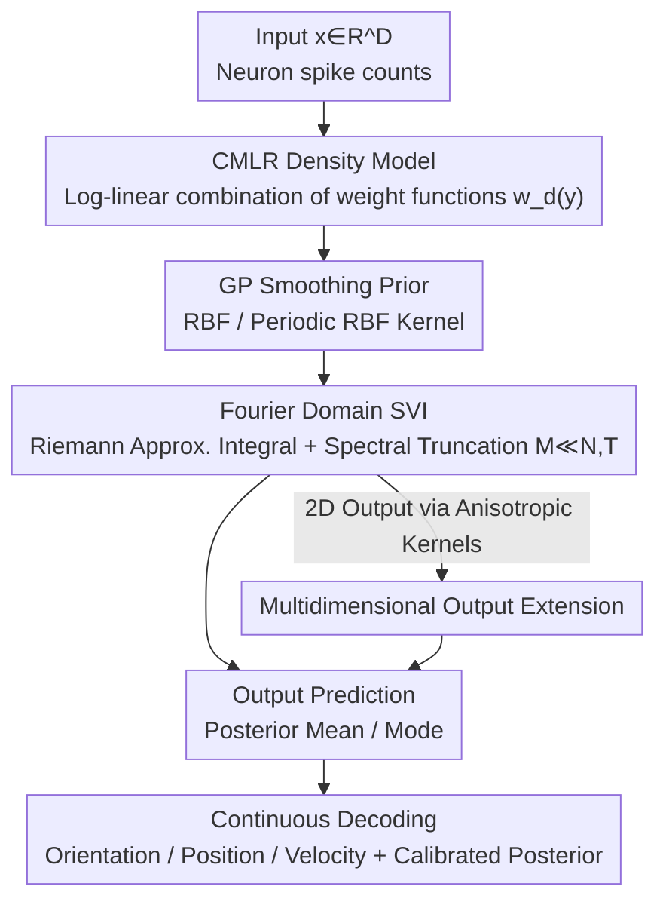

# Continuous Multinomial Logistic Regression for Neural Decoding

**Conference**: ICLR2026  
**OpenReview**: [https://openreview.net/forum?id=theeeNBSTG](https://openreview.net/forum?id=theeeNBSTG)  
**Code**: To be confirmed  
**Area**: Computational Neuroscience / Neural Decoding / Conditional Density Estimation  
**Keywords**: Neural decoding, multinomial logistic regression, Gaussian processes, conditional density estimation, variational inference

## TL;DR
This paper extends the classical multinomial logistic regression (MLR) from "finite discrete categories" to a "continuous output space," proposing CMLR: replacing discrete category weights with a set of smooth weight functions $w_d(y)$ under Gaussian process priors. This maps neural population activity into a complete conditional probability density over continuous variables (orientation, position, velocity, etc.). Combined with stochastic variational inference in the Fourier domain, the model can be efficiently trained on a scale of tens of thousands of neurons, generally outperforming DNN, XGBoost, and FlexCode on data from mouse/monkey visual cortex, hippocampus, and motor cortex.

## Background & Motivation
**Background**: Neural decoding aims to infer behavioral or sensory variables from neural activity and is a core problem in systems neuroscience. Logistic regression is a fundamental tool for binary classification tasks, while multinomial logistic regression (MLR) is used for multi-class tasks—learning a weight vector for each discrete category and providing category probabilities via softmax.

**Limitations of Prior Work**: Target variables in many neural decoding tasks are inherently **continuous**—e.g., time, orientation, head direction, spatial position, and velocity. Classifiers like MLR can only process finite discrete categories; applying them requires "binning" the continuous output. This discretization leads to: ① reduced effective resolution; ② introduction of quantization artifacts; ③ the need for additional regularization to prevent overfitting. Meanwhile, standard regression models (point prediction) only provide a single value and cannot represent **multimodal, circular, or asymmetric** output distributions—orientation decoding is naturally circular and often bimodal (difficult to distinguish 0° and 180°).

**Key Challenge**: Researchers seek a **complete posterior density** similar to classifiers (to express uncertainty, multimodality, and circular structures) while avoiding the resolution loss and quantization errors of discretization. As the number of discrete categories $K$ increases for finer expression, more parameters are required, leading to overfitting—making it difficult to balance the two.

**Goal**: Construct a decoding model that retains the interpretable additive structure of MLR while directly providing normalized densities on a **continuous output space**, and ensure it extends to real-world data scales of tens of thousands of neurons and samples.

**Key Insight**: The authors observe that MLR assigns a weight vector $w_k$ to each discrete category $k$. When categories are infinitely subdivided, this sequence of "discrete weights sorted by output" can be viewed as a **smooth function** $w_d(y)$ of the output variable $y$. By replacing "$K$ weight vectors" with "$D$ weight functions," MLR is pushed to its continuous limit.

**Core Idea**: Use smooth weight functions (with GP priors) over the output space to replace the discrete category weights of MLR, transforming the classifier into a conditional density estimator for continuous outputs—CMLR, the continuous limit of MLR as $K\to\infty$.

## Method

### Overall Architecture
CMLR maps an input vector $x\in\mathbb{R}^D$ (e.g., spike counts of $D$ neurons) into a probability density over an output variable $y\in\Omega$. Each input dimension $d$ is assigned a weight function $w_d(y)$, describing the additive contribution of that neuron's activity to the log-density of "output taking value $y$". The conditional density is written in log-linear form:

$$p(Y=y\mid x)=\frac{\exp\!\big(w(y)^\top x\big)}{\int_\Omega \exp\!\big(w(y')^\top x\big)\,dy'},\qquad w(y)=[w_1(y),\dots,w_D(y)]^\top$$

The denominator is the partition function that normalizes the density to 1. Comparing this with discrete MLR $p(Y=k\mid x)=\exp(w_k^\top x)/\sum_j \exp(w_j^\top x)$ shows that CMLR simply replaces the "sum over $K$ discrete classes" with an "integral over continuous $y$," and discrete weight vectors $w_k$ with continuous weight functions $w_d(y)$.

The pipeline is as follows: assign GP priors to weight functions to ensure smoothness → approximate the integral in the partition function using Riemann sums → move weight functions to the Fourier domain and truncate to a small number of basis functions to make inference tractable and scalable → use stochastic variational inference to jointly optimize variational parameters and hyperparameters → after training, calculate the posterior on a grid of any resolution and take the posterior mean or mode as the point estimate.

### Key Designs

**1. CMLR Density Model: Replacing MLR Discrete Category Weights with Continuous Weight Functions**

This step directly addresses the pain point that "MLR can only handle discrete categories and requires binning for continuous variables." CMLR no longer stores a weight vector for each discrete category $k$, but instead stores a weight function $w_d(y)$ defined over the entire output domain $\Omega$ for each input feature $d$. The density is obtained by normalizing $\exp(w(y)^\top x)$. This is conceptually isomorphic to a neuron's **tuning curve**: $w_d(y)$ characterizes how the activity of the $d$-th neuron raises or lowers the density of "output taking value $y$". Consequently, the learned weight functions often resemble the tuning structure of the neuron—allowing CMLR to serve not just as a decoder, but as a population coding probe that can be directly visualized and compared across neurons. Due to the log-linear additive structure, it inherits the interpretability of MLR while naturally expressing multimodal, asymmetric, and circular densities that point-estimate regressors cannot.

**2. Gaussian Process Smoothing Prior: Constraining Weight Functions with Kernels to Distinguish Linear and Circular Variables**

If no constraints are placed on $w_d(y)$, the parameters are effectively infinite-dimensional for continuous outputs, leading to inevitable overfitting. The authors apply a zero-mean Gaussian process prior $w_d(y)\sim\mathcal{GP}(0,K_d)$ to each weight function independently. The covariance uses a standard RBF kernel $K_d(y',y'')=\rho_d\exp\!\big(-(y'-y'')^2/2\ell_d^2\big)$, where amplitude $\rho_d$ and lengthscale $\ell_d$ control the intensity and smoothness of the weight function, respectively. Crucially, for **circular variables** (e.g., orientation $\Omega=[0,2\pi)$), a periodic RBF kernel $K_d(y',y'')=\rho_d\sum_{m=-\infty}^{\infty}\exp\!\big(-(y'-y''+2\pi m)^2/2\ell_d^2\big)$ is used to ensure the density is continuous and closed on the unit circle. This is why periodic tasks like orientation decoding can be correctly modeled, whereas point-estimate regressors struggle with circular structures.

**3. Fourier Domain Stochastic Variational Inference: Compressing Infinite-Dimensional Inference for Scalability to Tens of Thousands of Neurons**

Computing the partition integral in the conditional density and marginalizing the weight functions are both intractable. The authors compress this into a computable finite-dimensional problem in three steps. First, **Riemann Approximation**: subdivide the output domain into $T$ equal bins and approximate the normalization integral with $\Delta\sum_{t=1}^T \exp(w(y_t)^\top x_n)$. Second, **Fourier Domain Parametrization**: leveraging the fact that RBF covariance is diagonalized under Fourier bases, the weight function is written as a linear combination of frequency coefficients $\omega_d$ through an orthonormal basis matrix $w_d=B\omega_d$. The frequency coefficients independently follow $\omega_{m,d}\sim\mathcal{N}(0,k_{m,d})$. Truncating to **$M\ll T,N$** bases reduces inference to extremely low dimensions and eliminates matrix inversion. Third, **Stochastic Variational Optimization**: assuming the variational posterior is fully factorized over features and frequencies $q(\omega)=\prod_{d,m}\mathcal{N}(\mu_{m,d},\sigma_{m,d}^2)$, the ELBO is maximized:

$$\mathcal{L}(\theta,\psi)=\mathbb{E}_{q_\psi}\!\big[\log p_\theta(\{x_n\}\mid w)\big]-D_{\mathrm{KL}}\!\big(q_\psi(w)\,\|\,p_\theta(w)\big)$$

The KL term has a closed-form solution due to the Gaussian assumption, and the log-sum-exp in the likelihood term is approximated via Monte Carlo sampling. Mini-batching + Adam are used to jointly optimize variational parameters $\{\mu_{m,d},\sigma_{m,d}\}$ and GP hyperparameters $\theta=\{\rho_d,\ell_d\}$ (optimized in log-space for positivity). Training time grows linearly with the number of neurons $D$ ($D\approx2000$ takes $\approx 10^3$ seconds) and only slowly with the number of samples $N$, remaining insensitive to the number of Fourier components $M$.

**4. Multidimensional Output Extension and "Correlation-Awareness": Anisotropic Kernels + Explicit Modeling of Neuronal Co-variation**

Many decoding targets are multidimensional (e.g., 2D cursor velocity). CMLR uses **anisotropic RBF kernels** to assign independent lengthscales to each output dimension, extending the prior covariance to $y=[y^{(1)},y^{(2)}]$. The frequency domain prior variance becomes a product of frequencies in two dimensions, and the variational framework applies naturally. More importantly, CMLR is a **correlation-aware** decoder: it retains the co-variation structure between neurons within the likelihood. This stands in sharp contrast to Naive Bayes, which assumes conditional independence of neurons given the output (correlation-blind), effectively discarding noise correlations. Experiments show CMLR consistently outperforms NB using the same GP prior and Fourier inference, demonstrating the importance of modeling noise correlations for accurate decoding.

### Loss & Training
The training target is the ELBO described above, consisting of "expected log-likelihood − KL divergence." The KL term is analytically computable. In the likelihood term, the normalization constant uses Riemann approximation and log-sum-exp uses Monte Carlo sampling. Optimization employs Adam with mini-batch stochastic variational inference (batch size $N'\ll N$). Scale parameters are optimized in log-space to ensure positivity. CMLR hyperparameters are fixed across datasets without per-dataset tuning, providing an engineering advantage over DNN/XGBoost (which require Bayesian optimization). Post-training, a decoding Fourier basis $B_{\mathrm{dec}}$ is constructed at any target resolution $\delta$, and the full posterior is obtained via softmax. For regression, the posterior mean $\hat y_{\mathrm{mean}}=\sum_j \tilde y_j\,p(\cdot)$ is used; for classification error minimization, the posterior mode $\hat y_{\mathrm{mode}}=\arg\max_j p(\cdot)$ is taken.

## Key Experimental Results

5-fold cross-validation was conducted on four real neural datasets (Mouse V1, Monkey V1, Mouse Hippocampal CA1, Monkey Motor Cortex), comparing CMLR against Naive Bayes, FlexCode, XGBoost, and DNN.

### Main Results

| Task / Data | Metric | CMLR | FlexCode | Naive Bayes | XGBoost | DNN |
|------|------|------|----------|-------------|---------|-----|
| Mouse V1 Orientation | Mean Absolute Circular Error (°) | **3.1 ± 9.3** | 3.2 ± 5.5 | 4.9 ± 10.8 | 13.6 ± 23.4 | 18.3 ± 23.6 |
| Hippocampal CA1 Position | Absolute Error (Normalized) | **0.15 ± 0.31** | 0.16 ± 0.30 | 0.16 ± 0.31 | 0.16 ± 0.13 | 0.18 ± 0.16 |
| Motor Cortex 2D Velocity | $R^2$ | 0.53 | 0.35 | −0.43 | 0.55 | 0.58 |

- In orientation decoding, CMLR achieves the lowest error (median 2.1°); large errors primarily occur near 180°, reflecting inherent bimodality in orientation.
- In hippocampal position decoding, CMLR maintains a lead as the resolution $J$ increases.
- For extremely large samples like motor cortex data, XGBoost/DNN perform slightly better (expected for high-capacity non-linear models on big data), but CMLR remains competitive while providing complete density and interpretable tuning functions.

### Ablation Study

| Configuration Comparison | Key Observation | Explanation |
|------|---------|------|
| CMLR (Correlation-aware) vs Naive Bayes (Correlation-blind) | Comprehensive lead in V1/CA1/Motor Cortex | Proves the importance of modeling neuronal noise correlation for decoding |
| Category count $J$ sweep | Error decreases as $J$ increases, saturating after $J\approx5000$ | Continuous models allow principled evaluation at high-resolution limits without arbitrary discretization |
| Low data scenarios (reduced $D,N$) | CMLR accuracy drops slightly; lead over XGBoost/DNN increases | GP function priors + additive structure provide strong regularization |
| Posterior calibration (PIT histograms / Calibration curves) | CMLR posteriors are near-uniform/on the diagonal; FlexCode systematically miscalibrated | CMLR provides more reliable uncertainty estimates |

### Key Findings
- **Correlation is key**: The gap between CMLR and NB (which only differ in independence assumptions) shows that noise correlations carry decoding information.
- **Small data advantage**: Function priors and additive structure allow CMLR to outperform point-estimation models on low-data or structured (circular, multimodal) outputs.
- **Good posterior calibration**: CMLR's PIT histograms are nearly uniform, whereas FlexCode shows peaked/multimodal PITs and under-coverage.
- **Efficiency**: Training time is linear with $D$, increases slowly with $N$, and is insensitive to $M$. Running time is comparable to FlexCode and faster than NB; while slower than XGBoost/DNN, it provides complete density and calibrated uncertainty.

## Highlights & Insights
- **"Continuous Limit" Perspective**: Treating MLR discrete weights $w_k$ as discrete samples of the output variable allows for a clean transition to weight functions $w_d(y)$ when $K\to\infty$. This generalizes a classic model while preserving additive interpretability.
- **Weight Functions as Tuning Curves**: Learned $w_d(y)$ directly correspond to neural tuning structures. Visualizing and comparing them across neurons turns the decoder into an analysis tool for population coding—something black-box models cannot offer.
- **Fourier Domain + Spectral Truncation**: This approach of compressing "infinite-dimensional function inference" into "few frequency coefficients" is transferable to any GP-prior problem requiring scalability.
- **Periodic Kernel for Circular Variables**: For tasks where the target variable is periodic (orientation, phase, clock), using a periodic RBF kernel fundamentally avoids the boundary failures seen in point-estimation models.

## Limitations & Future Work
- The authors acknowledge that in **massive sample** scenarios, high-capacity non-linear models (XGBoost/DNN) may achieve higher predictive accuracy. CMLR is positioned as an "interpretable, data-efficient complementary baseline/diagnostic model" rather than a pursuit of extreme precision.
- The additive log-linear structure is essentially a **linear decoder** (weight functions are linear with respect to input $x$), which cannot capture strong non-linear interactions between neural activity and output—a primary reason it trails DNNs on large datasets.
- Riemann approximation and Fourier truncation introduce errors; the choice of bin count $T$ and basis count $M$ are robust but remain design parameters involving trade-offs.
- Future directions: introducing feature interaction terms or shallow non-linear mappings into the weight function layer to improve expression on large data while maintaining interpretability; integrating well-calibrated posteriors into downstream decisions (e.g., identifying ambiguous stimuli, estimating decoding confidence).

## Related Work & Insights
- **vs Discrete MLR (Greenidge et al. 2024)**: Discrete MLR is a special case of CMLR at the small $J$ limit; CMLR extends it to continuous outputs for principled evaluation at high resolutions, avoiding quantization errors.
- **vs Naive Bayes**: Both use GP priors and Fourier inference, but NB assumes conditional independence (correlation-blind). CMLR's explicit modeling of co-variation leads to universal superiority.
- **vs FlexCode**: Both are SOTA for non-parametric conditional density estimation, but FlexCode uses series expansion + random forests to estimate coefficients, leading to miscalibrated posteriors. CMLR provides better calibration and interpretable functions.
- **vs GP Regression / GP Classification**: GP Regression models output as a GP function of input (Gaussian prediction only). GP Classification maps latent GPs to discrete category probabilities. Neither can express rich/structured densities on continuous outputs. CMLR places the GP prior on **weight functions over output space** to flexibly estimate complete conditional densities.
- **vs Mixture Density Networks / Conditional Normalizing Flows**: These CDE methods often suffer from limited scalability, interpretability, or statistical robustness in high dimensions. CMLR provides interpretable weight functions via a non-parametric additive structure and achieves scalability through structured inference.

## Rating
- Novelty: ⭐⭐⭐⭐⭐ Systematically introduces conditional density estimation into neural decoding; the MLR→continuous perspective is clean and theoretically grounded.
- Experimental Thoroughness: ⭐⭐⭐⭐ Covers four real datasets and five baselines including calibration and runtime analysis, though lacks direct comparison with modern deep CDEs (e.g., conditional flows).
- Writing Quality: ⭐⭐⭐⭐⭐ Clear derivation from discrete MLR to Fourier domain SVI with consistent logic.
- Value: ⭐⭐⭐⭐⭐ Provides a new interpretable, data-efficient, and well-calibrated decoding baseline for systems neuroscience; the "weight functions as tuning curves" feature is highly practical.

<!-- RELATED:START -->

## Related Papers

- [\[ICLR 2026\] Beyond Grid-Locked Voxels: Neural Response Functions for Continuous Brain Encoding](beyond_grid-locked_voxels_neural_response_functions_for_continuous_brain_encodin.md)
- [\[ICLR 2026\] A Cross-Species Neural Foundation Model for End-to-End Speech Decoding](a_cross-species_neural_foundation_model_for_end-to-end_speech_decoding.md)
- [\[ICLR 2026\] Decoding Dynamic Visual Experience from Calcium Imaging via Cell-Pattern-Aware Pretraining](decoding_dynamic_visual_experience_from_calcium_imaging_via_cell-pattern-aware_p.md)
- [\[ICLR 2026\] Pretraining with Re-parametrized Self-Attention: Unlocking Generalization in SNN-Based Neural Decoding Across Time, Brains, and Tasks](pretraining_with_re-parametrized_self-attention_unlocking_generalizationin_snn-b.md)
- [\[NeurIPS 2025\] MEIcoder: Decoding Visual Stimuli from Neural Activity by Leveraging Most Exciting Inputs](../../NeurIPS2025/computational_biology/meicoder_decoding_visual_stimuli_from_neural_activity_by_leveraging_most_excitin.md)

<!-- RELATED:END -->
