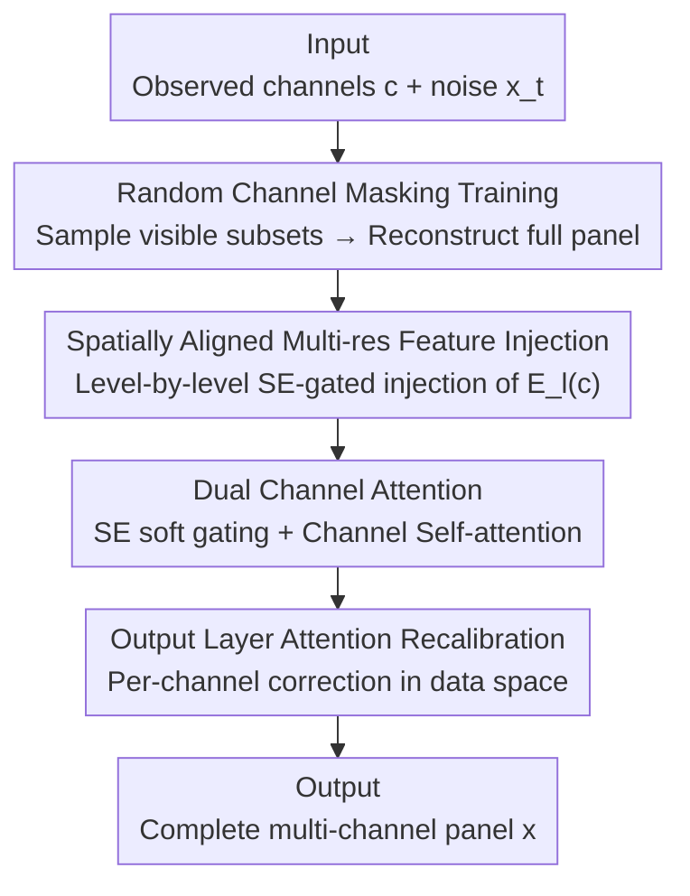

# Controllable Diffusion-based Generation for Multi-channel Biological Data

**Conference**: ICLR2026  
**OpenReview**: [https://openreview.net/forum?id=t7wIerUT2E](https://openreview.net/forum?id=t7wIerUT2E)  
**Code**: https://github.com/tansey-lab/MCD  
**Area**: Diffusion Models / Computational Biology  
**Keywords**: Multi-channel Diffusion, Spatial Omics Completion, Random Channel Masking, Channel Attention, Amortized Conditional Generation

## TL;DR
Ours proposes MCD, a multi-channel diffusion framework that uses "random channel masking training + multi-resolution spatial condition injection + dual channel attention." This allows a single diffusion model to complete full channel panels under any combination of "observed/missing channels," achieving SOTA in spatial proteomics, single-cell gene-to-protein translation, and missing MRI modality synthesis.

## Background & Motivation
**Background**: Biological profiling technologies such as Imaging Mass Cytometry (IMC) and spatial transcriptomics (Xenium/ST) produce **multi-channel data**—where each channel corresponds to a protein marker or gene expression, representing multiple spatially co-registered biological signals at the same pixel/cell. Applying diffusion models to such data for generation and completion is a natural direction.

**Limitations of Prior Work**: Existing generative models are almost exclusively designed for low-dimensional natural images (RGB 3-channels). Their condition injection methods—global embeddings, flattening conditions for concatenation, or FiLM modulation—**break spatial correspondences**. In biological data, conditional and target channels are pixel-wise spatially aligned; once flattened or globalized, this alignment is lost. Even multi-scale conditional methods that preserve alignment, like ControlNet/BrushNet, assume a small number of input channels ($n\le 3$) and train conditional encoders separately from the main network, lacking end-to-end synergy and the ability to model relationships among dozens or hundreds of semantically distinct channels.

**Key Challenge**: Dependencies between biological channels are **sparse, non-linear, asymmetric, and context-dependent**—some proteins co-localize only in specific spatial niches or cell types, while others are mutually exclusive. Simultaneously, experimental constraints limit data to partial signals (e.g., ~50 proteins for IMC, 500–5000 genes for Xenium), and clinical scans often miss channels due to patient motion or scan time limits. Thus, a model must address four entangled requirements: ① **Spatial alignment** between generation and conditions; ② Treatment of conditions as **multi-resolution structured information**; ③ Modeling **complex cross-channel dependencies**; ④ **Generalization to arbitrary condition-target combinations** at test time, including unseen configurations.

**Goal**: To learn a conditional distribution $p(x\mid c)$, where $x\in\mathbb{R}^{C\times H\times W}$ is the complete panel and $c\in\mathbb{R}^{C_o\times H\times W}$ is an arbitrary observed subset, while respecting spatial structure and remaining flexible for any $c$.

**Key Insight**: Instead of training dedicated models for each target channel, it is better to let **one model condition on any subset and always reconstruct the full panel**. To achieve this, a training strategy of "randomly masking which channels serve as conditions" is used to amortize the entire conditional space.

**Core Idea**: Treat "random channel masking" as **amortized inference** over the condition space—randomly sampling subsets of visible channels during training to force full-panel reconstruction. Combined with multi-resolution condition injection that preserves spatial alignment and dual channel attention, a unified diffusion model covers the entire family of conditional distributions $\{p(x\mid c)\}$.

## Method

### Overall Architecture
MCD is a **dual-network diffusion architecture**: one **diffusion network** denoises the noisy target $x_t$, and a parallel **conditioning network** encodes the observed channels $c$. At each resolution level $\ell$, the diffusion encoder produces features $D_\ell(x_t)$, while the conditioning encoder produces spatially aligned features $E_\ell(c)$. The latter are passed through SE gating and **injected level-by-level** into the corresponding resolutions of the diffusion network, ensuring spatial alignment and effective spatial conditioning. Channel attention modules are inserted within UNet blocks to model cross-channel dependencies. Random channel masking during training ensures generalization to arbitrary channel combinations. Overall: the input is "partially observed channels $c$ + noisy target $x_t$," and the output is the denoised **complete channel panel** $x$. This process accommodates any visible channel combination at test time without architectural changes or retraining.

### Key Designs

**1. Random Channel Masking: Amortizing "Arbitrary Condition Combinations" into One Training Process**

To address the pain point that "observed channels are not fixed and must generalize to unseen configurations," the approach is straightforward (Algorithm 1): during each iteration, a Bernoulli set $S_o\subset\{1,\dots,C\}$ is sampled independently with $\mathrm{Bern}(p)$. The remaining channels $S_m$ in the condition $c$ are **zeroed out**, while the target remains the full panel $x$—
$$c_i = \begin{cases} x_i, & i\in S_o \\ 0, & \text{otherwise}\end{cases}$$
The model denoises the full panel $x$ following the standard EDM objective, with masking applied only to the conditions. This is equivalent to optimizing an **amortized conditional objective**:
$$\mathbb{E}_{c\sim p(c)}\,\mathbb{E}_{t,x_0,\epsilon}\big[\lVert \epsilon - \epsilon_\theta(x_t,t,c)\rVert^2\big]$$
where $p(c)$ is the distribution of conditional configurations (visible channel combinations) over the condition space $\mathcal{C}$. By minimizing this, a single estimator $\epsilon_\theta(x_t,t,c)\approx \nabla_{x_t}\log p(x_t\mid c)$ implicitly models the entire family of conditional distributions $\{p(x\mid c)\}$. Unlike classifier-free guidance, which interpolates between "conditional/unconditional" predictions at inference, this method **samples conditional subsets during training** to learn a unified conditional model. The benefit is avoiding per-channel heads or separate training, allowing completion under arbitrary (including unseen) configurations.

**2. Spatially Aligned Multi-resolution Feature Injection: Conditioning on Local Details and Global Structure**

To prevent "naive condition injection from breaking spatial alignment," MCD directly superimposes condition features $E_\ell(c)$ onto diffusion features at each resolution level $\ell$:
$$z_\ell = D_\ell(x_t) + \mathrm{SE}\big(E_\ell(c)\big)$$
Here, $\mathrm{SE}(\cdot)$ is a Squeeze-and-Excitation soft channel attention (see Key Design 3), which **preserves spatial dimensions** and applies per-channel gating to the condition maps before element-wise addition. Thus, injection "selectively permits" conditions rather than using simple addition, preserving spatial correspondence. Crucially, conditions are not compressed into a fixed global representation but into a set of resolution-varying contextual features $\{E_\ell(c)\}_{\ell=1}^L$: shallow layers focus on local structure, while deep layers handle high-level global structure, matching the intuition that patterns in $x$ depend on both local details and global motifs in $c$.

**3. Dual Channel Attention + Output Recalibration: Modeling Sparse and Asymmetric Cross-channel Dependencies**

To address "complex non-linear, asymmetric, and context-dependent dependencies" where most diffusion models focus only on spatial attention, MCD uses two complementary modules. The first is a lightweight **SE soft attention** (used in injection) for latent feature maps $z\in\mathbb{R}^{D\times H\times W}$:
$$\alpha=\mathrm{GAP}(z),\quad w=\sigma\big(W_2\,\phi(W_1\alpha)\big),\quad z'=w\cdot z$$
It learns a scaling weight for each latent channel using global context for per-channel reweighting. The second is **Channel Self-attention** within UNet blocks: latent features are flattened to $x_\text{flat}\in\mathbb{R}^{D\times N}$ ($N=H\times W$), and $Q,K,V$ are computed as:
$$A=\mathrm{softmax}\!\Big(\frac{QK^\top}{\sqrt{d}}\Big),\quad x'_\text{flat}=AV$$
This is more expressive than SE, capturing **higher-order dependencies** between latent channels. Information propagates between channels via learned interactions, matching the biological requirement of inferring missing info across channels. Finally, at the **last stage** of the model (mapping latent to data channels), an SE-style output attention is added: $\hat{y}_\text{attn}=y+\mathrm{Conv}_1(\mathrm{SE}(y))$, performing final per-channel recalibration in the **data space**. Together, they provide "adaptive gating (SE) + structured channel interaction (Self-att)" for robust feature modulation.

### Loss & Training
Training utilizes the standard EDM (Karras et al., 2022) denoising objective on the full channel target $x$, with binary masks applied only to the condition $c$. For the single-cell CITE-seq task, where target and condition channels are fixed, random mask training is **not used**. The authors also distilled the model into a **one-step generation** variant using SiD, which maintains accuracy while reducing inference costs by two orders of magnitude.

## Key Experimental Results

### Main Results

Single-cell gene→protein translation (CITE-seq, 4 datasets, reporting cell-level correlation $r_c$ and protein-level correlation $r_p$):

| Dataset | Metric | Ours (500 steps) | Next Best Baseline |
|---------|--------|------------------|--------------------|
| PBMC    | $r_p$  | **0.673**        | 0.646 (KRR)        |
| CBMC    | $r_p$  | **0.763**        | 0.628 (UnitedNet)  |
| BMMC    | $r_p$  | **0.685**        | 0.634 (UnitedNet)  |
| HSPC    | $r_p$  | **0.647**        | 0.598 (scMM)       |

MCD achieves the highest protein-level correlation $r_p$ across all datasets; the SiD-distilled one-step variant (e.g., PBMC $r_p=0.672$) shows almost no performance loss.

Spatial proteomics IMC completion (Pearson $r$, Breast/Lung cancer cohorts):

| Method | Breast | Lung |
|--------|--------|------|
| Most Correlated Protein | 0.481 | 0.506 |
| Kernel Ridge Regression | 0.489 | 0.527 |
| ControlNet | 0.452 | 0.537 |
| Virtues / Stem (Domain specific) | 0.398/0.403 | 0.425/0.475 |
| Ours (Single-channel) | **0.667** | **0.703** |
| Ours (Multi-channel) | 0.596 | 0.647 |

Most baselines fail to outperform the "most correlated protein" naive predictor, while MCD leads significantly.

Missing MRI modality synthesis (BraTS): MCD achieves DICE 0.738 and SSIM$_\text{global}$ 0.928, outperforming BraTS 2024 winners HF-GAN (0.714/0.919) and SwinUNETR (0.709/0.916).

### Ablation Study

| Configuration | Observation | Explanation |
|---------------|-------------|-------------|
| Single vs. Multi-channel | Single 0.667/0.703 > Multi 0.596/0.647 | Capacity trade-off in amortized multi-tasking: models concentrate capacity on a single distribution when target channels are fixed. |
| union vs. intersection (Cross-dataset) | union yields higher Pearson $r$ (Fig.3b) | Using the union of protein channels with zero-filling facilitates learning richer dependencies than using only 23 shared proteins. |
| Components | Each improves generation quality (Appendix B.2) | Injection mechanism + both types of channel attention are critical. |

### Key Findings
- **Random masking leads to true generalization, not memorization**: MCD successfully reconstructs unseen channel subsets at test time, proving it learns an amortization of the conditional space rather than memorizing fixed configurations.
- **Multi-dataset integration does not require perfect channel alignment**: Zero-filling unobserved channels + sampling conditional subsets allows the model to infer conditional structures from partially overlapping panels. The union setting consistently outperforms the intersection, validating random masking as a principled method for joint learning under heterogeneous supervision.
- **Capacity trade-offs are explainable**: The multi-channel model distributes capacity across all missing configurations; its point accuracy is slightly lower than single-channel experts but still far exceeds baselines while gaining the utility of a single model for any configuration.

## Highlights & Insights
- **Reinterpreting "random condition dropout" as amortized inference over condition space**: This provides a probabilistic perspective (implicitly modeling the $\{p(x\mid c)\}$ family) for "train once, test any combination," transferable to any completion/translation task with variable observation sets.
- **SE gating as both condition injector and soft attention**: The same SE block performs per-channel gating while preserving spatial dimensions, ensuring spatial alignment during injection while simultaneously performing channel reweighting.
- **Unified framework bridging spatial and non-spatial data**: By abstracting the problem as multi-channel completion with $C=C_o+C_m$, $H=W=1$ reduces to single-cell vector prediction, while $H,W>1$ covers spatial imaging and specialty cases like RGB inpainting. This unified formulation is elegant.
- **Plug-and-play one-step distillation**: SiD distillation reduces inference costs by two orders of magnitude with negligible accuracy loss, demonstrating deployment feasibility.

## Limitations & Future Work
- This is a methodological work primarily validated on biological image generation; future work should **scale to larger and more diverse spatial cohorts**, introducing richer biological priors for actual biological discovery.
- The capacity trade-off from amortization is a real cost: multi-channel models have lower point accuracy than specialized ones. Whether this gap widens with massive channel panels and requires larger models was not deeply explored.
- Random masking uses independent $\mathrm{Bern}(p)$ sampling, **ignoring correlations in channel sampling** (e.g., certain channels are often measured together). Structured masking distributions matching experimental protocols might offer further improvements.
- Cross-dataset integration relies on zero-filling; whether this remains robust when channel semantics vary slightly across platforms (e.g., different antibodies for the same protein) requires more validation.

## Related Work & Insights
- **vs ControlNet / BrushNet**: These also perform multi-scale conditioned spatial alignment but assume low-dimensional inputs ($n\le3$), train condition encoders separately, and lack cross-channel dependency modeling. MCD uses end-to-end synergy and explicit channel attention, significantly outperforming ControlNet on IMC.
- **vs Classifier-free guidance**: CFG interpolates between conditional and unconditional predictions at inference. MCD adopts the "masking conditions during training" core but shifts to sampling conditional subsets to learn a unified model, resulting in an amortized estimator for any visible set rather than a guidance scalar.
- **vs SENet / Channel Attention**: Traditional channel attention often exists in vision backbones; diffusion models mostly focus on spatial attention. MCD combines SE soft attention and channel self-attention for asymmetric cross-channel modeling specifically for multi-channel biological data.
- **vs Single-cell Modality Translation (UnitedNet/scMM/GLUE, etc.)**: These are often designed for specific modality pairs and trained individually. MCD uses a unified diffusion prior to cover single-cell translation, spatial completion, and MRI synthesis, outperforming them in protein-level correlations.

## Rating
- Novelty: ⭐⭐⭐⭐⭐ Reinterprets random channel masking as amortized inference and bridges spatial/non-spatial multi-channel completion.
- Experimental Thoroughness: ⭐⭐⭐⭐⭐ Covers single-cell, spatial proteomics, cross-dataset generalization, and MRI tasks, including unseen configuration tests and distillation.
- Writing Quality: ⭐⭐⭐⭐ Clear structure with tight links between motivation and method; some theoretical proofs are relegated to the appendix.
- Value: ⭐⭐⭐⭐⭐ Provides in-silico expansion for constrained biological profiling, taking a step toward foundational models for spatial/multi-modal biological profiling.

<!-- RELATED:START -->

## Related Papers

- [\[ICLR 2026\] Controllable Sequence Editing for Biological and Clinical Trajectories](controllable_sequence_editing_for_biological_and_clinical_trajectories.md)
- [\[ICLR 2026\] Hierarchical Multi-Scale Molecular Conformer Generation](hierarchical_multi-scale_molecular_conformer_generation.md)
- [\[ICML 2026\] CountsDiff: A Diffusion Model on the Natural Numbers for Generation and Imputation of Count-Based Data](../../ICML2026/computational_biology/countsdiff_a_diffusion_model_on_the_natural_numbers_for_generation_and_imputatio.md)
- [\[ICLR 2026\] VCWorld: A Biological World Model for Virtual Cell Simulation](vcworld_a_biological_world_model_for_virtual_cell_simulation.md)
- [\[AAAI 2026\] Investigating Data Pruning for Pretraining Biological Foundation Models at Scale](../../AAAI2026/computational_biology/investigating_data_pruning_for_pretraining_biological_foundation_models_at_scale.md)

<!-- RELATED:END -->
