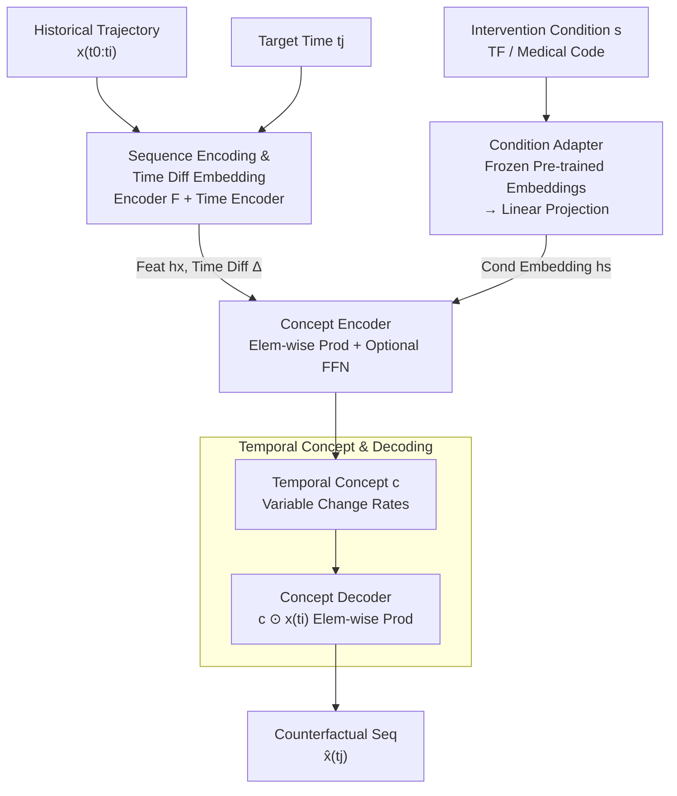

# Controllable Sequence Editing for Biological and Clinical Trajectories

**Conference**: ICLR 2026  
**arXiv**: [2502.03569](https://arxiv.org/abs/2502.03569)  
**Code**: [https://github.com/mims-harvard/CLEF](https://github.com/mims-harvard/CLEF)  
**Area**: Computational Biology / Bioinformatics  
**Keywords**: Counterfactual Generation, Sequence Editing, Temporal Concepts, Patient Trajectories, Cellular Reprogramming

## TL;DR

Clef is proposed, a controllable sequence editing model based on "temporal concepts" capable of immediate and delayed editing of biological/clinical multivariate trajectories under given conditions (e.g., drugs, surgery). On cellular reprogramming and patient lab data, it improves immediate editing MAE by 16.28%, delayed editing by 26.73%, and zero-shot counterfactual generation by up to 62.84%.

## Background & Motivation

Counterfactual reasoning ("What if a patient were given a different drug?" "What if a cellular perturbation occurred ten days earlier?") is a core problem in biology and medicine. Existing methods suffer from the following:

**Limitations of Prior Work**:
- **Controllable Text Generation (CTG) methods** can only perform "immediate editing" (predicting the next token) and cannot handle "delayed editing" (jumping to a future time step to predict counterfactual trajectories). CTG models must progress step-by-step to fill temporal gaps, failing to guarantee fulfillment of target conditions.
- **Time-series Diffusion Models** support conditional generation but are limited to univariate sequences and assume conditions affect the entire sequence, lacking precise local editing capabilities.
- **Spatiotemporal Locality of Real Interventions**: In practical scenarios, interventions (e.g., drug administration, surgery) should only take effect after specific time points and affect only a subset of variables (e.g., certain lab tests), while other variables and historical data should remain unchanged to maintain temporal causal consistency.

**Key Challenge**: How to perform precise, condition-guided local editing of multivariate sequences while maintaining global causal consistency?

**Key Insight**: Inspired by "condition guidance" in controllable text generation and "spatial context" in image in-painting, Clef introduces "temporal concepts"—vectors encoding sequence trajectory change rates—to capture how and when conditions affect a sequence, enabling precise, temporally localized controllable sequence editing.

## Method

### Overall Architecture

Clef addresses the problem of "editing a multivariate historical trajectory $\mathbf{x}_{:,t_0:t_i}$ into a counterfactual future under condition $s$ (e.g., administration of a drug, knock-in of a transcription factor)." Its data flow converges from three paths for single-step generation: a **Sequence Encoder $F$ + Time Encoder** encode the historical trajectory and "how far the target time $t_j$ is from the current time" into sequence features $\mathbf{h}_x$ and a time difference $\Delta_{t_i,t_j}$; a **Condition Adapter $H$** maps intervention conditions to condition embeddings $\mathbf{h}_s$; a **Concept Encoder $E$** fuses these three paths into a "temporal concept" $\mathbf{c}$; and finally, a **Concept Decoder $G$** treats $\mathbf{c}$ as variable-wise change rates applied to the current state via element-wise multiplication to yield the counterfactual sequence $\hat{\mathbf{x}}_{:,t_j}^s$ in one step. Since the target time $t_j$ is explicitly encoded into the concept, Clef supports two types of editing: **Immediate Editing** (predicting the next step $\hat{\mathbf{x}}_{:,t_{i+1}}$) and **Delayed Editing** (directly jumping to predict $\hat{\mathbf{x}}_{:,t_j}$ for a condition occurring at $t_j \geq t_{i+1}$), which CTG methods cannot achieve.

### Key Designs

**1. Sequence Encoding & Time Diff Embedding: Explicitly Encoding "When to Intervene"**

Delayed editing is possible because the model knows the distance to the target time point. The sequence encoder $F$ extracts temporal features $\mathbf{h}_x = F(\mathbf{x}_{:,t_0:t_i})$ from history. It is architecture-agnostic and can use Transformer, xLSTM, or pre-trained foundation models like MOMENT, making Clef a "controllable editing enhancement module" for any encoder. Simultaneously, the Time Encoder uses sinusoidal embeddings for year/month/day/hour to get positional encodings $\mathbf{h}_t$, representing the span explicitly as $\Delta_{t_i,t_j} = \mathbf{h}_{t_j} - \mathbf{h}_{t_i}$. This signal allows the model to jump to any future moment without step-by-step iteration.

**2. Condition Adapter: Reusing Frozen Domain Pre-trained Embeddings**

Intervention conditions $s$ are discrete symbols mapped to vectors. Clef uses frozen pre-trained models—ESM-2 for cellular experiments and clinical knowledge graph embeddings for patient data—projected via a linear layer $H$ to $\mathbf{h}_s = H(\mathbf{z}_s)$. Utilizing existing domain semantics enables generalization to unseen conditions based on embedding space proximity, forming the basis for zero-shot counterfactual generation.

**3. Concept Encoder: Fusing Three Signals to Generate Temporal Concept $\mathbf{c}$**

The time difference and condition embeddings are concatenated into a joint embedding $\mathbf{h}_s^{t_j} = \Delta_{t_i,t_j} \oplus \mathbf{h}_s$, which then interacts with sequence features via element-wise multiplication. An optional FFN with GELU activation generates the temporal concept:

$$\mathbf{c} = \text{GELU}(\text{FFN}(\mathbf{h}_x \odot \mathbf{h}_s^{t_j}))$$

Element-wise multiplication allows "how the state changes" to be gated by "condition + span." FFN usage depends on data complexity: cellular data uses linear concepts (no FFN) for optimal WOT performance, while complex patient data benefits from the non-linear capacity provided by the FFN.

**4. Temporal Concept & Decoding: Change Rates Over Absolute Values**

Clef defines the temporal concept as a change rate (growth/decay factor per variable) between time steps rather than regressing absolute values. The decoder applies the concept to the current state: $\hat{\mathbf{x}}_{:,t_j}^s = \mathbf{c} \odot \mathbf{x}_{:,t_i}$. This naturally ensures locality: interventions only need to shift the change rates of a few variables, while others remain near 1 (staying unchanged), satisfying the requirement that interventions affect only parts of the system. This provides rare concept-level controllability.

### Loss & Training

A Huber Loss is used to balance MSE sensitivity to outliers and MAE robustness:

$$\mathcal{L}(\mathbf{x}, \hat{\mathbf{x}}) = \begin{cases} 0.5\mathbf{a}^2, & \text{if } |\mathbf{a}| \leq \delta \\ \delta(|\mathbf{a}| - 0.5\delta), & \text{otherwise} \end{cases}$$

where $\mathbf{a} = \mathbf{x}_{:,t_j}^s - \hat{\mathbf{x}}_{:,t_j}^s$. Training was conducted on NVIDIA A100/H100 GPUs with hyperparameter search: dropout $\in [0.3, 0.6]$, learning rate $\in [1e-3, 1e-5]$, and layers $\in [4, 8]$.

## Key Experimental Results

### Datasets

Four core datasets were utilized:
- **WOT**: Simulated single-cell transcriptomic developmental trajectories (1479 highly variable genes).
- **WOT-CF**: Paired counterfactual cell trajectories for zero-shot evaluation.
- **eICU**: Patient lab test trajectories (18 tests).
- **MIMIC-IV**: Patient lab trajectories.

### Main Results

Baselines included VAR, Transformer, xLSTM, MOMENT, and their respective +Clef variants.

**Immediate Editing**:
- Clef consistently outperformed baselines across all datasets, with an average MAE reduction of 16.28%.
- Clef performed better on datasets with complex short-term dynamics.

**Delayed Editing**:
- Clef outperformed or matched SimpleLinear and VAR on eICU and MIMIC-IV.
- Clef-transformer and Clef-xLSTM achieved the lowest MAE.
- Average MAE improved by 26.73%.
- On WOT, linear models performed best due to smaller, potentially noisy changes in developmental trajectories.

### Ablation Study

| Configuration | Key Result | Description |
|------|---------|------|
| SimpleLinear (Concept = 1) | Competitive in some scenarios | Shows linear approximation is effective when $x_{t_j} \approx x_{t_i}$. |
| Clef-FFN=0 | Optimal for WOT | Cellular data is simple and requires no extra non-linearity. |
| Clef-FFN=1 | Optimal for eICU/MIMIC | Patient data requires more expressive capacity. |
| Different Encoders | MOMENT performed worst | 1024-d embeddings from foundation models were less effective than training from scratch. |

### Generalization

Using the SPECTRA method for train/test similarity splits:
- Clef models remained stable as train/test distribution shift increased.
- Non-Clef models showed significant performance degradation.

### Zero-Shot Counterfactual Generation

Evaluated on WOT-CF paired trajectories:
- Clef consistently outperformed non-Clef models in both immediate and delayed editing.
- Immediate editing improved up to 14.45% MAE; delayed editing up to 63.19% MAE.

### Key Findings

- Temporal concepts allow direct intervention at the concept level (e.g., halving glucose-related concepts) without condition tokens.
- In a T1D case study, lowering the glucose concept generated counterfactual trajectories more similar to healthy individuals.
- Intervening on the glucose concept indirectly caused a decrease in white blood cell counts, aligning with clinical knowledge of T1D as an autoimmune disease.
- Simultaneously intervening on multiple concepts (glucose + WBC) produced cumulative effects.

## Highlights & Insights

- **Minimalist yet Effective Mechanism**: Defining concepts as change rates with element-wise multiplication provides high interpretability.
- **One-Step Delayed Prediction**: Unlike CTG, Clef predicts counterfactuals at any future time point in a single step.
- **Encoder-Agnostic**: Clef serves as a plug-and-play enhancement module for various sequence encoders.
- **Concept Intervenability**: Users can edit specific dimensions of the temporal concept to generate counterfactuals.
- **Regularization Effect**: Clef reduces neural network MAE even in scenarios where linear models are traditionally stronger.

## Limitations & Future Work

- Currently lacks modeling of high-order relationships between variables; hierarchical concepts could be explored.
- Relies on data-driven approaches without utilizing causal model priors.
- Performance is tied to the quality of pre-trained condition embeddings (ESM-2, KG).
- Foundation models like MOMENT performed poorly, suggesting they may not yet be suited for fine-grained counterfactual generation.

## Related Work & Insights

- **Controllable Text Generation**: Clef extends the CTG paradigm to the temporal domain and supports delayed editing.
- **Concept Bottleneck Models**: Clef adapts the idea of intermediate interpretable concept layers for conditional generation.
- **Optimal Transport**: Clef builds upon OT-based developmental trajectories (WOT) to enable conditional editing.

## Rating

- Novelty: ⭐⭐⭐⭐
- Experimental Thoroughness: ⭐⭐⭐⭐⭐
- Writing Quality: ⭐⭐⭐⭐⭐
- Value: ⭐⭐⭐⭐

<!-- RELATED:START -->

## Related Papers

- [\[ICLR 2026\] Controllable Diffusion-based Generation for Multi-channel Biological Data](controllable_diffusion-based_generation_for_multi-channel_biological_data.md)
- [\[ICLR 2026\] Learning Flexible Forward Trajectories for Masked Molecular Diffusion](learning_flexible_forward_trajectories_for_masked_molecular_diffusion.md)
- [\[ICLR 2026\] Multi-state Protein Sequence Design with DynamicMPNN](multi-state_protein_sequence_design_with_dynamicmpnn.md)
- [\[ICML 2026\] scCBGM: Interpretable Single-Cell Counterfactual Editing](../../ICML2026/computational_biology/sccbgm_interpretable_single-cell_counterfactual_editing.md)
- [\[ICLR 2026\] FlexRibbon: Joint Sequence and Structure Pretraining for Protein Modeling](flexribbon_joint_sequence_and_structure_pretraining_for_protein_modeling.md)

<!-- RELATED:END -->
