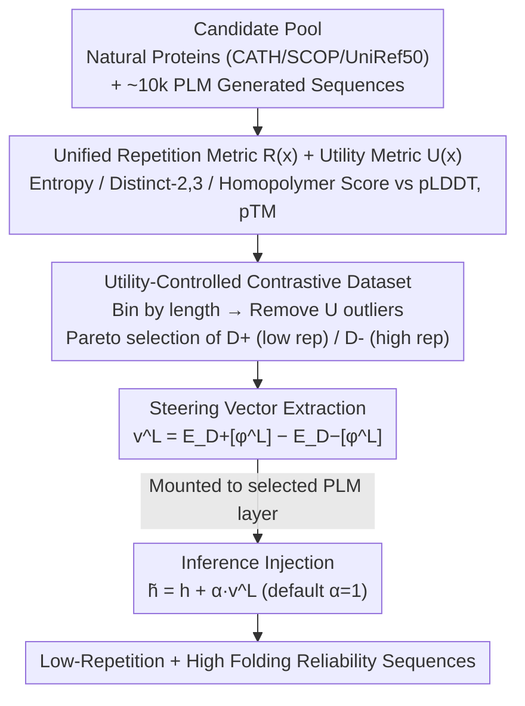

# Controlling Repetition in Protein Language Models

**Conference**: ICLR2026  
**arXiv**: [2602.00782](https://arxiv.org/abs/2602.00782)  
**Code**: To be confirmed  
**Area**: Protein / AI4Science  
**Keywords**: Protein Language Models, Repetition Control, Contrastive Steering, Representation Engineering, Sequence Generation

## TL;DR
The authors provide the first systematic study of pathological repetition in Protein Language Models (PLMs). They propose a unified repetition metric $R(x)$ and a utility metric $U(x)$, and design the Utility-Controlled Contrastive Steering (UCCS) method. By injecting a steering vector decoupled from repetition into the hidden layers, the method effectively suppresses repetition while maintaining folding reliability without requiring model retraining.

## Background & Motivation
1. PLMs (e.g., ESM-3, ProtGPT2) have made significant progress in protein structure prediction and de novo design; however, generation frequently suffers from pathological repetition—sequences collapsing into redundant motifs or long homopolymers.
2. Unlike natural language where repetition only reduces readability, repetition in proteins directly destroys structural diversity, leading to folding instability and loss of function (e.g., polyQ expansion in Huntington’s disease).
3. Existing decoding strategies (temperature, top-p, n-gram penalty) are directly transferred from NLP and are not tailored for protein design, often at the cost of reduced AlphaFold pLDDT scores.
4. Repetition and structural utility are highly entangled: naively reducing repetition often harms folding reliability, necessitating a method to decouple the two.
5. PLMs lack explicit mechanisms to separate repetition from other generation factors, and traditional text repetition metrics fail to capture degradation patterns unique to proteins.
6. Pathological repetition has been largely overlooked as a key failure mode of PLMs, lacking formal definition, evaluation metrics, and systematic research.

## Method

### Overall Architecture
UCCS formalizes the objective of "suppressing repetition without harming folding" as a constrained optimization problem: $\min_f R(f(M,p))$ s.t. $U(f(M,p)) \ge U(M,p) - \epsilon$, which aims to minimize repetition $R(x)$ given that utility $U(x)$ does not drop beyond a tolerance $\epsilon$. The pipeline is implemented in three steps: first, establishing two non-confusable metrics to quantify protein-specific "repetition" and "folding utility" into scalars; second, screening a "utility-aligned" contrastive set from natural and generated proteins to extract a steering vector that encodes only repetition from hidden layer activations; third, injecting this vector into selected layer activations with intensity $\alpha$ during inference. This plug-and-play approach requires no retraining and is compatible with both Masked Language Models (MLM) and Autoregressive Language Models (AR-LM).

### Key Designs

**1. Unified Repetition Metric: Quantifying protein-specific degradation into an optimizable scalar**

Textual repetition metrics cannot capture two collapses specific to proteins—motif-level cycles (e.g., short fragment repeats like AGAGAG) and homopolymer extensions (e.g., long chains of a single amino acid like AAAAAA). The latter is more common in PLMs due to the smaller amino acid vocabulary. The authors utilize three complementary signals: normalized token entropy $H_{\text{norm}}$ reflects global distribution imbalance; Distinct-2/3 captures local motif cycles; and a homopolymer diversity score $R_{\text{hpoly}} = 1 - \frac{1}{T}\sum_i \ell_i \cdot \mathbf{1}(\ell_i \ge k)$ specifically punishes homopolymer collapse of length $\ell_i \ge k$ (default $k=4$). While n-gram diversity is ineffective against single-residue repetition (where overlapping n-grams look diverse but are not), $R_{\text{hpoly}}$ addresses this blind spot. These are aggregated into a unified score $R(x)$; the paired utility score $U(x)$ is the mean of AlphaFold pLDDT and pTM, representing folding confidence. With these two independent metrics, "repetition" and "utility" can be measured and decoupled.

**2. Utility-Controlled Contrastive Dataset: Ensuring the steering vector learns only repetition without confounding folding capability**

This step corresponds to the transition from the candidate pool to $\mathcal{D}^+/\mathcal{D}^-$ in the framework. The challenge is that repetition and folding utility are naturally entangled—extremely repetitive sequences almost always have low structural confidence. If contrastive sets were built simply on repetition, the extracted direction would also encode "structural quality," potentially crushing the structure while reducing repetition. The authors' approach involves collecting a pool from natural proteins and PLM generations, binning by length, and removing sequences whose $U(x)$ significantly deviates from the reference mean $\bar U$. Then, they solve for $(\mathcal{D}^+,\mathcal{D}^-)=\arg\max \Delta R$ s.t. $\Delta U \le \epsilon$, using Pareto fronts or composite scoring to select a pair of subsets with maximum difference in repetition but aligned utility. This decoupling is the key to the method's success.

**3. Steering Vector Extraction and Injection: One-time extraction for plug-and-play intervention**

After obtaining the contrastive set, layer-wise representations $\phi^L(x)$ are extracted. MLM uses mean pooling across all tokens (fitting its bidirectional encoding), while AR-LM uses the final token embedding (concentrating predictive information). The steering vector is the difference between the means: $v^L = \mathbb{E}_{\mathcal{D}^+}[\phi^L] - \mathbb{E}_{\mathcal{D}^-}[\phi^L]$. During inference, this vector is added to the activations at each position in the selected layer: $\tilde{h}_t^L = h_t^L + \alpha \cdot v^L$ (default strength $\alpha=1$). Because the intervention occurs in the representation space rather than on decoding probabilities, UCCS does not require retraining and is agnostic to the sampling strategy.

### Loss & Training
UCCS is an inference-time intervention requiring no modification to model parameters and no training. It only requires a one-time offline construction of the contrastive set and vector extraction. The candidate pool consists of ~10k natural proteins and ~10k PLM-generated sequences, refined to ~100 sequences per length bin after utility filtering. The only adjustable hyperparameters are the injection strength $\alpha$ and the injection layer $L$.

## Key Experimental Results

### Main Results — ProtGPT2 Unconditional Generation (Table 2a)

| Method | R↑ (CATH) | U↑ (CATH) | R↑ (SCOP) | U↑ (SCOP) |
|------|-----------|-----------|-----------|-----------|
| Original | 0.728 | 0.621 ✓ | 0.728 | 0.621 ✓ |
| Repetition Penalty | 0.780 | 0.622 ✓ | 0.780 | 0.622 ✓ |
| **UCCS** | **0.845** | **0.711** ✓ | **0.835** | **0.722** ✓ |

### Ablation / Conditional Generation (Table 2b)

| Method | R↑ (CATH) | U↑ (CATH) |
|------|-----------|-----------|
| Original | 0.836 | 0.704 ✓ |
| Temperature | 0.847 | 0.700 |
| **UCCS** | **0.877** | **0.743** ✓ |

### Key Findings
- On ESM-3, UCCS achieved a **+55%** relative gain in $R(x)$ compared to the original model in CATH unconditional generation.
- On ProtGPT2, UCCS outperformed temperature sampling by approximately **+20%** in $R(x)$ and was the only method to consistently satisfy utility constraints across all datasets and tasks.
- In conditional generation, UCCS reached R=0.890 (highest) on SCOP with U=0.737, satisfying the constraint.
- Sequences generated by UCCS demonstrate high structural confidence (dominated by blue regions with pLDDT > 90) and diverse folds.
- Neuron Deactivation and Probe Steering methods dropped $U$ below constraints in some settings, proving less stable than UCCS.
- Ablation studies show that $\alpha$ is stable over a wide range, and while layer selection matters, the results are not extremely sensitive.
- Jensen-Shannon divergence heatmaps confirm that the proposed metrics clearly separate PLM-generated distributions from natural protein distributions.

## Highlights & Insights
- **Novelty**: This is the first work to systematically identify, quantify, and solve the pathological repetition problem in PLMs, filling a critical gap in the field.
- **Elegant Decoupling**: The utility-controlled contrastive set construction ensures that steering vectors encode only repetition signals rather than confounding factors of folding ability.
- **Plug-and-Play**: No retraining is required; vectors are injected during inference, making it applicable to both MLM and AR-LM paradigms.
- **Biological Motivation**: The threshold $k=4$ for the homopolymer diversity score $R_{\text{hpoly}}$ has a clear biological basis (homopolymers $\ge 4$ are almost always low-complexity unstable regions).

## Limitations & Future Work
- Validation was limited to ESM-3 and ProtGPT2; it has yet to be tested on larger PLMs like ESM-2 15B or ProGen2.
- $U(x)$ is based on AlphaFold confidence rather than experimental verification, leaving a gap in evaluating real-world folding reliability.
- The interpretability of the steering vector $v^L$ could be further investigated—it remains unclear exactly what features it encodes in the representation space.
- The construction of contrastive datasets relies on pre-computed $R(x)$ and $U(x)$, which may require recalibration for specialized protein domains (e.g., membrane proteins).

## Related Work & Insights
- **vs Repetition Penalty (Decoding Penalty)**: Simple but coarse; on ProtGPT2, UCCS achieved R=0.845 vs R=0.780, while also significantly boosting U (0.711 vs 0.622).
- **vs Probe Steering**: Uses probes to train steering vectors but fails to control for utility entanglement; on SCOP, it achieved R=0.735 and U=0.619 (below original), whereas UCCS achieved R=0.835/U=0.722.
- **vs Activation Steering (NLP)**: UCCS transfers representation steering from NLP safety/sentiment domains to protein generation, with the innovation being the utility-controlled contrastive set construction.

## Rating
- Novelty: ⭐⭐⭐⭐⭐ First to systematically identify and solve PLM pathological repetition; pioneering problem definition and method.
- Experimental Thoroughness: ⭐⭐⭐⭐ Two models × three datasets × two generation settings; comprehensive comparisons.
- Writing Quality: ⭐⭐⭐⭐ Clear motivation, well-grounded metric design, and rigorous structure.
- Value: ⭐⭐⭐⭐ Provides a practical tool for reliable protein generation with PLMs; the methodology is generalizable to other generative degradation issues.

<!-- RELATED:START -->

## Related Papers

- [\[ICLR 2026\] Towards Understanding the Shape of Representations in Protein Language Models](towards_understanding_the_shape_of_representations_in_protein_language_models.md)
- [\[ICML 2025\] Steering Protein Language Models](../../ICML2025/computational_biology/steering_protein_language_models.md)
- [\[ICML 2026\] Viral Proteins Reveal Geometry of Protein Language Models](../../ICML2026/computational_biology/viral_proteins_reveal_geometry_of_protein_language_models.md)
- [\[ICML 2026\] Circuit Tracing in Autoregressive Protein Language Models](../../ICML2026/computational_biology/circuit_tracing_in_autoregressive_protein_language_models.md)
- [\[ACL 2025\] Concept Bottleneck Language Models For Protein Design](../../ACL2025/computational_biology/concept_bottleneck_language_models_for_protein_design.md)

<!-- RELATED:END -->
