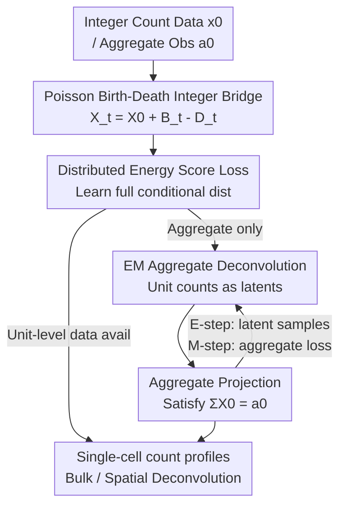

# Count Bridges enable Modeling and Deconvolving Transcriptomic Data

**Conference**: ICLR2026  
**OpenReview**: [https://openreview.net/forum?id=4nOZBufbLC](https://openreview.net/forum?id=4nOZBufbLC)  
**Code**: Available (Anonymous repository link provided in the paper)  
**Area**: Computational Biology / Generative Models / Discrete Diffusion / Transcriptomic Deconvolution  
**Keywords**: Count data, Stochastic Bridges, Poisson Birth-Death Process, Deconvolution, Single-cell Transcriptomics

## TL;DR
Ours proposes Count Bridges—a stochastic bridge model defined on the integer lattice $\mathbb{Z}^d$ driven by Poisson birth-death processes, providing an exact analytically tractable counterpart of diffusion models for count data. By incorporating "aggregation-only" deconvolution into the same framework via EM, it achieves SOTA results in synthetic distribution matching, nucleotide-level deconvolution of bulk RNA-seq, and spot deconvolution of spatial transcriptomics.

## Background & Motivation
**Background**: Modern biological measurements (RNA-seq, fluorescence imaging, mass cytometry) essentially output **integer-valued** data as "molecular counts." However, popular generative frameworks—such as diffusion models and flow matching—are mostly designed for continuous Euclidean spaces. Diffusion typically adds Gaussian noise to data and learns a denoiser, naturally assuming that states can take any real value.

**Limitations of Prior Work**: Existing approaches to bring generative models to count data are suboptimal. One category is **discrete diffusion** (D3PM, SEDD, etc.), which treats counts as unordered categories and corrupts them using masking or uniform noise, completely losing the **ordinal structure** inherent in counts (e.g., 5 is greater than 3 and different from 100 in terms of "distance"). Another specialized approach, Blackout Diffusion, uses a **pure death process**, which can only decay images to zero and cannot transport between two arbitrary distributions. Meanwhile, biological deconvolution literature (cell2location, RCTD, CIBERSORTx) only outputs **cell-type proportions** (cluster-level) rather than true single-cell count profiles.

**Key Challenge**: An ideal framework needs to satisfy three criteria simultaneously: respect the integer and ordinal structure of counts, enable transport between arbitrary distributions, and systematically infer unit-level details from aggregated observations. No existing method achieves all three. The latter is a critical biological need: Visium spots contain mixtures of 10–50 cells, and bulk RNA-seq averages counts across thousands to millions of cells. **Deconvolving** these aggregates back to single-cell profiles is essential for characterizing cellular heterogeneity, cell-cell interactions, and tissue structure.

**Goal**: (1) Create a generative diffusion model that natively supports integer counts and enables transport between arbitrary distributions; (2) Extend it into a deconvolver capable of training and inferring unit-level profiles directly from aggregated observations.

**Key Insight**: The authors note that the essence of diffusion models is a family of bridge kernels satisfying "bridge consistency" and "projected posterior" properties. By finding a random process on integers with a **closed-form conditional distribution** to replace the Gaussian process, the entire diffusion training-sampling paradigm can be adapted.

**Core Idea**: Construct stochastic bridges on integers using a pair of independent **Poisson birth/death processes** (increasing/decreasing counts) to obtain exactly samplable closed-form conditional distributions. Then, use EM to treat unit-level counts as latent variables to train the model from aggregated data.

## Method

### Overall Architecture
The Count Bridges framework consists of two layers. **The first layer is generative modeling**: Given a data distribution $p_0$ (e.g., single-cell counts) and a simple source distribution $p_1$ (e.g., Poisson noise), a stochastic bridge is constructed on $\mathbb{Z}^d$ moving from $X_1$ to $X_0$. "Noising" the bridge is implemented via birth-death processes—at each step, counts are randomly increased ($+1$) or decreased ($-1$). Since this process has a closed-form conditional distribution, a denoiser $q_\theta(x_0\mid x_t,t)$ is trained to approximate the posterior $X_0\mid X_t$, followed by multi-step sampling to recover the data. Because the space is discrete, the denoiser cannot simply learn the conditional mean; it must use a **distributed loss** (energy score) to learn the entire conditional distribution.

**The second layer is deconvolution**: In reality, we often only observe the aggregate $a_0=\sum_g x_{g0}$ (e.g., the sum of counts for all cells in a spot). The authors formulate this as a **generalized EM problem**, where unit-level counts $X_0$ are latent variables and the aggregate $a_0$ is the observation. The E-step uses "projection-guided sampling" to generate latent unit-level samples $x_0^\approx$ under aggregation constraints. The M-step uses these samples to update the model by calculating the loss **at the aggregate level**. The pipeline is as follows:

### Key Designs

**1. Poisson Birth-Death Integer Bridges: Bringing Diffusion to the Integer Lattice via Closed-Form Conditionals**

Addressing the pain point that diffusion is designed for continuous space and discrete alternatives lose ordinal structure, the authors construct a forward kernel using independent Poisson birth/death processes. Defining an increasing jump intensity $w(t)$ ($w(0)=0,w(1)=1$) and cumulative birth/death intensities $\Lambda^\pm(t)=\lambda^\pm w(t)$, the number of births $B_t\sim\mathrm{Poi}(\Lambda^+(t))$ and deaths $D_t\sim\mathrm{Poi}(\Lambda^-(t))$ yield the unconditional forward kernel:

$$X_t = X_0 + B_t - D_t.$$

The key is that this process has a **closed-form bridge conditional distribution** $K_{s|0,t}$. By introducing the displacement $d_t=X_t-X_0$, total jumps $N_t=B_t+D_t$, and a slack variable $M_t=\min(B_t,D_t)$, any two determine the third ($N_t=|d_t|+2M_t$). Using Poisson superposition/thinning properties, given endpoints $(x_0, x_t)$, one can sample the slack $M_t\mid d_t\sim\mathrm{Bes}(|d_t|;\Lambda^+,\Lambda^-)$ via a Bessel distribution, then use a **Binomial distribution** for $N_s\mid N_t\sim\mathrm{Bin}(N_t, w(s)/w(t))$ and a **Hypergeometric distribution** for $B_s$ to recover intermediate states exactly. This closed-form distribution satisfies "bridge consistency" and "projected posterior" (Proposition 3.1). Multi-step sampling is thus equivalent to sampling directly from the $(0,1)$ bridge, preventing the model from drifting. The birth-death mechanism allows bidirectional transport (overcoming Blackout's pure death limit) while preserving ordinal structure. A custom CUDA Bessel sampler was implemented for efficiency. A notable byproduct: as $d_t$ increases, $M_t$ concentrates at 0, revealing Count Bridges as an instance of the **Static Schrödinger Bridge**—solving entropy-regularized optimal transport where jump intensity $\kappa=\sqrt{\lambda^+\lambda^-}$ corresponds to the noise scale $\sigma$ in Gaussian settings.

**2. Distributed Energy Score Loss: Learning Full Conditional Distributions in Discrete Space**

In continuous diffusion, learning the conditional mean $\mathbb{E}[X_0\mid X_t]$ suffices. However, in discrete/jump processes, the ELBO is "distributed" and cannot be reduced to point estimation (Holderrieth et al. 2024); the full conditional distribution must be learned. Instead of cross-entropy, which ignores lattice geometry and suffers from exponential dimensionality in modeling joint distributions $X_s\mid X_t$, the authors use a **strictly proper energy score**. For a negative-type semi-metric $\rho$ (e.g., $\rho(x,x')=\|x-x'\|_2^{\beta}$ with $\beta=1$), the score for denoiser $q_\theta$ output is:

$$S_\rho(p,y)=\tfrac12\,\mathbb{E}_{X,X'\sim p}\big[\rho(X,X')\big]-\mathbb{E}_{X\sim p}\big[\rho(X,y)\big],$$

The training objective is $L(\theta)=\mathbb{E}_{X_0,X_t,t}\big[S_\rho(q_\theta(\cdot\mid X_t,t),X_0)\big]$. In practice, this is estimated via $m$ unbiased plug-in samples from $q_\theta$. Unlike cross-entropy, the energy score integrates count geometry (distances) into the loss and naturally supports joint distribution modeling, contributing to the scalability of Count Bridges in high dimensions.

**3. EM Aggregated Deconvolution: Training from Aggregate Data with Latent Unit-Level Counts**

To solve the core problem where only aggregate $a_0$ is observed, deconvolution is framed as generalized EM. For a linear mapping $A:\mathbb{Z}^G\to\mathbb{Z}$ (e.g., element-wise sum) and an i.i.d. product prior from the denoiser on $X_0=(X_{10},\dots,X_{G0})$, the target posterior is:

$$Q_\theta(X_0\mid a_0,x_t,t,z)\propto\Big[\prod_{g=1}^{G} q_\theta(X_{g0}\mid x_t,t,z)\Big]\,\mathbf{1}\{A(X_0)=a_0\}.$$

**E-step**: Approximates this via "projection-guided sampling": starting from $x_1$, reverse sampling is performed. At each step, $\hat x_0\sim q_\theta$ is predicted, then projected to $\tilde x_0$ to satisfy the aggregate constraint. Using $\tilde x_0$ as the predicted endpoint for the sampling step ensures the constraint is maintained throughout the trajectory, yielding latent samples $x_0^\approx$.
**M-step**: Trains the bridge using these latent samples, but the loss is lifted to the aggregate level using an aggregate score $S^A_\rho(p,a)=\tfrac12\mathbb{E}_p[\rho(A(X),A(X'))]-\mathbb{E}_p[\rho(A(X),a)]$ against ground truth $a_0$. This allow the model to learn self-consistent unit-level profiles without ever seeing unit-level labels—the core capability for bulk/spatial deconvolution.

**4. Aggregate Projection: Rescaling as a First-Order Approximation and Learned Projections**

The "projection" step is crucial. Proposition 4.1 proves that under regularity conditions, the aggregate conditional law $Q_\theta(\cdot\mid A_0=a_0)$ admits a first-order exponential tilt. The corresponding generalized KL projection $\Pi(x_0)=\arg\min_{y_0:A(y_0)=a_0} D_{\mathrm{KL}}(y_0\|x_0)$ for summation is exactly **simple rescaling**: $\Pi(x_0)_g = a_0 x_{g0}/(\sum_{g'} x_{g'0})$. This provides theoretical backing for common biological rescaling heuristics as first-order approximations of the true posterior. When unit-level data is available, a more powerful **projection module** $\Pi_\psi(\hat x_0,a_0,x_t,z)$ (using attention across cells) is learned using the distributed loss.

### Loss & Training
The generative phase minimizes the energy score $L(\theta)$. The deconvolution phase alternates between the E-step (generating latent samples) and M-step (updating via $L_\mathrm{agg}$). Cell-type labels are randomly masked during training to support both unconditional and conditional sampling. The projection module is enabled on only 10% of samples to support both unconstrained and constrained inference. The source distribution $X_1\sim\mathrm{Poi}(10)$ is used for spatial transcriptomics.

## Key Experimental Results

### Main Results
In synthetic tasks, Count Bridges (CB) outperforms Continuous Flow Matching (CFM) and Discrete Flow Matching (DFM) in $W_2$, Energy, and MMD on an integer "8 Gaussians → 2 Moons" task. CB trajectories exhibit OT-like behavior, whereas DFM is decoupled from geometry. CB also shows superior scalability in high-dimensional Gaussian mixtures ($d=4$ to $512$).

Bulk RNA-seq nucleotide-level deconvolution (PBMC scRNA-seq, $10^6$ cells / $10^3$ donors):

| Task | Metric | Ours (CB) | Baseline | Gain |
|------|------|---------|----------|------|
| Sequence → expression | Bulk MSE | **0.601** | Fine-tuned Enformer 2.590 | ↓ Huge |
| Sequence → expression | CT MSE | **1.410** | Fine-tuned Enformer 3.142 | ↓ Huge |
| Cell type proportion | JSD | **0.113** | CIBERSORTx 0.194 / MuSiC 0.313 | Best |
| Cell type proportion | RMSE | **0.073** | CIBERSORTx 0.109 | Best |
| Cell type proportion | Spearman | **0.267** | MuSiC 0.186 | Best |

Spatial transcriptomics spot deconvolution (MERFISH mouse brain, aggregated into Visium-like spots, UViT encodes nuclei images as side info):

| Metric | Ours (CB) | STDeconvolve | Gain |
|------|---------|--------------|------|
| JSD | **0.231** | 0.288 | Best |
| RMSE | **0.110** | 0.177 | Best |
| Spearman | **0.332** | 0.255 | Best |

CB also outperforms the biologically-motivated "spot mean $a_0/G$" baseline in profile quality (MMD 0.203 vs 0.409).

### Ablation Study

| Configuration | Key Finding | Description |
|------|---------|------|
| Energy Score vs Cross Entropy | Energy Score is superior | CE ignores lattice geometry and requires coordinate-wise decomposition, failing to model joint distributions. |
| One-step vs Two-step bridge | ECDF indistinguishable | Confirms the bridge consistency property (Fig 1, right). |
| Decon. vs Group size $G$ / Heterogeneity $\alpha$ | Larger/homogeneous groups are worse | Consistent with identifiability theory: deconvolution requires inter-group heterogeneity. |

### Key Findings
- **Ordinal Structure + Closed-Form Conditionals**: CB's OT-like trajectories (vs DFM's geometry-decoupled ones) prove that respecting count order leads to more reasonable transport.
- **Energy Score is Essential for High Dimensions**: Cross-entropy fails to model joint distributions; CB maintains performance as $d$ increases.
- **Identifiability Limits**: As groups grow larger or more homogeneous, identifiability inevitably degrades. EM is most reliable at moderate aggregation scales.

## Highlights & Insights
- **Abstracting Diffusion to "Two Bridge Properties"**: The authors first distill diffusion into bridge consistency and projected posterior properties, then prove Poisson birth-death bridges satisfy them—a clean "swap the kernel, keep the framework" approach transferable to other structures.
- **Birth-Death for Bidirectional, Ordinal, and Closed-Form**: Unlike Blackout's pure death, adding birth enables transport between arbitrary distributions. The closed-form Bessel/Binomial/Hypergeometric distributions make exact sampling possible.
- **Theorizing Rescaling**: Proposition 4.1 elevates "aggregate rescaling" from a heuristic to a first-order approximation, followed by a learned attention-based projection module.
- **Unifying Generation and Deconvolution**: The same bridge performs both unconditional generation and EM deconvolution under aggregate constraints, applicable to any "aggregate count" scenario (mass spec, imaging counts).

## Limitations & Future Work
- **Continuous Approximation**: At very high count scales where continuous approximations are valid, Euclidean diffusion might perform equally well or better. CB's advantage is primarily in low-count, highly discrete regimes.
- **Hard Limits on Deconvolution**: Identifiability is an information-theoretic constraint; if groups are too large or identical, EM will fail.
- **Theoretical Gaps in Projection**: The projection step in the E-step is a first-order proxy. Convergence of the projection-guided sampler and tighter identifiability bounds remain future work.
- **Evaluation Settings**: Deconvolution assessment relies heavily on synthetic aggregation (e.g., MERFISH treated as Visium). Validating on real data without single-cell ground truth remains an open challenge.

## Related Work & Insights
- **vs Blackout Diffusion**: Uses pure death processes to decay images to zero. Only unidirectional. CB allows birth and death, enabling bidirectional transport and generalizing to bridges.
- **vs Discrete Diffusion / Flow Matching (D3PM, SEDD, DFM)**: Treats counts as unordered, losing ordinal structure. CB natively models ordinal counts with geometry-aware trajectories.
- **vs Biological Deconvolution**: Most methods output cluster-level **proportions** and require reference atlases. CB outputs single-cell **count profiles** and can work without external references (using side info like images).
- **vs Distributed Diffusion (De Bortoli et al. 2025)**: CB borrows the "proper scoring rule" idea but applies it to the integer lattice with birth-death bridges, solving the fundamental difficulty of non-reducible conditional distributions in discrete spaces.

## Rating
- Novelty: ⭐⭐⭐⭐⭐ First generative bridge for counts enabling bidirectional transport between arbitrary distributions with closed-form sampling, unifying generation and deconvolution.
- Experimental Thoroughness: ⭐⭐⭐⭐ Covers synthetic, bulk, and spatial tasks, though real-data validation is largely via synthetic aggregation.
- Writing Quality: ⭐⭐⭐⭐⭐ Clear derivation from diffusion abstraction to integer bridges; natural transition between theory and application.
- Value: ⭐⭐⭐⭐⭐ Provides a principled foundation for count data generation and deconvolution with direct utility for single-cell/spatial transcriptomics.

<!-- RELATED:START -->

## Related Papers

- [\[ICML 2026\] CountsDiff: A Diffusion Model on the Natural Numbers for Generation and Imputation of Count-Based Data](../../ICML2026/computational_biology/countsdiff_a_diffusion_model_on_the_natural_numbers_for_generation_and_imputatio.md)
- [\[ICLR 2026\] Doloris: Dual Conditional Diffusion Implicit Bridges with Sparsity Masking Strategy for Unpaired Single-Cell Perturbation Estimation](doloris_dual_conditional_diffusion_implicit_bridges_with_sparsity_masking_strate.md)
- [\[ICLR 2026\] Controllable Diffusion-based Generation for Multi-channel Biological Data](controllable_diffusion-based_generation_for_multi-channel_biological_data.md)
- [\[ICLR 2026\] Adaptive Data-Knowledge Alignment in Genetic Perturbation Prediction](adaptive_data-knowledge_alignment_in_genetic_perturbation_prediction.md)
- [\[ICLR 2026\] Drugging the Undruggable: Benchmarking and Modeling Fragment-Based Screening](drugging_the_undruggable_benchmarking_and_modeling_fragment-based_screening.md)

<!-- RELATED:END -->
