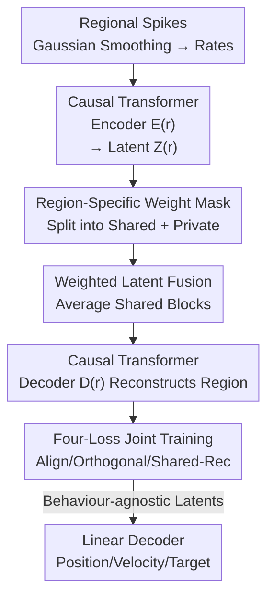

# Coupled Transformer Autoencoder for Disentangling Multi-Region Neural Latent Dynamics

**Conference**: ICLR 2026  
**OpenReview**: [https://openreview.net/forum?id=oeoCgcYIyf](https://openreview.net/forum?id=oeoCgcYIyf)  
**Code**: https://github.com/Mishne-Lab/ctae-multiregion (Available)  
**Area**: Computational Neuroscience / Neural Latent Dynamics / Representation Disentanglement  
**Keywords**: Multi-region neural recordings, Shared-private disentanglement, Transformer Autoencoder, Communication subspace, Latent dynamics

## TL;DR
CTAE employs a pair of (or multiple) coupled causal Transformer autoencoders to simultaneously model neural population activity across multiple brain regions. It explicitly partitions the latent space of each region into orthogonal "cross-region shared" and "region-private" subspaces. By utilizing four loss functions to force inter-regional signals into the shared block and retain region-specific signals in the private block, it cleanly separates shared and private components while preserving non-stationary, non-linear temporal dynamics. Downstream linear decoders achieve higher accuracy in decoding behavioral variables compared to linear methods like DLAG/mDLAG.

## Background & Motivation
**Background**: Neuropixels probes and volumetric calcium imaging allow neuroscientists to simultaneously record the activity of thousands of neurons across multiple brain regions. The dominant analytical framework is the "neural latent dynamics" hypothesis—that high-dimensional population responses are the result of a low-dimensional trajectory evolving over time. Mature tools exist for single-region analysis: linear PCA/FA, GPFA with temporal smoothing priors, and deep models like LFADS (RNN) or NDT (Self-Attention) for capturing non-linear, non-stationary dynamics.

**Limitations of Prior Work**: Directly applying single-region tools to multi-region data (e.g., concatenating recordings into a single matrix) often fails: conduction delays between regions distort the latent space, differences in correlation structures cause shared factors to absorb private variance, and regions with stronger activity or more channels dominate the mixing weights. Another line of work involves joint latent variable models inspired by CCA (GP-based methods like DLAG/mDLAG, or multi-view autoencoders like SPLICE and DMVAE). However, GP-based methods inherit smoothing and linear readout assumptions, struggling with non-stationary and long-range dependencies. Multi-view autoencoders often treat time points as i.i.d. samples, discarding temporal structure.

**Key Challenge**: A competent multi-region latent model must simultaneously satisfy three conflicting requirements: (i) latent trajectories should evolve smoothly over time to respect neural autocorrelation; (ii) it must accommodate the non-stationary, non-linear dynamics of real circuits; (iii) it must separate shared and region-specific structures without parameter explosion as the number of regions increases. No existing method adequately addresses all three.

**Key Insight**: The authors leverage the "communication subspace" hypothesis from neuroscience—that communication between brain regions is mediated via a persistent low-dimensional subspace that is orthogonal to each region's private, region-specific dynamics (the output-null/potent concept). If shared and private dimensions are naturally orthogonal, it should be possible to cleanly recover shared dynamics from region-specific processes.

**Core Idea**: Use Transformer encoders/decoders as flexible non-linear temporal priors to capture long-range dynamics, while partitioning each region's latent space into "shared + private" segments using fixed binary masks. A set of losses is then used to align shared signals across regions, ensure subspace orthogonality, and facilitate alignment—addressing non-linear dynamics and shared/private separation within a single end-to-end framework.

## Method

### Overall Architecture
Problem Setup: Given synchronized population activity $X^{(1)}\in\mathbb{R}^{N_1\times T}$ and $X^{(2)}\in\mathbb{R}^{N_2\times T}$ from two brain regions ($N_r$ channels, $T$ time steps), assume observations at each moment are non-linear transformations of latent variables. These include cross-regionally correlated shared dynamics $S$ (in the communication subspace) and region-private dynamics $P^{(1)}, P^{(2)}$ (in subspaces orthogonal to shared). The goal is to recover $S, P^{(1)}, P^{(2)}$ from $X^{(1)}, X^{(2)}$.

CTAE assigns each region an independent pair of "Causal Transformer Encoder + Decoder." The input is not raw spikes but continuous firing rate estimates obtained via Gaussian smoothing of spike trains. The encoder $E^{(r)}_\theta$ maps the multi-channel time series to a latent representation $Z^{(r)}\in\mathbb{R}^{D\times T}$ ($D$ is the total latent dimension). Key design: A fixed binary mask $w_r$ partitions these $D$ dimensions into a shared block (first $d_s$ dimensions) and a region-private block. Weighted fusion creates a unified latent $Z$; the decoder $D^{(r)}_\phi$ receives only the latent dimensions relevant to its region (masking out irrelevant dimensions) to reconstruct regional firing rates via cross-attention. The architecture is trained end-to-end with four losses to align the shared blocks and orthogonalize subspaces. For $R > 2$, the orthogonality loss is generalized to pair-wise regions, preventing exponential parameter growth.

### Key Designs

**1. Region-Specific Weight Mask: Partitioning Shared/Private Structure without Hard-coding Interactions**

The issue with concatenation or single autoencoders is the mutual contamination of shared and private signals. CTAE divides the total latent dimension $D=d_s+d_1+d_2$ into three continuous index sets $I_s, I_1, I_2$. It constructs two binary vectors $w_1=[\mathbf{1}_{d_s}, \mathbf{1}_{d_1}, \mathbf{0}_{d_2}]^\top$ and $w_2=[\mathbf{1}_{d_s}, \mathbf{0}_{d_1}, \mathbf{1}_{d_2}]^\top$: $w_1$ activates "shared + region 1 private," and $w_2$ activates "shared + region 2 private." These masks are fixed, with $(d_s,d_1,d_2)$ treated as hyperparameters. Crucially, the masks only define the *maximum* possible shared/private dimensions (upper bound) rather than forcing a specific interaction structure; unsupported dimensions naturally collapse to negligible variance during training.

**2. Weighted Latent Fusion: Aligning Shared Blocks via Masked Averaging**

After encoding, regional latents must be synthesized into a unified $Z$. CTAE performs masked weighted averaging for each latent dimension $d$:

$$Z_t[d] = \frac{w_1[d]\,Z^{(1)}_t[d] + w_2[d]\,Z^{(2)}_t[d]}{w_1[d] + w_2[d]}.$$

Private blocks are activated only by their respective masks (weight 1), so $\hat P^{(1)}=Z_{I_1}=Z^{(1)}_{I_1}$ and $\hat P^{(2)}=Z_{I_2}=Z^{(2)}_{I_2}$ are preserved. Shared blocks are activated by both, resulting in the average $\hat S=Z_{I_s}=\tfrac12(Z^{(1)}_{I_s}+Z^{(2)}_{I_s})$. This average implicitly forces the alignment of shared latents—since the fused $Z$ is used for reconstruction, discrepancy in shared representations would degrade performance, pushing gradients toward consistency. During decoding, $\hat X^{(r)}=D^{(r)}_\phi((w_r\mathbf{1}_T^\top)\odot Z)$ ensures each decoder relies only on dynamics meaningful to its region.

**3. Four-Loss Synergy: Consolidating Shared Signals and Promoting Orthogonality**

The total objective is $L = L_\text{rec} + \lambda_\text{align}L_\text{align} + \lambda_\text{shared}L_\text{shared} + \lambda_\text{orth}L_\text{orth}$:

- **Reconstruction Loss** $L_\text{rec}$: Ensures faithful reconstruction of regional activity.
- **Shared-Only Reconstruction** $L_\text{shared}=\sum_r \lVert D^{(r)}_\phi((w^{(s)}\mathbf{1}_T^\top)\odot Z)-X^{(r)}\rVert_F^2$ where $w^{(s)}=w_1\odot w_2=[\mathbf{1}_{d_s},\mathbf{0},\mathbf{0}]^\top$: Requires that the shared block alone can reconstruct regional activity, forcing cross-regional patterns into the shared subspace.
- **Alignment Loss** $L_\text{align}$: Aligns each encoder's shared output to the cross-region average, preventing region-specific variance from leaking into the shared space.
- **Orthogonality Loss** $L_\text{orth}$: Penalizes off-diagonal terms of the Gram matrix $G=\tfrac1T ZZ^\top$, encouraging all latent dimensions (shared or private) to be approximately orthogonal.

### Loss & Training
The weights $\lambda_\text{shared}, \lambda_\text{align}, \lambda_\text{orth}$ and dimensions $(d_s, d_1, d_2)$ are selected via a validation set. Downstream decoding uses behavior-agnostic latent representations, allowing the same embeddings to be reused for different tasks (position, velocity, etc.) with simple linear readouts.

## Key Experimental Results

### Main Results
Testing was performed on two real multi-region datasets and one synthetic dataset against GP-based DLAG/mDLAG.

**Motor Cortex M1–PMd (Macaque Center-Out Reaching)**: 208 trials, 8 reach directions, PMd/M1 neurons (66/52). Tasks: Continuous hand position decoding and 8-way discrete target classification.

| Dataset / Task | Evaluation | CTAE Shared Latent | DLAG / Baseline |
|--------------|---------|--------------|-------------|
| M1–PMd Continuous Position | Linear Regression | Behavior-related variance concentrated in shared subspace; highest accuracy | DLAG fragments behavior variance across private latents |
| M1–PMd Target Classification | Logistic Regression | High consistency across directions | DLAG shows direction-specific fragmentation |

Key Finding: CTAE's shared latents capture the majority of behavior-related variance, consistent with the neuroscience finding that PMd and M1 co-encode reaching kinematics via a shared low-dimensional manifold. DLAG tends to leak behavioral variance into private subspaces in a direction-specific manner.

**Multisensory Circuit SC–ALM (Mouse Multisensory Discrimination)**: Recording upper SC, deep SC, and ALM. Animals integrate visual/tactile stimuli. Multi-region CTAE ($R>2$) inferred various global and pair-wise shared interactions. Deep SC shared subspaces with other regions decoded stimulus and choice more accurately than private latents, suggesting its central role in the circuit. mDLAG showed no significant improvement over raw activity, highlighting limitations of its linear assumptions.

### Ablation Study

| Configuration | Shared Decoding Acc. | Private M1 | Private PMd |
|------|---------------|-----------|-------------|
| CTAE (Full) | 0.69 (0.03) | 0.22 (0.02) | 0.21 (0.03) |
| w/o Alignment | 0.61 (0.02) | 0.16 (0.02) | 0.20 (0.02) |
| w/o Orthogonality | 0.31 (0.02) | 0.28 (0.02) | 0.29 (0.02) |
| w/o Shared-Only Rec | 0.34 (0.01) | 0.36 (0.01) | 0.37 (0.01) |

(Accuracy for predicting reach direction; 5-fold SD in parentheses.)

### Key Findings
- Orthogonality and Shared-Only reconstruction losses are critical for disentanglement. Removing either causes shared decoding accuracy to drop from 0.69 to ~0.33, indicating shared information "leaking" into private subspaces.
- Alignment loss prevents region-specific variance from contaminating the shared space.
- CTAE correctly localizes behaviorally relevant information into the shared block, aligning with neuroscience priors, whereas DLAG fragments this information.

## Highlights & Insights
- **Binary Masking**: Partitioning subspaces with fixed masks provides a controllable upper bound without extra parameters. Dimensions not supported by data naturally collapse.
- **Weighted Fusion**: Implicitly achieves alignment without explicit pairwise matching losses by forcing the average of shared blocks to be reconstructable.
- **Scalability**: Generalizing orthogonality loss to pairwise regions avoids exponential parameter growth, making it suitable for multi-region ($R>2$) analysis.

## Limitations & Future Work
- **Fixed Masks**: Dimensions are currently manual hyperparameters; learnable masks or anatomical priors are left for future work.
- **Input Representation**: Current use of Gaussian-smoothed firing rates loses fine-grained temporal information. Future iterations could use raw spikes with Poisson/Negative Binomial observation models.
- **Evaluation Scope**: While successful on two datasets, verification on larger scales and more complex behaviors is needed.

## Related Work & Insights
- **vs DLAG/mDLAG**: These rely on smoothing GP priors and linear readouts, failing on non-stationary dynamics and showing higher shared-private leakage.
- **vs DeepCCA/DCCAE**: CCA-based methods maximize correlation but don't guarantee capturing all shared variance. CTAE's combination of shared-only reconstruction and orthogonality explicitly routes shared variance.
- **vs Multi-view AEs (SPLICE/DMVAE)**: CTAE preserves temporal structure via causal Transformers and scales better to multiple regions without exponential growth in auxiliary networks.

## Rating
- Novelty: ⭐⭐⭐⭐ First model to satisfy non-stationary non-linear dynamics, temporal continuity, and multi-region scalability.
- Experimental Thoroughness: ⭐⭐⭐⭐ Includes synthetic and real datasets with detailed ablation.
- Writing Quality: ⭐⭐⭐⭐ Clear motivation and methodology.
- Value: ⭐⭐⭐⭐ Provides a practical, scalable tool for multi-region neuroscience data analysis.

<!-- RELATED:START -->

## Related Papers

- [\[ICLR 2026\] Animal behavioral analysis and neural encoding with transformer-based self-supervised pretraining](animal_behavioral_analysis_and_neural_encoding_with_transformer-based_self-super.md)
- [\[ICML 2026\] Disentangling Latent Risk Pathways via Bayesian Hypergraph Inference](../../ICML2026/computational_biology/disentangling_latent_risk_pathways_via_bayesian_hypergraph_inference.md)
- [\[ICLR 2026\] Beyond Ensembles: Simulating All-Atom Protein Dynamics in a Learned Latent Space](beyond_ensembles_simulating_all-atom_protein_dynamics_in_a_learned_latent_space.md)
- [\[ICLR 2026\] OmniMouse: Scaling properties of multi-modal, multi-task Brain Models on 150B Neural Tokens](omnimouse_scaling_properties_of_multi-modal_multi-task_brain_models_on_150b_neur.md)
- [\[ICLR 2026\] FACET: A Fragment-Aware Conformer Ensemble Transformer](facet_a_fragment-aware_conformer_ensemble_transformer.md)

<!-- RELATED:END -->
