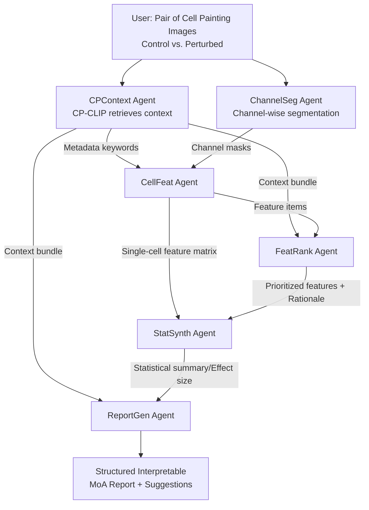

# CP-Agent: Context-Aware Multimodal Reasoning for Cellular Morphological Profiling under Chemical Perturbations

**Conference**: ICLR 2026  
**OpenReview**: [https://openreview.net/forum?id=7BLnSeWuei](https://openreview.net/forum?id=7BLnSeWuei)  
**Code**: [https://github.com/letitia-zhang/CP-Agent](https://github.com/letitia-zhang/CP-Agent)  
**Area**: Computational Biology / Phenotypic Drug Screening / Multimodal Agents  
**Keywords**: Cell Painting, High-Content Imaging, MoA Inference, CLIP Alignment, Experimental Context, Agentic MLLM, Drug Discovery  

## TL;DR
CP-Agent integrates an experimental context-aware image-text alignment module (CP-CLIP) with a multi-agent MLLM reasoning pipeline. Starting from a pair of Cell Painting microscopy images, it automatically retrieves experimental background, segments and extracts single-cell morphological features, statistically compares perturbed vs. control groups, and generates traceable, interpretable Mechanism of Action (MoA) reports.

## Background & Motivation
**Background**: Cell Painting is a cornerstone technology in phenotypic drug screening. It utilizes multiplexed fluorescent staining and high-content imaging to capture multi-scale cellular responses to compound perturbations as high-dimensional morphological profiles, supporting downstream tasks like MoA inference, toxicity prediction, and drug repurposing. Recently, AI methods like CLOOME introduced the CLIP paradigm to align Cell Painting images with molecular structures, while MolPhenix and CellCLIP further leveraged strong unimodal foundation models for alignment.

**Limitations of Prior Work**: (i) **Complex Intermediate Dependencies**: Morphological responses are highly context-dependent; concentration-related profiles show extremely low correlation across dosages (Pearson $r=0.21–0.26$). MoA prediction is sensitive to cell line backgrounds, and ignoring these structures conflates biological signals with imaging artifacts, wasting valuable metadata. (ii) **Morphological Convergence**: Compounds with entirely different mechanisms may induce similar morphological readouts, reducing MoA resolution. (iii) **Lack of Semantic Grounding**: Treating image embeddings as unstructured feature vectors limits semantic reasoning and downstream biological inference capabilities.

**Key Challenge**: Existing drug screening models **over-focus on molecular representation learning while neglecting real-world experimental context** (cell lines, dosing regimens, imaging parameters). Metadata is often appended via late fusion or treated as unstructured text, leading to insufficient information representation. Furthermore, while general MLLMs possess reasoning capabilities, they are unproven in drug screening; this study shows that models like GPT-5 and Gemini-2.5-Pro **all fall below the random baseline** in compound classification.

**Goal**: Construct a context-aware agentic MLLM framework that robustly aligns images with structured experimental context at the perception layer and generates **mechanistically relevant, human-interpretable** reports at the reasoning layer.

**Core Idea**: **[Perception-Reasoning Decoupling]** A lightweight contrastive alignment module, CP-CLIP, jointly embeds images and structured experimental context (including continuous numerical metadata) as a perceptual foundation. Multiple specialized MLLM agents then perform tool-augmented reasoning to compress high-dimensional features into calibrated statistical summaries, synthesized by the MLLM into traceable narratives. **[Numerical Token Injection]** Continuous metadata such as molecular descriptors, concentration, and time are injected into text sequences via placeholder tokens, allowing the language model to process both discrete language and continuous values simultaneously.

## Method

### Overall Architecture
CP-Agent is a "Perception → Retrieval → Analysis → Report" single-pass memory-augmented pipeline. The base layer is **CP-CLIP**, which aligns pairs of (perturbed vs. control) Cell Painting images with structured experimental context, serving as both a perceptual encoder and a memory retriever. The upper layer consists of **six specialized agents**: given a pair of images, CPContext uses CP-CLIP to retrieve the best-matching context; ChannelSeg performs channel-wise instance segmentation; CellFeat uses CellProfiler to extract single-cell features (morphology, texture, granularity); FeatRank ranks features by perturbation impact; StatSynth performs statistical comparison between groups; and ReportGen synthesizes all evidence into an MoA report. The MLLM acts as a "cognitive controller" for dynamic tool routing and evidence synthesis.

### Key Designs

**1. CP-CLIP Context-Aware Token Projection**: Injecting continuous metadata into language sequences. This is the core innovation. Instead of treating metadata as unstructured text, CP-CLIP describes each experiment as a prompt-like sentence (cell culture + imaging + perturbation) using standard GPT-2 tokenization. Crucially, it introduces **field-specific placeholder tokens** (`<CMPD>`, `<CONC>`, `<TIME>`) for molecular descriptors, normalized concentration, and time. Their embeddings are dynamically computed via lightweight MLP trunks: $e_{\text{cmpd}}=f_{\text{cmpd}}(z_{\text{cmpd}})$, $e_{\text{conc}}=f_{\text{conc}}(z_{\text{conc}})$, and $e_{\text{time}}=f_{\text{time}}(z_{\text{time}})$, all projected to $\mathbb{R}^D$. The final sequence $X=[\text{CLS}, t_1, \dots, e_{\text{cmpd}}, \dots, e_{\text{conc}}, \dots, e_{\text{time}}, \dots]$ allows discrete tokens and continuous embeddings to coexist in the same space.

**2. Paired Image Branch**: Amplifying treatment effects via "Perturbed-Control" contrast. Images undergo channel-level preprocessing $P:\mathbb{R}^{H_0\times W_0}\to\mathbb{R}^{H\times W}$ and are tiled into $512\times512$ patches. For each perturbed tile $x_p$, a control tile $x_c$ is sampled from a set $\Omega(x_p)$ where all context (plate, cell line, channel) matches except for the perturbation. These are concatenated along the channel dimension as $\hat{x}=\text{concat}(x_p, x_c)\in\mathbb{R}^{512\times512\times2}$ for the ViT. This forces the model to learn the difference between treated and untreated states, cancelling out batch effects.

**3. Numerical Normalization for Compounds, Concentration, and Time**: Ensuring consistent input spaces. Molecules are encoded using either continuous physicochemical/topological descriptors $\phi_{\text{desc}}$ (z-score normalized) or binary fingerprints. Concentration is represented as a normalized pair $[\rho_{\max}, s(C)]$, where $\rho_{\max}[\text{mg/mL}]=\frac{M[\text{Da}]\cdot C_{\max}[\mu M]}{10^6}$ and the log-dose step index is $s(C)=\frac{\log_{10}(C_{\max})-\log_{10}(C)}{\Delta\log}$. Time is normalized as $\tilde{t}=t/T_{\max}$.

**4. Evidence-First Agent Pipeline**: Compressing high-dimensional features into MLLM-digestible summaries. To handle high-dimensional morphological data (30–300 cells per image), FeatRank first provides confidence-weighted rankings and rationales based on mechanism context. StatSynth then calculates statistical evidence (median difference, bootstrap CI, effect size via Cliff's delta, and p/q values) only for prioritized features. These compact, interpretable summaries circumvent the noise and context-length bottlenecks of LLMs.

## Key Experimental Results

### Main Results: Classification Task F1 (Cell Line/Channel/Compound, Macro-avg)
Comparison between general MLLMs and CLIP variants (Compound: 10-class balanced setting, retrieval-based inference):

| Model | Cell Line | Channel | Compound Macro-avg |
|---|---|---|---|
| Random Guessing | 0.25 | 0.143 | 0.10 |
| Grok-4 | 0.448 | 0.228 | 0.102 |
| GPT-5 | 0.377 | 0.439 | 0.074 |
| Claude-4-Sonnet | 0.450 | 0.198 | 0.027 |
| Gemini-2.5-Pro | 0.526 | 0.628 | 0.007 |
| CLIP ViT-B/16 | 1.000 | 0.955 | 0.657 |
| SigLIP ViT-B/16 | 1.000 | 0.925 | 0.514 |
| **CP-CLIP ViT-B/16 (fingerprint)** | 1.000 | 0.991 | 0.887 |
| **CP-CLIP ViT-B/16 (descriptor)** | 1.000 | 0.882 | **0.896** |

**Key Finding**: All general MLLMs perform **near or below the random baseline** for compound classification (Gemini at 0.007, GPT-5 at 0.074). In contrast, CP-CLIP achieves 0.896, demonstrating that without perturbation-aware grounding, current MLLMs cannot extract meaningful biological signals from Cell Painting images.

### Zero-shot Matching of Unseen Drugs (Image-Text Cosine Similarity)

| Model | Avg Similarity |
|---|---|
| CLIP ViT-B/16 | 0.286 |
| CP-CLIP ViT-B/16 (descriptor) | 0.432 |
| **CP-CLIP ViT-L/16 (descriptor)** | **0.444** |

The descriptor version shows a 14.6% absolute gain over the CLIP baseline. Performance on unseen drugs (0.432) is close to seen drugs (0.549), suggesting CP-CLIP learns mechanism-related biology rather than simple label memorization.

### Key Findings
- **Continuous Descriptors > Binary Fingerprints**: The descriptor-based model captures richer chemical context, leading to higher classification and zero-shot performance.
- **Diminishing Returns from Visual Backbone**: Upgrading from ViT-B/16 to ViT-L/16 yielded no significant gain in classification (0.896 to 0.891), suggesting that with strong chemical priors, lightweight backbones are sufficient.
- **Expert Review (N=11, 40 reports)**: GPT-5 powered CP-Agent provided the strongest reasoning. Consensus on feature selection and report consistency remained stable across multiple runs.

## Highlights & Insights
- **Paradigm Shift: "Context is Signal, Not Noise"**: Instead of treating experimental metadata as a nuisance to be controlled, this work redefines it as a signal to be modeled, providing an engineering solution to inject continuous variables directly into LLM sequences.
- **Decoupling Perception and Reasoning**: CP-CLIP grounds images in chemical/experimental semantics, while the MLLM reasons over calibrated statistical summaries, enabling end-to-end interpretability and traceability.
- **Compelling Negative Evidence**: Unlike histopathology tasks where zero-shot MLLMs often succeed, the failure of general MLLMs here proves that **biological grounding supervision is mandatory** for Cell Painting.
- **Paired Design**: Concatenating control and perturbed tiles is a simple yet effective technique to cancel batch effects and focus on treatment-induced changes.

## Limitations & Future Work
- **Bottlenecked by Statistical Summaries**: If StatSynth misses a key signal, the MLLM cannot recover it. Reports also contain honest annotations regarding small sample sizes (e.g., n=16) or insignificant features.
- **Dependency on Hand-crafted Toolchains**: The system relies on fixed configurations for CellProfiler and VISTA-2D; the "agentic" aspect currently focuses on process autonomy rather than strategic policy learning.
- **Future Work**: Plans to extend to experimental planning (dose optimization), multi-omics fusion, and incorporating causal priors for counterfactual reasoning.

## Related Work & Insights
- **Molecular-Image Alignment**: Builds on CLOOME (image-molecule alignment) and MolPhenix/CellCLIP (foundation model integration). CP-CLIP differentiates itself by jointly embedding the **entire structured experimental context**.
- **Biomedical MLLMs**: While MLLMs have been applied to genomics and clinical imaging, the drug screening domain remained largely unexplored. This work fills the gap and provides empirical evidence of the limitations of general-purpose MLLMs in this field.

## Rating
- **Novelty**: ⭐⭐⭐⭐ — The combination of numerical token injection, experimental context embedding, and a decoupled multi-agent pipeline is a solid and rare innovation in phenotypic screening.
- **Experimental Thoroughness**: ⭐⭐⭐⭐ — Evaluated on 1.9M image-text pairs across three public datasets with comparisons against four state-of-the-art MLLMs and multiple CLIP variants.
- **Writing Quality**: ⭐⭐⭐⭐ — Clear motivation and tight correspondence between pain points and methods. Reasoning cases are persuasive.
- **Value**: ⭐⭐⭐⭐ — Successfully bridges interpretability and experimental context in drug screening, showing clear potential for accelerating lead discovery and MoA identification.

<!-- RELATED:START -->

## Related Papers

- [\[NeurIPS 2025\] Beyond Chemical QA: Evaluating LLM's Chemical Reasoning with Modular Chemical Operations](../../NeurIPS2025/computational_biology/beyond_chemical_qa_evaluating_llms_chemical_reasoning_with_modular_chemical_oper.md)
- [\[ICLR 2026\] CDBridge: A Cross-omics Post-training Bridge Strategy for Context-aware Biological Modeling](cdbridge_a_cross-omics_post-training_bridge_strategy_for_context-aware_biologica.md)
- [\[ICLR 2026\] Automatic Image-Level Morphological Trait Annotation for Organismal Images](automatic_image-level_morphological_trait_annotation_for_organismal_images.md)
- [\[ACL 2026\] ToxReason: A Benchmark for Mechanistic Chemical Toxicity Reasoning via Adverse Outcome Pathway](../../ACL2026/computational_biology/toxreason_a_benchmark_for_mechanistic_chemical_toxicity_reasoning_via_adverse_ou.md)
- [\[ICLR 2026\] Exploring Synthesizable Chemical Space with Iterative Pathway Refinements](exploring_synthesizable_chemical_space_with_iterative_pathway_refinements.md)

<!-- RELATED:END -->
