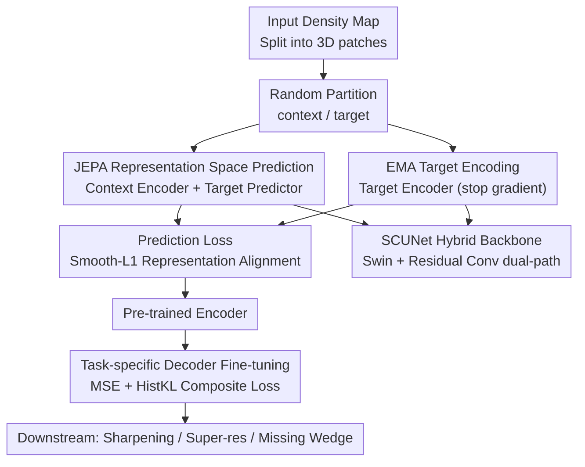

# CryoLVM: Self-supervised Learning from Cryo-EM Density Maps with Large Vision Models

**Conference**: ICLR2026  
**OpenReview**: [https://openreview.net/forum?id=9xcvEF2BRi](https://openreview.net/forum?id=9xcvEF2BRi)  
**Code**: To be confirmed  
**Area**: Computational Biology / Self-supervised Learning / Foundation Models / cryo-EM  
**Keywords**: cryo-EM density maps, JEPA, SCUNet, self-supervised pre-training, histogram distribution alignment loss

## TL;DR
CryoLVM introduces the Joint-Embedding Predictive Architecture (JEPA) and a SCUNet backbone to the domain of 3D cryo-EM density maps. It performs self-supervised pre-training in representation space using 7,302 real experimental maps from EMDB, combined with a novel histogram distribution alignment loss for fine-tuning. It consistently outperforms specialized methods like DeepEMhancer, EMReady, EM-GAN, and IsoNet across three downstream tasks: sharpening, super-resolution, and missing wedge completion.

## Background & Motivation
**Background**: Cryo-electron microscopy (cryo-EM) allows researchers to observe biological macromolecular complexes at near-atomic resolution. The number of density maps deposited in EMDB is growing exponentially. Machine learning methods have permeated the pipeline from reconstruction (cryoDRGN, 3DFlex) and post-processing sharpening (DeepEMhancer, EMReady) to atomic model building (DeepTracer, ModelAngelo).

**Limitations of Prior Work**: These deep learning methods are almost entirely **task-specific + fully supervised**. Each task requires training a dedicated model from scratch using pairs of "degraded input / clean target" labeled data, which suffers from limited data scale and poor generalization. Switching to a new task or imaging condition requires starting over.

**Key Challenge**: Cryo-EM density maps have extremely low signal-to-noise ratios (SNR), high-frequency decay, and resolution anisotropy (particularly the missing wedge artifacts in cryo-ET). This creates a conflict: there is a need to **learn universal structural representations from large-scale unlabeled data**, but the model must **avoid fitting the pervasive noise** in density maps. Pre-training based on voxel reconstruction (e.g., Masked Autoencoders (MAE) predicting raw voxel values) tends to amplify this noise.

**Goal**: To build a **foundation model** for cryo-EM density maps, pre-trained via self-supervision on large-scale real experimental maps to learn transferable structural semantic representations, which can then be adapted to multiple downstream tasks with lightweight fine-tuning.

**Key Insight**: The authors noted that JEPA performs predictions in an **abstract representation space** rather than reconstructing in pixel/voxel space, which naturally filters out density noise while retaining high-level structural semantics. Considering that density maps require both atomic-level local features and cross-regional global spatial relationships, the authors selected SCUNet—a hybrid of Swin Transformer and residual convolution—as the backbone.

**Core Idea**: Replace "voxel reconstruction + task-specific networks" with "representation-space prediction (JEPA) + SCUNet backbone," unifying cryo-EM density map processing into a "pre-train once, fine-tune for many" paradigm.

## Method

### Overall Architecture
CryoLVM consists of two stages. **Pre-training stage**: The input density map is divided into non-overlapping 3D patches and randomly partitioned into visible "context" subsets and masked "target" subsets. The Context Encoder encodes the visible patches. The Target Predictor takes the context embeddings along with the positional information of the masked patches to predict the embeddings output by the Target Encoder for those target patches. A regression loss is applied between them. The weights of the Target Encoder are updated via Exponential Moving Average (EMA) of the Context Encoder weights, with gradients stopped. **Fine-tuning stage**: The pre-trained encoder is connected to a task-specific decoder (upsampling SC blocks + 3D transposed convolution). It is jointly fine-tuned on labeled data for each downstream task using a composite loss of MSE + Histogram Alignment, resulting in three specialized models for sharpening, super-resolution, and missing wedge completion.

### Key Designs

**1. JEPA Representation Space Prediction: Filtering noise at the source via abstract space prediction**

Cryo-EM density has a low SNR. If raw **voxel values** of masked regions are predicted directly as in MAE, the model is forced to fit pervasive noise, learning "how to reproduce noise" rather than structural semantics. CryoLVM uses JEPA instead: it only predicts the **embedding representations** of masked patches under the Target Encoder, not the voxels themselves. The pre-training objective is:
$$L_p = \mathbb{E}_{x,M}\Big[\sum_{i\in M}\mathrm{SmoothL1}_\beta\big(g_\phi(f_{\theta_c}(x_{\text{context}}), z_i) - f_{\theta_t}(x_i)\big)\Big],$$
where $M$ is the set of masked patches, $z_i$ is the spatial position info of target patches, $f_{\theta_c}$ is the Context Encoder, $f_{\theta_t}$ is the Target Encoder, and $g_\phi$ is the Target Predictor. Smooth-L1 (with parameter $\beta$) is used instead of L2 to be more robust to outliers common in density maps. Because the loss is computed only in the abstract space of "semantic embeddings," noise is naturally filtered during encoding, allowing the model to focus on high-level structural semantics—the source of transferable representations beneficial for multiple downstream tasks. Ablations show JEPA pre-training consistently outperforms MAE.

**2. SCUNet Hybrid Backbone: Capturing atomic-level local details and cross-regional global relationships simultaneously**

Cryo-EM data has contradictory requirements: atomic-level features rely on local receptive fields, while cross-regional spatial relationships require global modeling. Standard 3D ViTs are biased toward global cues, while pure convolutions are biased toward local ones; neither is sufficient. The authors chose SCUNet, which centers on the **dual-path structure** of Swin-Conv (SC) blocks: the convolutional branch uses residual $3\times3\times3$ convolutions with Filter Response Normalization to preserve local details, while the Transformer branch captures long-range dependencies using 3D window multi-head self-attention with a $4\times4\times4$ window. The branches are fused via $1\times1\times1$ convolutions. The Context/Target Encoders consist of three downsampling SC blocks, three 3D conv blocks, and one bottleneck SC block. Encoder outputs are transformed into patch embeddings via linear transformation with 3D sinusoidal positional encoding, followed by masking to generate context and target embeddings. The downstream decoder mirrors this with upsampling SC blocks and 3D transposed convolution blocks. In ablations, the SCUNet backbone outperformed ViT versions across all downstream tasks.

**3. EMA Target Encoder: Providing a stable, collapse-free target for self-supervised prediction**

JEPA requires a "target" for alignment. If the target and context encoders share the same set of real-time updated weights, self-prediction easily collapses into trivial solutions. CryoLVM updates the Target Encoder weights as an **Exponential Moving Average (EMA)** of the Context Encoder weights and **stops gradients** on this path. The target side acts as a slowly evolving "teacher," providing stable and consistent prediction targets to avoid representation collapse, while the online Context Encoder converges toward a better semantic space. The Target Predictor is a standard Transformer block, ending with a linear projection to map predictions back to the encoder's embedding dimension.

**4. Histogram Distribution Alignment Loss $L_{\text{HistKL}}$: Aligning global predicted density distribution with ground truth**

Voxel-wise MSE only penalizes point-to-point errors, making it easy for the overall grayscale/amplitude distribution of predicted density to deviate from the ground truth, affecting interpretability and convergence. The authors designed a differentiable histogram distribution alignment loss: first, the predicted density $X$ and target density $X^\star$ are constructed into **soft histograms** using Gaussian kernel weighting:
$$h(x)_j = \frac{1}{N}\sum_{i}^{N}\exp\!\Big(-\tfrac{1}{2}\big(\tfrac{x_i - c_j}{\sigma}\big)^2\Big),$$
where $c_j$ is the center of the $j$-th bin, $\sigma$ controls smoothness, and $N$ is the total number of voxels. Then, Jensen–Shannon (JS) divergence based on KL divergence is used to measure the distribution difference between two histograms $p=h(X)$ and $q=h(X^\star)$:
$$D_{JS}(p\|q)=\tfrac{1}{2}\sum_k p_k\log\tfrac{p_k}{m_k}+\tfrac{1}{2}\sum_k q_k\log\tfrac{q_k}{m_k},\quad m=\tfrac{1}{2}(p+q),$$
thus $L_{\text{HistKL}}(X,X^\star)=D_{JS}\big(H(X)\,\|\,H(X^\star)\big)$. The Gaussian kernel ensures the process is differentiable. Ablations show that combining this with MSE leads to faster convergence and better downstream performance.

### Loss & Training
The pre-training phase uses the representation prediction loss $L_p$ (Smooth-L1). The three downstream tasks use a unified composite loss:
$$L_{\text{total}} = \alpha\, L_{\text{MSE}} + (1-\alpha)\, L_{\text{HistKL}},$$
where $\alpha\in[0,1]$ balances voxel reconstruction accuracy and distribution alignment. Pre-training data comes from the Cryo2StructData training subset, containing 7,392 experimental density maps (1–4 Å). Pre-processing: voxel sizes are resampled to 1 Å, density values clipped at 0.01–0.99 quantiles and normalized to $[0,1]$. To prevent data leakage, maps appearing in downstream baseline test sets were removed, resulting in a final pre-training corpus of 7,302 maps, with inputs randomly cropped to $48^3$ volumes. Downstream supervised targets are simulated from corresponding PDB structures using Chimera.molmap at matching resolutions.

## Key Experimental Results

### Main Results
CryoLVM leads across all three downstream tasks. Density map sharpening (Cross-correlation with atomic model + Q-score, higher is better):

| Method | CCbox ↑ | CCmask ↑ | CCpeaks ↑ | Q-score ↑ |
|------|---------|----------|-----------|-----------|
| Deposited | 0.744 | 0.788 | 0.659 | 0.338 |
| DeepEMhancer | 0.695 | 0.679 | 0.659 | 0.323 |
| EMReady | 0.878 | 0.802 | 0.791 | 0.424 |
| **Ours** | **0.894** | **0.821** | **0.806** | **0.444** |

Density map super-resolution (FSC / Local resolution, in Å, lower is better):

| Method | $d_{\text{model}}$ ↓ | FSC-0.143 ↓ | FSC-0.5 ↓ | Resolution ↓ |
|------|------|------|------|------|
| Deposited | 3.66 | 3.39 | 4.64 | 3.81 |
| DeepEMhancer | 3.27 | 2.72 | 4.86 | 3.47 |
| EM-GAN | 2.49 | 2.70 | 5.46 | 4.18 |
| **Ours** | **2.33** | **2.58** | **4.58** | **3.39** |

Missing wedge completion (cryo-ET, FSC resolution via phenix.mtriage, lower is better):

| Method | FSC-0.143 ↓ | FSC-0.5 ↓ |
|------|------|------|
| IsoNet | 10.448 | 12.361 |
| **Ours** | **10.094** | **11.447** |

In the missing wedge task, CryoLVM reduced FSC-0.143 from 10.448 to 10.094 Å (~3.39%) and FSC-0.5 from 12.361 to 11.447 Å (~7.39%). Visualization shows it reconstructs continuous pore-like channels, whereas IsoNet produced fragmented or topologically incorrect segments.

### Ablation Study

| Configuration | Conclusion |
|------|------|
| SCUNet vs ViT backbone | SCUNet consistently outperforms ViT across all downstream tasks (Appendix G.1) |
| MSE + HistKL vs MSE only | Composite loss accelerates convergence and improves SR performance (Appendix G.2) |
| Pre-training vs From Scratch | Fine-tuning after pre-training improves all metrics consistently (Appendix G.3) |
| JEPA vs MAE Pre-training | JEPA consistently outperforms MAE on the sharpening task (Appendix G.3) |

### Key Findings
- **JEPA > MAE** validates the core hypothesis: On low-SNR density maps, representation space prediction learns more useful semantics without being misled by noise compared to voxel reconstruction.
- **SCUNet Backbone Stability**: Outperforming ViT across three tasks confirms that the "local conv + global attention" approach fits the requirement for both atomic detail and global context in cryo-EM.
- **HistKL Benefits**: It not only improves performance but also accelerates convergence, indicating that constraining the global density distribution provides a valuable orthogonal supervisory signal to voxel-wise MSE.
- Robustness on real experimental maps with noise and low resolution compensates for CryoFM's limitation of only evaluating on curated high-quality maps with synthetic noise.

## Highlights & Insights
- **Adapting JEPA from 2D natural images to 3D scientific data**: Leveraging the noise-resistance of representational prediction specifically addresses cryo-EM's SNR bottleneck, showing a targeted application of foundation model principles.
- **Differentiable soft histograms + JS divergence**: Converting the task of aligning global density distributions into a backpropagatable loss using Gaussian kernels is a versatile trick applicable to other density or image generation tasks.
- **Unified "Pre-train Once, Fine-tune for Many" paradigm**: Consolidates sharpening, super-resolution, and missing wedge completion—previously handled by disparate methods—into a single encoder-decoder framework, reducing the overhead of training per-task.
- The use of PDB-derived ground truth (Chimera.molmap) for all three tasks ensures consistent supervisory signals, offering a standardized data construction approach for cryo-EM supervised learning.

## Limitations & Future Work
- Downstream tasks still rely on **paired simulated target maps** (generated from PDB structures), remaining essentially supervised fine-tuning; handling maps without known structures remains unexplored.
- Evaluations focus on repair-type tasks and density map quality metrics (FSC/CC/Q-score), remaining one step away from the ultimate goal of improving atomic model building accuracy.
- Absolute resolution improvement for missing wedge completion is still around 10 Å, with a limited gain (3–7%); its practical benefit for cryo-ET interpretation needs further validation.
- The pre-training corpus (7,302 maps) is relatively small for a "Large" Vision Model. Scaling behavior and generalization to very low-resolution maps outside the 1–4 Å training distribution are not yet systematically characterized.

## Related Work & Insights
- **vs CryoFM**: While both are foundation models for cryo-EM, CryoFM is a flow-based generative prior trained on high-quality curated maps; CryoLVM uses discriminative JEPA pre-training on real noisy experimental maps, offering better robustness for actual workflows.
- **vs DeepEMhancer / EMReady (Sharpening)**: These are task-specific 3D U-Net / Swin-Conv-UNet models. CryoLVM uses a similar SCUNet backbone but benefits from self-supervised pre-training, yielding better CC and Q-scores.
- **vs EM-GAN (Super-resolution)**: EM-GAN uses 3D GAN for 3–6 Å enhancement; CryoLVM is significantly better and more stable across FSC metrics.
- **vs IsoNet (Missing Wedge)**: IsoNet relies on 3D U-Net trained on rotated subtomograms with artificial wedges; CryoLVM achieves better FSC resolution and preserves topological continuity like pore structures.
- **vs MAE-style Reconstruction**: Both involve masking, but while MAE amplifies noise by predicting raw voxels, JEPA circumvents this by predicting in embedding space—a difference directly validated by the authors' ablation studies.

## Rating
- Novelty: ⭐⭐⭐⭐ First to introduce JEPA + SCUNet to 3D cryo-EM density maps, with a clever HistKL loss design.
- Experimental Thoroughness: ⭐⭐⭐⭐ Comprehensive comparison across three tasks + multiple ablations, though some details are in appendices and missing wedge gains were slight.
- Writing Quality: ⭐⭐⭐⭐ Clear logic from motivation to experiment; complete formulas and diagrams.
- Value: ⭐⭐⭐⭐ Provides a unified foundation model paradigm for the cryo-EM community, offering practical utility for structural biology.

<!-- RELATED:START -->

## Related Papers

- [\[ICLR 2026\] CryoNet.Refine: A One-step Diffusion Model for Rapid Refinement of Structural Models with Cryo-EM Density Map Restraints](cryonetrefine_a_one-step_diffusion_model_for_rapid_refinement_of_structural_mode.md)
- [\[ICLR 2026\] CryoSplat: Gaussian Splatting for Cryo-EM Homogeneous Reconstruction](cryosplat_gaussian_splatting_for_cryo-em_homogeneous_reconstruction.md)
- [\[ICLR 2026\] CellDuality: Unlocking Biological Reasoning in LLMs with Self-Supervised RLVR](cellduality_unlocking_biological_reasoning_in_llms_with_self-supervised_rlvr.md)
- [\[ICML 2026\] Learning the Neighborhood: Contrast-Free Multimodal Self-Supervised Molecular Graph Pretraining](../../ICML2026/computational_biology/learning_the_neighborhood_contrast-free_multimodal_self-supervised_molecular_gra.md)
- [\[ICLR 2026\] Animal behavioral analysis and neural encoding with transformer-based self-supervised pretraining](animal_behavioral_analysis_and_neural_encoding_with_transformer-based_self-super.md)

<!-- RELATED:END -->
