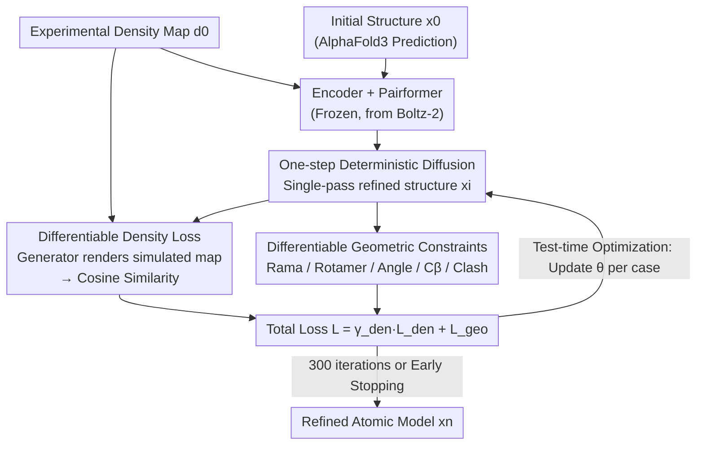

# CryoNet.Refine: A One-step Diffusion Model for Rapid Refinement of Structural Models with Cryo-EM Density Map Restraints

**Conference**: ICLR 2026  
**arXiv**: [2602.22263](https://arxiv.org/abs/2602.22263)  
**Code**: [GitHub](https://github.com/kuixu/cryonet.refine)  
**Area**: Structural Biology/Cryo-EM/Diffusion Models  
**Keywords**: cryo-EM, atomic model refinement, one-step diffusion, density loss, geometric constraints, protein structure

## TL;DR
This work proposes CryoNet.Refine, the first AI-based cryo-EM atomic model refinement framework. It designs a one-step diffusion model (initialized with Boltz-2 weights) incorporated with an innovative differentiable density generator for physical simulation. By introducing density map correlation as a differentiable loss function (cosine similarity) combined with geometric constraints (Ramachandran, Rotamer, bond angles), it employs a test-time optimization strategy for case-specific refinement. It comprehensively outperforms Phenix.real_space_refine across 120 protein and DNA/RNA complexes (CC_mask 0.59 vs 0.54, Ramachandran favored 98.92%).

## Background & Motivation

**Bottlenecks in Cryo-EM Refinement**: While cryo-EM has revolutionized structural biology, refining precise atomic models from density maps remains a core bottleneck. Traditional methods like Phenix.real_space_refine and Rosetta are computationally expensive and require expert manual parameter tuning.

**Inadequate Initial Model Quality**: Even with high-resolution density maps, peripheral and flexible regions often exhibit lower resolution. Modeling tools like ModelAngelo may generate fragmented structures or incorrect residue types, necessitating a refinement step.

**Limitations of Prior Work**:
   - (1) **High Computational Cost**: Simulated annealing and conformational space sampling lead to time-consuming iterative optimization.
   - (2) **Expert Dependency**: Weights and constraint parameters must be adjusted manually case-by-case, resulting in a steep learning curve.
   - (3) **Time-consuming Manual Refinement**: Interactive tools like Coot are flexible but extremely slow, creating a bottleneck for high-throughput determination.

**Gap in Existing AI Methods**: AI methods such as DeepAccNet, GNNRefine, and AtomRefine only learn geometric features from known structures without direct coupling to experimental cryo-EM density maps. Consequently, predicted structures may be geometrically reasonable but fail to match experimental data. **There is a lack of neural network methods in the literature that support differentiable refinement under experimental cryo-EM data constraints.**

**Opportunity for Diffusion Models**: Diffusion models like AlphaFold3 and RFDiffusion have shown excellence in protein generation and geometric feature learning (bond lengths/angles) but do not natively support refinement under experimental density map constraints. Integrating the generative power of diffusion models with cryo-EM density constraints presents a transformative path.

**Key Insight**: Unifying density map fitting and geometric constraints into differentiable loss functions enables end-to-end driven diffusion model refinement, achieving automation, efficiency, and high quality without manual tuning.

## Method

### Overall Architecture

CryoNet.Refine receives an experimental cryo-EM density map $d_0$ and an initial atomic structure $x_0$. The goal is to refine atomic coordinates to fit experimental density while maintaining stereochemical validity. The network consists of five modules: an atom encoder extracts pairwise features $z$, a sequence embedder encodes atom types $s$, and a Pairformer (initialized from Boltz-2) performs cross-attention. A one-step diffusion module predicts the refined structure $x_i$ in a single pass. A differentiable density generator renders $x_i$ into a simulated density map to compute density loss against the experimental map, which is then combined with geometric constraint losses. The total loss $\mathcal{L} = \gamma_{\text{den}}\,\mathcal{L}_{\text{den}} + \mathcal{L}_{\text{geo}}$ is back-propagated. Notably, only the diffusion module remains trainable while encoders are frozen, and test-time optimization is applied to each case separately—iteratively updating diffusion weights for up to 300 cycles per structure.

### Key Designs

**1. One-step Deterministic Diffusion: Starting from Structure instead of Noise**
Unlike AlphaFold3 which denoises from Gaussian noise over hundreds of steps, refinement benefits from an "almost correct" starting point. CryoNet.Refine formulates refinement as a preconditioned deterministic mapping $\hat{\mathbf{x}} = c_{\text{skip}}(\sigma)\,\mathbf{x}_0 + c_{\text{out}}(\sigma)\,\mathcal{F}_\theta\!\left(c_{\text{in}}(\sigma)\mathbf{x}_0,\, c_{\text{noise}}(\sigma),\, \mathcal{C}\right)$. It predicts the refined structure in one step from the initial input, removing MSA processing to rely entirely on physical density constraints. Experiments show that a one-step version achieves a CC_mask of 0.65 compared to 0.30 for standard 200-step diffusion.

**2. Differentiable Density Loss: Enabling Back-propagation for Density Correlation**
The key is treating density matching as an end-to-end differentiable loss. The density generator acts as a physical simulator: it superimposes Gaussian spheres centered at each atom to create a synthetic density $\hat{\boldsymbol{\rho}}(\vec{\boldsymbol{m}}, \vec{\mathbf{x}}) = \sum_{i=1}^{N} w_i e^{-k|\vec{\boldsymbol{m}} - \vec{\mathbf{x}}_i|^2}$, where weight $w_i$ is the atomic number and $k$ is determined by resolution. The loss is defined as $\mathcal{L}_{\text{den}} = 1 - \frac{\hat{\boldsymbol{\rho}} \cdot \boldsymbol{\rho}}{\lVert\hat{\boldsymbol{\rho}}\rVert \cdot \lVert\boldsymbol{\rho}\rVert}$. This allows gradients to back-propagate directly to atomic coordinates, achieving an average correlation of 0.892.

**3. Differentiable Geometric Constraints: Optimizable Stereochemical Rules**
To prevent atoms from fitting into density noise and violating chemical common sense, several geometric losses are used: $\mathcal{L}_{\text{geo}} = \gamma_{\text{rama}} \mathcal{L}_{\text{rama}} + \gamma_{\text{rot}} \mathcal{L}_{\text{rot}} + \gamma_{\text{angle}} \mathcal{L}_{\text{angle}} + \gamma_{C_\beta} \mathcal{L}_{C_\beta} + \gamma_{\text{viol}} \mathcal{L}_{\text{viol}}$. These include Ramachandran penalties for backbone dihedrals, Rotamer constraints for side chains, $C_\beta$ deviation penalties, and bond angle RMSD. Removing the Ramachandran loss drops the favored percentage from 98.80% to 90.75%.

**4. Test-time Optimization: Refining via Case-specific Over-fitting**
As each cryo-EM map is unique, a universal static model is insufficient. CryoNet.Refine treats each case as a mini-training task: it fixes input $x_0$, performs a forward pass, calculates losses on the output, and updates only the diffusion module parameters $\theta$. This process repeats for up to 300 cycles. This approach resembles the scene-specific over-fitting used in NeRF, focusing all optimization capacity on fitting the current density map.

## Key Experimental Results

### Protein Complex Refinement (110 Cases)

| Metric | AlphaFold3 | Phenix.real_space_refine | **CryoNet.Refine** |
|------|-----------|------------------------|-------------------|
| CC_mask ↑ | 0.38 | 0.54 | **0.59** |
| CC_box ↑ | 0.41 | 0.53 | **0.57** |
| CC_mc ↑ | 0.40 | 0.55 | **0.60** |
| CC_sc ↑ | 0.39 | 0.55 | **0.58** |
| CC_peaks ↑ | 0.27 | 0.40 | **0.45** |
| CC_volume ↑ | 0.42 | 0.55 | **0.60** |
| Angle RMSD (°) ↓ | 1.58 | 0.72 | **0.36** |
| Rama favored (%) ↑ | 95.73 | 96.39 | **98.92** |
| Rama outlier (%) ↓ | 0.82 | 0.02 | 0.06 |
| Rotamer favored (%) ↑ | 97.08 | 85.42 | **98.64** |
| Rotamer outlier (%) ↓ | 1.08 | 1.15 | **0.49** |

### DNA/RNA-Protein Complex Refinement (10 Cases)

| Metric | AlphaFold3 | Phenix.real_space_refine | **CryoNet.Refine** |
|------|-----------|------------------------|-------------------|
| CC_mask ↑ | 0.40 | 0.57 | **0.65** |
| CC_box ↑ | 0.49 | 0.61 | **0.67** |
| CC_sc ↑ | 0.42 | 0.58 | **0.67** |
| CC_peaks ↑ | 0.35 | 0.51 | **0.60** |
| CC_volume ↑ | 0.48 | 0.61 | **0.69** |

### Ablation Study (27 Protein Complexes)

| Configuration | CC_mask | Rama favored | Rot favored |
|------|---------|-------------|-------------|
| W/o Density Loss $\gamma_{\mathrm{den}}=0$ | 0.41 (↓35%) | 99.09% | 98.67% |
| W/o Ramachandran $\gamma_{\mathrm{rama}}=0$ | 0.65 | 90.75% (↓) | 98.64% |
| W/o Rotamer $\gamma_{\mathrm{rot}}=0$ | 0.64 | 99.22% | 94.48% (↓) |
| **CryoNet.Refine (Full)** | **0.65** | **98.80%** | **98.58%** |

### vs. Multi-step Diffusion vs. Direct Numerical Optimization

| Method | CC_mask | Angle RMSD |
|------|---------|-----------|
| Standard 200-step Diffusion | 0.30 | 1.66° |
| Direct SGD Coordinate Opt | 0.46 | **0.27°** |
| **CryoNet.Refine (One-step)** | **0.65** | 0.54° |

## Key Findings

1. **Density Loss as the Core Driver**: Removing density loss causes CC_mask to plummet from 0.65 to 0.41 (>35% drop), indicating density constraints are essential for accurate fitting.

2. **One-step Diffusion Outperforms Multi-step**: Standard 200-step diffusion yields a CC_mask of only 0.30. CC values decrease monotonically with more steps because multi-step sampling disrupts the already complete initial structure.

3. **Indispensability of Diffusion Generative Power**: Direct SGD optimization on coordinates achieves superior geometric metrics (Angle RMSD 0.27°) but poor CC_mask (0.46). It gets trapped in local minima where the diffusion model's exploration capabilities help find global optima.

4. **Synergy of Geometric Constraints**: Ramachandran constraints protect backbone conformation while Rotamer constraints preserve side-chain packing.

5. **Two-phase Convergence**: CC values rise sharply during the first 100 cycles (high-sensitivity phase) before plateauing (robust convergence phase). 300 iterations with early stopping provide a safe margin.

6. **Competitive Efficiency**: CryoNet.Refine is faster than Phenix in 54.2% of the cases, especially for large complexes, leveraging GPU acceleration where Phenix is CPU-only.

## Highlights & Insights

- **Triple "Firsts"**: First AI-based cryo-EM refinement method, first differentiable density generator, and first use of density correlation as a loss.
- **Test-time Optimization Paradigm**: Instead of static inference, it treats each case as an iterative optimization, similar to the NeRF approach, suitable for the unique nature of each cryo-EM map.
- **Hybrid Physical Simulation and Neural Network**: The density generator is a physical simulator (Gaussian spheres) implemented in PyTorch to be differentiable, elegantly blending physical priors with learning.
- **Unified Framework**: Handles both protein and DNA/RNA-protein complexes within the same framework, whereas most AI refinement methods are limited to proteins.

## Limitations

1. **Test-time Optimization Cost**: Case-specific optimization implies independent training for every structure. While individual cycles are fast, the total iteration count is high.
2. **Missing Nucleic Acid Geometric Constraints**: DNA/RNA-specific stereochemistry is not yet implemented, leaving nucleic acid refinement reliant solely on density loss.
3. **Simulated Map Limitations**: Gaussian simulation doesn't capture experimental artifacts or secondary structure features; future work could use a learned density generator.
4. **Insufficient Collision Evaluation**: While violation loss exists, its effect on steric clashes was not evaluated in detail.

## Related Work & Insights

| Dimension | Phenix.real_space_refine | DeepAccNet/GNNRefine | CryoNet.Refine |
|------|------------------------|---------------------|----------------|
| Method Type | Traditional (Annealing) | AI Prediction (GNN/CNN) | AI Refinement (One-step + TTO) |
| Density Constraint | ✅ Direct but non-diff. | ❌ Not used | ✅ First differentiable loss |
| Geo. Constraint | ✅ Static libraries | ✅ Learned from data | ✅ Differentiable loss |
| Automation | Medium | High | High (Fully automated) |
| Scope | Protein + Nucleic acid | Protein only | Protein + DNA/RNA |
| Efficiency | Slow (CPU-only) | Fast | Medium (54% faster than Phenix) |

| Dimension | AlphaFold3/RFDiffusion | CryoNet.Refine |
|------|----------------------|----------------|
| Task | Prediction/Design (from noise) | Refinement (from initial model) |
| Diffusion Steps | Multi-step (~200) | One-step deterministic |
| Exp. Data | ❌ Not used | ✅ cryo-EM density constraints |
| Strategy | Static weight inference | TTO (Update weights per case) |

## Rating
- Novelty: ⭐⭐⭐⭐⭐ First AI cryo-EM refinement + Differentiable density loss + One-step diffusion.
- Experimental Thoroughness: ⭐⭐⭐⭐ 120-case benchmark + extensive ablation; lacks comparison with some recent AI methods.
- Writing Quality: ⭐⭐⭐⭐ Clear methodology and motivation.
- Value: ⭐⭐⭐⭐⭐ High impact for the structural biology community.

<!-- RELATED:START -->

## Related Papers

- [\[ICLR 2026\] CryoLVM: Self-supervised Learning from Cryo-EM Density Maps with Large Vision Models](cryolvm_self-supervised_learning_from_cryo-em_density_maps_with_large_vision_mod.md)
- [\[ICLR 2026\] CryoSplat: Gaussian Splatting for Cryo-EM Homogeneous Reconstruction](cryosplat_gaussian_splatting_for_cryo-em_homogeneous_reconstruction.md)
- [\[CVPR 2026\] CryoHype: Reconstructing a Thousand Cryo-EM Structures with Transformer-Based Hypernetworks](../../CVPR2026/computational_biology/cryohype_reconstructing_a_thousand_cryo-em_structures_with_transformer-based_hyp.md)
- [\[ICLR 2026\] One Protein Is All You Need](one_protein_is_all_you_need.md)
- [\[ICLR 2026\] Constrained Diffusion for Protein Design with Hard Structural Constraints](constrained_diffusion_for_protein_design_with_hard_structural_constraints.md)

<!-- RELATED:END -->
