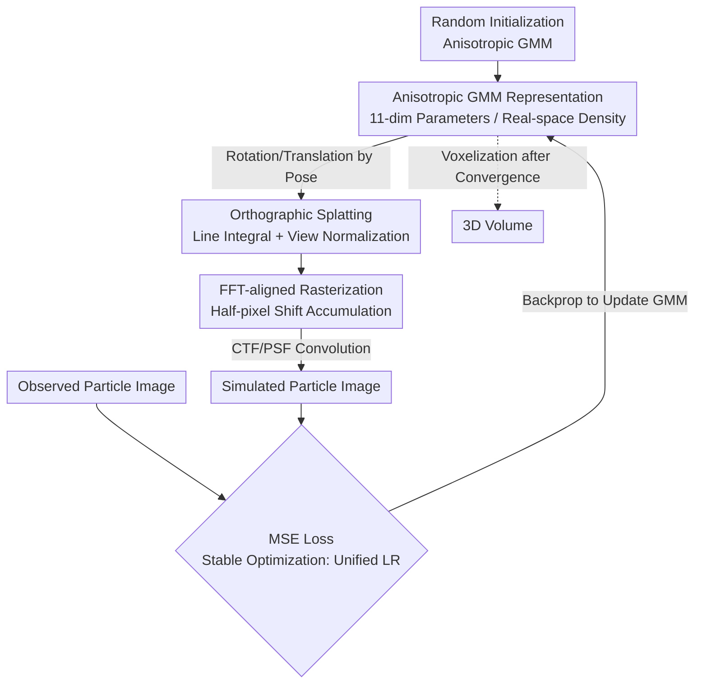

# CryoSplat: Gaussian Splatting for Cryo-EM Homogeneous Reconstruction

**Conference**: ICLR2026  
**OpenReview**: [https://openreview.net/forum?id=dLaUZKBzta](https://openreview.net/forum?id=dLaUZKBzta)  
**Code**: https://github.com/Chen-Suyi/cryosplat (To be released)  
**Area**: Computational Biology / Cryo-EM Reconstruction / Gaussian Splatting  
**Keywords**: cryo-EM, Gaussian Mixture Model, Gaussian Splatting, Homogeneous Reconstruction, Differentiable Rendering

## TL;DR
CryoSplat transforms 3D Gaussian Splatting (3DGS) into a differentiable renderer compliant with cryo-EM imaging physics. Using an anisotropic Gaussian Mixture Model (GMM), it achieves stable cryo-EM homogeneous reconstruction directly from raw noisy particle images starting from random initialization—without requiring any external consensus maps or atomic models. It outperforms cryoSPARC and cryoDRGN in resolution across four real datasets while maintaining superior memory and speed efficiency.

## Background & Motivation
**Background**: The core computational task of single-particle cryo-EM is to reconstruct the 3D electrostatic potential volume of a molecule from a large number of 2D projection images with unknown orientations and extremely low signal-to-noise ratios (SNR can be as low as $\sim -20$ dB). There are three main paradigms for representing this 3D volume: voxel grids (e.g., cryoSPARC / RELION / EMAN2, relying on FFT for fast projection but memory-intensive and incompatible with learning frameworks), neural fields (e.g., cryoDRGN using coordinate networks for implicit representation, which is differentiable but slow, uninterpretable, and hard to incorporate biological priors), and Gaussian Mixture Models (GMM, which are continuous, compact, physically interpretable, and naturally interface with atomic models using fewer parameters for fine structures).

**Limitations of Prior Work**: While GMMs are conceptually elegant, their practical implementation faces a significant hurdle: **all existing GMM methods rely on external initialization**. They either require a consensus map produced by other pipelines for initialization or even necessitate an atomic model as a guide. If initialized randomly, the optimization of mixture parameters diverges under extreme noise, leading to collapsed reconstruction quality. In fact, prior to this work, **no method could stably train a reliable GMM reconstruction from random initialization given only known particle poses**. This prevents GMM from becoming a "self-contained" form capable of serving as a backbone for more complex reconstruction workflows (e.g., ab initio or heterogeneous reconstruction).

**Key Challenge**: Simultaneously, differentiable rendering techniques like 3D Gaussian Splatting (3DGS) have shown impressive scalability and efficiency in volume representation, appearing as a perfect match for GMM-based cryo-EM. However, **standard 3DGS is designed for photorealistic view synthesis and is fundamentally incompatible with cryo-EM on three levels**: (i) imaging physics—3DGS uses perspective projection for pinhole cameras, whereas cryo-EM uses orthogonal line integral projection along the optical axis; (ii) reconstruction goal—3DGS pursues 2D visual realism, while cryo-EM requires physically correct 3D density; (iii) coordinate system—the image-center coordinate system of 3DGS is inconsistent with the FFT-aligned grids assumed in cryo-EM.

**Goal / Core Idea**: The authors propose **cryoSplat**, which re-derives the differentiable framework of Gaussian Splatting according to cryo-EM imaging physics to create "orthographic-aware Gaussian splatting." Given known poses, it can complete homogeneous reconstruction directly, stably, and efficiently from a randomly initialized anisotropic GMM without any external priors, thereby providing the missing foundation for GMM to become an independent reconstruction tool.

## Method

### Overall Architecture
cryoSplat parameterizes the 3D electrostatic potential volume as a set of anisotropic Gaussians (GMM) and **literally simulates the cryo-EM imaging process in real space**: given a known pose for a particle image, all Gaussians are first rotated and translated to align with the projection direction (viewing transformation). They are then orthographically projected along the $z$-axis to "splat" each 3D Gaussian into a 2D Gaussian. These splats are rapidly rasterized and accumulated on an FFT-aligned grid to form a projection image, which is finally convolved with the Contrast Transfer Function (CTF / PSF) to generate a "simulated particle image." The MSE between this and the observed particle image is calculated, and gradients are backpropagated to update all GMM parameters. After convergence, the GMM is voxelized to obtain the final 3D volume.

The critical aspect is not merely the use of "splatting," but correcting every stage of 3DGS for cryo-EM physics: replacing heuristic alpha blending with physical line integrals, retaining the view-normalization term usually discarded in 3DGS, shifting rasterization coordinates by half a pixel to align with FFT grids, and using a unified learning rate with naive MSE to ensure stable convergence from random initialization.

### Key Designs

**1. Anisotropic GMM Representation: Learning 3D Density from Random Initialization**

To be both compact and physically interpretable, cryoSplat represents the volume as a weighted sum of $N$ normalized Gaussians $V(r)=\sum_{i=1}^N A_i G_i(r)$. Each 3D Gaussian $G(r|\mu,\Sigma)$ is determined by a mean $\mu\in\mathbb{R}^3$ (position) and a covariance $\Sigma\in\mathbb{R}^{3\times3}$ (shape), constructed as $\Sigma = RSS^\top R^\top$ as in 3DGS to ensure positive semi-definiteness—where $S=\mathrm{diag}(s)$ represents scaling and $R\in SO(3)$ is parameterized by a quaternion $q$. Thus, each Gaussian is fully described by 11 parameters $\{\mu_x,\mu_y,\mu_z,s_x,s_y,s_z,q_w,q_x,q_y,q_z,A\}$. For stability, amplitude $A$ and scale $s$ are passed through a softplus function, and quaternion $q$ is normalized. While the representation itself is not unique to cryoSplat, its "self-contained" nature is: all parameters are trainable from random initialization (means distributed in a sphere of radius $E/2$, $\sigma=0.075$, initial scale $0.0075$, and amplitude $A=1/(2N)$ to maintain constant total energy), without relying on external consensus volumes.

**2. Orthographic Splatting: Physical Projection with Normalization**

This is the core step in "correcting" splatting. Cryo-EM imaging is essentially a line integral of the electrostatic potential along the $z$-axis, convolved with a PSF $H$: $Y(r_x,r_y)=H * \int_{\mathbb{R}} V(W^\top r + t)\,dr_z + \epsilon$, where $W\in SO(3)$ is the pose and $t$ is the in-plane translation. Since the integral is linear, each Gaussian contributes independently. First, a viewing transformation aligns the world-coordinate Gaussian to the projection direction: $\dot{\mu}=W(\mu-t)$ and $\dot{\Sigma}=W\Sigma W^\top$. After integration along the $z$-axis, a 3D Gaussian is compressed into a 2D Gaussian splat with a closed-form solution: $\tilde{G}(\tilde{r}|\tilde{\mu},\tilde{\Sigma})=\frac{1}{2\pi|\tilde{\Sigma}|^{1/2}}\exp(-\tfrac12(\tilde{r}-\tilde{\mu})^\top\tilde{\Sigma}^{-1}(\tilde{r}-\tilde{\mu}))$.

The key difference lies in the normalization factor $1/(2\pi|\tilde{\Sigma}|^{1/2})$. Because 3DGS prioritizes photorealism, it often omits this; however, in cryo-EM, the goal is to recover the **correct 3D volume**. Omitting this **view-dependent normalization** introduces amplitude bias and leads to reconstruction errors. cryoSplat explicitly retains it to preserve the quantitative correctness of the model. The final image is a weighted sum of all splats convolved with the PSF: $X(r_x,r_y)=H * \sum_i A_i\tilde{G}_i(\tilde{r})$. This effectively replaces the heuristic alpha blending of 3DGS with a "physical line integral."

**3. FFT-aligned Rasterization: Half-pixel Coordinate Shift**

cryoSplat reuses the efficient tile-based rasterization framework of 3DGS to handle tens of thousands of Gaussians differentiably—but replaces alpha blending with direct summation to match the cryo-EM transmission model. A subtle detail that could compromise reconstruction is the coordinate system: for a $D\times D$ image, original 3DGS places the center of continuous coordinates at $[(D-1)/2,(D-1)/2]^\top$ (between discrete pixels), whereas FFT-based imaging assumes the origin is on an integer grid point $[\lfloor D/2\rfloor,\lfloor D/2\rfloor]^\top$. This half-pixel discrepancy introduces phase inconsistency, hindering gradient propagation during CTF modulation. cryoSplat **shifts the rasterization coordinates by half a pixel** to align the image center with the FFT grid, ensuring accurate projection simulation and backpropagation while maintaining the computational efficiency of the 3DGS architecture.

**4. Stable Optimization: Unified Learning Rate and Naive MSE**

Whereas previous GMM methods relied on complex regularization or constraint losses to stabilize optimization, cryoSplat uses a simple $L=\|X-Y\|_2^2$ (MSE between simulated and observed images) without extra regularization. This simplicity is possible because the root cause of divergence was identified: 3DGS assigns **different learning rates** to various parameter types (position, scale, rotation, opacity). While suitable for view synthesis, this distorts gradient directions in cryo-EM. Parameter updates should follow $\nabla_\theta L$; multiplying components by different coefficients alters the descent direction, causing Gaussians to diffuse uncontrollably in early iterations. cryoSplat uses a **single unified learning rate for all parameters** to preserve the true descent direction. Combined with Adam (batch size 1, learning rate 0.001, exponential decay $\gamma=0.1$ per epoch), the GMM converges stably in just 5 epochs.

### Loss & Training
The loss function is pure MSE as described above, with no additional regularization terms. Training utilizes Adam with a batch size of 1, a learning rate of 0.001, and exponential decay ($\gamma=0.1$) over 5 epochs on a single RTX 3090. Each volume defaults to 30,000 Gaussians. Particle translations are applied to observed images via phase shifts in Fourier space rather than GMM viewing transformations.

## Key Experimental Results

### Main Results
Homogeneous reconstruction was performed on four real EMPIAR datasets using fixed consensus poses to compare volume representations. In the absence of ground truth, Resolution was defined by Golden-standard Fourier Shell Correlation (FSC at the 0.143 threshold; smaller numbers indicate better resolution).

| Dataset | Characteristics | cryoSPARC (Voxel) | cryoDRGN (Neural) | cryoSplat (Ours) |
|--------|------|------|------|------|
| EMPIAR-10028 (Pf80S Ribosome) | High contrast, stable | 3.80 Å | 3.80 Å | 3.80 Å (Superior high-freq) |
| EMPIAR-10049 (RAG Complex) | Degenerate poses, flexible DNA/NBD | 4.23 Å | 4.07 Å | **2.49 Å** |
| EMPIAR-10076 (E. coli LSU) | Strong composition/conformation heterogeneity | — | — | **3.30 Å** (Fewer artifacts) |
| EMPIAR-10180 (Spliceosome) | Significant SF3b movement | 4.51 Å | 4.27 Å | **4.26 Å** (No high-freq spikes) |

cryoSplat consistently shows higher FSC curves across all datasets, particularly excelling in high spatial frequencies (fine structures). It proves more robust to pose degeneracy, heterogeneity, and large-scale motions (where other methods show high-frequency artifacts in the SF3b region).

### Ablation Study

| Configuration | Key Metric | Explanation |
|------|---------|------|
| Gaussian Count $N$=2,048→30,000 | FSC improves monotonically with $N$ | Higher $N$ increases capacity; $\approx$10,000 is sufficient to surpass baselines. |
| Training Epochs 1→5 | FSC curves overlap at epochs 4 and 5 | Stable convergence within 5 epochs. |
| Unified LR vs. Grouped LR | Grouped causes divergence | Unified LR is the key to preventing early uncontrolled diffusion. |
| Normalization Term (Incl./Excl.) | Exclusion causes amplitude bias | View-normalization is critical for quantitative accuracy. |
| Naive MSE vs. Regularization | Naive MSE converges rapidly | No extra regularization required. |

Memory and Speed: Even with 30,000 Gaussians, cryoSplat uses $<$ 380 MiB of VRAM, significantly lower than cryoDRGN (nearly 5 GiB at $D=256$). At 2,048–3,072 Gaussians often used for heterogeneous reconstruction, its FPS is 2–3x higher than cryoDRGN. Combined with requiring only 5 epochs (vs. 50 for cryoDRGN), the overall speedup is $\sim$30x, with sub-linear time complexity relative to the number of Gaussians.

### Key Findings
- **Unified learning rate is the key to stability**: Replacing the grouped learning rates of 3DGS with a unified rate is the decisive change allowing convergence from random initialization—more critical than the loss design itself.
- **Normalization term ensures quantitative correctness**: The view-normalization factor discarded in 3DGS for aesthetics is mandatory in cryo-EM for accurate amplitude and reconstruction.
- **Gaussian count correlates with quality with a turning point**: Approximately 10,000 Gaussians suffice to surpass baselines, while 30,000 provides leading results on the most difficult heterogeneous datasets (10076).
- **Superiority increases with difficulty**: cryoSplat shows the largest gains in challenging scenarios such as pose degeneracy (10049), strong heterogeneity (10076), and large motions (10180).

## Highlights & Insights
- **The paradigm of "Correcting 3DGS rather than applying it"**: Instead of treating 3DGS as a black box, the authors systematically addressed three mismatches in imaging physics, goals, and coordinates, providing specific fixes (line integral for alpha blending, normalized splatting, and half-pixel alignment). This approach of adapting mature differentiable rendering to specific scientific imaging physics has high transfer value (e.g., X-ray, CT, Ultrasound).
- **Half-pixel alignment as "The devil in the details"**: The half-pixel shift between FFT grids and 3DGS centers sounds trivial but is enough to destroy phase consistency for CTF modulation. Such "coordinate convention" pitfalls are often hidden culprits for failure in scientific reconstruction.
- **Counter-intuitive insight on Unified Learning Rate**: Grouped learning rates are considered best practice in view synthesis. The authors identified that they distort gradient directions under extreme noise. This serves as a reminder to re-evaluate "field-standard" best practices when migrating techniques to new domains.
- **Foundation for "Self-contained" GMM**: This is the first GMM method to enable cryo-EM homogeneous reconstruction from random initialization without external priors, paving the way for GMM as a backbone for ab initio and heterogeneous reconstruction.

## Limitations & Future Work
- **Limitations acknowledged by authors**: The framework assumes known particle poses and is not yet an ab initio reconstruction method for unsupervised scenarios.
- **Independent observations**: Experiments were limited to four EMPIAR datasets under homogeneous assumptions. Validation of true heterogeneous reconstruction (multiple co-existing conformations) remains a future goal; the claimed advantages of GMM for heterogeneity are not yet empirically demonstrated in this paper. Initialization relies on several heuristic constants whose robustness across different datasets requires further ablation.
- **Future Directions**: The proposed path includes joint optimization of poses and Gaussian parameters, extension to heterogeneous reconstruction, and integration into end-to-end ab initio pipelines.

## Related Work & Insights
- **vs. Voxel Methods (cryoSPARC / RELION)**: These use FFT on dense grids, which are fast but suffer from cubic memory scaling with resolution and are non-differentiable for learning frameworks. cryoSplat uses compact GMMs with resolution-independent memory and full differentiability.
- **vs. Neural Fields (cryoDRGN)**: Uses implicit coordinate networks which are slow (50 epochs), memory-heavy (5 GiB), and uninterpretable. cryoSplat is explicit, interpretable, interfaces with atomic models, converges in 5 epochs with $<$ 380 MiB VRAM, and achieves higher resolution.
- **vs. Prior GMM Methods (E2GMM / Chen et al.)**: These require initialization from consensus volumes or atomic models. cryoSplat is the first to achieve stable reconstruction from random initialization without such priors.
- **vs. Original 3DGS (Kerbl 2023)**: Designed for view synthesis with perspective projection, alpha blending, and image-center coordinates. cryoSplat adapts it with orthographic line integrals, normalization, FFT-aligned coordinates, and unified learning rates to fit cryo-EM physics.

## Rating
- Novelty: ⭐⭐⭐⭐⭐ First to achieve cryo-EM GMM reconstruction from random init; systematic re-derivation of 3DGS.
- Experimental Thoroughness: ⭐⭐⭐⭐ Extensive real-world datasets and ablations; however, lacks empirical evidence for heterogeneity and ab initio tasks.
- Writing Quality: ⭐⭐⭐⭐⭐ Clear logical flow (Three mismatches → Three fixes); solid physical motivation and formulas.
- Value: ⭐⭐⭐⭐⭐ Provides a self-contained foundation for GMM in cryo-EM; adaptable paradigm for other scientific imaging.

<!-- RELATED:START -->

## Related Papers

- [\[ICCV 2025\] CryoFastAR: Fast Cryo-EM Ab initio Reconstruction Made Easy](../../ICCV2025/computational_biology/cryofastar_fast_cryoem_ab_initio_reconstruction_made_easy.md)
- [\[CVPR 2026\] CryoKRAQEN: Kernel-Regularized Annealing for Quantized Embedding Networks in Cryo-EM Heterogeneous Reconstruction](../../CVPR2026/computational_biology/cryokraqen_kernel-regularized_annealing_for_quantized_embedding_networks_in_cryo.md)
- [\[ICLR 2026\] CryoLVM: Self-supervised Learning from Cryo-EM Density Maps with Large Vision Models](cryolvm_self-supervised_learning_from_cryo-em_density_maps_with_large_vision_mod.md)
- [\[CVPR 2026\] CryoHype: Reconstructing a Thousand Cryo-EM Structures with Transformer-Based Hypernetworks](../../CVPR2026/computational_biology/cryohype_reconstructing_a_thousand_cryo-em_structures_with_transformer-based_hyp.md)
- [\[ICLR 2026\] CryoNet.Refine: A One-step Diffusion Model for Rapid Refinement of Structural Models with Cryo-EM Density Map Restraints](cryonetrefine_a_one-step_diffusion_model_for_rapid_refinement_of_structural_mode.md)

<!-- RELATED:END -->
