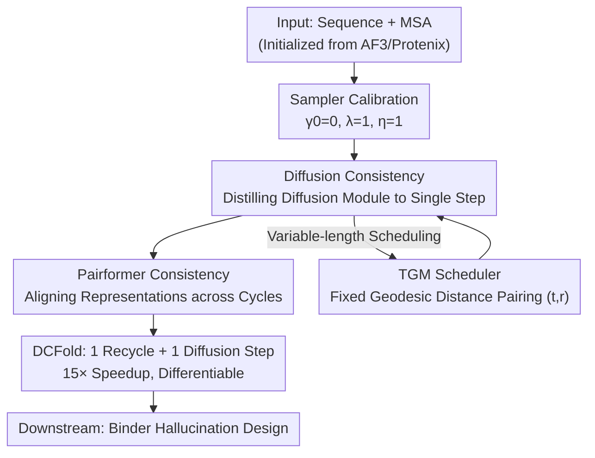

# DCFold: Efficient Protein Structure Generation with Single Forward Pass

**Conference**: ICLR 2026  
**OpenReview**: [https://openreview.net/forum?id=LMsdys7t1L](https://openreview.net/forum?id=LMsdys7t1L)  
**Code**: To be confirmed  
**Area**: Computational Biology / Protein Structure Prediction / Diffusion Acceleration  
**Keywords**: Protein Folding, AlphaFold3, Consistency Models, Single-step Generation, Diffusion Distillation

## TL;DR
DCFold simultaneously distills the two major iterative bottlenecks of AlphaFold3 (multi-step diffusion and Pairformer recycling) using "dual consistency." Combined with a Temporal Geodesic Matching (TGM) scheduler designed for variable-length protein sequences, it achieves AlphaFold3-level structure prediction accuracy in a single forward pass, providing approximately 15× inference acceleration (average 133s → 9s).

## Background & Motivation
**Background**: AlphaFold2 pioneered the end-to-end integration of Multi-Sequence Alignment (MSA) and geometric constraints, pushing protein structure prediction close to experimental accuracy. AlphaFold3 (AF3) transitioned into an all-atom framework and replaced the structure module with a diffusion model, enabling the generation of biological complexes including proteins, nucleic acids, and ligands, which now serves as a foundation for downstream tasks like virtual screening and protein design.

**Limitations of Prior Work**: To achieve high accuracy, AF3 introduces two layers of iteration: the Pairformer cycles multiple times to update pair/single representations, and the diffusion module requires dozens of denoising steps. Consequently, single predictions for long sequences take minutes (average 133s). This inference cost is prohibitive for virtual screening against thousands or even massive public libraries of candidates. Furthermore, hallucination-based protein design requires gradient backpropagation through the folding network, which is rendered nearly impossible by AF3's multi-step iterative structure, effectively preventing the community from using AF3 as a base model for design.

**Key Challenge**: Accuracy is derived from iteration, but iteration brings unbearable inference overhead and non-differentiability. Previous compromises (such as manually reducing recycle counts in BindCraft) trade accuracy for speed, inevitably leading to performance degradation. Similarly, high-order solvers in the diffusion field struggle to compress sampling steps to fewer than 10.

**Key Insight**: Consistency Models (CM) in image generation have demonstrated the ability to collapse multi-step trajectories into a single step, theoretically addressing AF3's diffusion bottleneck. However, the authors found that directly applying CM to AF3 faces two fatal issues: (i) standard CM scheduling assumes fixed-length data and pairs adjacent time steps using fixed Euclidean distances, failing to adapt to variable-length protein sequences and leading to training instability or weight collapse; (ii) AF3 possesses a second bottleneck in the Pairformer cycles, which traditional diffusion consistency methods do not address.

**Core Idea**: Utilize "Dual Consistency" to simultaneously distill both the diffusion and Pairformer iterations into a single step. The consistency scheduler is transformed from "fixed Euclidean intervals" to "fixed geodesic distances" (TGM), allowing pairing to occur within the intrinsic geometric space of protein diffusion trajectories, thereby stabilizing training while preserving accuracy.

## Method

### Overall Architecture
The goal of DCFold is to compress AF3 from "dozens of diffusion steps + multiple Pairformer cycles" to "1 diffusion step + 1 recycle" without retraining the entire AF3, while minimizing accuracy loss. The process consists of three components: first, the AF3 diffusion sampler is calibrated to ensure stable single-step generation (disabling extra noise injection and fixing rescale factors); second, two-stage distillation is performed using dual consistency to collapse the diffusion module and the Pairformer cycles; third, the TGM scheduler is used during diffusion distillation to solve training instability for variable-length sequences. The resulting DCFold is both efficient and differentiable, enabling direct integration into downstream tasks like binder design that require large-scale sampling and gradient optimization.

### Key Designs

**1. Sampler Calibration: Preparing AF3 for Single-step Stability**

Before any distillation, the authors investigated why AF3 fails under few-step sampling. The issue stems from the sampling process itself: AF3's default behavior involves injecting extra random noise and magnifying ODE step sizes, which is catastrophic in a single-step regime as it amplifies ODE prediction bias. They modified the sampler by disabling noise injection (noise factor $\gamma_0 = 0$), fixing the rescale factor $\lambda = 1$, and normalizing the step size to $\eta = 1$. This allows AF3 to generate reasonably correct structures in a single step without retraining (referred to as the AF3 ODE baseline), providing a viable starting point for distillation.

**2. Dual Consistency: Distilling Two Bottlenecks into One Step**

This is the core of DCFold. The authors identified two sources of iteration and applied consistency learning to each. **Diffusion Consistency** distills the diffusion module, aligning single-step outputs with multi-step outputs by minimizing the MSE between outputs at different time steps:

$$\mathcal{L}_{\text{diffusion}} = \mathbb{E}_{x,t,r,\epsilon}\left[w(t)\,\text{MSE}\big(f_\theta(x_t, t) - f_{\text{sg}(\theta)}(x_r, r)\big)\right]$$

where $f_\theta$ is the diffusion module, $\text{sg}(\theta)$ is the stop-gradient, and experiments found $w(t)=1$ is sufficient. **Pairformer Consistency** targets the most critical bottleneck: Pairformer requires $N$ cycles (taken as $N=4$) to refine representations, where each cycle depends on the previous output. Thus, a single forward pass naturally contains representations of varying refinement levels. The authors introduced a "Recycle Consistency Loss" to minimize representation transfer errors between adjacent cycles:

$$\mathcal{L}_{\text{pairformer}} = \sum_{i=1}^{N-1}\big(\text{MSE}(z_i, z_{i+1}) + \text{MSE}(s_i, s_{i+1})\big)$$

where $z_n, s_n$ denote the pair and single representations after the $n$-th cycle. This design avoids explicit time-step sampling as the cycle depth itself provides the supervision signal. Weighting follows the AF3 strategy where nucleic acids and ligands have higher weights; single representations use a per-token weight $\alpha$, while pair representations use an outer product weight matrix $\sqrt{\alpha}\sqrt{\alpha}^\top$.

**3. Temporal Geodesic Matching (TGM): Geodesic Pairing for Variable-length Sequences**

Directly applying general consistency methods to AF3 often results in weight collapse or prohibitive training costs due to scheduling issues with variable-length outputs (protein structures vary in size). Traditional schedulers use fixed Euclidean intervals to pair $(t, r)$, creating an ill-conditioned curriculum: for long sequences, even small $\Delta t$ causes severe distributional shifts, while for short sequences, the same interval provides weak signals. This ignores how "information accumulates non-uniformly with data dimension."

TGM's solution is to pair points based on geodesic distance on the "Temporal Information Manifold" $\mathcal{M}_t$ rather than in Euclidean space. The authors treat the intermediate distributions $p_t(x)$ of the diffusion trajectory as coordinates on the manifold, using the Fisher information relative to time $t$ as the Riemannian metric tensor $g(t) := I(t) = \mathbb{E}_{p_t(x)}[(\partial_t \log p_t(x))^2]$. The geodesic distance is $d_g(t,r) = \int_r^t \sqrt{I(\tau)}\,d\tau$. Proposition 1 (Local Metric-KL Equivalence) provides theoretical support: for small steps, the geodesic distance is approximately the square root of the KL divergence between adjacent distributions $d_g(t,r) = \sqrt{2 D_{\text{KL}}(p_r\|p_t)}^{1/2} + O((\Delta t)^3)$, meaning geodesic pairing is equivalent to pairing using the "natural distance" of the diffusion variational objective. TGM explicitly incorporates the data dimension $D$ into the scheduler to balance the learning difficulty across different sequence lengths.

### Loss & Training
Training is conducted in two stages. Stage (i) updates only the diffusion module with targets $\mathcal{L}_{\text{confidence}}$ (weight $10^{-4}$) + $\mathcal{L}_{\text{diffusion}}$ (weight 1). Stage (ii) updates only one 16-block Pairformer with targets $\mathcal{L}_{\text{confidence}}$ (weight $10^{-4}$) + $\mathcal{L}_{\text{pairformer}}$ (weight 1). The confidence loss $\mathcal{L}_{\text{confidence}}$ follows the AF3 definition. The model is initialized from Protenix (an open-source AF3 reproduction) and ultimately utilizes only 1 recycle and 1 diffusion denoising step.

## Key Experimental Results

### Main Results
On Posebusters V2, the proportions of predicted ligand RMSDs below various thresholds were reported. DCFold consistently outperforms AF3 ODE in worst-case scenarios and approaches or exceeds original AF3 at certain thresholds, indicating that dual consistency "tightens" the output distribution and reduces extreme errors.

| Method | Best <2Å (%) | Best <5Å (%) | Worst <2Å (%) | Worst <5Å (%) |
|------|------|------|------|------|
| AlphaFold3 | 82.86 | 93.81 | 70.00 | 87.62 |
| AF3 ODE | 74.77 | 92.38 | 66.19 | 87.62 |
| DCFold (Ours) | 78.57 | **94.29** | **71.43** | **90.48** |

On the Low Homology Recent PDB dataset, DCFold shows consistent positive gains over AF3 ODE across three complex categories in terms of TM-score and Success Rate (RMSD <2Å). The improvement in Success Rate is notably larger than that in average TM-score, confirming that DCFold reshapes the distribution more effectively than AF3 to avoid generating unreasonable complexes.

| Category | Method | TM-score | SR (%) |
|------|------|------|------|
| PL-complex | AF3 ODE | 0.815 | 92.3 |
| PL-complex | DCFold | **0.824 (+1.2)** | **94.9 (+2.6pp)** |
| Monomer | DCFold | **0.850 (+2.3)** | **95.7 (+2.9pp)** |
| PP-complex | DCFold | **0.800 (+4.8)** | **92.2 (+5.2pp)** |

Regarding efficiency, the average folding time was reduced from 133.3s (AF3) to 8.9s (DCFold), representing a ~15× speedup, while the Posebusters V2 success rate only slightly decreased from 82.9% to 78.6%.

### Ablation Study
The effectiveness of TGM was compared against various general consistency models on Posebusters V2. TGM achieved the highest success rate under the same single-step time constraint, while naive CD suffered from training collapse:

| Method | Single-step Time (s) | Success Rate (%) | Note |
|------|------|------|------|
| CD | 18.5 | 25.6 ↓ | Training collapse |
| sCM | 38.1 | - | Not usable |
| ECM | 11.6 | 75.7 ↑ | Observable gain |
| TGM | 11.6 | **77.5 ↑** | Largest gain for same time |

### Key Findings
- **AF3 is inherently capable of single-step generation**: By selecting proper ODE parameters (disabling noise, fixing step size), AF3 ODE can generate roughly correct structures in one step, suggesting the bottleneck lies in the sampling strategy rather than the model itself.
- **Dual consistency "reshapes the distribution"**: While best-case RMSD remains stable, worst-case scenarios improve significantly, effectively pruning extreme errors and resulting in a higher Success Rate increase compared to average TM-score.
- **Diversity and confidence are maintained**: Dual consistency slightly narrows the structural distribution (Diversity decreases marginally) while confidence (pLDDT) remains stable or slightly increases. These effects are orthogonal to diversity augmentation strategies like MSA sampling.
- **Downstream binder design benefits significantly**: In *in silico* success rates across six targets, DCFold outperformed the AF2-based BindCraft on most targets (e.g., H3, VirB8, LTK), demonstrating that differentiability and efficiency allow AF3 to perform hallucination design tasks.

## Highlights & Insights
- **Leveraging "Cycle Depth" as Free Supervision**: Pairformer consistency does not require explicit time-step sampling because a single forward pass inherently contains representations of varying refinement levels, allowing for simple MSE alignment between adjacent cycles.
- **Geodesic Distance as Geometric KL**: TGM uses the link between geodesic distance and the square root of KL divergence to pair time steps under the "natural metric" of the diffusion objective, compensating for information accumulation in long sequences.
- **Model Transformation via Distillation**: DCFold provides a reusable paradigm for transforming expensive foundational models into deployable versions through lightweight two-stage distillation starting from Protenix.

## Limitations & Future Work
- **Small accuracy trade-off**: The Posebusters V2 best-case success rate dropped from 82.9% to 78.6%; single-step generation might not suffice for scenarios requiring extreme precision.
- **Limited diversity gains**: Similar to AF3, simply increasing sampling runs (5→15) provides minimal diversity gains due to strong conditioning; orthogonal MSA perturbation methods are required.
- **Downstream validation focused on binder design**: While successful in structure prediction and binder hallucination, its robustness in broader protein design or docking tasks remains to be verified.
- **Theoretical approximations**: TGM uses a first-order Euler approximation for geodesic distance, and Proposition 1 is a local expansion; the impact of approximation errors for extremely long sequences warrants further analysis.

## Related Work & Insights
- **vs. AlphaFold3**: AF3 relies on multi-step diffusion and Pairformer cycles for accuracy; DCFold distills both into a single step, achieving comparable accuracy with 15× speedup and providing differentiability for optimization.
- **vs. General Consistency Models (CD / sCM / ECM)**: These assume fixed-length data and Euclidean intervals; TGM adapts to variable-length sequences using Fisher Information geodesic distances, preventing the collapse seen in CD.
- **vs. BindCraft (AF2-based design)**: BindCraft is limited to the AF2 framework; DCFold brings AF3's all-atom complex modeling capability into binder design with higher success rates on most targets.
- **vs. High-order ODE Solvers**: While solvers improve efficiency, they rarely reach sub-10-step regimes; DCFold takes the consistency distillation route to achieve 1-step generation directly.

## Rating
- Novelty: ⭐⭐⭐⭐⭐ Distilling two bottlenecks simultaneously + TGM for variable-length scheduling is a solid and theoretically supported approach.
- Experimental Thoroughness: ⭐⭐⭐⭐ Comprehensive coverage of structure prediction, diversity, and binder design, though downstream task variety could be broader.
- Writing Quality: ⭐⭐⭐⭐ Clear motivation and methodology; theoretical sections require some background in Fisher information.
- Value: ⭐⭐⭐⭐⭐ Reducing AF3 from minutes to seconds while maintaining differentiability significantly lowers the barrier for downstream design tasks.

<!-- RELATED:START -->

## Related Papers

- [\[ICLR 2026\] Efficient Prediction of Large Protein Complexes via Subunit-Guided Hierarchical Refinement](efficient_prediction_of_large_protein_complexes_via_subunit-guided_hierarchical_.md)
- [\[ICLR 2026\] GAGA: Gaussianity-Aware Gaussian Approximation for Efficient 3D Molecular Generation](gaga_gaussianity-aware_gaussian_approximation_for_efficient_3d_molecular_generat.md)
- [\[ICLR 2026\] Learning Flexible Forward Trajectories for Masked Molecular Diffusion](learning_flexible_forward_trajectories_for_masked_molecular_diffusion.md)
- [\[ICML 2026\] Protein Autoregressive Modeling via Multiscale Structure Generation](../../ICML2026/computational_biology/protein_autoregressive_modeling_via_multiscale_structure_generation.md)
- [\[ICLR 2026\] Convex Efficient Coding](convex_efficient_coding.md)

<!-- RELATED:END -->
