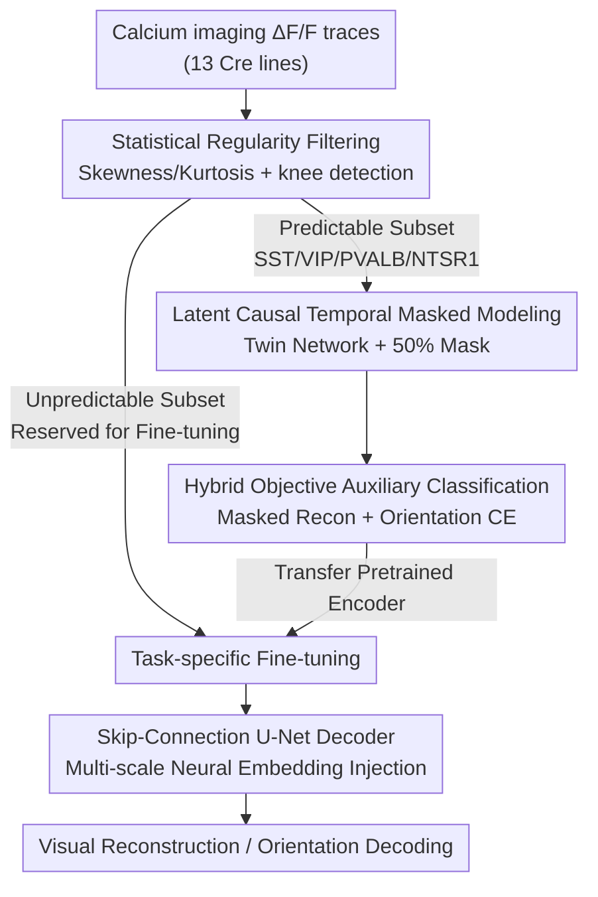

# Decoding Dynamic Visual Experience from Calcium Imaging via Cell-Pattern-Aware Pretraining

**Conference**: ICLR2026  
**OpenReview**: [https://openreview.net/forum?id=z9kAjjRejs](https://openreview.net/forum?id=z9kAjjRejs)  
**Code**: TBD  
**Area**: Computational Biology / Neural Decoding / Self-Supervised Learning  
**Keywords**: Calcium Imaging, Neural Decoding, Cell Type, Self-Supervised Pretraining, Curriculum Learning

## TL;DR
POYO-CAP treats "statistical regularity" (measured by skewness and kurtosis) as an explicit data filtering criterion. It performs masked reconstruction pretraining starting with the most "predictable" neurons (e.g., inhibitory interneurons) and then transfers to noisy neurons for downstream decoding. This transforms neural heterogeneity in calcium imaging from a bottleneck into a scalable learning advantage—achieving a movie frame reconstruction SSIM of 0.593, a 1.98× increase in data efficiency, and stable performance scaling with model size.

## Background & Motivation
**Background**: Learning useful representations from neural recordings is a long-standing challenge in machine learning. Data collected across laboratories are often small-scale, high-dimensional, and partially observed due to recording limitations, with labels being both scarce and weak. Self-supervised learning (SSL) is naturally suited for this "low data, few labels" scenario. Techniques like masked modeling and sequence prediction have proven effective in structured domains like language and are expected to reconstruct perception or intent directly from neural activity (e.g., Brain-Computer Interfaces, BCI).

**Limitations of Prior Work**: The success of SSL relies on the existence of "learnable statistical regularities" in the data. However, neural decoding breaks this premise—only a small, biased subset of neurons from the entire circuit is typically recorded, causing "predictability" to be extremely uneven within the population. This unpredictability is strongly correlated with cell types: the dynamics of inhibitory interneurons and corticothalamic neurons are relatively regular, while excitatory pyramidal cells appear sparse and stochastic under isolated observation (as the larger network signals driving them are unobserved). Feeding this mixed signal indiscriminately into SSL causes the loss to be dominated by unpredictable neurons, diverting the model's attention from learnable patterns.

**Key Challenge**: There is a fundamental conflict between the functional heterogeneity of neural populations (regular neurons vs. highly stochastic neurons mixed in the same dataset) and SSL's dependence on statistical regularity. The authors even observe a paradoxical phenomenon—**adding more neurons leads to "scaling collapse"**, a failure mode unique to heterogeneous neural populations.

**Goal**: To verify a "Statistical Regularity Hypothesis"—that representation learning efficiency increases with the statistical regularity of the selected neuron subset—and to design a pretraining scheme that enables stable SSL scaling.

**Key Insight**: Instead of traditional curricula based on "task difficulty," the authors advocate for guiding the learning curriculum using the **intrinsic statistical properties** of neurons—a "data diet" approach where the pruning targets are **neurons (feature sources)** rather than samples. They use high-order statistics (skewness, kurtosis) as label-free proxies for predictability.

**Core Idea**: Use "statistical predictability" as an explicit data filtering criterion—pretrain on "predictable" neurons with low skewness/kurtosis (near-Gaussian, thin-tailed), then fine-tune on more stochastic populations, turning heterogeneity into a scalable learning advantage.

## Method

### Overall Architecture
POYO-CAP (Cell-pattern Aware Pretraining) is a hybrid pretraining framework that "selects neurons first, then trains in stages." The pipeline is: Input calcium imaging $\Delta F/F$ traces from the mouse visual cortex → Partition 13 Cre lines into "predictable" and "unpredictable" subsets using skewness/kurtosis → Perform pretraining with a hybrid objective of "latent space masked reconstruction + auxiliary classification" on the predictable subset (encoder based on POYO+, twin network) → Transfer the pretrained encoder to unpredictable neurons for fine-tuning with task-specific decoders (Skip-Connection U-Net for movie reconstruction, POYO+ decoder for orientation classification) → Output reconstructed movie frames or drifting grating orientations.

The spirit of the design is to elevate "data selection" to a status equal to "model design": the pretraining phase does not aim for full coverage of all neurons but deliberately learns only the most regular ones to build a well-conditioned optimization foundation for the large model.

### Key Designs

**1. Statistical Regularity Data Filtering: Label-free selection of "predictable" neurons**  
Addressing the issue of SSL loss being dominated by stochastic neurons, the authors operationalize predictability as a calculable, label-free criterion. They calculate the skewness and kurtosis of $\Delta F/F$ traces for each neuron—near-Gaussian (symmetric, thin-tailed) neurons are treated as "predictable" (mean skewness 1.87, kurtosis 7.32 in the selected subset), while heavy-tailed, sparse-bursting neurons (mean kurtosis up to 148.51) are reserved for fine-tuning. Specifically, they use a knee-detection algorithm (Satopaa et al.) on the mean distributions across 13 Cre lines to find data-driven inflection points, yielding thresholds of $\text{skewness} \le 3.51$ and $\text{kurtosis} \le 22.62$. This identifies 4 lines: SST, VIP, PVALB (the three major inhibitory interneuron classes) and NTSR1 (a modulatory corticothalamic excitatory line). Notably, this purely statistical criterion yields a population that is **biologically consistent**—crucial actors in stable neural circuits.

**2. Latent Causal Temporal Masked Modeling: Masked reconstruction in hidden space**  
The main pretraining objective is masked reconstruction, but instead of masking raw signals, it is performed in the **latent space**. The architecture is based on POYO+: calcium traces are tokenized into sequences and compressed via a cross-attention block into $L$ latent tokens $Z_1 = \{z_1^{(1)}, \cdots, z_1^{(L)}\}$, each with a timestamp relative to the context window. **Causal temporal masking** is applied—the second half (50%) of latent tokens are replaced with `<MASKED>` to get $Z_1^{\text{masked}}$. A twin network processes both $Z_1$ and $Z_1^{\text{masked}}$ through the same self-attention blocks to obtain $Z_L$ and $Z_L^{\text{masked}}$, with $Z_L$ from the unmasked view serving as the regression target for $Z_L^{\text{masked}}$. Temporal masking was chosen over random masking because it preserves local temporal dependencies critical for neural dynamics (typical V1 receptive fields are 50–100ms).

**3. Mixed-Objective Auxiliary Classification: Light supervision as an "easy curriculum"**  
Relying solely on latent space self-distillation can lead to representational collapse. The authors introduce a lightweight fully-supervised auxiliary loss—cross-entropy classification of drifting grating orientations—defining the pretraining loss as:
$$\text{Loss}_{\text{pretrain}} = \text{Loss}_{L1}(Z_L^{\text{masked}}, Z_L) + \lambda \cdot \text{Loss}_{\text{CE}}(\text{DG}_{\text{pred}}, \text{DG}_{\text{true}})$$
where $\lambda = 0.01$. The CE weight is kept small so that classification only accelerates convergence and guides early selectivity, while masked reconstruction remains the primary driver for shaping representations.

**4. Skip-Connection U-Net Decoder: Multi-scale reconstruction of high-res frames from neural embeddings**  
For fine-tuning on dense prediction tasks like movie reconstruction, the authors designed a U-Net style decoder. The key modification is **replacing traditional encoder skip connections with neural embedding projections**: at each upsampling stage, the latent vector is directly projected into feature maps of corresponding scales (e.g., $128\times2\times2$, $64\times4\times4$) and fused with upsampled features via $1\times1$ convolutions. This repeated injection of neural embeddings across scales is essential for maintaining semantic information, allowing the model to reconstruct fine visual details from a compact neural representation. The movie reconstruction loss is a weighted combination:
$$\text{Loss}_{\text{movie}} = 50\,\text{Loss}_{\text{focal}} + 50\,\text{Loss}_{L1} + 50\,\text{Loss}_{\text{FFT}} + \text{Loss}_{\text{perceptual}} + 0.1\,\text{Loss}_{\text{SSIM}}$$

### Loss & Training
Pretraining uses $\text{Loss}_{\text{pretrain}}$ (L1 latent reconstruction + small weight CE). Fine-tuning uses task-specific losses: $\text{Loss}_{\text{movie}}$ for movie decoding and standard CE for drifting gratings. The dataset is the Allen Brain Observatory calcium imaging (13 Cre lines). Pretraining and fine-tuning are strictly non-overlapping at the Cre line level (and individual animal level). Downstream splits are trial-based and temporally non-overlapping within sessions. Training was performed on 4×V100 GPUs.

## Key Experimental Results

### Main Results
Comparison of downstream decoding performance (mean ± 95% CI over three seeds, paired t-test $p<0.05$):

| Method | Pretrain Data | Fine-tune Data | Movie SSIM↑ | Drifting Grating Acc↑ |
|------|-----------|---------|-----------|----------------|
| **POYO-CAP (Ours)** | Predictable | Unpredictable | **0.593±0.013** | **0.555±0.022** |
| Train from Scratch | None | All (Pred. + Unpred.) | 0.528±0.023 | 0.492±0.041 |

Ours achieves a ~12–13% relative improvement over training from scratch. The external SSL baseline (CEBRA encoder with the same visual decoder) only reached SSIM≈0.48.

### Ablation Study

| Configuration | Movie SSIM | Description |
|------|----------|------|
| Full (POYO-CAP) | 0.593 | Complete model |
| MLP Enc.→MLP Dec. | 0.449 | Fully connected, no spatial bias |
| POYO+ Enc.→MLP Dec. | 0.503 | SSL encoder with linear decoder |
| POYO+ Enc.→U-Net w/o skip | 0.466 | Removed multi-scale skip connections |
| Reverse SSL | 0.489 | Curriculum reversed; worse than scratch |
| Mixed SSL | 0.543 | Including unpredictable neurons in pretrain |
| Random masking | 0.540 | Random mask < temporal mask |
| Masking only | 0.496 | Removed CE auxiliary loss |

### Key Findings
- **Curriculum direction is more important than data volume**: "Reverse SSL" (pretraining on unpredictable neurons first) yielded an SSIM of 0.489, **lower than the 0.528 from scratch**, indicating that pretraining on high-stochasticity data establishes poor inductive biases.
- **Predictable neurons have higher information density**: Fisher Information was 64.5 vs. 33.5 (1.93×). Training efficiency on predictable data points was 1.98× that of unpredictable ones.
- **Distinct loss landscapes**: Predictable neurons induce a smooth, near-convex loss surface ($\sigma_L=14.85$), while unpredictable neurons result in a rugged, non-convex surface ($\sigma_L=2048$, ~138× rougher).
- **Stable Scaling**: Models pretrained only on predictable neurons scaled positively with capacity (slope 0.018), whereas mixed or scratch training slopes were significantly flatter (0.005–0.013).
- **Transfer Mechanism**: During fine-tuning, encoder weights changed by only ~0.18%, while readout layer bias magnitudes increased by 12.4×, suggesting pretraining provides a stable "representational scaffold."

## Highlights & Insights
- **Neurons as First-Class Citizens in Data Dieting**: While standard data dieting prunes samples, this work prunes feature sources (neurons). This perspective reveals "scaling collapse" unique to neural data.
- **Bio-Statistical Convergence**: The fact that a purely statistical knee-detection criterion based on skewness/kurtosis perfectly aligns with known biological cell types (inhibitory interneurons) lends high credibility to the filtering approach.
- **Geometric Interpretation**: Quantifying predictability via 138× differences in landscape roughness and 1.93× Fisher Information provides a rigorous methodological foundation beyond mere performance metrics.
- **Transferable U-Net Trick**: The technique of "multi-scale latent vector injection" instead of traditional skip connections is a valuable design for generating dense outputs from low-dimensional neural embeddings.

## Limitations & Future Work
- **Proxy Limitations**: Skewness/kurtosis are computational proxies that do not necessarily capture causal mechanisms.
- **Same-Stimulus Generalization**: Evaluation was conducted using training and test frames from the same stimulus set; generalization to entirely novel naturalistic stimuli remains to be verified.
- **Dependency on Metadata**: The division by Cre lines relies on annotated datasets like the Allen Brain Observatory. Implementation on raw recordings without cell-type labels remains a practical challenge.

## Related Work & Insights
- **vs. POYO / POYO+**: POYO uses Transformers for multi-session decoding but relies on full supervision. This work extends it to SSL by handling unlabeled data through statistical filtering.
- **vs. CEBRA**: CEBRA uses contrastive learning to reduce label dependency but its aligned latent space does not transfer well to high-fidelity pixel generation (SSIM≈0.48 vs. ours 0.59).
- **vs. Neuro-BERT**: Unlike methods that treat all neurons equally, POYO-CAP explicitly differentiates neurons based on intrinsic circuit structures rather than external supervision.

## Rating
- Novelty: ⭐⭐⭐⭐⭐ Elevated statistical predictability to an explicit filtering criterion and revealed neural scaling collapse.
- Experimental Thoroughness: ⭐⭐⭐⭐ Solid multi-dimensional evidence (landscapes, Fisher Info), though limited to one major dataset.
- Writing Quality: ⭐⭐⭐⭐ Clear logic from hypothesis to verification; excellent integration of statistical and biological insights.
- Value: ⭐⭐⭐⭐ Provides a verifiable "predictability-first" signal for scalable neural SSL, highly relevant for BCI and computational neuroscience.

<!-- RELATED:START -->

## Related Papers

- [\[ICLR 2026\] Rigidity-Aware Geometric Pretraining for Protein Design and Conformational Ensembles](rigidity-aware_geometric_pretraining_for_protein_design_and_conformational_ensem.md)
- [\[ICLR 2026\] Continuous Multinomial Logistic Regression for Neural Decoding](continuous_multinomial_logistic_regression_for_neural_decoding.md)
- [\[ICLR 2026\] Pretraining with Re-parametrized Self-Attention: Unlocking Generalization in SNN-Based Neural Decoding Across Time, Brains, and Tasks](pretraining_with_re-parametrized_self-attention_unlocking_generalizationin_snn-b.md)
- [\[AAAI 2026\] Apo2Mol: 3D Molecule Generation via Dynamic Pocket-Aware Diffusion Models](../../AAAI2026/computational_biology/apo2mol_3d_molecule_generation_via_dynamic_pocket-aware_diff.md)
- [\[AAAI 2026\] MergeDNA: Context-aware Genome Modeling with Dynamic Tokenization through Token Merging](../../AAAI2026/computational_biology/mergedna_context-aware_genome_modeling_with_dynamic_tokenization_through_token_m.md)

<!-- RELATED:END -->
