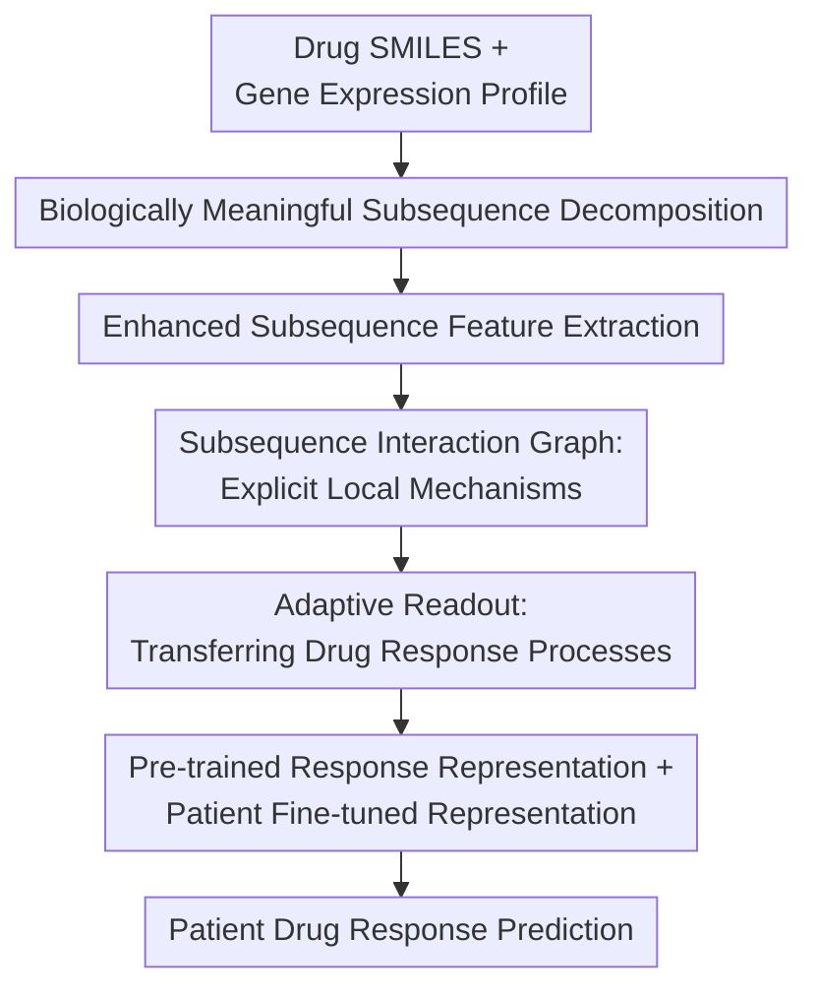

# DeepSADR: Deep Transfer Learning with Subsequence Interaction and Adaptive Readout for Cancer Drug Response Prediction

**Conference**: ICLR2026  
**OpenReview**: [https://openreview.net/forum?id=jrFJWpDZvq](https://openreview.net/forum?id=jrFJWpDZvq)  
**Code**: https://github.com/ZYPssss/DeepSADR  
**Area**: Computational Biology / Cancer Drug Response Prediction  
**Keywords**: Cancer Drug Response Prediction, Transfer Learning, Subsequence Interaction Graph, Adaptive Readout, Cell Line to Patient Transfer  

## TL;DR
DeepSADR models "drug-patient response" as a bipartite interaction graph between drug substructures and gene functional subsequences. It employs Graph Autoencoders and Adaptive Readout via Set Transformers to transfer rich response knowledge from cell lines to label-scarce clinical patient data, achieving an average AUC of 0.856 and AUPR of 0.862 across 5 clinical drugs.

## Background & Motivation
**Background**: Precision oncology aims to predict drug efficacy based on omics features such as patient gene expression. Real-world patient data from clinical cohorts like TCGA are limited, as each patient typically receives few drugs, resulting in very sparse labeled drug response samples. Conversely, cancer cell line data like DepMap allow testing numerous drugs on the same cell line, providing richer drug-cell line response labels. Existing methods often use cell lines as the source domain and patients as the target domain, utilizing transfer learning or domain adaptation to translate in vitro data into in vivo predictive capability.

**Limitations of Prior Work**: Most methods primarily align the global gene expression distributions of cell lines and patients, assuming that learning a shared expression space is sufficient for model transfer. This assumption is overly coarse. Drug response is not a black-box matching of a "full molecule + full expression vector" but is determined by local interactions between specific pharmacophores/chemical fragments in the drug and functional biological pathways in the patient. Treating SMILES and gene expression as monolithic features makes it difficult for models to explain which drug structures act on which biological processes.

**Key Challenge**: The discrepancy between cell lines and patients is not just a static distribution shift such as $P(G_c) \ne P(G_p)$. Factors such as the immune system, tumor microenvironment, and pharmacokinetics in patients—which are absent in cell lines—mean that the "drug response process" itself varies. Global feature alignment ignores this mechanism-level domain shift, while purely substructure-based explanation is insufficient for completing the transfer from cell lines to patients.

**Goal**: The authors aim to address two issues simultaneously. First, decompose drug response into biologically meaningful local interactions to identify which drug substructures affect specific gene functional subsequences. Second, for sparse patient data, fine-tune only a few modules responsible for adapting to in vivo mechanisms, thereby retaining pre-trained knowledge from cell lines while avoiding overfitting.

**Key Insight**: Interactions between drug substructures and gene functional pathways are more "transferable mechanisms" than raw gene expression vectors. The same drug fragment may influence similar apoptosis, DNA repair, or cell cycle pathways in both cell lines and patients, but the in vivo environment alters the overall readout of these interactions. Therefore, DeepSADR converts each drug-response case into a subsequence interaction graph and treats the "readout of response representations from the graph" as the core adaptation point for transfer learning.

**Core Idea**: Replace monolithic drug/gene feature concatenation with a drug substructure-gene functional subsequence interaction graph, and fine-tune only the Set Transformer-based adaptive readout and predictor to learn the response mechanism transfer from cell lines to patients.

## Method
### Overall Architecture
DeepSADR is a two-stage transfer framework. In the pre-training stage, only large-scale cell line drug response data are used to learn drug substructures, gene functional subsequences, their interaction graphs, and graph-level response representations. In the fine-tuning stage, most parameters of the pre-trained model are frozen; only the Adaptive Readout (AR) and the patient predictor are updated. The pre-trained response representation is concatenated with the patient-specific representation to adapt the model to in vivo response mechanisms using limited clinical labels.

The overall workflow involves decomposing drugs and gene expression into local components, constructing a bipartite interaction graph for each drug-sample pair, obtaining node representations via a supervised graph autoencoder, and aggregating them into a graph-level drug response representation using a trainable set readout function. The "subsequence interaction graph" and "adaptive readout" are the two key contributions: the former focuses on mechanistic locality, while the latter determines which interaction patterns should be transferred to the patient domain.

### Key Designs
**1. Biologically Meaningful Subsequence Decomposition: Breaking down black-box inputs into interpretable units**

Traditional models encode entire SMILES and gene expression vectors, mixing active drug fragments and patient functional pathways with irrelevant noise. DeepSADR decomposes inputs into subsequences closer to biological mechanisms: drugs are decomposed via BRICS in RDKit from $S(d_i)$ into $[S^1_{sub}, S^2_{sub}, \ldots, S^n_{sub}]$, corresponding to local chemical substructures; genes are grouped using GSEAPY into functional subsequences $[G^1_{sub}, G^2_{sub}, \ldots, G^m_{sub}]$ based on KEGG and GO pathway information.

This design moves the prediction target from "matching two large vectors" to "determining if a drug fragment acts on a specific functional pathway." For instance, visualization shows a cyclic fragment of Temozolomide having high interaction weights with cell stress/apoptosis pathways, providing a granularity closer to pharmacological mechanisms.

**2. Enhanced Subsequence Feature Extraction: Separate encoders for drug fragments and gene pathways**

Drug substructures remain molecular graphs, and standard GNN message passing is often limited by chemical bond neighborhoods. DeepSADR overlays edge feature fusion, normalization, Dropout, residual connections, FFN, and Random Walk Structural Positional Encoding on a classic GNN to form the GNP encoder. This produces drug substructure representations $Sub^d_i \in \mathbb{R}^{n \times e_d}$. For genes, multiple fully connected layers encode the functional pathway subsequences into $Sub^c_j$ or $Sub^p_j \in \mathbb{R}^{m \times e_g}$.

This asymmetric encoding is justified: drug fragments naturally possess graph structures, while gene functional subsequences are sets of expression features organized by pathways. Ablation studies show that replacing GNP with a simple GNN decreases performance across five drugs.

**3. Subsequence Interaction Graph: Explicitly representing interaction strength between drug fragments and gene functions**

DeepSADR uses a bilinear scoring function to calculate the interaction strength between each drug fragment and gene functional subsequence: $\psi(\hat d, \hat g)=\sigma(\hat d W \hat g^\top)$. The scores form a matrix $R \in \mathbb{R}^{n \times m}$, where each value in $[0,1]$ represents a potential edge. The model filters weak edges using a threshold $t$ to obtain $\hat R$, and constructs a bipartite adjacency matrix $A=\begin{pmatrix}0 & \hat R \\ \hat R^\top & 0\end{pmatrix}$.

Filtering is critical; keeping the full bipartite graph introduces noise, while a threshold too high removes useful interactions. Optimal thresholds vary by drug (e.g., 0.19 for Fluorouracil, 0.40 for Temozolomide). A Supervised Graph Autoencoder (SGAE) then learns node latent representations $Z=SGAE(X,A)$ on this graph.

**4. Adaptive Readout: Focusing transfer on graph-level aggregation of the "drug response process"**

Standard graph tasks use sum, mean, or max readout, assuming stable node contribution patterns. In cell-line-to-patient transfer, this is risky as the response mechanism changes in vivo. DeepSADR uses a Set Transformer-based Adaptive Readout (AR) that is permutation-invariant and uses multi-head attention to learn complex interaction combinations.

Node representations from SGAE pass through SAB (Set Attention Block) blocks, followed by PMA (Pooling by Multihead Attention) and SAB/FF blocks. During fine-tuning, all modules except AR and the predictor are frozen. The final representation is a concatenation $[Z_{fine} \Vert \hat Z_{pre}]$ of the fine-tuned branch and the frozen pre-trained branch. This ensures that the small patient sample size only adjusts the readout and prediction boundaries.

### Function
Using Temozolomide as an example: the model takes a drug SMILES and a patient's 1,426-gene expression profile. It decomposes the drug via BRICS and groups genes into pathways (e.g., apoptosis, DNA repair). After encoding, it calculates interaction scores. If a fragment scores high against the "cell stress" pathway, an edge is retained. SGAE propagates information, and AR aggregates the graph. The concatenated representation predicts the response probability. Visualizations show high-weight fragments align with known Temozolomide mechanisms.

### Loss & Training
In the pre-training stage (cell lines), all modules are trained using: $L_{pre}=MSE(P_1(Z_{pre}),Y_c)-KL[q(Z|X,A)\Vert p(Z)]$, where $p(Z)$ is a standard Gaussian prior.

In the fine-tuning stage (patients), pre-trained modules (decomposition, extraction, SGAE) are frozen. Only AR and the predictor are trained using: $L_{fine}=MSE(P_2([Z_{fine}\Vert \hat Z_{pre}]),Y_p)$. Training/test splits are 7:3 across 5 drugs with at least 20 patient samples.

## Key Experimental Results

### Main Results
The study uses 1,426 genes, consistent with WISER. Pre-training uses DepMap (966 cell lines); fine-tuning uses TCGA (555 patients).

| Drug | DeepSADR AUC | DeepSADR AUPR | Prev. SOTA AUC | Prev. SOTA AUPR | Main Conclusion |
|------|--------------|---------------|----------------|-----------------|----------|
| Fluorouracil | 0.805/0.056 | 0.821/0.023 | 0.793(GANDALF) | 0.794(TransDRP) | Small lead, AUPR advantage more obvious |
| Temozolomide | 0.870/0.026 | 0.886/0.029 | 0.791(GANDALF) | 0.786(WISER) | Stable gain on Glioma drug |
| Sorafenib | 0.957/0.037 | 0.978/0.024 | 0.811(GANDALF) | 0.795(GANDALF) | Most significant improvement |
| Gemcitabine | 0.719/0.057 | 0.702/0.022 | 0.709(GANDALF) | 0.697(GANDALF) | Smaller margin, likely near performance ceiling |
| Cisplatin | 0.927/0.027 | 0.922/0.021 | 0.852(GANDALF) | 0.813(GANDALF) | Clearly outperforms transfer/DA baselines |

Average DeepSADR AUC/AUPR is 0.856/0.862, outperforming GANDALF (0.791/0.765), WISER (0.726/0.741), and CODE-AE (0.680/0.711).

### Ablation Study
| Configuration | Avg AUC | Avg AUPR | Description |
|------|----------|-----------|------|
| DeepSADR | 0.856 | 0.862 | Full model |
| w/o AR | 0.662 | 0.675 | Replace AR with sum/max/mean pooling |
| w/o SN | 0.698 | 0.710 | Remove interaction graph; direct readout of features |
| w/o TS | 0.775 | 0.749 | No thresholding; retain all noisy edges |
| w/o ET | 0.781 | 0.787 | No pre-trained representation concatenation |

### Key Findings
- The subsequence interaction graph and adaptive readout are complementary: the former provides mechanistic local input, while the latter extracts transferable graph-level features.
- Performance is sensitive to the threshold $t$; the optimal threshold varies significantly by drug.
- Even on drugs with very few samples (e.g., Sunitinib), DeepSADR outperforms baselines, though absolute performance drops.

## Highlights & Insights
- **Transferring the response process rather than static expression**: Unlike domain adaptation methods that align expression distributions, DeepSADR focuses on the interaction patterns of drug fragments and functional pathways.
- **Interpretable intermediate layer**: The model produces interaction heatmaps between drug substructures and gene functional subsequences, providing mechanistic clues rather than just black-box probabilities.
- **克制 (Restrained) fine-tuning strategy**: By updating only AR and the predictor, the model avoids destroying the general structural knowledge learned from large-scale cell line data while adapting to small clinical samples.
- **Threshold-driven mechanism hypothesis**: Filtering low-confidence edges converts a dense graph into a sparse hypothesis of drug action, improving both performance and readability.

## Limitations & Future Work
- **Sample size constraints**: Clinical data remain extremely limited (e.g., Sorafenib $n=26$), requiring validation on larger cohorts.
- **Threshold tuning**: Threshold $t$ currently requires per-drug tuning. Future work could explore learnable thresholds or Bayesian uncertainty for edge pruning.
- **Pathway dependency**: Gene functional subsequences rely on existing pathway annotations; performance may suffer if drug mechanisms involve unannotated pathways.
- **Label granularity**: Using "time to recurrence" as a binary label is coarse; future studies should incorporate multi-modal clinical endpoints.

## Related Work & Insights
- **vs CODE-AE**: CODE-AE focuses on de-confounding and alignment. DeepSADR explicitly models substructure-pathway interactions, offering higher interpretability but requiring more complex graph construction.
- **vs WISER / GANDALF**: DeepSADR outperforms these on Sorafenib and Cisplatin by specifically transferring the mechanism of action via the adaptive readout.
- **Value**: The "interpretable local mechanism + sparse transfer" paradigm used here could be extended to tasks like drug toxicity or immunotherapy response prediction.

## Rating
- Novelty: ⭐⭐⭐⭐☆
- Experimental Thoroughness: ⭐⭐⭐⭐☆
- Writing Quality: ⭐⭐⭐⭐☆
- Value: ⭐⭐⭐⭐☆

<!-- RELATED:START -->

## Related Papers

- [\[ICLR 2026\] GRAM-DTI: Adaptive Multimodal Representation Learning for Drug-Target Interaction Prediction](gram-dti_adaptive_multimodal_representation_learning_for_drugtarget_interaction_.md)
- [\[ICLR 2026\] I2Mole: Interaction-aware Invariant Molecular Learning for Generalizable Drug-Drug Interaction Prediction](i2mole_interaction-aware_invariant_molecular_learning_for_generalizable_property.md)
- [\[ICLR 2026\] Adaptive Data-Knowledge Alignment in Genetic Perturbation Prediction](adaptive_data-knowledge_alignment_in_genetic_perturbation_prediction.md)
- [\[ICLR 2026\] Readout Representation: Redefining Neural Codes by Input Recovery](readout_representation_redefining_neural_codes_by_input_recovery.md)
- [\[AAAI 2026\] SpaCRD: Multimodal Deep Fusion of Histology and Spatial Transcriptomics for Cancer Region Detection](../../AAAI2026/computational_biology/spacrd_multimodal_deep_fusion_of_histology_and_spatial_transcriptomics_for_cance.md)

<!-- RELATED:END -->
