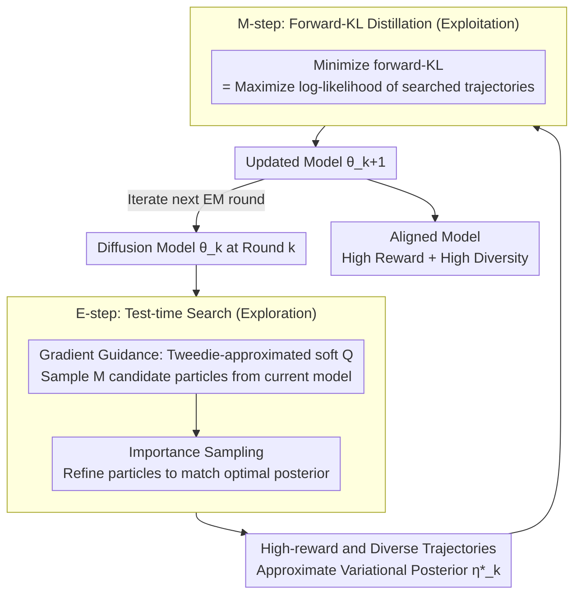

# Diffusion Alignment as Variational Expectation-Maximization

**Conference**: ICLR 2026  
**arXiv**: [2510.00502](https://arxiv.org/abs/2510.00502)  
**Code**: [https://github.com/Jaewoopudding/dav](https://github.com/Jaewoopudding/dav)  
**Area**: Computational Biology  
**Keywords**: diffusion alignment, expectation-maximization, test-time search, reward optimization, mode collapse prevention  

## TL;DR
This paper formalizes diffusion model alignment as a variational EM algorithm: the E-step uses test-time search (soft Q guidance + importance sampling) to explore high-reward multimodal trajectories, and the M-step distills search results into model parameters through forward-KL, achieving both high reward and high diversity in image generation and DNA sequence design.

## Background & Motivation

**Background**: Diffusion model alignment (matching generation to external rewards) primarily follows two routes: RL (DDPO/DPOK) and direct backpropagation (DRaFT/AlignProp).

**Limitations of Prior Work**: RL methods use reverse-KL optimization, leading to mode-seeking behavior, which causes mode collapse and loss of diversity. Direct backpropagation relies on gradient signals from reward models and is prone to reward over-optimization. Both types of methods exhibit a sharp drop in image quality/diversity despite high rewards in late training stages.

**Key Challenge**: The trade-off between reward optimization and diversity maintenance. Reverse-KL is naturally mode-seeking and tends to collapse into a single mode.

**Goal**: To design an alignment framework that effectively optimizes rewards while maintaining sample diversity and naturalness, applicable to both continuous (image) and discrete (DNA) diffusion models.

**Key Insight**: Formalize the alignment problem as variational EM—introducing an optimality variable $\mathcal{O}$ and trajectory latent variables $\tau$. The E-step finds a multimodal posterior, while the M-step performs distillation using forward-KL (mode-covering). Forward-KL naturally encourages covering all modes rather than focusing on a single one.

**Core Idea**: Use test-time search in the E-step to discover multimodal high-reward samples, and use forward-KL distillation in the M-step to maintain diversity, iteratively improving through cycles.

## Method

### Overall Architecture

DAV aims to address the common issue in diffusion model alignment where "rewards increase while diversity collapses." The strategy is to reformulate alignment as a variational EM loop: first, actively search for a batch of high-reward and diverse trajectories at test-time, then distill these trajectories back into the model. This process repeats, allowing rewards and diversity to improve simultaneously. Each EM round consists of two alternating steps: the E-step (Exploration) starts from the current model and uses test-time search (gradient-guided sampling + importance sampling) to generate high-reward, diverse trajectories that approximate the variational posterior $\eta_k^*$; the M-step (Distillation) trains the model on these trajectories by minimizing the forward-KL $D_{\text{KL}}(\eta_k^* \| p_\theta)$, equivalent to maximizing the log-likelihood $-\log p_\theta(\tau)$ of the searched trajectories. By iterating these steps, the model becomes progressively more aligned, and the E-step can sample even better trajectories from the improving distribution, creating a positive feedback loop.

### Key Designs

**1. Variational EM Formulation: Reformulating reward optimization as marginal likelihood maximization with optimality variables**

Direct RL on rewards is prone to mode-seeking. DAV adopts a different perspective: introducing an optimality variable $\mathcal{O}$, defining $p(\mathcal{O}=1|\tau) \propto \exp(\sum r_t/\alpha)$, and treating the entire denoising trajectory $\tau$ as a latent variable. Alignment then becomes maximizing the marginal likelihood of $\mathcal{O}$. The corresponding ELBO is denoted as $\mathcal{J}_{\alpha,\gamma}(\eta, p_\theta)$, where a discount factor $\gamma$ is used to decay credit for timesteps further from the terminal state, preventing early high-noise steps from dominating reward signals. This reformulation naturally decouples exploration (E-step finding posterior $\eta$) and exploitation (M-step updating $p_\theta$), and the M-step uses mode-covering forward-KL to fundamentally prevent collapse.

**2. E-step—Test-time Search: Approximating the optimal variational posterior via active search**

The target posterior to be sampled in the E-step is $\eta_k^*(x_{t-1}|x_t) \propto p_{\theta_k}(x_{t-1}|x_t) \exp(Q_{\text{soft}}^*/\alpha)$, which is the denoising distribution of the current model multiplied by an exponential weight of the soft Q-function. DAV approximates this in two stages: first, it uses gradient guidance by approximating $Q_{\text{soft}}$ via Tweedie's formula as $\gamma^{t-1} r(\hat{x}_0(x_{t-1}))$ (scoring based on the reward of the predicted clean sample $\hat{x}_0$ from the current state) to sample $M$ candidate particles; second, it uses importance sampling to refine these $M$ particles, selecting those truly close to the posterior. This active search avoids the bias inherent in traditional on-policy reweighting when the policy deviates from the posterior, as it can explore high-reward regions outside the current policy distribution.

**3. M-step—Forward-KL Distillation: Mapping searched trajectories back to model parameters**

The high-quality trajectories found in the E-step must be incorporated into the model. The M-step minimizes the forward-KL, where the loss is the negative log-likelihood under the searched trajectories: $\mathcal{L}_{\text{DAV}} = -\mathbb{E}_{\tau \sim \eta_k^*}[\log p_\theta(\tau)]$. When a constraint on the deviation from the pre-trained model is required, a KL regularization term $\mathcal{L}_{\text{DAV-KL}} = \mathcal{L}_{\text{DAV}} + \lambda D_{\text{KL}}(p_\theta \| p_{\theta^0})$ can be added. The key lies in the direction of the forward-KL: minimizing forward-KL is equivalent to maximizing the likelihood of searched samples, which is mode-covering. This forces the model to cover all modes discovered in the posterior, contrasting with the mode-seeking reverse-KL used in RL, thus naturally preserving diversity.

**4. Modular Design: Replaceable searchers and applicability to continuous/discrete domains**

The search in the E-step is a plug-and-play component that can be replaced by any test-time search method; the framework is not bound to a specific search algorithm. Furthermore, the EM derivation does not depend on whether the sample space is continuous or discrete, making it directly applicable to both continuous image diffusion and discrete DNA sequence diffusion.

### Loss & Training

- Based on SD v1.5, with rewards prioritized as LAION aesthetic score (differentiable) or compressibility (non-differentiable).
- EM iterates for 100 epochs.
- E-step samples $M$ candidates per step, selected via importance sampling.
- Discount factor $\gamma$ decays credit assignment for early timesteps.

## Key Experimental Results

### Main Results (Text-to-Image, SD v1.5, Aesthetic Reward)

| Method | Aesthetic ↑ | LPIPS-A ↑ | ImageReward ↑ | Type |
|------|-----------|---------|-------------|------|
| Pretrained | 5.40 | 0.65 | 0.90 | — |
| DDPO | 6.83 | 0.48 | 0.27 | RL |
| DRaFT | 7.22 | 0.46 | 0.19 | Backprop |
| **DAV** | **8.04** | 0.53 | **0.95** | EM |
| DAV-KL | 6.99 | **0.58** | 1.13 | EM+KL |
| DAS (search only) | 7.22 | 0.65 | 1.07 | Inference-time |
| DAV Posterior | **9.18** | 0.53 | 0.91 | EM+search |

### Ablation Study

| Analysis | Key Findings |
|------|---------|
| DAV ELBO Trend | ELBO increases monotonically (approximately); ELBO decreases if E-step search is removed. |
| DAV vs DAV-KL | KL regularization sacrifices reward (8.04→6.99) to gain diversity (0.53→0.58). |
| DDPO/DRaFT 100 epochs | Severe collapse occurs; ImageReward drops to negative values. |

### Key Findings
- DAV's reward (8.04) significantly exceeds DDPO (6.83) and DRaFT (7.22), while maintaining an ImageReward of 0.95 (close to the pretrained 0.90), indicating no reward over-optimization.
- DDPO and DRaFT show a sharp decline in ImageReward (0.27/0.19) in late training, indicating severe over-optimization.
- DAV Posterior (inference with search) reaches 9.18 aesthetic, the highest among all methods.
- Effective in DNA sequence design, outperforming baselines across reward, diversity, and naturalness dimensions.

## Highlights & Insights
- The choice of **Forward-KL vs. Reverse-KL** is the core insight. RL methods use reverse-KL (mode-seeking → collapse), while DAV uses forward-KL (mode-covering → diversity preservation). The theoretical motivation is clear and experimentally validated.
- **Test-time search amortization** is a generalizable idea—searching first and then distilling converts inference-time computation into model capability. This can be transferred to any scenario requiring expensive inference-time search (e.g., code generation, molecular design).
- **Cross-modal applicability**: The same framework handles both continuous (image) and discrete (DNA) diffusion, demonstrating the universality of the methodology.

## Limitations & Future Work
- E-step test-time search increases training overhead (multiple ODE/forward passes required per EM iteration).
- Tweedie's formula for estimating $Q^*_{\text{soft}}$ is only an approximation and may be inaccurate for high-noise timesteps.
- Validated only on SD v1.5, lacking experiments on larger models like SDXL or Flux.
- The optimal choice of discount factor $\gamma$ has not been systematically studied.
- Forward-KL distillation may not perfectly cover all modes of the posterior given finite samples and training steps.

## Related Work & Insights
- **vs DDPO/DPOK**: Both are RL alignment, but DAV replaces reverse-KL with forward-KL. The core difference is mode-covering vs. mode-seeking. DAV achieves higher rewards without collapse.
- **vs DRaFT/AlignProp**: Direct backpropagation is efficient but gradient signals are fragile. DAV does not require differentiable rewards.
- **vs DAS (test-time search)**: DAS only performs inference-time search without updating the model. DAV distills search results back into the model, removing additional overhead at inference time.

## Rating
- Novelty: ⭐⭐⭐⭐⭐ The Variational EM perspective unifies RL and test-time search; forward-KL distillation is a key innovation.
- Experimental Thoroughness: ⭐⭐⭐⭐ Validated on image and DNA domains with sufficient training dynamic analysis, though limited to SD v1.5.
- Writing Quality: ⭐⭐⭐⭐⭐ Theoretical derivations are clear, with rigorous logic connecting motivation, method, and experiments.
- Value: ⭐⭐⭐⭐⭐ Addresses the core pain points of diffusion alignment (over-optimization + mode collapse) with broad applicability.

<!-- RELATED:START -->

## Related Papers

- [\[ICLR 2026\] Discrete Diffusion Trajectory Alignment via Stepwise Decomposition](discrete_diffusion_trajectory_alignment_via_stepwise_decomposition.md)
- [\[ICLR 2026\] Riemannian Variational Flow Matching for Material and Protein Design](riemannian_variational_flow_matching_for_material_and_protein_design.md)
- [\[ICLR 2026\] Unified Biomolecular Trajectory Generation via Pretrained Variational Bridge](unified_biomolecular_trajectory_generation_via_pretrained_variational_bridge.md)
- [\[ICLR 2026\] Fast and Interpretable Protein Substructure Alignment via Optimal Transport](fast_and_interpretable_protein_substructure_alignment_via_optimal_transport.md)
- [\[ICLR 2026\] Property-Driven Protein Inverse Folding with Multi-Objective Preference Alignment](property-driven_protein_inverse_folding_with_multi-objective_preference_alignmen.md)

<!-- RELATED:END -->
