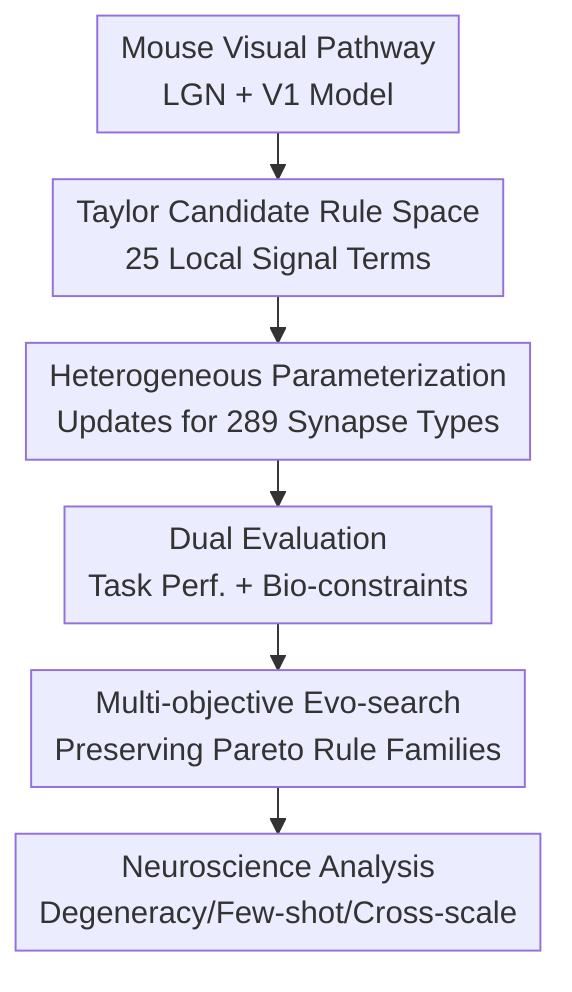

# Discovering heterogeneous synaptic plasticity rules via large-scale neural evolution

**Conference**: ICLR2026  
**OpenReview**: [https://openreview.net/forum?id=hJBPMSUNUG](https://openreview.net/forum?id=hJBPMSUNUG)  
**Code**: None  
**Area**: Computational Neuroscience / Synaptic Plasticity  
**Keywords**: Heterogeneous synaptic plasticity, evolutionary search, Mouse V1, working memory, biological plausibility  

## TL;DR

This paper constructs the mouse primary visual cortex (V1) as a plastic spiking neural network. By utilizing a multi-objective evolutionary algorithm to search for individual learning rules for different synapse types within a vast interpretable rule space composed of spikes, eligibility traces, and reward prediction error signals, researchers discovered that various mathematically distinct rules can simultaneously maintain biological plausibility, visual change detection capabilities, few-shot adaptability, and generalization across network scales.

## Background & Motivation

**Background**: Synaptic plasticity is generally regarded as the underlying mechanism for learning and memory. Classical theories have evolved from Hebbian learning, BCM, and Oja’s rule to STDP, focusing on how neuronal activity leads to changes in synaptic weights. Experimental neuroscience has revealed that plasticity rules vary across different synapse types, excitatory/inhibitory cells, brain regions, and neuromodulatory states.

**Limitations of Prior Work**: The collective behavior within real cortical circuits is difficult to explain using rules derived from single synapses or small-scale networks. A real V1 contains multiple cell types, interlaminar connections, and excitatory/inhibitory pathways, where different synapse types may follow different rules. Prior computational work often searched for a unified rule in small artificial networks or only roughly distinguished between excitatory and inhibitory synapses, failing to systematically explore how "families of heterogeneous rules" jointly produce behavior.

**Key Challenge**: There is a conflict between strong constraints from biological experiments (firing rates, firing distributions, Dale's principle, synaptic weight ranges) and functional goals (the network must perform visual change detection, form working memory-like delay activity, and achieve few-shot learning). If only task accuracy is pursued, the search might find biologically nonsensical solutions; if only biological statistics are mimicked, the network may lack behavioral capability.

**Goal**: The authors aim to answer not "which single plasticity rule is best," but "in a circuit close to the real mouse V1, which mathematically structured heterogeneous synaptic plasticity rules can produce functional behavior without deviating from biological constraints." This requires defining an interpretable candidate rule space, a scalable search algorithm, dual evaluation metrics (task and biological), and neuroscientific interpretations of the results.

**Key Insight**: The paper treats Darwinian evolution as the search mechanism: a population maintains many candidate rules simultaneously, using multi-objective selection to preserve rules with high task performance, low complexity, and closer alignment with biological statistics, while generating new rules via crossover and mutation. This approach is suitable for studying "rule families" and Pareto trade-offs rather than forcing a single point solution via gradient optimization.

**Core Idea**: Use truncated Taylor expansion to combine local neural signals into an interpretable synaptic plasticity rule space, then employ large-scale multi-objective evolutionary search in a biologically realistic V1 model to discover a set of functionally equivalent but mathematically distinct heterogeneous plasticity rules.

## Method

### Overall Architecture

The methodology follows four steps: fix a mouse V1 spiking network with LGN input pathways; define candidate plasticity rules for 289 types of synapses formed between 17 neuron types; train and validate each rule for visual change detection while measuring task performance and biological statistics; and finally use a noise-aware multi-objective evolutionary algorithm to search for Pareto-optimal rule families in a parameter space of approximately 2645 dimensions.

The key is not training V1 like a standard neural network, but treating the "learning algorithm itself" as the object of evolution. Each candidate individual is a complete set of heterogeneous plasticity rules: different synapse types can have different coefficients, and neuron types can have different time constants for eligibility and reward traces. During evaluation, V1 weights are updated online according to the rule; during validation, plasticity is disabled to check if the network truly learned the change detection capability.

### Key Designs

**1. Taylor Candidate Rule Space: Restricting plasticity search to interpretable combinations of local signals**

Allowing the algorithm to generate learning rules freely would result in an uninterpretably large search space and likely produce black-box updates lacking neuroscientific meaning. The authors start with five types of local signals: presynaptic spikes $S_{pre}$, postsynaptic spikes $S_{post}$, presynaptic eligibility traces $X_{pre}$, postsynaptic eligibility traces $X_{post}$, and reward prediction error traces $R$. Eligibility traces record recent neural activity history, and the reward prediction error trace simulates neuromodulatory signals. Thus, rule inputs correspond to discussable variables in real nervous systems.

Candidate terms are generated via third-order truncated Taylor expansion:

$$
P = \{ \prod_{j=1}^{q} u_j \mid u_j \in \{S_{pre}, S_{post}, X_{pre}, X_{post}, R\}, q \le 3 \}.
$$

Redundant and meaningless terms (e.g., $S_{pre}^2=S_{pre}$, $R^2$ is removed) are deleted, resulting in 25 candidate plasticity terms. Each synaptic rule is a gated weighted sum of these terms:

$$
\Delta W^{(m_{pre},m_{post})} = \sum_{k=1}^{N_P} g_k c_{k,(m_{pre},m_{post})} P_k.
$$

Here, $g_k\in\{0,1\}$ controls whether a term is active, and $c_{k,(m_{pre},m_{post})}$ is the coefficient for the corresponding synapse type. This design allows the space to contain simple presynaptic-only rules, eligibility trace interactions, reward modulation, and high-order combinations, while ensuring each discovered rule remains mathematically transparent.

**2. Heterogeneous Parametrization: Allowing different cell-type connections to possess distinct learning mechanisms**

The paper utilizes the biologically realistic mouse V1 model constructed by Billeh et al., including 17 types of neurons: excitatory cells and inhibitory categories like Pvalb, Sst, and Htr3a across different cortical layers. Connections between these 17 types result in $17^2=289$ synapse types. Rather than assuming a shared rule, different $m_{pre}\rightarrow m_{post}$ connections are allowed unique coefficients.

Heterogeneity also extends to time constants. Eligibility traces decay exponentially:

$$
X_i(t+\Delta t)=X_i(t)-\frac{\Delta t}{\tau_E^m}X_i(t)+S_i(t),
$$

while reward prediction errors are constructed using the mean reward of the last $N_{win}=20$ trials, giving $\delta_R(l_i)=r(l_i)-\bar r(l_i)$, which forms a reward trace via neuron-type-specific $\tau_R^m$. This aligns with biological observations that reward events have heterogeneous persistent effects across different neuronal populations.

The total parameter count reaches 2645, including neuron-type coefficients, synapse-type coefficients, 25 binary gates, time constants, and readout thresholds. Constraints such as Dale's principle, synapse-specific weight bounds, and adaptive scaling (to prevent weight explosion or sign flipping) are applied.

**3. Dual Evaluation Metrics: Using task performance and biological plausibility to filter rules**

Each candidate rule is evaluated within the V1 model. Visual stimuli pass through fixed retina/LGN pathways into the plastic V1; the readout layer consists of L5 excitatory neurons. The task is visual change detection using gratings and ImageNet natural images. Evaluation starts with 100 training trials (plasticity on), followed by validation/testing trials (plasticity off) to check if internal states support 1-back change detection.

Evaluation goes beyond accuracy. Six objectives are used: maximizing cross-domain accuracy, and minimizing rule complexity, maximum firing rate, synchrony ratio, mean firing rate deviation from mouse data, and Wasserstein distance of firing distributions from mouse data. This prevents "pseudo-solutions" like global synchrony bursts.

**4. Noise-Aware Multi-objective Evolution: Preserving reliable rule families in expensive, stochastic spaces**

Evaluating a rule requires simulating V1 from scratch, which is noisy due to random seeds and stimuli. Rules involve binary gates, discrete spikes, and hard constraints, making gradient optimization difficult. The authors designed a parallel evolutionary framework using EvoX/JAX, maintaining 4000 rules over 150 generations utilizing 8 A6000 GPUs.

The reproduction stage uses a Competitive Swarm Optimizer-like mechanism: individuals are paired, compared on random objectives to designate a teacher and student, and the student updates toward the teacher and swarm center. Selection maintains objective means and variances, using probabilistic dominance relations for non-dominated sorting to handle evaluation noise reliably.

### A Complete Example

An evaluation of a candidate rule proceeds as follows: an individual selects 5 active terms. For example, the best overall rule takes the form:

$$
\Delta w = X_{post}+S_{pre}X_{pre}+S_{post}X_{pre}+X_{post}^2+X_{post}R.
$$

During grating change detection, the network receives visual stimuli. In the first 100 trials (training), if a stimulus changes and the L5 readout exceeds a threshold, a reward is given. This reward is compared to the moving average to form $\delta_R$, which affects synapse updates via the reward term. Meanwhile, spikes accumulate into $X_{pre}$ or $X_{post}$, making updates dependent on recent activity history.

In the validation phase, plasticity is disabled. If the rule is effective, V1 maintains appropriate persistent activity between the stimulus window and delay period, allowing the readout to distinguish "change" from "no-change" while satisfying firing rate and synchrony constraints.

### Loss & Training

A single loss function is not used; instead, rule search is framed as multi-objective optimization:

$$
\min F(\theta)=(f_1(\theta),\ldots,f_{N_o}(\theta)), \quad \theta\in\Omega_\theta,
$$

where $\theta=\{c,g,\tau_E,\tau_R\}$ and $\phi$ is the shared readout threshold. Coefficients $c\in[-1,1]$, gates $g\in\{0,1\}$, and time constants are in $(0,150]$. In comparisons with Adam/SGD baselines, the authors use surrogate gradients and BPTT on the same V1, incorporating biological metrics as regularization terms.

## Key Experimental Results

### Main Results

| Evaluation Item | Ours (Representative) | Comparison / Reference | Conclusion |
|-----------------|----------------------|------------------------|------------|
| Search Scale | Pop. 4000, 150 gens | Random sampling of 3000 rules mostly near chance | High-dim rule space is non-trivial; requires systematic search |
| Final Selection | 70 rules from Pareto pop | Original population contains dominated rules | Multi-objective constraints yield rules balancing task & biology |
| Most Common Rule | $\Delta w=S_{pre}$ (approx. 48.57%) | Complex rules are not the only solution | Simple presynaptic-dependent rules can produce function |
| Best Overall Rule | $\Delta w=X_{post}+S_{pre}X_{pre}+S_{post}X_{pre}+X_{post}^2+X_{post}R$ | Higher complexity but highest accuracy | Reward modulation + eligibility trace combinations boost perf |
| Behavioral Ref. | Acc. comparable to mouse behavior | Mouse: grating ~60%, natural image ~73% | Search results fall within biologically realistic ranges |

| Method / Rule | Grating / Natural Image Detection | Sample Efficiency | Biological Constraints |
|-----------|-------------------------------|----------|----------|
| 3 Evo Rule Classes | High test acc within 100 training trials | ~5000x fewer samples than Adam on gratings | Explicitly constrained firing rates and synchrony |
| Adam + surrogate grad | Requires massive samples to match Evo rules | High data demand | Biological metrics added as regularization |
| SGD baseline | Fails to converge across learning rates | Significantly weaker than Adam | Limited by training budget |

### Ablation Study

| Configuration / Analysis Object | Key Metric | Description |
|----------------|----------|------|
| Random Sampling | Obj-1 Mean 0.503, Best 0.685 | Most random rules are near chance; good rules are rare |
| Most Common $\Delta w=S_{pre}$ | Task Avg 65.19, Complexity 0.04 | Simple, reward-free, presynaptic-only rules account for half; non-Hebbian mechanisms are valid |
| 2nd Best $\Delta w=S_{pre}X_{post}$ | Task Avg 63.91 | Eligibility traces maintain simplicity with different structure |
| Best Overall Rule | Task Obj 71.86, Max Rate 115.63 | Highest accuracy, complex form including reward modulation |
| Long-term Training | Stable beyond 100 trials | Suggests homeostatic properties, though some rules eventually degrade |
| Cross-scale Test | Performance held from 1000 to 5000 neurons | Rules did not overfit to the 3000-neuron search scale |

### Key Findings

- Mathematically distinct rules can produce similar visual change detection behavior, supporting "computational degeneracy": biological systems do not rely on a single "correct" formula but utilize multiple functionally equivalent implementations.
- Surprisingly, reward-free rules performed well in reward-required tasks. Specifically, $\Delta w=S_{pre}$ (presynaptic-only) was highly prevalent, challenging intuitions that only Hebbian coincidence or reward modulation can explain memory formation.
- The best representative rules induced persistent firing during delay periods, a signature of working memory, while maintaining heavy-tailed firing rate distributions.
- Unlike Adam, evolution embeds inductive biases into the plasticity rules themselves, allowing the network to express behaviors with minimal experience, providing a synaptic-level explanation for innate abilities.

## Highlights & Insights

- **Plasticity search as an interpretable scientific tool**: The Taylor expansion approach allows results to be written as clear $\Delta w$ formulas rather than black-box meta-learners, facilitating dialogue with existing concepts like STDP and RPE.
- **Heterogeneity as a core feature**: Allowing 289 synapse types to have different coefficients and neuron types to have unique time constants reflects cortical reality and explains how similar behaviors emerge from varied local mechanisms.
- **Multi-objective evaluation avoids "pseudo-biological" solutions**: By enforcing constraints on firing rates and distributions during search, the framework prevents solutions that achieve task accuracy via biologically impossible dynamics.
- **Rule families vs. single winners**: Analyzing the Pareto frontier reveals that conflicting experimental results in neuroscience might actually observe different rules that are functionally equivalent.
- **New perspective on innate ability**: Evolutionary search suggests that innate behavior might be stored not just in "hard-wired" circuits but in "pre-configured plasticity mechanisms" that allow rapid adaptation with minimal experience.

## Limitations & Future Work

- **Signal limitations**: Signals are currently limited to spikes, eligibility traces, and RPE, excluding current weights, voltages, or dendritic states.
- **System scope**: Experiments were limited to mouse V1; validation in auditory, hippocampal, or motor systems is required.
- **Time scales**: The model primarily addresses millisecond-scale plasticity; second-scale mechanisms like behavioral-timescale synaptic plasticity (BTSP) are not yet included.
- **Dynamic similarity**: Biological similarity was based on firing rates and synchrony; more detailed dynamics-based analyses (manifolds, Koopman spectrum) are needed.
- **Computational cost**: High costs (8 A6000 GPUs) remains a barrier for scaling to more complex brain regions.
- **Long-term stability**: Some rules degrade over very long training periods; future work could incorporate homeostasis directly into the evolutionary objectives.

## Related Work & Insights

- **Vs. Manual Rules (STDP, etc.)**: Unlike designing formulas based on specific experiments, this method defines a signal space and discovers rules via task and biological constraints.
- **Vs. Data-driven Inference**: While others infer rules from observations, this work is generative, looking for rules that produce both behavior and biological statistics.
- **Vs. Meta-learning**: Unlike meta-learning in small/simplified networks, this work uses an experimental-scale V1 model with massive heterogeneity.
- **Vs. SNN Surrogate Training**: Whereas BPTT uses global errors and massive data, these evolved local rules allow rapid adaptation using minimal trials, acting as an evolutionary prior.

## Rating

- Novelty: ⭐⭐⭐⭐⭐ 
- Experimental Thoroughness: ⭐⭐⭐⭐☆ 
- Writing Quality: ⭐⭐⭐⭐☆ 
- Value: ⭐⭐⭐⭐⭐ 

<!-- RELATED:START -->

## Related Papers

- [\[ICLR 2026\] Distilling Causal Signals for One-Shot Directed Evolution of Antibodies](distilling_causal_signals_for_one-shot_directed_evolution_of_antibodies.md)
- [\[NeurIPS 2025\] EDBench: Large-Scale Electron Density Data for Molecular Modeling](../../NeurIPS2025/computational_biology/edbench_large-scale_electron_density_data_for_molecular_modeling.md)
- [\[ICLR 2026\] Fast Proteome-Scale Protein Interaction Retrieval via Residue-Level Factorization](fast_proteome-scale_protein_interaction_retrieval_via_residue-level_factorizatio.md)
- [\[ICLR 2026\] Hierarchical Multi-Scale Molecular Conformer Generation](hierarchical_multi-scale_molecular_conformer_generation.md)
- [\[ICLR 2026\] Continuous Multinomial Logistic Regression for Neural Decoding](continuous_multinomial_logistic_regression_for_neural_decoding.md)

<!-- RELATED:END -->
