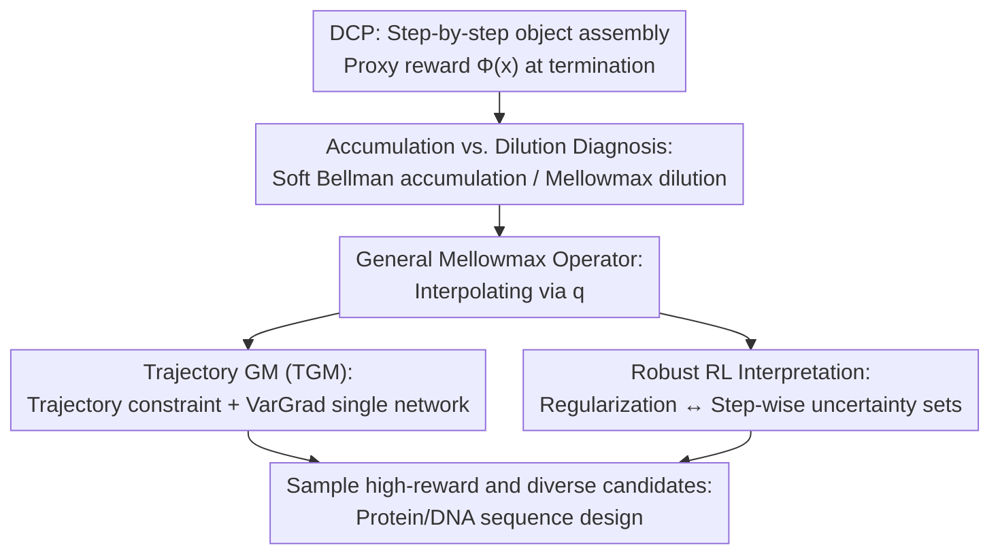

# Discrete Compositional Generation via General Soft Operators and Robust Reinforcement Learning

**Conference**: ICLR2026  
**OpenReview**: [https://openreview.net/forum?id=MGWk2tEgLW](https://openreview.net/forum?id=MGWk2tEgLW)  
**Code**: https://github.com/marcojira/tgm  
**Area**: Reinforcement Learning / Generative Flow Networks  
**Keywords**: GFlowNet, Discrete Compositional Generation, Regularized RL, Robust RL, mellowmax operator, Scientific Discovery

## TL;DR
To address the issue where reward-proportional sampling in GFlowNets is overwhelmed by a massive number of sub-optimal objects in exponentially large search spaces, this paper proposes a general mellowmax operator that unifies soft Bellman, mellowmax, and soft mellowmax (interpolating between "accumulation" and "dilution" biases via parameter $q$). Based on this, it derives TGM, a simple trajectory-level algorithm that identifies higher-reward yet diverse candidates in real biological sequence design tasks (DNA/Protein) compared to GFN/PPO/SAC.

## Background & Motivation
**Background**: The core of scientific discovery (finding new proteins, molecules, or DNA sequences) involves screening a small set of promising candidates from an **exponentially large** discrete set. These objects are inherently compositional—proteins are sequences of amino acids, and molecules are assemblies of fragments—thus they can be modeled as a **Discrete Compositional Process (DCP)**: tokens are added step-by-step from an empty string until termination, where a proxy reward model $\Phi(x)$ (e.g., a transformer predicting binding affinity or fluorescence) provides the reward. By viewing this as an MDP, RL can be used to learn a sampler. **GFlowNet (GFN)** is particularly successful as its optimal policy samples objects $x$ with probability proportional to $e^{\beta\Phi(x)}$ and has theoretical links to maximum entropy RL, ensuring candidate diversity.

**Limitations of Prior Work**: This paper identifies that the "reward-proportional sampling" objective of GFN **fails in exponentially large spaces**. The issue is that the sampling probability of a few high-reward objects is submerged by the sum of probabilities of a massive number of low-reward objects generated by **combinatorial explosion**. The paper provides a clear counter-example: in a sequence task with vocabulary size $B$ and max length $d$, if the sampler reaches an optimal sequence $s^*$ of length $n<d$, it must decide whether to terminate or continue. Continuing can generate $\Omega(B^{d-n})$ sequences prefixed by $s^*$. As long as these have non-zero rewards, the termination probability $\pi(x^*\mid s) \le e^{\Phi(x^*)}/(c_r \cdot B^{d-n})$ will **decay exponentially** as $d-n$ increases. Figure 2 shows that almost all random objects in real tasks have non-negligible rewards, indicating this is a widespread phenomenon.

**Key Challenge**: The root cause lies in the sampling objective itself. From a dynamic programming perspective, GFN is equivalent to repeatedly applying the **soft Bellman operator** (logsumexp over Q-values). As values accumulate from leaves to the root, the values of numerous sub-optimal objects **accumulate**, overwhelming single high-reward objects. Conversely, using the **mellowmax operator** (logmeanexp over Q-values) leads to **dilution**, where the value of a deep high-reward object is diluted by the average of shallow branches. Neither extreme can resist both accumulation and dilution simultaneously.

**Goal**: To find an operator that flexibly balances quality vs. diversity and resists both accumulation and dilution, allowing the sampling distribution to be "peakier" around high-reward objects without losing diversity.

**Key Insight**: A unified regularization framework is used to **interpolate** between soft Bellman, mellowmax, and soft mellowmax (general mellowmax), using parameter $q$ to find a middle ground. This is developed into a practical trajectory-constrained algorithm, TGM. Finally, a **Robust RL interpretation** is provided: regularization is equivalent to robustness against compositional uncertainty, specifically the discrepancy between the proxy reward and the true reward.

## Method

### Overall Architecture
The paper aims to learn a sampler for DCP that concentrates on high-reward objects without collapsing to a single point. The logic follows three steps: **diagnose** why existing soft RL operators fail (the accumulation-dilution dilemma), **unify and interpolate** a general mellowmax operator to mechanistically suppress both biases, and **implement a practical algorithm, TGM** (trajectory constraints + VarGrad single-network training). Finally, it interprets GFN regularization as "unhealthy" and GM-induced uncertainty sets as more reasonable from a **Robust RL** perspective.

### Key Designs

**1. Accumulation/Dilution Diagnosis: Quantifying operator quality via deviation from max Q-value**

To compare operators, the paper defines the difference between the state value after applying operator $T$ and the Q-value of the optimal action as $\Delta^T_s := Tv_s - \max_{a\in Ch(s)} Q(s,a)$. This is split into two non-negative terms: **Accumulation** $\mathrm{Acc}^T(s):=\max(\Delta^T_s, 0)$ and **Dilution** $\mathrm{Dil}^T(s):=\max(-\Delta^T_s, 0)$. These represent how much the operator inflates or deflates the state value. An ideal operator should keep **both small**—not inflated by sub-optimal objects (which masks high-reward ones) nor deflated by averaging (which loses signals from deep good objects). Three classic operators are mapped: Soft Bellman $T^{SB}v_s = \frac{1}{\omega}\,\mathrm{logsumexp}(\omega Q_s)$ is pure accumulation; mellowmax $T^{MM}v_s = \frac{1}{\omega}\log\sum_a \frac{1}{|Ch(s)|}e^{\omega Q_s(a)}$ is pure dilution; soft mellowmax $T^{SMM}v_s=\frac{1}{\omega}\log\langle\mathrm{softmax}(\alpha Q_s), e^{\omega Q_s}\rangle$ is intermediate but still biased.

**2. General Mellowmax Operator: Interpolating three soft operators via $q$**

The paper unifies these operators through the lens of **regularized MDPs**: Soft Bellman corresponds to Shannon entropy regularization, while mellowmax/soft mellowmax correspond to $\mathrm{KL}(\pi_s, d_s)$ regularization ($d_s$ being uniform or $\mathrm{softmax}(\alpha Q_s)$). An **interpolated regularizer** is defined:

$$\Omega^q_{d_s}(\pi_s) := \frac{1}{\omega}\big[\,q\,\mathrm{KL}(\pi_s, d_s) + (1-q)\,(-H(\pi_s))\,\big],\quad q\in[0,1]$$

It slides via $q$ between entropy regularization (encouraging diversity) and alignment with $\mathrm{softmax}(\alpha Q_s)$ (aligning with high Q-values). With $d_s=\mathrm{softmax}(\alpha Q_s)$, the corresponding operator is derived as:

$$\Omega^{q,*}_\alpha(Q_s) = \frac{1}{\omega}\log\big\langle \mathrm{softmax}(\alpha Q_s)^q,\ e^{\omega Q_s}\big\rangle$$

This **gracefully unifies the three operators**: $q=0$ recovers the entropy/GFN operator, $q=1$ yields soft mellowmax, and further setting $\alpha=0$ yields mellowmax. The key benefit is that for $q\in(0,1)$, it produces **small amounts** of both accumulation and dilution rather than extreme bias. Table 1 proves that for $q\in(0,1)$, the worst-case bound $|\Delta^T_s|=\max\{\mathrm{Acc}, \mathrm{Dil}\}$ is **strictly smaller** than the other three, allowing the sampling distribution to focus more sharply on high-reward objects.

**3. Trajectory General Mellowmax (TGM): A practical trajectory-level single-network algorithm**

To address credit assignment in DCP tasks where rewards only appear at the end, the paper derives an **equivalent trajectory constraint** (Theorem 4.1). Satisfying this constraint ensures that $\mathrm{softmax}([\alpha q+\omega]Q^\theta)$ is the optimal policy for the regularized problem. The implementation makes three engineering choices: (1) Setting $d_s=\mathrm{softmax}(\alpha Q_s)$ so the framework works on-policy and off-policy without a separate $d_s$; (2) Satisfying the trajectory constraint to inherit GFN's credit assignment advantages; (3) Training a **single** Q-network $Q^\theta$ using a VarGrad objective. The final loss is:

$$\mathcal{L}_{\mathrm{TGM}}(\tau) = \mathrm{Var}\Big[\tfrac{1}{\omega}\sum_{i=0}^{n}\big(\log\sigma_{q\alpha+\omega}[Q^\theta_{s_i}(a_i)] - q\log\sigma_\alpha[Q^\theta_{s_i}(a_i)]\big) - \beta r(x)\Big]$$

where $\sigma_t$ is the softmax with inverse temperature $t$. The algorithm is minimal, transformer-friendly, and **exactly reduces to GFN training** when $q=0, \omega=1$.

**4. Robust RL Interpretation: Regularization as robustness to step-wise proxy reward uncertainty**

The final theoretical piece justifies the effectiveness. Since the proxy reward $\Phi$ is not the true reward $r^*$, there is a discrepancy $\delta$. Choosing candidates can be viewed as robust optimization $\max_{p}\min_{\delta\in R} \mathbb{E}_{x\sim p}[\Phi(x)+\delta(x)]$. While traditional DCP considers uncertainty only at termination, this paper **decomposes uncertainty into every step** of the generation process. Using a Fenchel–Robust MDP theorem, the regularization operator is shown to be equivalent to the value function of a robust operator with a "step-wise uncertainty set." This explains Figure 3: **entropy/GFN regularization sets never contain the proxy reward $\Phi(x)$** (they are only robust to "increases" in reward and vulnerable to overestimation in multi-step DCPs); conversely, GM's set contains values near $\Phi(x)$ and is robust to reward decreases, providing a more meaningful notion of uncertainty.

### Loss & Training
The training target is the VarGrad loss $\mathcal{L}_{\mathrm{TGM}}$, which minimizes the variance of the "accumulated log-policy correction minus $\beta r(x)$" along a trajectory. Three hyperparameters are used: $q\in[0,1]$ controls the accumulation-dilution trade-off, $\alpha$ controls the bias toward high Q-value actions, and $\omega$ controls regularization strength (related to sampling temperature). Experiments fixed $\alpha=1$ and searched $\omega\in\{1,4,16\}$, $\beta\in\{4,16,64,256\}$, and learning rates $\{10^{-5},10^{-4},10^{-3}\}$. The optimal policy $\mathrm{softmax}([\alpha q+\omega]Q^\theta)$ is derived in closed form from $Q^\theta$.

## Key Experimental Results

### Main Results
In three biological sequence design tasks, the **average mode reward** (top $k=100$ candidates with pairwise distance $\ge\delta$ after temperature sweeping) is reported:

| Task (Space Size) | SAC | PPO | GFN (=TGM $q{=}0$) | TGM Best Variant | Val Set Max |
|------------------|-----|-----|---------------------|--------------|-----------|
| UTR ($4^{50}$) | 3.46 | 4.12 | 4.19 | **4.27** ($q{=}0.75$) | 4.26 |
| AMP (Variable length $\sim20^{60}$) | 9.79 | 10.04 | 10.13 | **10.43** ($q{=}0.75$) | 9.96 |
| GFP ($20^{237}$) | 0.66 | 1.90 | 2.44 | **2.95** ($q{=}0.25$) | 3.63 |

TGM variants **match or exceed** GFN/PPO/SAC in all tasks. The gap is most significant in the largest space (GFP), where TGM improves by ~21% over GFN, supporting the claim that TGM benefits more as search space grows.

### Ablation Study

| Config | Phenomenon | Description |
|------|------|------|
| $q=0$ (GFN) | Large accumulation bias, less peaky sampling | Lags behind significantly in large spaces like GFP. |
| $q\in(0,1)$ | Small accumulation & dilution; lowest worst-case $|\Delta^T_s|$ | Best variants for all tasks fall in this interval. |
| $q=1$ (Soft mellowmax) | Dilution bias | Smallest variance on AMP, but not universally optimal. |
| TF-Bind-8 ($4^8$) | TGM shifts mass to high-reward deciles | Directly validates that increasing $q$ makes sampling peakier. |
| Bit sequence ($2^{120}$) | $q{>}0$ finds more modes and stays closer to them | Increased peakiness does not damage diversity. |

### Key Findings
- **Optimal $q$ varies by task but usually falls in $(0,1)$**: UTR/AMP prefer $q{=}0.75$, while GFP prefers $q{=}0.25$, indicating that interpolation itself is the value.
- **Larger spaces lead to larger gains**: GFP represents the most significant improvement, addressing the motivation that GFN underestimates high-reward candidates in exponential spaces.
- **Peakiness does not sacrifice diversity**: On bit sequences, $q{>}0$ finds more modes and higher quality, showing it does not simply collapse to a single point.
- **Hyperparameter Robustness**: TGM variants consistently outperform GFN across hyperparameter grids.

## Highlights & Insights
- **Unity via a single knob**: Unifying soft Bellman, soft mellowmax, and mellowmax using $q$ provides a continuous design space to balance the accumulation-dilution contradiction.
- **Quantifying sampling bias**: Using $\mathrm{Acc}/\mathrm{Dil}$ and worst-case $|\Delta^T_s|$ bounds provides theoretical guarantees for why GM is better.
- **Robust RL interpretation**: By showing GFN’s uncertainty set fails to contain the proxy reward, the paper provides a全新 theoretical reason for why deviating from reward-proportional sampling is necessary.
- **Backward compatibility**: TGM reduces to GFN at $q=0$, allowing it to work with existing GFN tricks like temperature conditioning with minimal migration cost.

## Limitations & Future Work
- **Additional Hyperparameters**: Optimal $q$ is task-dependent, necessitating a search; the role of $\alpha$ was not fully explored.
- **Theoretical limits**: Analysis is primarily focused on DAG/tree structured DCPs; behavior in general DAGs with many recombining paths is less detailed.
- **Upper bound by proxy quality**: The method maximizes the proxy $\Phi$; if $\Phi$ is poor, even robust sampling is limited.
- **In-silico evaluation**: Lacks wet-lab validation for true biological activity.

## Related Work & Insights
- **vs. GFlowNet (Trajectory Balance)**: GFN aims for $p(x)\propto e^{\beta\Phi(x)}$; Ours shows this is overwhelmed in exponential spaces and replaces the soft Bellman operator.
- **vs. Temperature-conditioned GFN**: These use conditional policies to counter oversmoothing; Ours intervenes at the operator level. The two are **complementary**.
- **vs. Soft Mellowmax / Mellowmax**: These were not previously used for DCP; Ours generalizes them with trajectory constraints.
- **vs. Diffusion / PPO / SAC**: Standard RL suffers from credit assignment in DCP; trajectory constraints bridge this gap.

## Rating
- Novelty: ⭐⭐⭐⭐⭐ Unifying three soft RL operators via $q$ with an original Robust RL interpretation.
- Experimental Thoroughness: ⭐⭐⭐⭐ Solid coverage across synthetic and real biological tasks with hyperparameter sweeps; however, strictly in-silico.
- Writing Quality: ⭐⭐⭐⭐⭐ Clear motivation, well-structured derivation, and good intuition.
- Value: ⭐⭐⭐⭐ Plug-and-play超集 for GFN with high practical utility for scientific discovery.

<!-- RELATED:START -->

## Related Papers

- [\[ICLR 2026\] Ultra-Fast Language Generation via Discrete Diffusion Divergence Instruct](ultra-fast_language_generation_via_discrete_diffusion_divergence_instruct.md)
- [\[NeurIPS 2025\] Self Iterative Label Refinement via Robust Unlabeled Learning](../../NeurIPS2025/computational_biology/self_iterative_label_refinement_via_robust_unlabeled_learning.md)
- [\[ICLR 2026\] FragFM: Hierarchical Framework for Efficient Molecule Generation via Fragment-Level Discrete Flow Matching](fragfm_hierarchical_framework_for_efficient_molecule_generation_via_fragment-lev.md)
- [\[ICLR 2026\] Discrete Diffusion Trajectory Alignment via Stepwise Decomposition](discrete_diffusion_trajectory_alignment_via_stepwise_decomposition.md)
- [\[ICML 2025\] Improved Off-policy Reinforcement Learning in Biological Sequence Design](../../ICML2025/computational_biology/improved_off-policy_reinforcement_learning_in_biological_sequence_design.md)

<!-- RELATED:END -->
