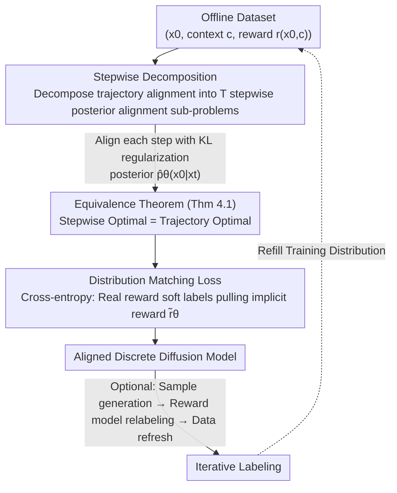

# Discrete Diffusion Trajectory Alignment via Stepwise Decomposition

**Conference**: ICLR2026  
**arXiv**: [2507.04832](https://arxiv.org/abs/2507.04832)  
**Code**: [hanjq17/discrete-diffusion-sdpo](https://github.com/hanjq17/discrete-diffusion-sdpo)  
**Area**: Computational Biology  
**Keywords**: discrete diffusion, preference optimization, RLHF, trajectory alignment, stepwise decomposition  
**Authors**: Jiaqi Han, Austin Wang, Minkai Xu, Wenda Chu, Meihua Dang, Haotian Ye, Huayu Chen, Yisong Yue, Stefano Ermon (Stanford, Caltech, Tsinghua)  

## TL;DR

Ours proposes SDPO (Stepwise Decomposition Preference Optimization), which decomposes the trajectory alignment problem of discrete diffusion models into stepwise posterior alignment sub-problems. This avoids the difficulty of backpropagating gradients through the entire denoising chain and significantly outperforms existing methods in DNA sequence design, protein inverse folding, and language modeling.

## Background & Motivation

Discrete diffusion models have shown great potential in modeling sequential data, covering areas such as DNA sequence design, protein inverse folding, and text generation. However, how to perform reward alignment on pre-trained discrete diffusion models, similar to RLHF in large language models, remains an unsolved core issue.

**Limitations of Prior Work**:

1.  **Gradient backpropagation difficulty due to discreteness**: The sampling chain of discrete diffusion models consists of sequence-level discrete random variables. Rewards are typically defined only on the final clean sequence $\mathbf{x}_0$, making gradient backpropagation through the entire denoising chain extremely computationally expensive and unstable.
2.  **Imprecise likelihood calculation**: When aligning the joint distribution $p_\theta(\mathbf{x}_{0:T})$ of the entire trajectory, precisely calculating likelihoods and evaluating rewards is infeasible, leading to suboptimal performance.
3.  **High online RL sampling cost**: The chained sampling of discrete diffusion causes online RL methods (e.g., DRAKES, diffu-GRPO) to require expensive online sampling for every training step.

## Core Problem

How to design an efficient offline preference optimization method that allows for precise likelihood and reward calculation, is compatible with arbitrary reward functions, and effectively aligns pre-trained discrete diffusion models?

## Method

### Overall Architecture

SDPO (Stepwise Decomposition Preference Optimization) aims to align a pre-trained discrete diffusion model with a specific reward, similar to LLM RLHF, without being hindered by its discrete chained sampling. The challenge lies in the fact that rewards are defined only on the final clean sequence $\mathbf{x}_0$, whereas the optimization target is the entire denoising trajectory $p_\theta(\mathbf{x}_{0:T})$. Direct backpropagation through this chain of discrete variables is costly and unstable, and likelihoods cannot be computed accurately.

The **Core Idea** of SDPO is "divide and conquer": instead of directly optimizing the joint distribution $p_\theta(\mathbf{x}_{0:T})$, it **decomposes it into $T$ stepwise alignment sub-problems**. Each sub-problem at diffusion step $t$ aligns the factorized posterior $\hat{p}_\theta(\mathbf{x}_0|\mathbf{x}_t)$ with the reward using KL regularization. This decomposition is valid based on an equivalence theorem: the concatenation of the optimal solutions to these sub-problems is precisely the optimal solution to the original trajectory alignment objective. With this guarantee, training reduces to a **distribution matching cross-entropy loss** for each step's posterior, which is entirely offline and requires no online sampling. Optionally, it can follow with **iterative labeling**—generating new samples from the current model, relabeling with the reward model, and refreshing the dataset—to push the training distribution toward high-reward regions.

### Key Designs

**1. Stepwise Decomposition: Dimensionality reduction from trajectory-level alignment to precisely calculable stepwise posterior alignment**

Since rewards in discrete diffusion are only defined on the clean sequence $\mathbf{x}_0$, backpropagating this to the entire denoising chain is expensive and unstable. Furthermore, calculating expectations over the joint distribution $p_\theta(\mathbf{x}_{0:T})$ is imprecise. SDPO bypasses this by solving a KL-regularized alignment sub-problem for each diffusion step $t$ individually: $\max_{\hat{p}_\theta} \mathbb{E}_{\hat{p}_\theta(\mathbf{x}_0|\mathbf{x}_t,\mathbf{c})}[r(\mathbf{x}_0,\mathbf{c})] - \beta_t D_{\mathrm{KL}}[\hat{p}_\theta(\mathbf{x}_0|\mathbf{x}_t,\mathbf{c}) \| \hat{p}_{\mathrm{ref}}(\mathbf{x}_0|\mathbf{x}_t,\mathbf{c})]$, where the posterior is approximated via factorization $\hat{p}_\theta(\mathbf{x}_0|\mathbf{x}_t,\mathbf{c})=\prod_{i=1}^L \hat{p}_\theta(\mathbf{x}_0^{(i)}|\mathbf{x}_t,\mathbf{c})$. As a result, the posterior at each step directly predicts the clean sequence, allowing likelihoods to be calculated efficiently and precisely. Rewards act directly on $\mathbf{x}_0$ without requiring biased estimation of latent variables, making it naturally compatible with arbitrary reward functions beyond simplified models like Bradley-Terry.

**2. Equivalence Theorem: Proof that stepwise optimality implies trajectory optimality**

Decomposing a trajectory raises concerns about whether local optima equal the global optimum. Theorem 4.1 provides the guarantee: the joint distribution $p^*(\mathbf{x}_{0:T})$ induced by the optimal solutions to each step's sub-problem $\{\hat{p}^*(\mathbf{x}_0|\mathbf{x}_t)\}_{t=1}^T$ is also the optimal solution to the original trajectory alignment objective—under the condition that the chain reward is defined as the sum of rewards at each step $\hat{r}(\mathbf{x}_{0:T})=\beta\sum_{t=1}^T r_t(\mathbf{x}_{t-1};\mathbf{x}_t)$. This theorem elevates "stepwise optimization" from an engineering heuristic to a theoretically grounded equivalent replacement, ensuring the decomposed training does not sacrifice final alignment quality while providing finer-grained guidance per step than trajectory-level supervision.

**3. Distribution Matching Loss: Pulling the model posterior toward the reward-weighted target distribution via cross-entropy**

With the stepwise sub-problems defined, a directly optimizable target is needed. SDPO converts each step's alignment into distribution matching, where the final loss takes a cross-entropy form:

$$\mathcal{L}(\theta) = -\mathbb{E}_{t,\mathbf{c},\mathbf{x}_0,q(\mathbf{x}_t|\mathbf{x}_0)} \sum_{i=1}^N \left( \frac{\exp(r(\mathbf{x}_0^{(i)},\mathbf{c}))}{\sum_j \exp(r(\mathbf{x}_0^{(j)},\mathbf{c}))} \cdot \log \frac{\exp(\tilde{r}_\theta(\mathbf{x}_0^{(i)},\mathbf{x}_t^{(i)},\mathbf{c},\beta_t))}{\sum_j \exp(\tilde{r}_\theta(\mathbf{x}_0^{(j)},\mathbf{x}_t^{(j)},\mathbf{c},\beta_t))}\right)$$

Here, the soft-maxed real rewards serve as soft labels, and the implicit reward $\tilde{r}_\theta$ is given by the difference in log-likelihood between the model and the reference model. A scheduling weight $w(t)$ (linked to $\beta_t=\beta/w(t)$) averages the regularization strength across different diffusion steps. When the number of samples $N=2$ and the BT reward model is used, this loss exactly recovers DPO. Thus, SDPO can be viewed as a generalization of DPO for discrete diffusion, while larger $N$ reduces the variance of Monte-Carlo estimation for steadier alignment.

**4. Iterative Labeling: Refreshing training data with the reward model to push the performance ceiling**

The quality of pure offline training is limited by the initial sample distribution and can saturate quickly. When a reward model is available, SDPO can iteratively generate new samples using the current model (e.g., 10,000 sequences per round in DNA experiments), relabel them with the reward model, and continue optimizing on these higher-quality samples. This mechanism pushes the training distribution toward high-reward regions. This approach allows SDPO to reach a predicted activity of 6.2 with only 15k labeled samples, whereas DRAKES and diffu-GRPO only reach 5.6 and 4.2 even with 25k samples, continuously increasing the performance ceiling while remaining offline with low overhead.

## Key Experimental Results

### DNA Sequence Design

| Method | Pred-Activity ↑ | ATAC-Acc ↑ | 3-mer Corr ↑ | JASPAR Corr ↑ |
|------|:---:|:---:|:---:|:---:|
| DRAKES | 5.61 | 92.5% | 0.887 | 0.911 |
| diffu-GRPO | 5.86 | 33.0% | 0.783 | 0.903 |
| **Ours** | **6.30** | **94.8%** | **0.900** | **0.936** |

- Compared to the strongest RL baseline DRAKES, predicted activity increased by **12.3%**.
- High ATAC accuracy and natural sequence features were maintained.

### Protein Inverse Folding

| Method | Pred-ddG ↑ | %(ddG>0) ↑ | scRMSD ↓ | Success Rate ↑ |
|------|:---:|:---:|:---:|:---:|
| DRAKES | 1.095 | 86.4% | 0.918 | 78.6% |
| diffu-GRPO | 1.286 | 76.8% | 1.192 | 37.2% |
| **Ours** | **1.400** | **87.1%** | 0.938 | 75.5% |

- Pred-ddG significantly leads all baselines; while diffu-GRPO has high ddG, its scRMSD degrades severely (reward over-optimization).

### Language Modeling (LLaDA-8B-Instruct)

| Method | AlpacaEval LC ↑ | AlpacaEval WR ↑ | GSM8K ↑ | IFEval ↑ |
|------|:---:|:---:|:---:|:---:|
| Instruct | 10.6% | 6.8% | 78.6 | 52.9 |
| D2-DPO | 12.1% | 7.5% | 78.1 | 53.8 |
| **Ours** | **14.2%** | **8.7%** | **81.2** | **55.1** |

- GSM8K improved from 78.6 to 81.2, exceeding the LLaMA-3-8B RL post-training results.

### Training Efficiency

Average time per training step: DRAKES 6.02s, diffu-GRPO 1.51s, **Ours only 0.77s** (no online sampling required).

## Highlights

1.  **Theoretical Elegance**: Formulates trajectory alignment as stepwise posterior alignment and rigorously proves their equivalence.
2.  **Strong Generalizability**: Compatible with arbitrary reward functions, not limited to simplified models like Bradley-Terry; generalizes DPO when $N=2$ with BT rewards.
3.  **Efficient Offline Training**: No online policy sampling required, making training ~8x faster than DRAKES.
4.  **Cross-domain Validation**: Consistently outperforms baselines across three highly diverse domains: DNA design, protein engineering, and language modeling.
5.  **Iterative Labeling**: Continually pushes performance with minimal additional labels (Ours reaches higher rewards with 15k samples compared to DRAKES' 128k).

## Limitations & Future Work

1.  **Success Rate in protein tasks is slightly lower than DRAKES** (75.5% vs 78.6%), indicating room for improvement in the scRMSD dimension.
2.  **Factorized posterior approximation** ($\hat{p}_\theta(\mathbf{x}_0|\mathbf{x}_t)=\prod_i \hat{p}_\theta(\mathbf{x}_0^{(i)}|\mathbf{x}_t)$) ignores dependencies between tokens, which may introduce errors in long sequences.
3.  **Limited scale of language model experiments**: Validated only on LLaDA-8B, not yet extended to larger models or more benchmarks.
4.  **Monte-Carlo estimation bias**: Estimation of the partition function is still biased when $N$ is finite; results show performance saturates as $N$ increases from 25 to 100 but does not drop.
5.  **Iterative labeling requires a callable reward model**, limiting its application in pure preference data scenarios.

## Related Work & Insights

| Dimension | DPO / D2-DPO | DRAKES | diffu-GRPO | SDPO (Ours) |
|------|:---:|:---:|:---:|:---:|
| Online/Offline | Offline | Online | Online | Offline |
| Reward Type | Bradley-Terry | Arbitrary | Arbitrary | Arbitrary |
| Optimization Granularity | Trajectory-level | Trajectory-level | Trajectory-level | **Stepwise** |
| Efficiency | High | Low | Medium | **High** |
| Likelihood Precision | Approximate | Approximate | Approximate | **Precise** |
| Reward Over-optimization Risk | Low | Medium | **High** | Low |

- **Vs. D2-DPO/VRPO**: Ours does not rely on the BT model assumption, supports arbitrary rewards, and achieves stronger performance.
- **Vs. DRAKES**: Ours utilizes offline training, ~8x more efficient, with 12.3% higher predicted activity in DNA tasks.
- **Vs. diffu-GRPO**: Ours suffers no reward over-optimization (diffu-GRPO Success Rate in proteins is only 37.2%).
- **Vs. Inference-time guidance (CG/SMC/TDS)**: Ours is a training-time optimization, incurring no additional overhead during sampling.

## Related Work & Insights

1.  **Transfer of Stepwise Decomposition**: This decomposition strategy is universal and could potentially be transferred to alignment for continuous diffusion models or other multi-step decision optimization scenarios.
2.  **Unified Perspective with DPO**: SDPO reduces to DPO under $N=2$ + BT reward, providing a more general framework for DPO in the context of diffusion models.
3.  **Application in Biological Sequence Design**: Significant improvements in DNA/protein tasks suggest this method is particularly suitable for bio-engineering applications with explicit sequence-level rewards.
4.  **Preference Optimization for Discrete Diffusion LMs**: Validation on LLaDA provides a feasible path for post-training of discrete diffusion language models.

## Rating

- Novelty: ⭐⭐⭐⭐⭐ (Stepwise decomposition + equivalence proof is a new perspective)
- Experimental Thoroughness: ⭐⭐⭐⭐⭐ (Three diverse domains + rich ablation)
- Writing Quality: ⭐⭐⭐⭐⭐ (Clear theoretical derivations, well-organized experiments)
- Value: ⭐⭐⭐⭐⭐ (Establishes a new benchmark for aligning discrete diffusion models)

<!-- RELATED:START -->

## Related Papers

- [\[ICLR 2026\] Diffusion Alignment as Variational Expectation-Maximization](diffusion_alignment_as_variational_expectation-maximization.md)
- [\[ICLR 2026\] Ultra-Fast Language Generation via Discrete Diffusion Divergence Instruct](ultra-fast_language_generation_via_discrete_diffusion_divergence_instruct.md)
- [\[ICLR 2026\] Unified Biomolecular Trajectory Generation via Pretrained Variational Bridge](unified_biomolecular_trajectory_generation_via_pretrained_variational_bridge.md)
- [\[NeurIPS 2025\] Constrained Discrete Diffusion](../../NeurIPS2025/computational_biology/constrained_discrete_diffusion.md)
- [\[ICLR 2026\] Adaptive Data-Knowledge Alignment in Genetic Perturbation Prediction](adaptive_data-knowledge_alignment_in_genetic_perturbation_prediction.md)

<!-- RELATED:END -->
