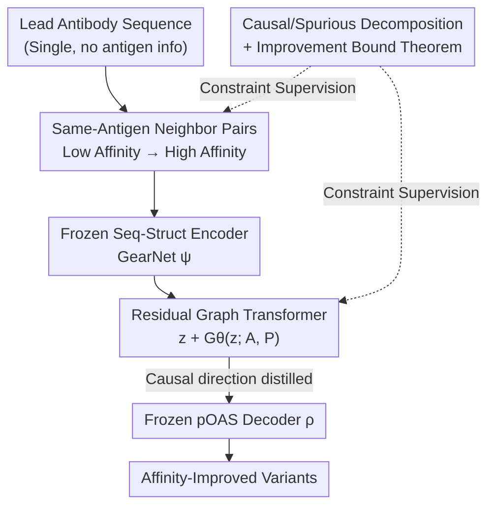

# Distilling Causal Signals for One-Shot Directed Evolution of Antibodies

**Conference**: ICLR2026  
**OpenReview**: [https://openreview.net/forum?id=M7PDJTrqcS](https://openreview.net/forum?id=M7PDJTrqcS)  
**Code**: https://github.com/prescient-design/AffinityEnhancer  
**Area**: Computational Biology / Protein Design / Antibody Affinity Maturation  
**Keywords**: Antibody affinity maturation, one-shot directed evolution, causal signal distillation, paired data matching, Graph Transformer

## TL;DR
AFFINITYENHANCER proposes antibody affinity maturation in an extreme "one-shot" setting: "given only a single lead antibody sequence, no antigen information, no fine-tuning, and no antigen-antibody complex structures." By constructing "same-antigen, low-affinity → high-affinity" neighbor pairs within cross-antigen datasets, a residual Graph Transformer learns a mapping in a frozen sequence-structure embedding space to "push low-affinity embeddings toward high-affinity ones." It theoretically proves that this paired supervision is dominated by causal changes, keeping spurious shifts within a small budget, thereby generalizing to completely unseen antibody seeds and concentrating mutations on the paratope interface rim, outperforming structure-conditioned Inverse Folding (AntiFold) and sequence inpainting (IgCraft) baselines.

## Background & Motivation

**Background**: As core drugs in oncology and autoimmunity, antibody efficacy is driven by their binding mechanism—antibodies use a small set of residues (paratope) on six hypervariable loops (CDRs) to bind specific fragments (epitope) on the antigen surface. In drug discovery, after obtaining a lead antibody with moderate affinity, affinity maturation is performed by generating large libraries via random/directed mutations to screen for stronger binders. However, experimental screening can only explore $10^6$–$10^9$ sequences, while the total space of antibody variable domains is $\sim 250^{20}$, making it difficult to find enough optimized designs.

**Limitations of Prior Work**: Machine learning-based computational affinity maturation follows two main paradigms, neither of which is suitable for one-shot. Structure-conditioned models (AbMPNN, AntiFold, FvHallucinator, RFDiffusion) rely on lead structures or antigen-antibody complex structures to constrain designs, but such data are scarce and lack diversity; furthermore, de novo models like RFDiffusion only guarantee "binding," not "stronger binding." Sequence-based models (ProGen2, Walk-Jump, various protein LMs) only learn sequence distributions or require iterative target-specific screening. A more direct predecessor, PropEn (Tagasovska et al., 2024), uses "data matching" to implicitly learn the upward gradient of a property, but it uses only sequence representations and requires hundreds of related sequences near the lead—making it unsuitable for one-shot settings.

**Key Challenge**: The fundamental difficulty of the one-shot setting is **generalization**—at test time, the lead antibody may be far from the training distribution in both sequence and structure, and the model must propose stronger variants "without antigen context and without fine-tuning." Additionally, paired data naturally suffer from selection bias: only some sequences are measured, and not every sequence is measured in every antigen environment, causing spurious factors (batch effects, library/lead specificity) to falsely correlate with affinity through selection.

**Goal**: (1) To perform one-shot affinity maturation without antigen information; (2) To leverage matching in heterogeneous datasets to alleviate data sparsity; (3) To theoretically guarantee the learning of causal features rather than spurious correlations; (4) To outperform structure-conditioned and inverse folding baselines on held-out seeds.

**Key Insight**: The authors observe that if pairs are restricted to the "same-antigen environment + sufficiently close in sequence + verified higher affinity," then the environment-driven gains are conditioned out, leaving only sequence changes to explain the affinity improvement. Combined with Lipschitz-type smoothness assumptions, it can be mathematically proven that each pair enforces a minimum causal direction shift while bounding spurious drift within a small limit.

**Core Idea**: Use "same-antigen neighbor pairs + frozen sequence-structure embeddings + residual Graph Transformer" to distill the causal direction of "low-affinity embedding → high-affinity embedding," performing directed evolution in the embedding space before decoding back to sequences.

## Method

### Overall Architecture

AFFINITYENHANCER addresses the following: given a held-out lead sequence $x^{e^*}_{\text{lead}}$ (corresponding to an antigen $e^*$ unseen during training), propose a batch of reliable affinity-improved designs without fine-tuning or utilizing the antigen structure. The problem is decomposed into defining the environments for learning causal directions, selecting representations, and transporting these directions, resulting in a "matching → encoding → residual transport → decoding" pipeline.

Formalizing the antibody sequence space as $X$ and binding affinity as $Y \subset \mathbb{R}$, training data comes from $E$ environments (each corresponding to one lead/seed antibody, denoted $e=1,\dots,E$), with only $\sim 10$ labeled sequences $\{(x^e_j, y^e_j)\}$ observed per environment. The process is:

1.  **Construct Matching Pairs**: Within each environment $e$, find a neighbor $x'_i$ for each low-affinity sequence $x_i$, requiring $y'_i > y_i$ and sequence distance below a threshold $\delta_x$, yielding $M=\{(x_i, x'_i \mid e=e')\}$.
2.  **Extract Embeddings**: Use a base model $\psi: X \to \mathbb{R}^{L \times d}$ to encode each antibody in the pair into sequence-structure embeddings.
3.  **Learn "Bad-to-Good" Embedding Mapping**: Apply a residual Graph Transformer $G_\theta$ on residues: $f(z) := z + G_\theta(z; A, P)$, where $z=\psi(x)$, $A$ is the residue-residue adjacency matrix derived from the predicted structure, and $P$ represents position/edge features.
4.  **Embedding-to-Sequence Decoding**: Train a lightweight decoder $\rho: \mathbb{R}^{L \times d} \to X$ to map per-residue embeddings back to amino acid distributions.
5.  **Sampling for OOD Leads**: At test time, compute $z_{\text{lead}}=\psi(x^{e^*}_{\text{lead}})$, apply the residual mapping $\tilde z = z_{\text{lead}} + G_\theta(z_{\text{lead}}; A, P)$, and decode $\tilde x = \rho(\tilde z)$.

The implementation consists of three modules: Embedder (GearNet, frozen), Reconstruction (Graph Transformer, the only trained component), and Decoder (pre-trained on pOAS and frozen). This trio ensures sequences are embedded into a general semantic space learned from massive protein/antibody data, enabling generalization to blind-test seeds.

### Key Designs

**1. Same-Antigen Neighbor Matching: Conditioning out environmental gains to isolate sequence-side improvements**

This directly addresses the spurious correlation issue in one-shot settings. Affinity $y$ depends on both sequence $x$ and antigen environment $e$. If "winners vs. losers" are paired randomly (as in standard preference learning), a winner might simply be due to a target antigen that is easier to bind. AFFINITYENHANCER requires: sequence proximity $d(x, x') < \varepsilon$, actual affinity improvement $y' - y > \Delta y > 0$, and the **same antigen environment** $e' = e$. This is expressed via the conditional distribution:

$$p\big(x' \mid x,\ d(x,x')<\varepsilon,\ y'-y>\Delta y,\ e'=e\big).$$

Conditioning on $e'=e$ removes gains from switching antigens. This is a critical upgrade over PropEn, which only matches in sequence space, whereas matching here happens in the geometry induced by the pre-trained encoder and Graph Transformer. It differs from preference learning (like DPO) in two ways: it requires sequence proximity and specific measurement values, creating **local improvement pairs** so that learned transformations correspond to realistic, stepwise improvements.

**2. Theoretical Guarantees for Causal Signal Distillation: Bounding causal movement and spurious drift**

The authors demonstrate that this supervision is dominated by causal changes. Assuming sequences are generated by latent factors $x=f(s,c)$ and affinity is determined by $y=h(c,e)$, where $c$ is the causal factor for affinity and $s$ is a spurious factor (batch/library effects). Under Lipschitz smoothness ($h$ is $K_y$-Lipschitz w.r.t $c$) and bi-Lipschitz rendering (sequence shifts imply latent shifts), they derive the **Improvement Bound Theorem**: for pairs satisfying $d(x, x') < \varepsilon$ and $y' - y > \Delta y$:

$$d(c',c) > \Delta y / K_y, \qquad d(s',s) < K_x\varepsilon - \Delta y/K_y.$$

Intuitively, every pair **enforces** a minimum causal direction shift (lower bound $\Delta y/K_y$) while restricting spurious drift to a strictly finite budget. Averaging across multiple environments causes spurious directions to cancel out while causal directions align, forcing $G_\theta$ to model the cross-environment invariant component that consistently explains affinity gains.

**3. Frozen Representation + Residual Graph Transformer: Learning the "causal transport" in a general space**

GearNet (pre-trained on 600k AlphaFold2 structures) provides semantically rich embeddings and is frozen. The Decoder, a lightweight model mapping GearNet embeddings back to sequence space, is trained on pOAS and frozen. Only the Reconstruction module—a Graph Transformer—is trained to learn a **residual mapping** $f_\theta(z) = z + G_\theta(z; A, P)$ on matching pairs from SKEMPI 2.0 by minimizing:

$$L(\theta) = \frac{1}{|M|} \sum_{(x,x') \in M} \big\|\psi(x') - f_\theta(\psi(x))\big\|_2^2.$$

The residual form allows the model to learn only "which direction to move relative to the lead," rather than reconstructing the whole embedding. The adjacency matrix $A$ injects physical priors of residue contacts for compact and plausible edits.

### Loss & Training
The objective is the $\ell_2$ reconstruction loss $L(\theta)$ in embedding space. Only the Graph Transformer $G_\theta$ is trained. Matching pairs are derived from SKEMPI 2.0, with any sequences in the neighborhood of held-out seeds strictly excluded to ensure fairness. Edit distance is controllable via iteration or temperature during sampling.

## Key Experimental Results

### Main Results
Evaluation is performed in a true one-shot regime: 4 held-out seeds (3 internal antibodies + Trastuzumab) that are significantly OOD (edit distance 64–87 from training). Cortex is used as the oracle.

| Model | Average ED | Average Binder Rate | Average Improved Rate | Improved Seeds |
| :--- | :--- | :--- | :--- | :--- |
| **AFFINITYENHANCER (Full)** | 7.08 | **50.10%** | **8.46%** | **4/4** |
| PropEn (Sequence only) | 55.8 | 0.0% | 0.00% | 0/4 |

PropEn proposed designs far from the seeds (>25 ED) with zero binders, showing that sequence-only matching fails in one-shot settings. AFFINITYENHANCER kept designs near the seeds (ED $\approx$ 7), with 26–78% predicted as binders. Compared to AntiFold and IgCraft within the $\text{ED} \in [5, 12]$ window, AFFINITYENHANCER significantly shifted the affinity distribution upward.

### Ablation Study
Averaged across 5000 samples for 4 seeds:

| Configuration | Binder Rate | Improved Rate | Improved Seeds | Note |
| :--- | :--- | :--- | :--- | :--- |
| Full model | 50.10% | 8.46% | 4/4 | GearNet + pOAS + GT + Matching |
| − Matching | 6.61% | 4.29% | 2/4 | Degenerates to AE; few binders |
| − Embedding | 27.02% | 1.32% | 4/4 | No GearNet; diversity drops |
| CNN (replaced GT) | 16.07% | 0.63% | 2/4 | Local kernels; poor controllability |
| − Adjacency | 35.04% | 9.98% | 3/4 | Fully connected; edit explosion |

### Key Findings
- **Matching is the critical intervention**: Without matching, the improved rate drops significantly; matching pushes probability mass toward functional, higher-affinity regions.
- **GT inductive bias is vital**: Replacing GT with CNN leads to a sharp decline in binders, showing GT is superior at modeling functional edits.
- **Adjacency matrix enables compact edits**: Removing adjacency leads to edit explosion, highlighting the importance of contact information for physical plausibility.
- **Biological Interpretability**: Without seeing the antigen, AFFINITYENHANCER concentrates edits on the **rim of the interface**, consistent with the intuition that improving already strong leads often involves refining peripheral contacts rather than core ones.

## Highlights & Insights
- **Causal Inference for Protein Design**: Uses a selection bias framework to provide formal bounds on causal vs. spurious drift, upgrading implicit matching to grounded causal distillation.
- **"Frozen Foundation + Small Residual Mapper" Paradigm**: Data-efficient and generalizes well to blind seeds by training only a small residual operator in a fixed semantic space.
- **Emergent "Rim" Targeting**: The model's ability to locate binding-relevant regions (the rim) without antigen input is highly valuable for real-world discovery where complex structures are missing.

## Limitations & Future Work
- **Reliance on In Silico Oracle**: All results are predicated on Cortex predictions without wet-lab validation.
- **Uneven Performance**: While the mean improved rate is 8.46%, it is heavily skewed by Trastuzumab; some seeds show very low improvement.
- **Antigen-Agnostic Nature**: Not using antigen info is a "double-edged sword"—it allows for broader application but may lead to sub-optimal directions in multi-solution cases.
- **Theoretical Assumptions**: Real-world validity of bi-Lipschitzness and additive latent decomposition in antibody space remains to be empirically verified.

## Related Work & Insights
- **vs PropEn**: PropEn requires many localized sequences; AFFINITYENHANCER achieves one-shot generalization via sequence-structure embeddings and explicit environment control.
- **vs AntiFold**: AntiFold follows existing structures and often produces variants with equal or lower affinity; AFFINITYENHANCER consistently shifts affinity upward.
- **vs Preference Learning (DPO)**: Unlike DPO, which uses arbitrary winner/loser pairs, this method constructs local improvement pairs for targeted evolution.

## Rating
- Novelty: ⭐⭐⭐⭐⭐ (Integration of causal selection bias with one-shot maturation)
- Experimental Thoroughness: ⭐⭐⭐⭐ (Extensive OOD seeds and ablations, though lacks wet-lab)
- Writing Quality: ⭐⭐⭐⭐ (Clear problem formulation and mapping to theory)
- Value: ⭐⭐⭐⭐⭐ (Practical drop-in tool for data-scarce antibody optimization)

## Related Papers

- [\[ICLR 2026\] One Protein Is All You Need](one_protein_is_all_you_need.md)
- [\[ICML 2026\] Towards A Generative Protein Evolution Machine with DPLM-Evo](../../ICML2026/computational_biology/towards_a_generative_protein_evolution_machine_with_dplm-evo.md)
- [\[ICML 2026\] TD3B: Transition-Directed Discrete Diffusion for Allosteric Binder Generation](../../ICML2026/computational_biology/td3b_transition-directed_discrete_diffusion_for_allosteric_binder_generation.md)
- [\[ICLR 2026\] Extending Sequence Length is Not All You Need: Effective Integration of Multimodal Signals for Gene Expression Prediction](extending_sequence_length_is_not_all_you_need_effective_integration_of_multimoda.md)
- [\[AAAI 2026\] On the Information Processing of One-Dimensional Wasserstein Distances with Finite Samples](../../AAAI2026/computational_biology/on_the_information_processing_of_one-dimensional_wasserstein_distances_with_fini.md)

<!-- RELATED:END -->

<!-- RELATED:START -->

## Related Papers

- [\[ICLR 2026\] One Protein Is All You Need](one_protein_is_all_you_need.md)
- [\[ICLR 2026\] Discovering heterogeneous synaptic plasticity rules via large-scale neural evolution](discovering_heterogeneous_synaptic_plasticity_rules_via_large-scale_neural_evolu.md)
- [\[ICML 2026\] TD3B: Transition-Directed Discrete Diffusion for Allosteric Binder Generation](../../ICML2026/computational_biology/td3b_transition-directed_discrete_diffusion_for_allosteric_binder_generation.md)
- [\[ICML 2026\] Towards A Generative Protein Evolution Machine with DPLM-Evo](../../ICML2026/computational_biology/towards_a_generative_protein_evolution_machine_with_dplm-evo.md)
- [\[ICLR 2026\] Extending Sequence Length is Not All You Need: Effective Integration of Multimodal Signals for Gene Expression Prediction](extending_sequence_length_is_not_all_you_need_effective_integration_of_multimoda.md)

<!-- RELATED:END -->
